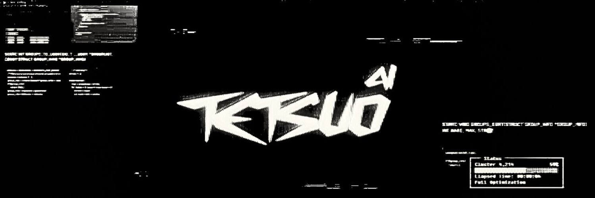

# AgenC



A lightweight agent framework for C that integrates smoothly with a variety of systems. It provides a foundation for building and managing multi-agent solutions.

## Community & Resources
- Discord: https://discord.gg/tetsuo-ai
- Website: https://www.tetsuo.ai
- X (Twitter): https://www.x.com/7etsuo
- Solana Coin Ticker: $TETSUO
- ca: 8i51XNNpGaKaj4G4nDdmQh95v4FKAxw8mhtaRoKd9tE8

## Table of Contents
- [Features](#features)
- [Directory Structure](#directory-structure)
- [Getting Started](#getting-started)  
- [Usage Example](#usage-example)  
- [Contributing](#contributing)
- [License](#license)

---

## Features
- **Modular Design:** Agents are designed as independent modules for easy reuse.  
- **Efficient Message-Passing:** Low overhead, enabling fast agent-to-agent communication.  
- **Straightforward Integration:** Minimal dependencies and clear interfaces.  

---

## Directory Structure
```
AgenC/
├── include/          # Framework header files
├── src/              # Core framework source
├── examples/         # Sample agents and usage demonstrations
├── tests/            # Unit tests
├── README.md         # Project documentation
└── LICENSE           # License information
```

---

## Getting Started

1. **Clone the Repository**  
   ```bash
   git clone git@github.com:7etsuo/AgenC.git
   cd AgenC
   ```

2. **Build and Compile**  
   Example using a Makefile:
   ```bash
   make
   ```
   The compiled artifacts go to a `build` directory.

3. **Include in Your Project**  
   Add the relevant headers and link the library or source files.
---

## Usage Example
```c
#include "agent_framework.h"

int main(void) 
{
    Agent *myAgent = create_agent("exampleAgent", my_agent_behavior);
    AgentManager *manager = create_agent_manager();

    register_agent(manager, myAgent);
    start_agent_manager(manager);

    stop_agent_manager(manager);
    destroy_agent_manager(manager);
    return 0;
}
```
Adapt the sample behavior in the `examples/` folder to fit your needs.

---

## Contributing

1. **Branch Workflow**  
   - Pull latest from `main`:  
     ```bash
     git checkout main
     git pull origin main
     ```
   - Create a feature branch:  
     ```bash
     git checkout -b chore/setup-shell-structure
     ```
   - After making changes, push your branch:  
     ```bash
     git push origin chore/setup-shell-structure
     ```
   - Open a Pull Request, address feedback, then merge.

2. **Coding Standards**  
   - Maintain consistency in naming conventions.
   - Document any new functions or data structures.

3. **Issue Reporting**
   - Use clear, concise descriptions.
   - Provide steps to reproduce if applicable.
---

## License
Distributed under [MIT License](LICENSE).  

Feel free to reach out through issues or pull requests for questions or suggestions. Happy coding!
