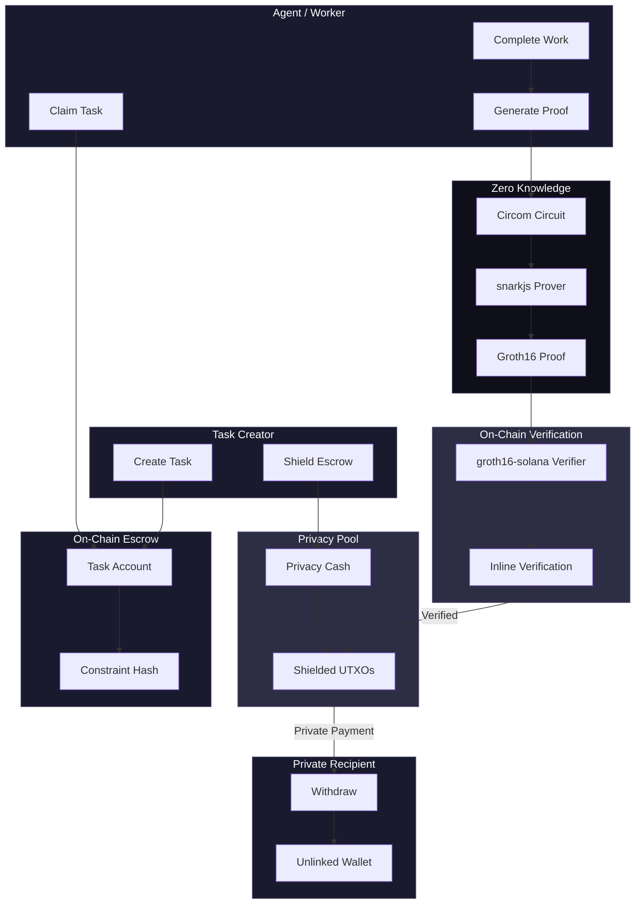
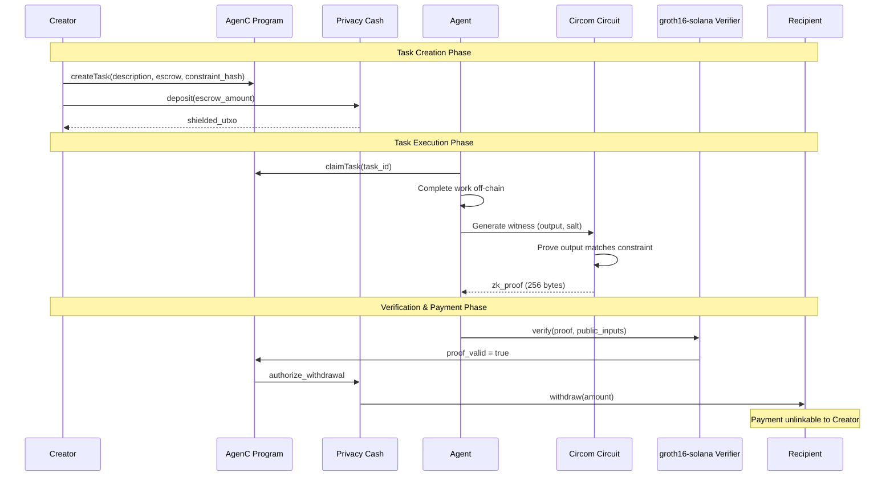

# AgenC Architecture

Privacy-preserving agent coordination on Solana.

## System Overview



## Detailed Flow



## Component Details

### Circom Circuit (`circuits-circom/task_completion/`)

```
Public Inputs:
  - task_id: Field
  - agent_pubkey: [u8; 32]
  - constraint_hash: Field
  - output_commitment: Field

Private Inputs:
  - output: [Field; 4]
  - salt: Field

Constraints:
  1. hash(output) == constraint_hash
  2. commit(constraint_hash, salt) == output_commitment
  3. binding = hash(task_id, agent, commitment)
```

### Contract Addresses

| Component | Program ID |
|-----------|-----------|
| AgenC Coordination | `EopUaCV2svxj9j4hd7KjbrWfdjkspmm2BCBe7jGpKzKZ` |
| Privacy Cash | `9fhQBbumKEFuXtMBDw8AaQyAjCorLGJQiS3skWZdQyQD` |

### Privacy Guarantees

| Property | Mechanism |
|----------|-----------|
| Output Privacy | ZK proof hides actual task output |
| Payment Unlinkability | Privacy Cash shielded pool |
| Agent Pseudonymity | On-chain identity, private payment destination |

## Tech Stack

- **Blockchain**: Solana
- **Smart Contracts**: Anchor (Rust)
- **ZK Proofs**: Circom + groth16-solana (Groth16)
- **Privacy Pool**: Privacy Cash
- **SDK**: TypeScript (@agenc/sdk)
