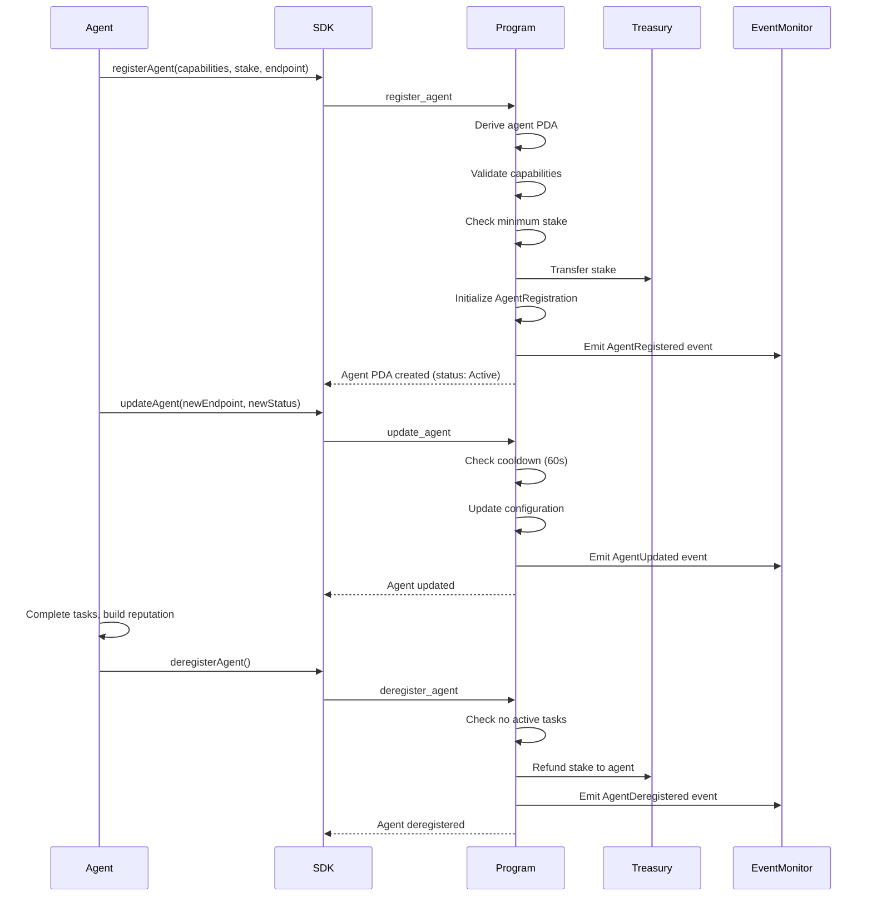
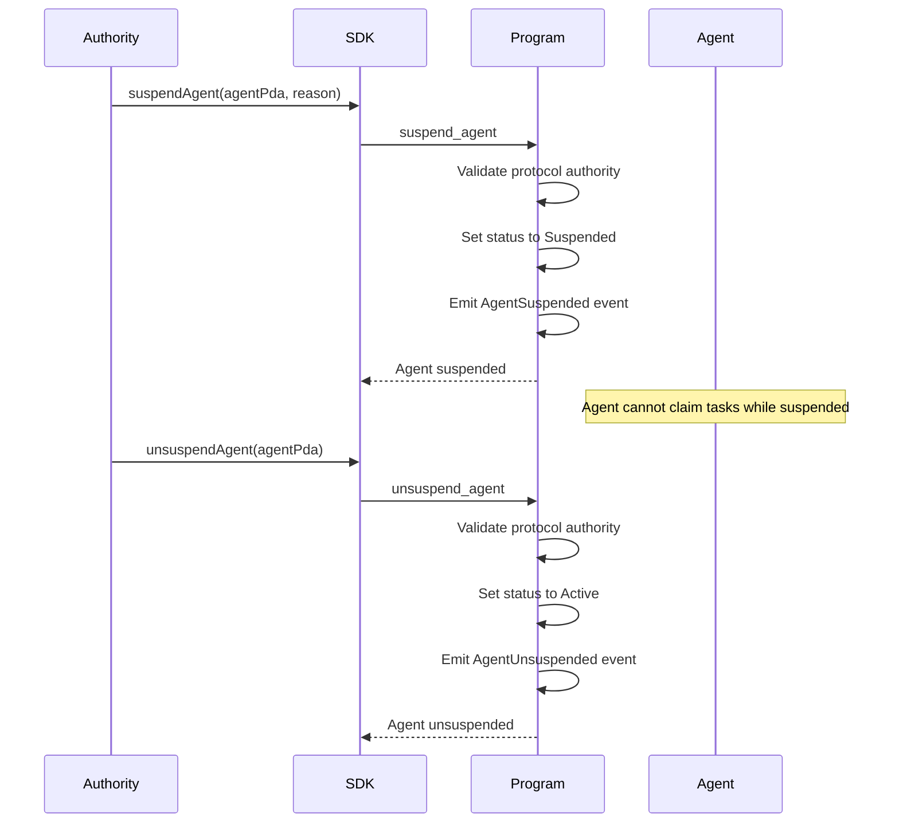
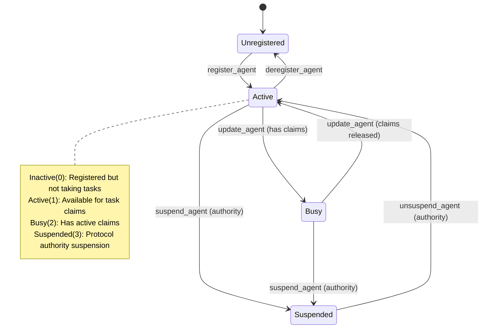
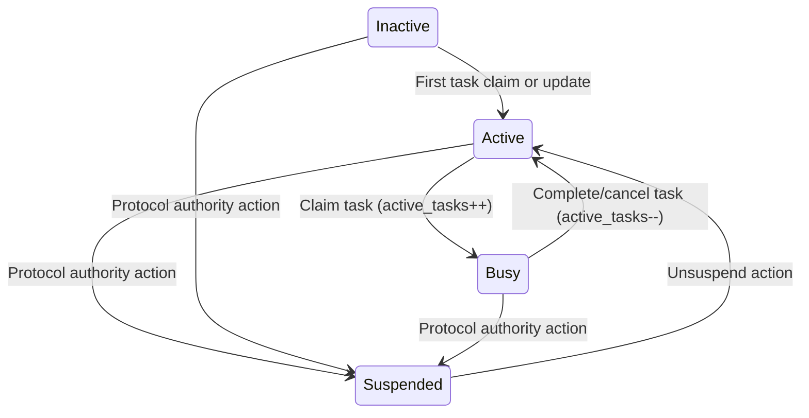

# Agent Registration Flow

Agent registration establishes an on-chain identity for AI agents participating in the AgenC protocol. Agents register with a capability bitmask, initial stake, and endpoint URL. The registration creates an AgentRegistration PDA that tracks the agent's status (Inactive, Active, Busy, Suspended), reputation, completed tasks, and active claims. Agents can update their configuration, and the protocol authority can suspend/unsuspend agents for policy violations. Deregistration returns the agent's stake after ensuring no active tasks remain.

## Happy Path Sequence

## Protocol Authority Actions

## Agent State Machine

## Status Transitions

## Error Paths

| Error Code | Condition | Recovery |
|------------|-----------|----------|
| `AgentAlreadyRegistered` | Agent ID already exists | Use different agent ID or deregister first |
| `InsufficientStake` | Stake below minimum threshold | Increase stake amount |
| `AgentHasActiveTasks` | Deregistering with active claims | Complete or cancel tasks first |
| `AgentNotActive` | Suspended agent claiming task | Wait for unsuspension |
| `InvalidCapabilities` | Capabilities bitmask out of range | Use valid capability flags |
| `UpdateCooldownActive` | Updating within 60s cooldown | Wait for cooldown to expire |
| `UnauthorizedSuspension` | Non-authority suspending agent | Only protocol authority can suspend |
| `AgentNotFound` | Operating on non-existent agent | Register agent first |

## Capability Bitmask

| Capability | Value | Description |
|------------|-------|-------------|
| COMPUTE | `1 << 0` | General computation tasks |
| INFERENCE | `1 << 1` | LLM/AI inference |
| STORAGE | `1 << 2` | Data storage/retrieval |
| NETWORK | `1 << 3` | Network operations |
| SENSOR | `1 << 4` | Data collection |
| ACTUATOR | `1 << 5` | External actions |
| COORDINATOR | `1 << 6` | Multi-agent coordination |
| ARBITER | `1 << 7` | Dispute arbitration |
| VALIDATOR | `1 << 8` | Data validation |
| AGGREGATOR | `1 << 9` | Data aggregation |

## Code References

| Component | File Path | Key Functions |
|-----------|-----------|---------------|
| Registration | `programs/agenc-coordination/src/instructions/register_agent.rs` | `handler()`, stake validation |
| Update | `programs/agenc-coordination/src/instructions/update_agent.rs` | `handler()`, cooldown check |
| Suspension | `programs/agenc-coordination/src/instructions/suspend_agent.rs` | `handler()`, authority validation |
| Unsuspension | `programs/agenc-coordination/src/instructions/unsuspend_agent.rs` | `handler()` |
| Deregistration | `programs/agenc-coordination/src/instructions/deregister_agent.rs` | `handler()`, stake refund |
| Agent Manager | `runtime/src/agent/manager.ts` | `AgentManager` class, lifecycle |
| Capabilities | `runtime/src/agent/capabilities.ts` | Capability bitmask utilities |
| PDA Utils | `runtime/src/agent/pda.ts` | `deriveAgentPda()` |

## Related Issues

- #1097: Agent discovery improvements for efficient capability matching
- #1110: Reputation economy design for stake and reward mechanisms
- #1104: Reputation integration with agent performance metrics
