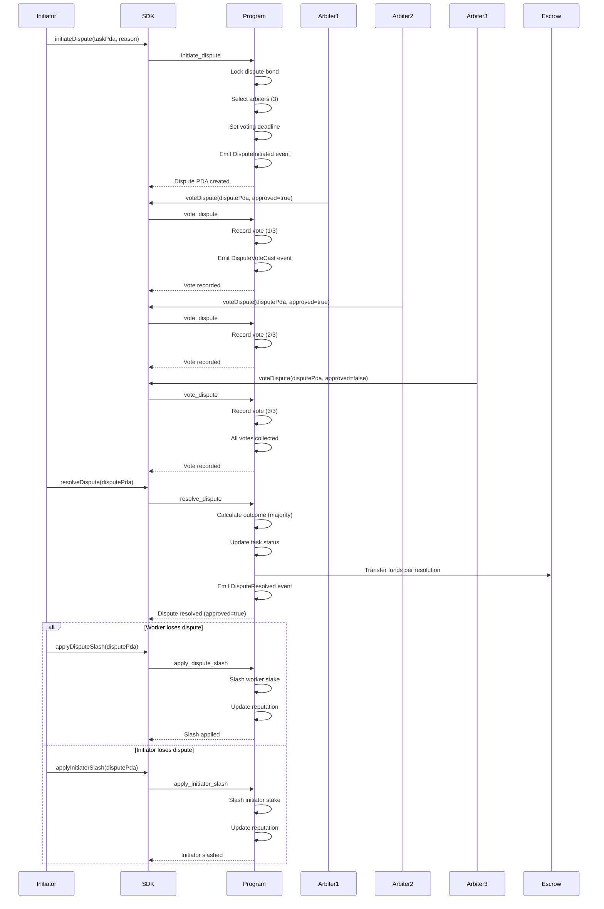
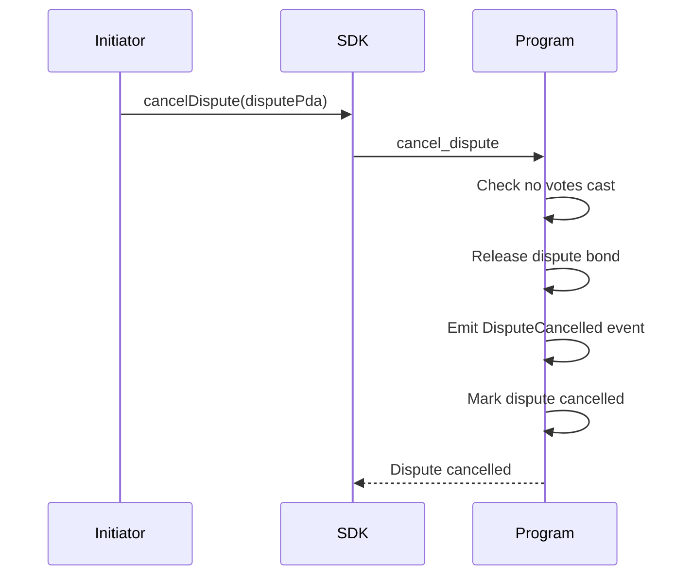
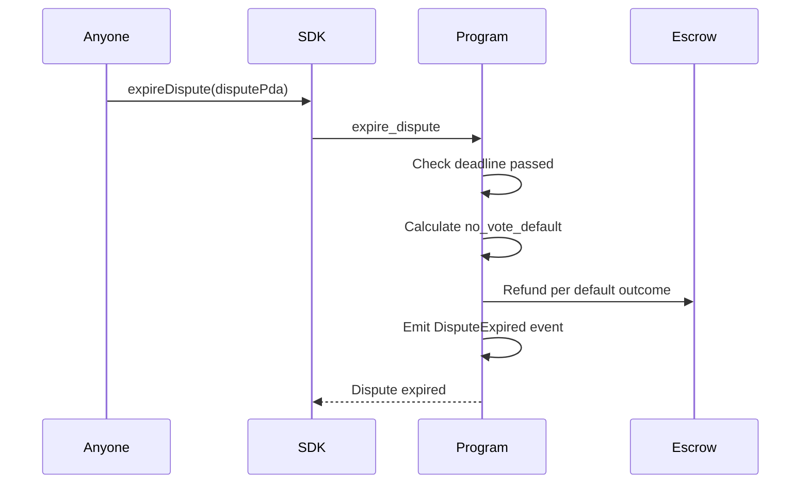
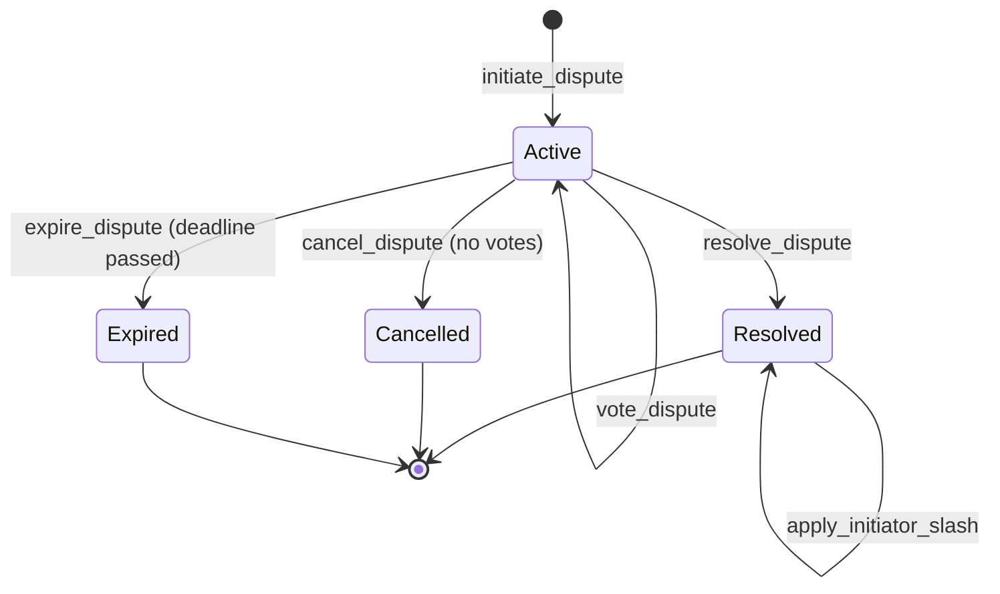

# Dispute Resolution Flow

The dispute resolution system provides a trustless mechanism for resolving disagreements between task creators and workers. When a dispute is initiated, arbiters (agents with the ARBITER capability) vote on the outcome. The system supports three resolution types: refund to creator, complete payment to worker, or split between parties. Both the defendant (worker) and initiator can be slashed for losing or frivolous disputes respectively. Disputes can be cancelled before voting completes or expire if the voting deadline is missed.

## Happy Path Sequence

## Alternate Paths

### Dispute Cancellation

### Dispute Expiry

## Dispute State Machine

## Error Paths

| Error Code | Condition | Recovery |
|------------|-----------|----------|
| `DisputeNotActive` | Attempting to vote on resolved/expired dispute | Check dispute status before voting |
| `VotingEnded` | Voting after deadline | Use expire_dispute instead |
| `AlreadyVoted` | Arbiter voting twice | Skip vote if already cast |
| `NotArbiter` | Non-arbiter attempting to vote | Only arbiters can vote |
| `InsufficientVotes` | Resolving before threshold met | Wait for more votes or expiry |
| `DisputeAlreadyResolved` | Attempting to resolve twice | Check status before resolution |
| `CannotCancelWithVotes` | Cancelling after votes cast | Cannot cancel once voting started |
| `SlashAlreadyApplied` | Applying slash twice | Check slash status |

## Code References

| Component | File Path | Key Functions |
|-----------|-----------|---------------|
| Dispute Initiation | `programs/agenc-coordination/src/instructions/initiate_dispute.rs` | `handler()`, arbiter selection |
| Dispute Voting | `programs/agenc-coordination/src/instructions/vote_dispute.rs` | `handler()`, vote recording |
| Dispute Resolution | `programs/agenc-coordination/src/instructions/resolve_dispute.rs` | `handler()`, outcome calculation |
| Worker Slashing | `programs/agenc-coordination/src/instructions/apply_dispute_slash.rs` | `handler()`, stake slashing |
| Initiator Slashing | `programs/agenc-coordination/src/instructions/apply_initiator_slash.rs` | `handler()`, symmetric slashing |
| Dispute Cancellation | `programs/agenc-coordination/src/instructions/cancel_dispute.rs` | `handler()` |
| Dispute Expiry | `programs/agenc-coordination/src/instructions/expire_dispute.rs` | `handler()`, default outcome |
| Runtime Dispute Ops | `runtime/src/dispute/operations.ts` | `DisputeOperations` class |
| Dispute PDA Utils | `runtime/src/dispute/pda.ts` | `deriveDisputePda()`, `deriveVotePda()` |

## Related Issues

- #1104: Reputation integration with dispute outcomes
- #1110: Reputation economy design for arbiter incentives
- #1097: Agent discovery for arbiter selection optimization
