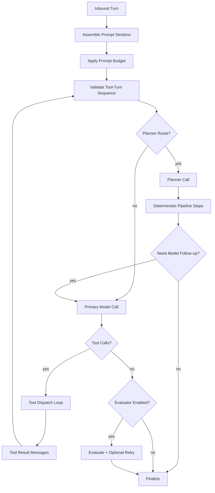

# Runtime Chat Pipeline

This document defines the runtime chat/tool pipeline implemented by `ChatExecutor` and the provider adapters.
It is the canonical architecture reference for pipeline states, budget controls, and fallback behavior.

## Code Anchors

- `runtime/src/llm/chat-executor.ts`
- `runtime/src/llm/prompt-budget.ts`
- `runtime/src/llm/tool-turn-validator.ts`
- `runtime/src/llm/policy.ts`
- `runtime/src/llm/grok/adapter.ts`
- `runtime/src/gateway/daemon.ts`
- `runtime/src/eval/pipeline-quality-runner.ts`
- `runtime/src/eval/pipeline-gates.ts`

## End-to-End Flow

## Pipeline States and Stop Reasons

| State | Description | Primary Output |
|------|-------------|----------------|
| `assemble_prompt` | Build system/history/memory/tool/user messages | Prompt sections with section tags |
| `apply_budget` | Enforce adaptive prompt caps | Bounded messages + budget diagnostics |
| `validate_tool_turns` | Enforce assistant `tool_calls` -> `tool` result ordering | Local 4xx-style validation failure or continue |
| `planner_pass` | Optional bounded planner for complex turns | Deterministic step intents |
| `model_call` | Provider call (stateful/stateless as configured) | Assistant content/tool calls + usage |
| `tool_loop` | Execute tool calls with retries/guardrails | Tool results appended to history |
| `evaluate` | Optional response quality evaluation | Accepted response or bounded retry |
| `finalize` | Emit output + diagnostics + stop reason | `ChatExecutorResult` |

Canonical stop reasons (from `runtime/src/llm/policy.ts`):

- `completed`
- `tool_calls`
- `validation_error`
- `provider_error`
- `authentication_error`
- `rate_limited`
- `timeout`
- `tool_error`
- `budget_exceeded`
- `no_progress`
- `cancelled`

## Budget Controls

### Prompt composition budgets

`prompt-budget.ts` enforces section-aware caps for:

- `system_anchor`
- `system_runtime`
- `memory_working`
- `memory_episodic`
- `memory_semantic`
- `history`
- `tools`
- `user`
- `assistant_runtime`

These caps are driven by:

- `llm.contextWindowTokens`
- `llm.maxTokens`
- `llm.promptSafetyMarginTokens`
- `llm.promptCharPerToken`
- `llm.promptHardMaxChars`
- `llm.maxRuntimeHints`

### Request execution budgets

`ChatExecutor` enforces:

- `llm.maxToolRounds`
- `llm.toolBudgetPerRequest`
- `llm.maxModelRecallsPerRequest`
- `llm.maxFailureBudgetPerRequest`
- `llm.sessionTokenBudget` (with compaction fallback)

### Timeout layering

Timeouts are explicitly layered:

- `llm.timeoutMs` (provider request timeout + stream inactivity handling)
- `llm.toolCallTimeoutMs` (per tool invocation)
- `llm.requestTimeoutMs` (end-to-end request timeout)

## Fallback and Retry Rules

Failure taxonomy and retry policy are centralized in `llm/policy.ts` and applied in `ChatExecutor`.

| Failure class | Default retry policy | Fallback behavior |
|--------------|----------------------|-------------------|
| `validation_error` | no retry | fail fast locally; do not forward malformed tool-turns |
| `provider_error` | bounded retry | provider fallback eligible |
| `rate_limited` | bounded retry | provider fallback eligible |
| `timeout` | bounded retry | provider fallback eligible; may emit `timeout` stop reason |
| `authentication_error` | no retry | no fallback loop on deterministic auth failures |
| `tool_error` | bounded retry (idempotency-aware) | session-level tool failure circuit breaker applies |
| `budget_exceeded` | no retry | compaction attempt, then explicit budget stop |
| `no_progress` | no retry | explicit stop with no-progress detail |

Stateful continuation fallback (`llm.statefulResponses.*`):

- use `previous_response_id` only when reconciliation anchors match
- emit explicit fallback reason on mismatch/missing/stale IDs
- optional stateless fallback controlled by `fallbackToStateless`

## Observability and Debugging

For each execution, runtime emits:

- per-call usage attribution (`callUsage[]`)
- prompt-shape before/after budget
- stateful diagnostics (`statefulDiagnostics`, `statefulSummary`)
- tool-routing diagnostics (`toolRoutingSummary`)
- planner diagnostics (`plannerSummary`)
- canonical stop reason + detail

Operational runbooks:

- `docs/RUNTIME_PIPELINE_DEBUG_BUNDLE.md`
- `docs/INCIDENT_REPLAY_RUNBOOK.md`

## Phase 9/10 Quality Gates

Pipeline reliability gates are enforced in CI by:

- `npm --prefix runtime run benchmark:pipeline:ci`
- `npm --prefix runtime run benchmark:pipeline:gates`

Gate domains:

- context growth slope/delta
- malformed tool-turn forwarding (must stay zero)
- desktop timeout/hang regressions
- token efficiency per completed task
- offline replay determinism for sanitized incident fixtures
