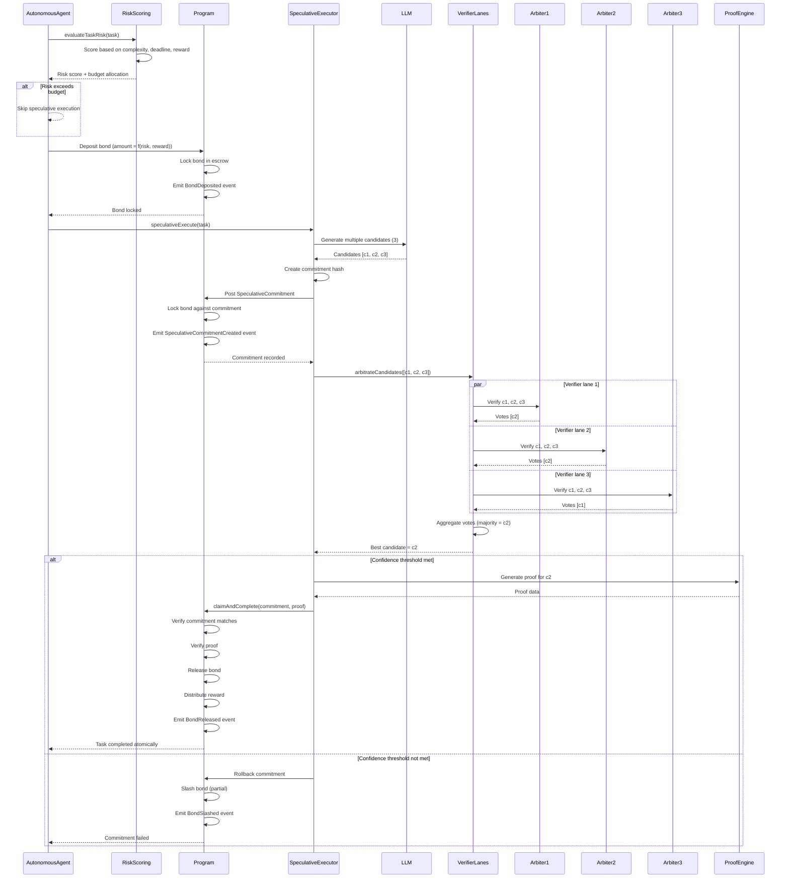
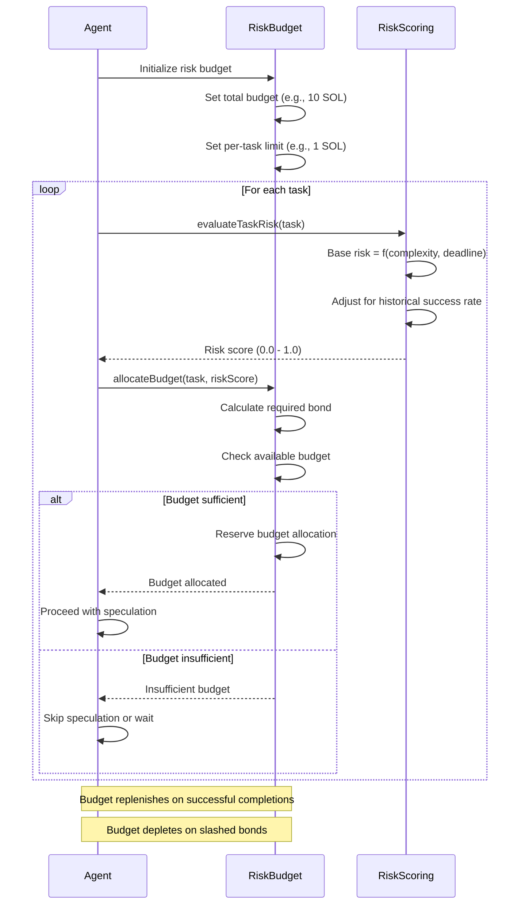
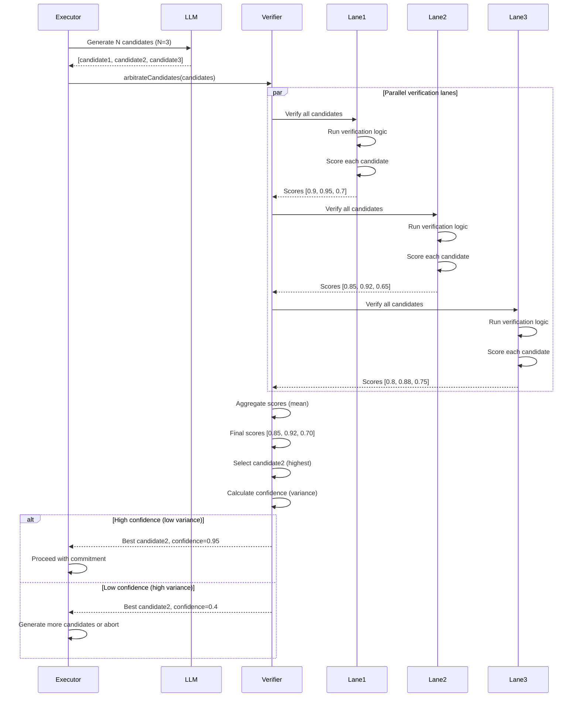
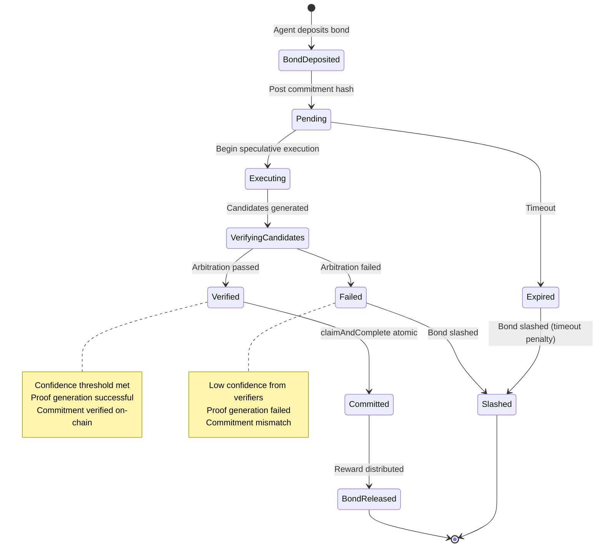
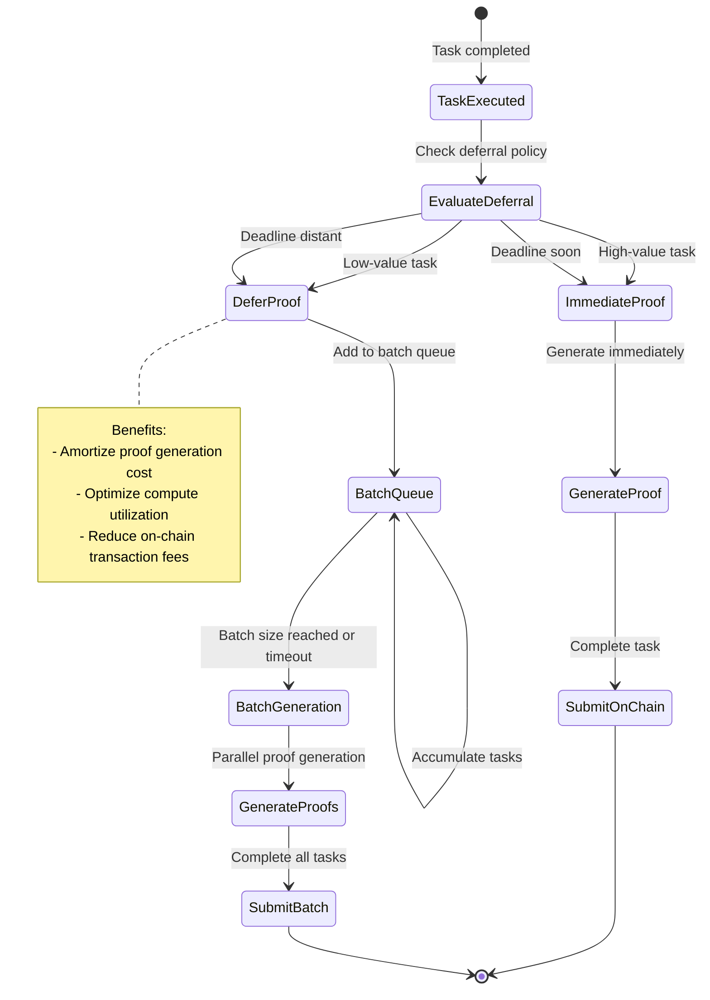
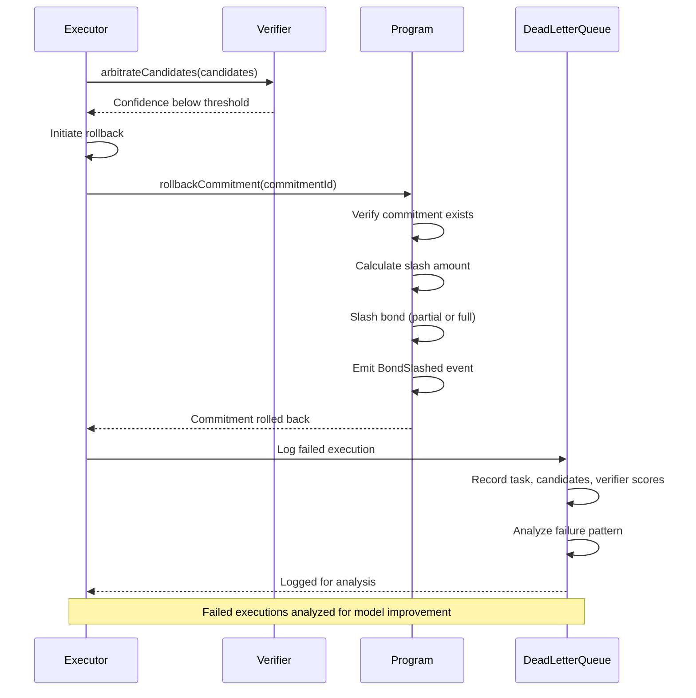

# Speculative Execution Flow

Speculative execution enables agents to execute tasks before officially claiming them, reducing latency and enabling competitive optimization. Agents post bonded commitments on-chain, execute the task speculatively, and use multi-candidate arbitration through verifier lanes to ensure correctness. If verification passes, the agent claims and completes the task atomically. If verification fails, the commitment is rolled back and the bond is slashed. The system includes adaptive risk budgeting to manage speculative execution risk and proof deferral for batch optimization.

## Happy Path Sequence



## Risk Budgeting Flow



## Multi-Candidate Arbitration



## Commitment State Machine



## Proof Deferral Strategy



## Rollback Flow



## Error Paths

| Error | Condition | Recovery |
|-------|-----------|----------|
| `InsufficientBondForSpeculation` | Bond < required for task | Increase bond or skip speculation |
| `VerificationFailed` | Verifier lanes reject all candidates | Rollback, slash bond, log to DLQ |
| `CommitmentExpired` | Timeout before verification | Slash bond (timeout penalty) |
| `CommitmentMismatch` | On-chain commitment != executor hash | Rollback, investigate hash computation |
| `AtomicClaimFailed` | claimAndComplete transaction failed | Retry with backoff or rollback |
| `ProofGenerationFailed` | Cannot generate proof for winner | Rollback, try next best candidate |
| `RiskBudgetExceeded` | Task risk > available budget | Skip speculation or wait for budget |
| `LowConfidenceArbitration` | High variance in verifier scores | Generate more candidates or abort |

## Risk Scoring Algorithm

```typescript
// Pseudocode
function evaluateTaskRisk(task: Task): RiskScore {
  const baseRisk =
    complexityRisk(task.requiredCapabilities) * 0.3 +
    deadlineRisk(task.deadline) * 0.2 +
    rewardRisk(task.reward) * 0.2 +
    historicalRisk(task.creator) * 0.3;

  const adjustedRisk = baseRisk * (1 - agent.successRate);

  return {
    score: adjustedRisk,
    requiredBond: task.reward * adjustedRisk * BOND_MULTIPLIER,
    confidence: 1 - variance(historicalOutcomes),
  };
}
```

## Code References

| Component | File Path | Key Functions |
|-----------|-----------|---------------|
| Speculative Executor | `runtime/src/task/speculative-executor.ts` | Speculative execution logic |
| Verifier Lanes | `runtime/src/autonomous/verifier.ts` | Multi-candidate arbitration |
| Risk Scoring | `runtime/src/autonomous/risk-scoring.ts` | Risk evaluation and budgeting |
| Autonomous Agent | `runtime/src/autonomous/agent.ts` | Speculative execution integration |
| Bond Management | `programs/agenc-coordination/src/instructions/` | Bond deposit/lock/release/slash |
| Proof Deferral | `runtime/src/task/proof-pipeline.ts` | Batch proof optimization |
| DLQ | `runtime/src/task/dead-letter-queue.ts` | Failed execution logging |

## Related Issues

- #1109: Service marketplace integration with speculative execution
- #1076: Execution sandboxing for secure speculative environments
- #1081: Heartbeat scheduler for monitoring speculative commitments
- #1097: Agent discovery for verifier lane assignment
