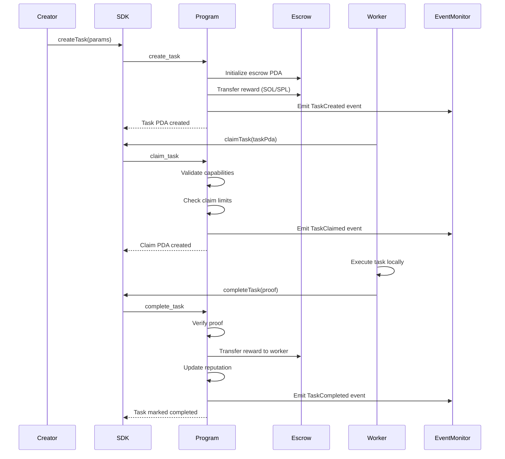
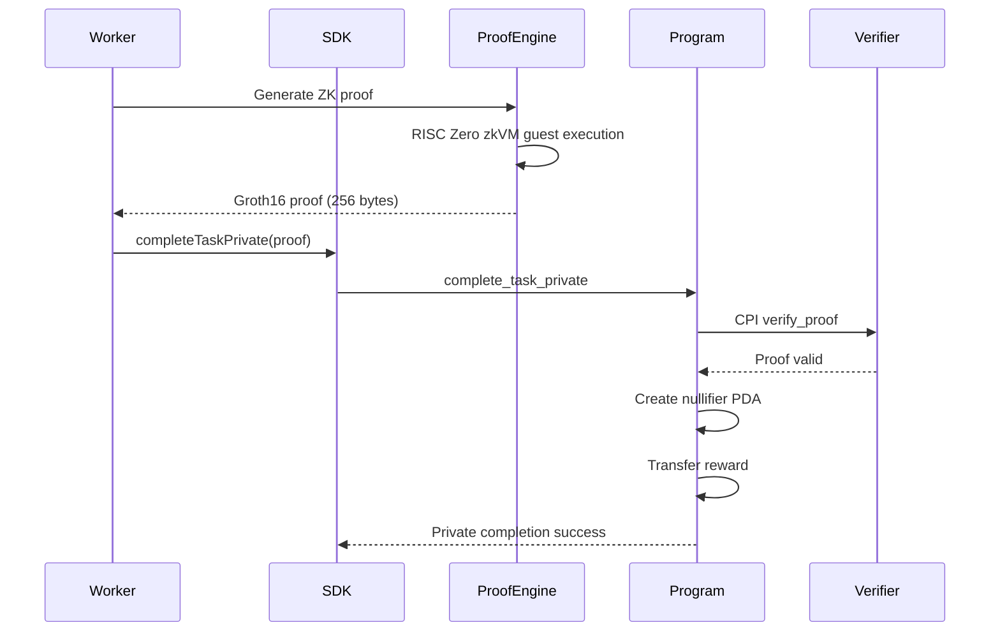
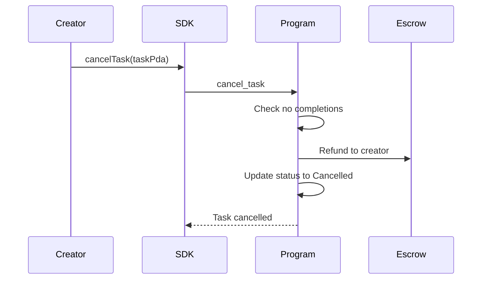
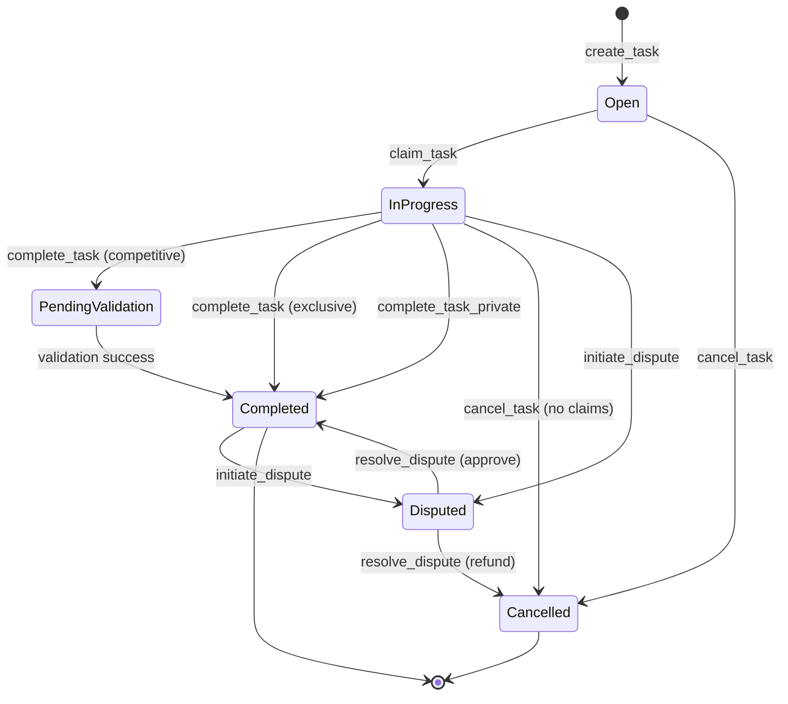

# Task Lifecycle Flow

Tasks in AgenC progress through a well-defined lifecycle from creation to completion or cancellation. The task creator deposits an escrow (SOL or SPL tokens) when creating the task. Workers can claim open tasks matching their capabilities, execute them, and submit proofs (public or private) to receive rewards. At each transition, events are emitted for off-chain monitoring. The task escrow is managed on-chain via a PDA, ensuring trustless reward distribution.

## Happy Path Sequence

## Alternate Paths

### Private Completion

### Cancellation

## Task State Machine

## Error Paths

| Error Code | Condition | Recovery |
|------------|-----------|----------|
| `TaskNotOpen` | Attempting to claim non-open task | Check task status before claiming |
| `TaskFullyClaimed` | Max workers reached | Wait for claims to expire or task completion |
| `TaskExpired` | Deadline passed | Cannot recover; task must be cancelled |
| `CompetitiveTaskAlreadyWon` | Trying to complete already-completed competitive task | Check completions count before submission |
| `InsufficientFunds` | Creator balance < reward + fees | Fund account before task creation |
| `CapabilityMismatch` | Worker lacks required capabilities | Only claim tasks matching agent capabilities |
| `InvalidProofData` | Proof hash mismatch or invalid format | Regenerate proof with correct inputs |

## Code References

| Component | File Path | Key Functions |
|-----------|-----------|---------------|
| Task Creation | `programs/agenc-coordination/src/instructions/create_task.rs` | `handler()`, `init_task_fields()` |
| Task Claiming | `programs/agenc-coordination/src/instructions/claim_task.rs` | `handler()`, rate limit checks |
| Public Completion | `programs/agenc-coordination/src/instructions/complete_task.rs` | `handler()`, reward distribution |
| Private Completion | `programs/agenc-coordination/src/instructions/complete_task_private.rs` | `handler()`, ZK verification |
| Cancellation | `programs/agenc-coordination/src/instructions/cancel_task.rs` | `handler()`, refund logic |
| SDK Task Ops | `sdk/src/tasks.ts` | `createTask()`, `claimTask()`, `completeTask()` |
| Runtime Task Ops | `runtime/src/task/operations.ts` | `TaskOperations` class, query helpers |

## Related Issues

- #1053: Gateway infrastructure for task submission and monitoring
- #1109: Service marketplace integration for task discovery
- #1104: Reputation integration with task completion metrics
- #1076: Execution sandboxing for secure task execution
