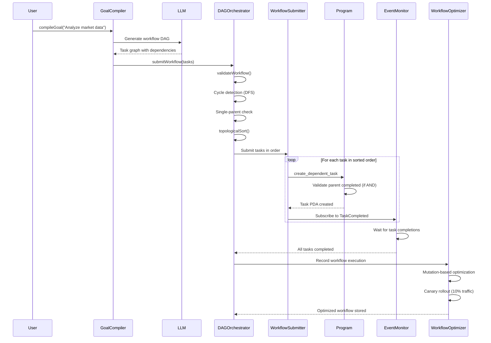
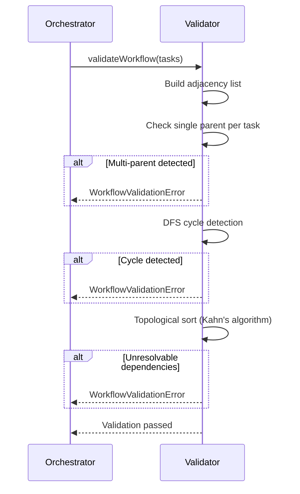
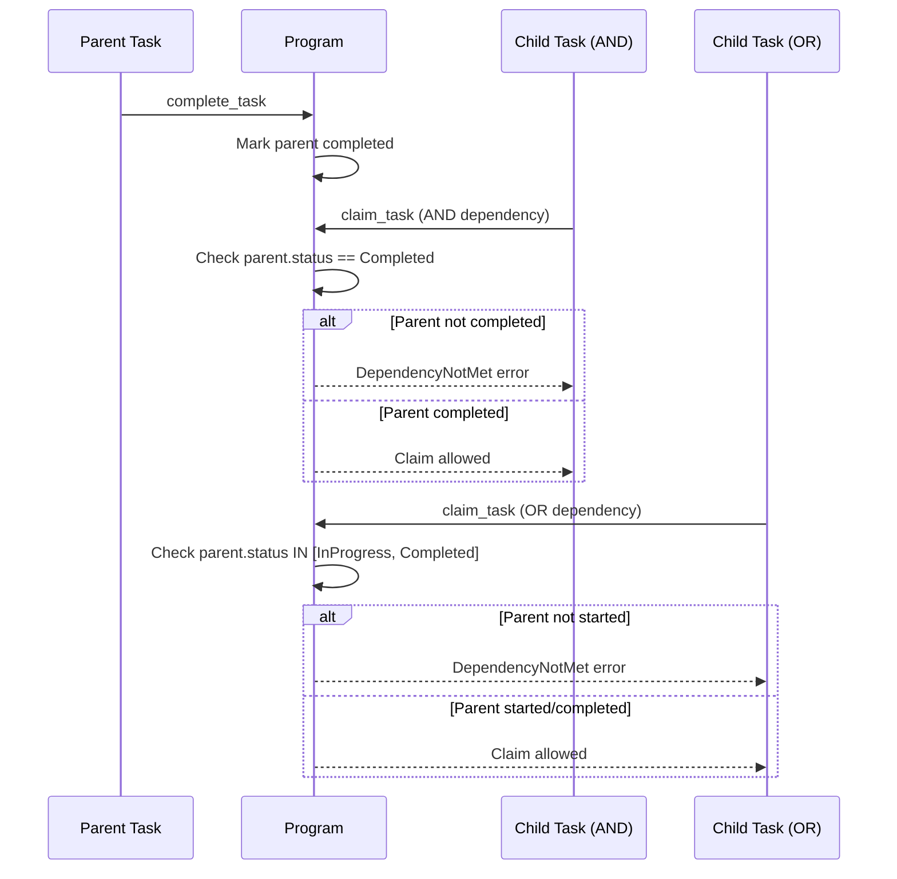
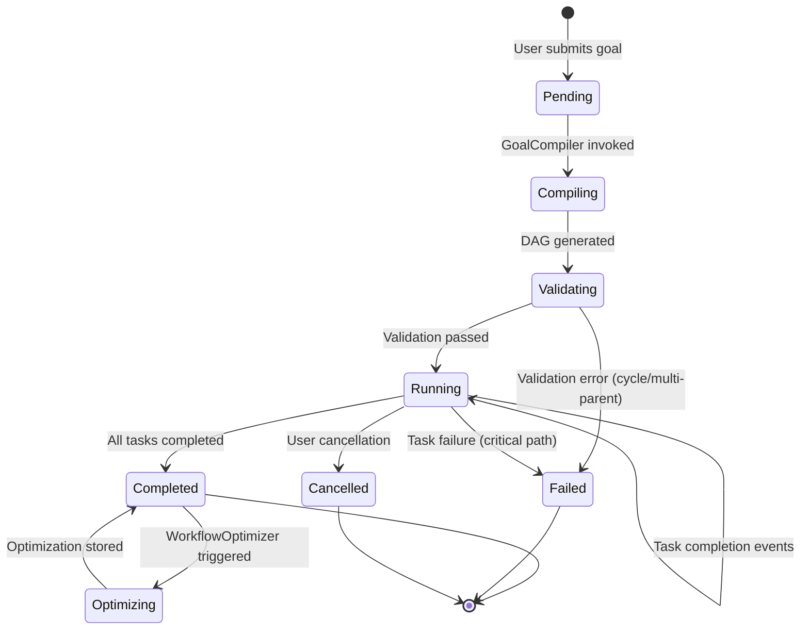
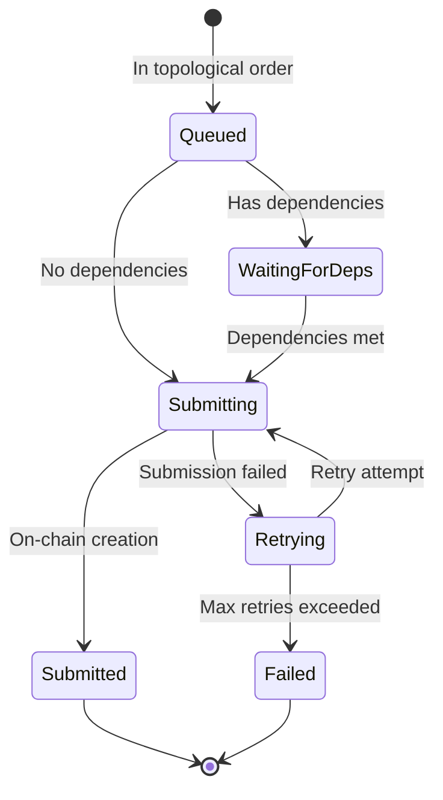

# Workflow Execution Flow

Workflow execution orchestrates complex, multi-step goals by decomposing them into dependency-ordered tasks executed across multiple agents. The GoalCompiler uses an LLM to transform natural language goals into task DAGs. The DAGOrchestrator validates the workflow structure (rejecting cycles and enforcing single-parent constraints), performs topological sorting, and submits tasks in dependency order. The WorkflowOptimizer applies mutation-based optimization with canary rollout to improve future executions. Workflows support tree topology with AND/OR dependency types.

## Happy Path Sequence

## Workflow Validation

## Dependency Type Handling

## Workflow State Machine

## Task Submission State

## Error Paths

| Error | Condition | Recovery |
|-------|-----------|----------|
| `WorkflowValidationError` | Cycle detected in DAG | Remove circular dependencies |
| `MultiParentTaskError` | Task has >1 parent | Restructure to tree topology |
| `DependencyNotMet` | Claiming task before parent done | Wait for parent completion |
| `WorkflowSubmissionError` | On-chain submission failed | Retry with backoff |
| `TaskFailureOnCriticalPath` | Critical task failed | Cancel workflow or retry task |
| `WorkflowTimeout` | Workflow exceeds deadline | Cancel remaining tasks |
| `InsufficientFundsForWorkflow` | Cannot fund all tasks | Reduce task count or increase budget |

## Code References

| Component | File Path | Key Functions |
|-----------|-----------|---------------|
| DAG Orchestrator | `runtime/src/workflow/orchestrator.ts` | `DAGOrchestrator`, validation, sorting |
| Goal Compiler | `runtime/src/workflow/compiler.ts` | `GoalCompiler`, LLM-based decomposition |
| Workflow Submitter | `runtime/src/workflow/submitter.ts` | `WorkflowSubmitter`, dependency-aware submission |
| Workflow Optimizer | `runtime/src/workflow/optimizer.ts` | `WorkflowOptimizer`, mutation + canary rollout |
| Dependent Task | `programs/agenc-coordination/src/instructions/create_dependent_task.rs` | `handler()`, dependency validation |
| Workflow Types | `runtime/src/workflow/types.ts` | `WorkflowTask`, `DependencyType` |

## Workflow Optimization

The WorkflowOptimizer uses mutation operators to improve workflow efficiency:

| Mutation | Description |
|----------|-------------|
| Task Reordering | Swap independent tasks to optimize parallelism |
| Dependency Relaxation | Convert AND to OR where safe |
| Task Merging | Combine sequential tasks with same agent |
| Redundant Task Removal | Eliminate duplicate work |

Optimizations are rolled out via canary deployment (10% traffic) with automatic rollback if metrics degrade.

## Related Issues

- #1096: Sub-agent spawning for workflow task execution
- #1109: Service marketplace integration for workflow tasks
- #1081: Heartbeat scheduler for workflow health monitoring
- #1063: ChatExecutor for interactive workflow management
