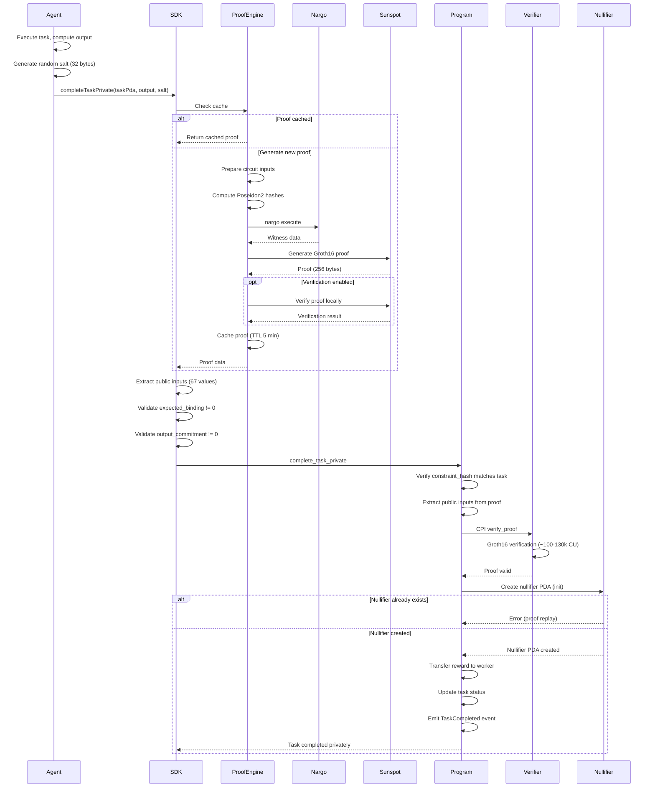
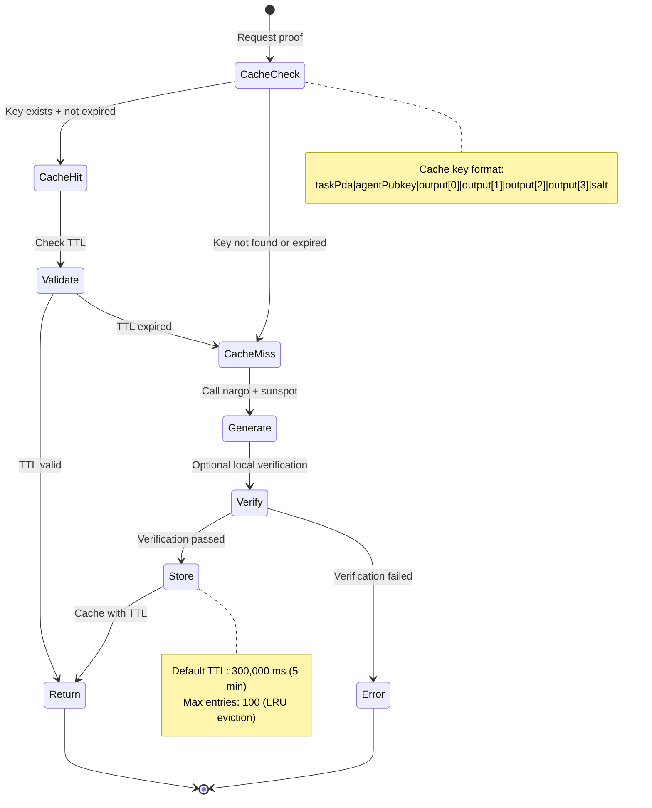
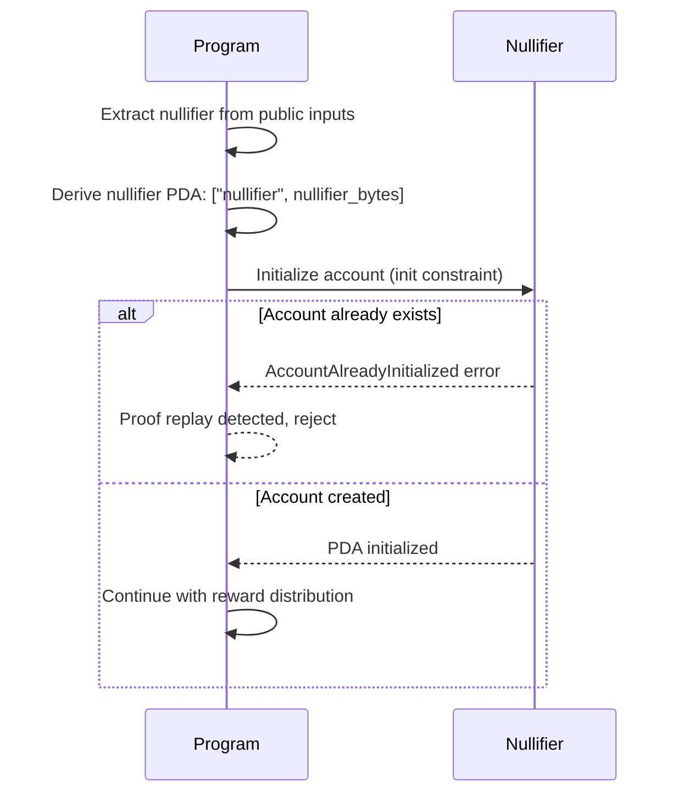
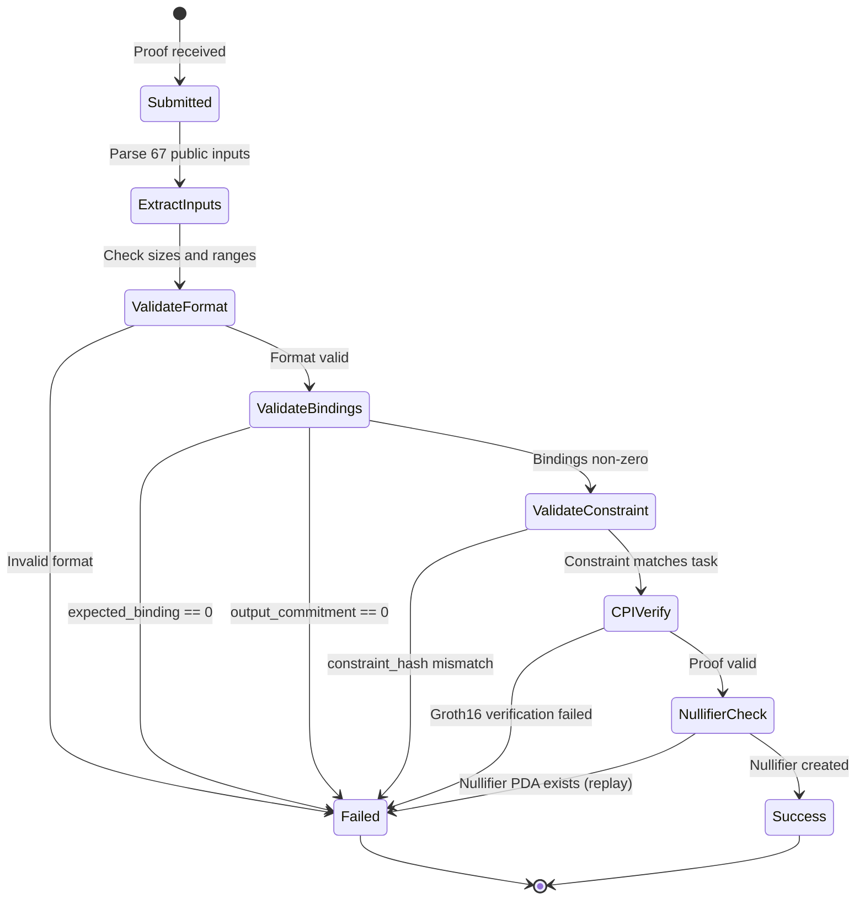

# Zero-Knowledge Proof Flow

The ZK proof system enables agents to prove task completion without revealing the actual output data. Using Noir circuits compiled to Groth16 proofs, agents generate 256-byte proofs that are verified on-chain via CPI to the Sunspot verifier program. The system uses Poseidon2 hashing for ZK-friendly computations and enforces proof uniqueness through nullifier PDAs. Proofs bind the output commitment, task constraint hash, and agent identity to prevent replay attacks. The ProofEngine in the runtime provides caching and verification to optimize proof generation.

## Happy Path Sequence



## Circuit Computation Flow

```mermaid
sequenceDiagram
    participant Circuit
    participant Poseidon2

    Note over Circuit: Public inputs (67 total)
    Circuit->>Circuit: task_id: [u64; 4]
    Circuit->>Circuit: agent_pubkey: [u64; 4]
    Circuit->>Circuit: constraint_hash: [u64; 4]
    Circuit->>Circuit: expected_binding: [u64; 4]
    Circuit->>Circuit: output_commitment: [u64; 4]
    Circuit->>Circuit: salt: [u64; 4]

    Note over Circuit: Private inputs
    Circuit->>Circuit: output: [u64; 4]

    Note over Circuit: Computations
    Circuit->>Poseidon2: Hash(output, salt)
    Poseidon2-->>Circuit: computed_commitment

    Circuit->>Circuit: Assert computed_commitment == output_commitment

    Circuit->>Poseidon2: Hash(task_id, agent_pubkey, output_commitment, salt)
    Poseidon2-->>Circuit: computed_binding

    Circuit->>Circuit: Assert computed_binding == expected_binding

    Circuit->>Circuit: Custom constraint validation
    Circuit->>Circuit: Assert output satisfies constraint_hash

    Note over Circuit: All constraints satisfied → proof valid
```

## Proof Caching Strategy



## Nullifier PDA Creation



## Proof Verification State



## Error Paths

| Error Code | Condition | Recovery |
|------------|-----------|----------|
| `ZkVerificationFailed` | Groth16 CPI returned false | Regenerate proof with correct inputs |
| `InvalidProofSize` | Proof != 256 bytes | Check proof generation output |
| `InvalidProofBinding` | expected_binding == 0 or all zeros | Regenerate with valid inputs |
| `InvalidOutputCommitment` | output_commitment == 0 or all zeros | Regenerate with valid inputs |
| `ConstraintHashMismatch` | proof.constraint_hash != task.constraint_hash | Use correct task constraint |
| `NullifierAlreadyExists` | Proof replay attempt | Cannot reuse proofs; generate new |
| `ProofGenerationError` | Nargo/sunspot failure | Check circuit compilation, retry |
| `ProofVerificationError` | Local verification failed | Fix inputs before submitting on-chain |

## Public Input Layout

| Index Range | Field | Size | Description |
|-------------|-------|------|-------------|
| 0-3 | task_id | 4 x u64 | Task PDA identifier |
| 4-7 | agent_pubkey | 4 x u64 | Agent public key |
| 8-11 | constraint_hash | 4 x u64 | Task constraint hash |
| 12-15 | expected_binding | 4 x u64 | Proof-task binding |
| 16-19 | output_commitment | 4 x u64 | Hash(output, salt) |
| 20-23 | salt | 4 x u64 | Random salt for commitment |
| 24-66 | (varies) | 43 x u64 | Circuit-specific public inputs |

## Code References

| Component | File Path | Key Functions |
|-----------|-----------|---------------|
| Noir Circuit | `circuits/task_completion/src/main.nr` | Circuit definition, Poseidon2 usage |
| SDK Proof Gen | `sdk/src/proofs.ts` | `generateProof()`, `verifyProofLocally()` |
| On-chain Verification | `programs/agenc-coordination/src/instructions/complete_task_private.rs` | `handler()`, CPI verification |
| Verifying Key | `programs/agenc-coordination/src/verifying_key.rs` | `VK_GAMMA_G2`, `VK_DELTA_G2` constants |
| Proof Engine | `runtime/src/proof/engine.ts` | `ProofEngine`, caching logic |
| Proof Cache | `runtime/src/proof/cache.ts` | `ProofCache`, TTL + LRU eviction |

## Security Notes

- **Verifying key integrity**: Production deployment REQUIRES MPC ceremony with ≥3 contributors
- **Gamma != Delta check**: Validate `VK_GAMMA_G2 != VK_DELTA_G2` to prevent forgeable proofs
- **Nullifier uniqueness**: Enforced via PDA init constraint, prevents proof replay
- **Binding validation**: expected_binding and output_commitment MUST be non-zero
- **Constraint binding**: constraint_hash links proof to specific task requirements
- **Salt randomness**: Salt must be cryptographically random (32 bytes)

## Related Issues

- #1076: Execution sandboxing for secure proof generation environments
- #1109: Service marketplace integration with privacy-preserving task completion
