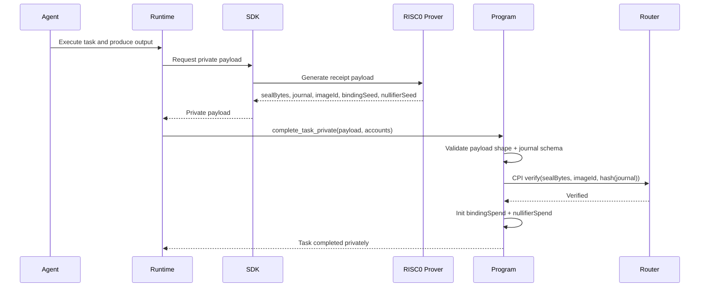

# Private Proof Flow (RISC0 + Router)

The private completion flow proves task correctness without revealing private outputs.

## Happy path

## Journal schema

`journal` is fixed at 192 bytes:

1. task PDA
2. authority
3. constraint hash
4. output commitment
5. binding seed bytes
6. nullifier seed bytes

## Replay protection

- `bindingSpend` blocks reuse of the same binding context.
- `nullifierSpend` blocks global nullifier replay.

## Failure modes

| Error | Condition |
|-------|-----------|
| `InvalidSealEncoding` | `sealBytes` cannot be decoded/validated |
| `InvalidJournalLength` | `journal` is not exactly 192 bytes |
| `TrustedSelectorMismatch` | selector is not trusted |
| `InvalidImageId` | image ID is not trusted |
| `RouterAccountMismatch` | router/verifier-entry account constraints fail |
| `NullifierAlreadyUsed` | `nullifierSpend` already exists |
| `BindingAlreadyUsed` | `bindingSpend` already exists |

## Payload/account checklist

Payload:
- `sealBytes`
- `journal`
- `imageId`
- `bindingSeed`
- `nullifierSeed`

Accounts:
- `routerProgram`
- `router`
- `verifierEntry`
- `verifierProgram`
- `bindingSpend`
- `nullifierSpend`
