# Key Interface Class Diagrams

Class diagrams for the 10 most important interfaces in the runtime. These are the contracts that new modules must integrate with.

## AgentManager

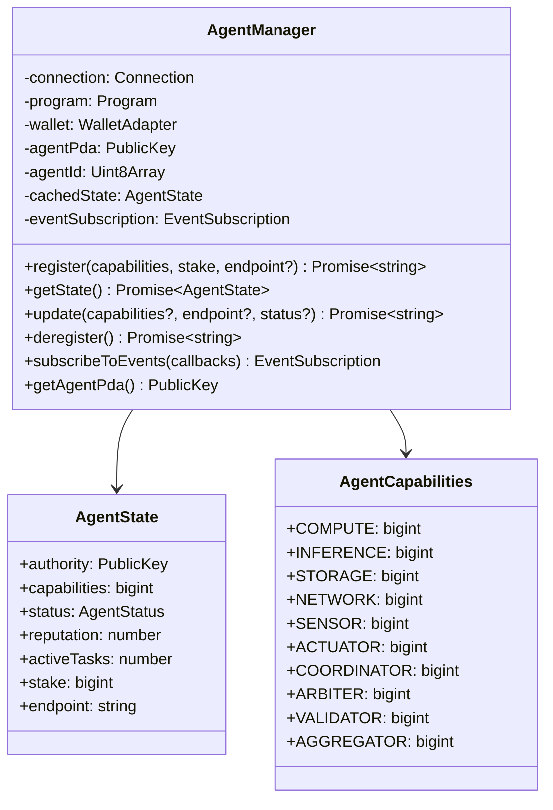

## TaskOperations

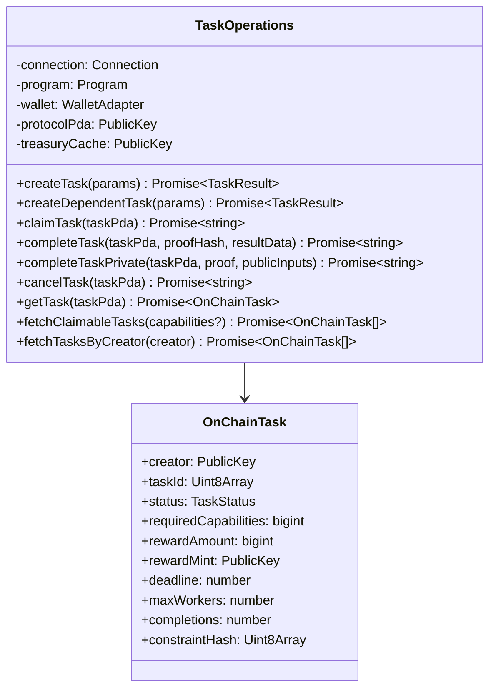

## AutonomousAgent

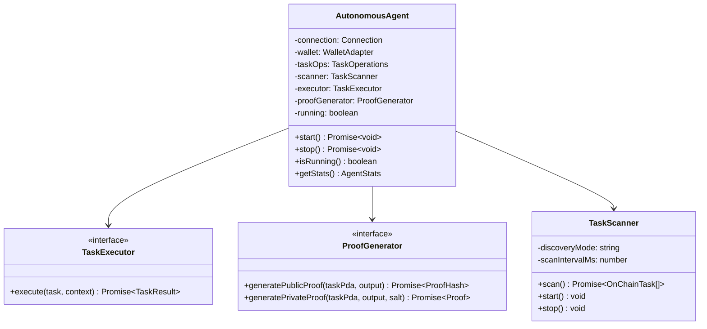

## LLMProvider

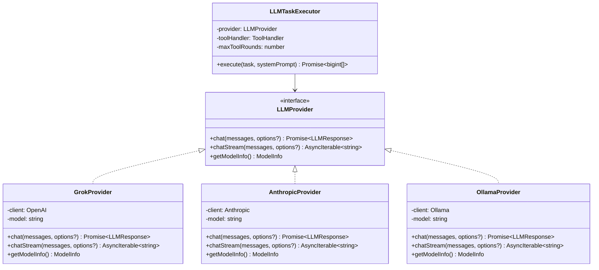

## ToolRegistry and Tool

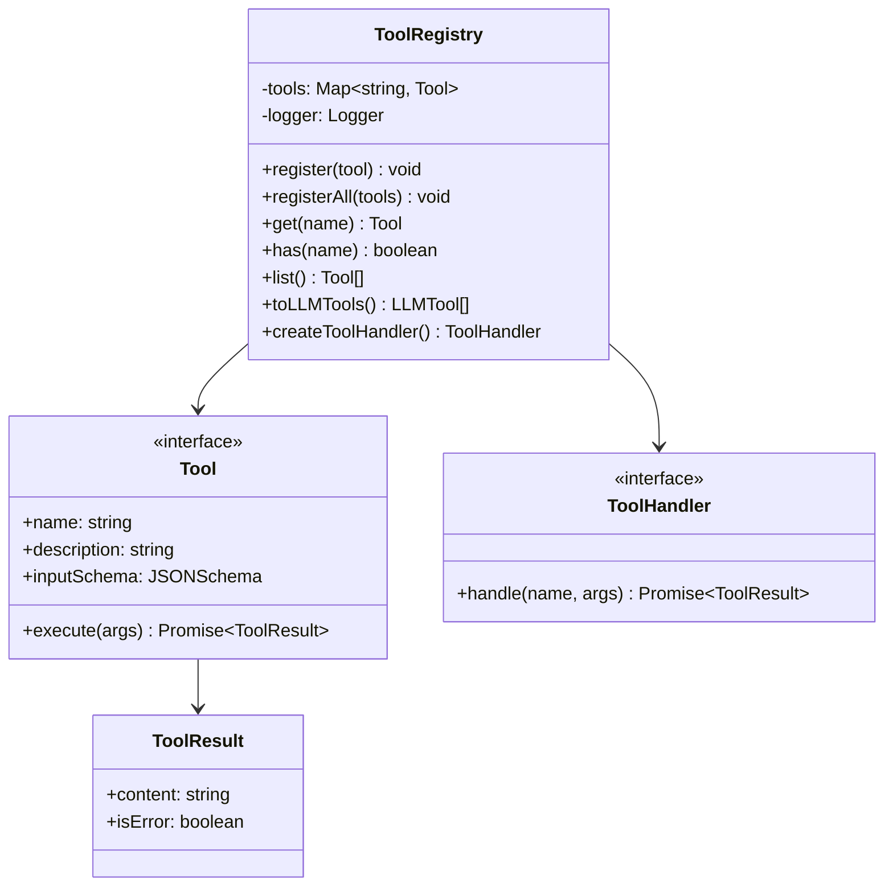

## MemoryBackend

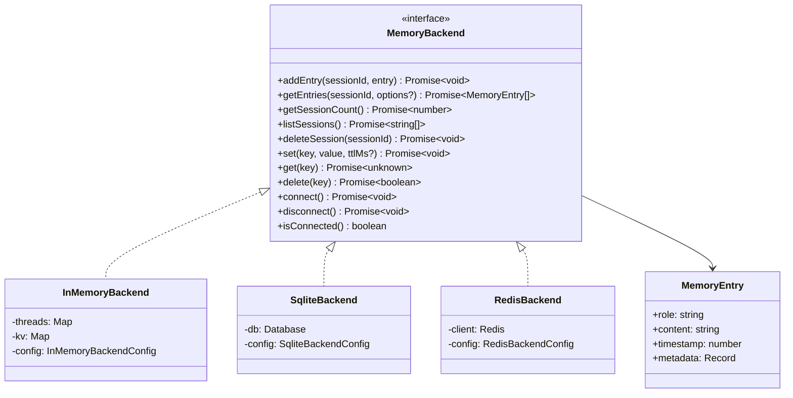

## ProofEngine

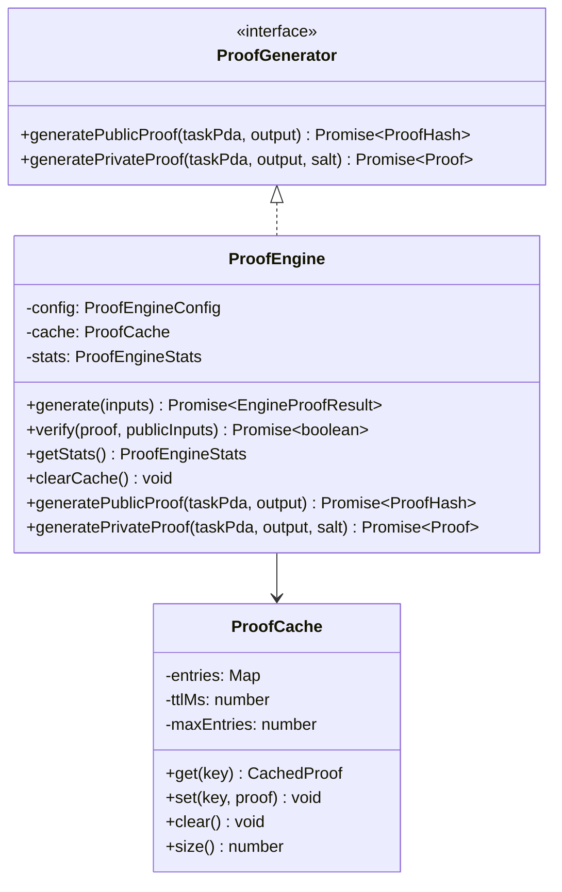

## DisputeOperations

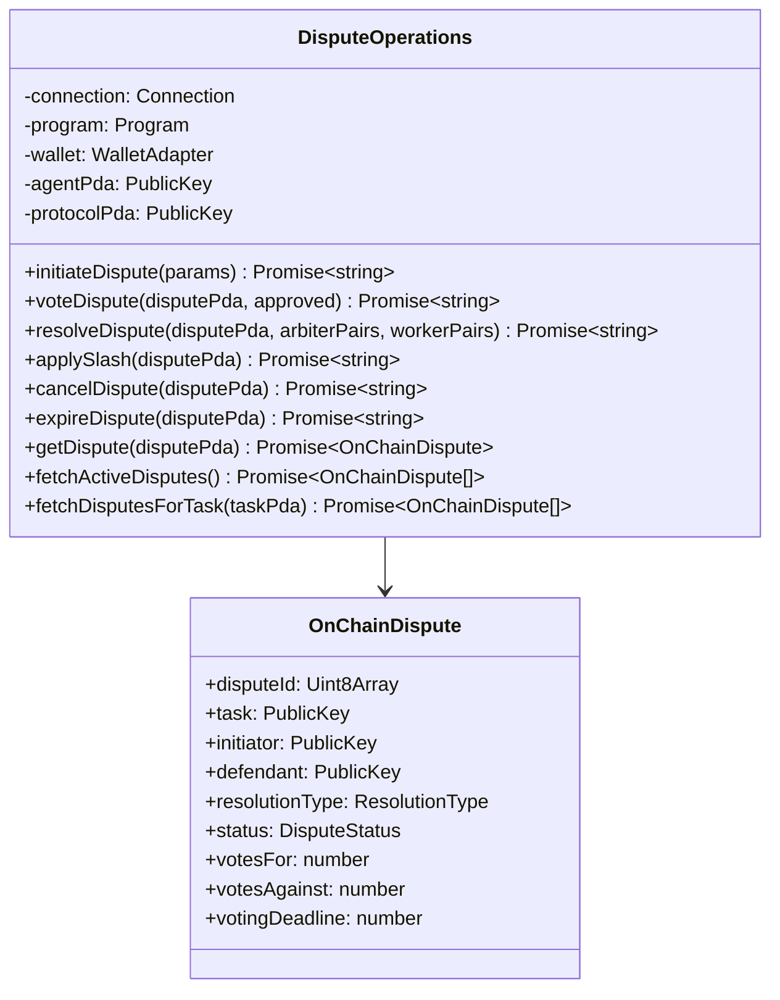

## DAGOrchestrator

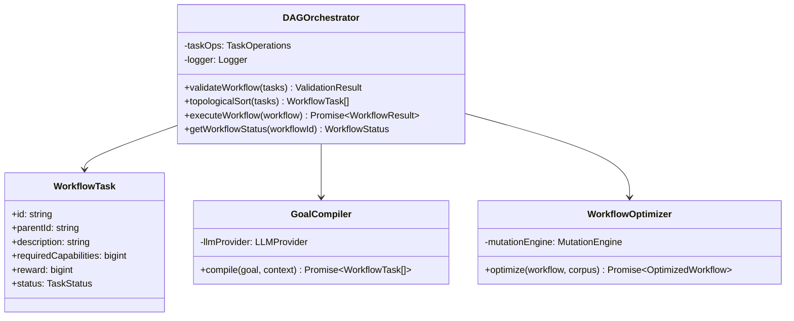

## PolicyEngine

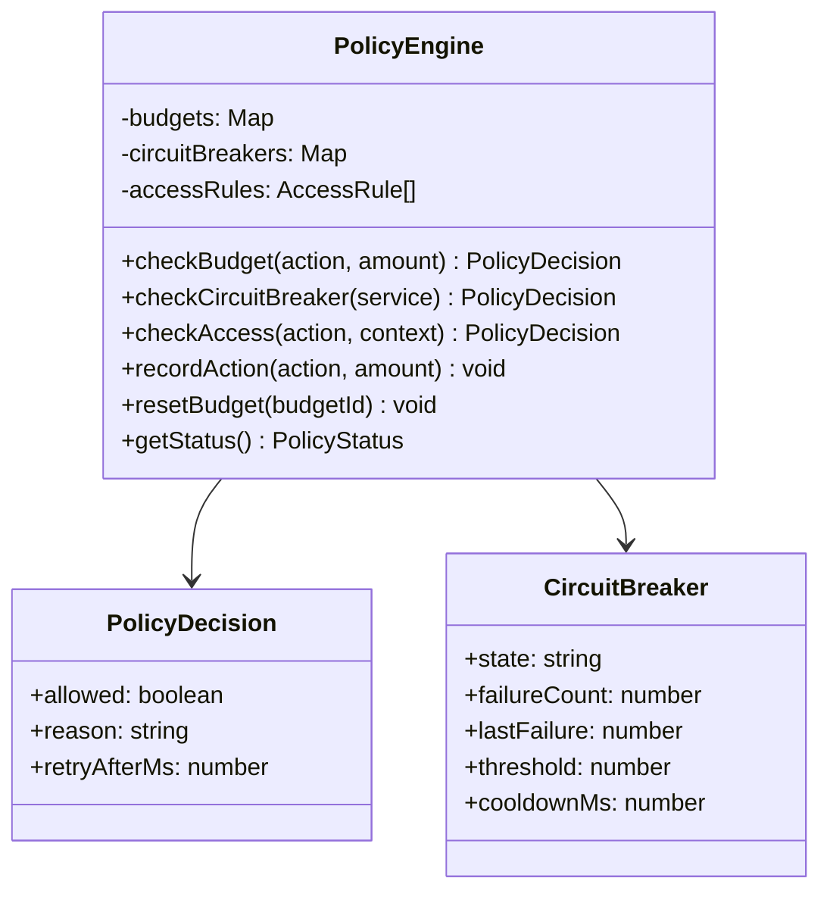

## Interface Integration Map

Shows how interfaces connect at runtime:

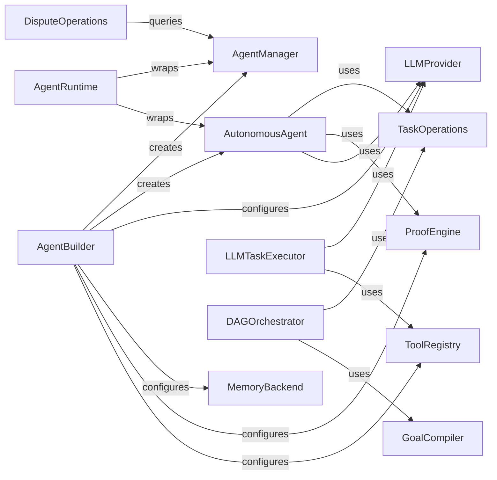
