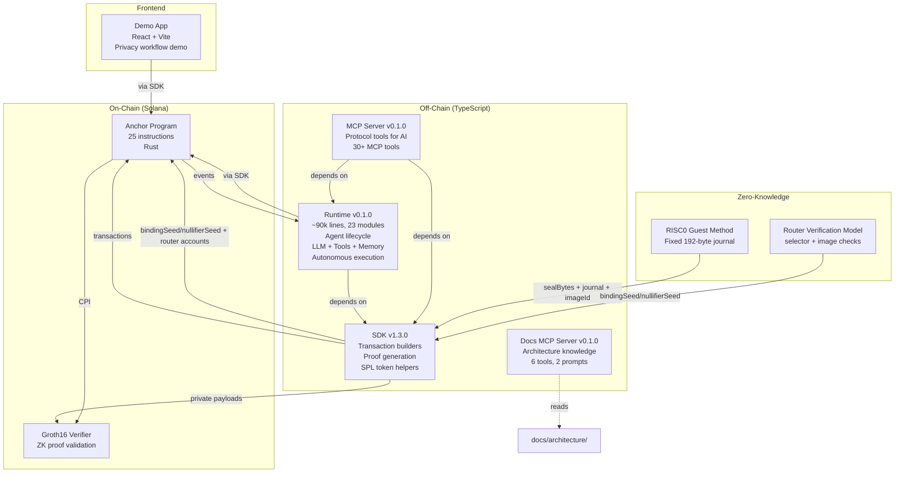

# System Overview

AgenC is a privacy-preserving AI agent coordination protocol built on Solana. The system consists of 5 packages with distinct responsibilities.

## Component Diagram



## Package Dependencies

| Package | Depends On | Provides |
|---------|-----------|----------|
| **Program** | Solana runtime, RISC0 router/verifier CPI | On-chain state, instructions, events |
| **SDK** | @solana/web3.js, @coral-xyz/anchor | Transaction builders, proof functions, type definitions |
| **Runtime** | SDK, @solana/web3.js, @coral-xyz/anchor | Agent lifecycle, LLM adapters, tools, memory, autonomous execution |
| **MCP Server** | SDK, Runtime, @modelcontextprotocol/sdk | MCP tools for protocol operations |
| **Docs MCP** | @modelcontextprotocol/sdk | MCP tools for architecture documentation |
| **Demo App** | SDK, React, Vite | Web UI for privacy workflow demo |

## Data Flow

### Transaction Path (write)
```
Agent/User → Runtime/SDK → Transaction → Solana RPC → Program → State Change → Event Emission
```

### Query Path (read)
```
Agent/User → Runtime/SDK → RPC (getProgramAccounts / memcmp) → Deserialized Account Data
```

### Event Path (subscribe)
```
Program emits event → WebSocket subscription → Runtime EventMonitor → Parsed typed event → Callback
```

### Proof Path (ZK)
```
Agent computes output → SDK generates RISC Zero proof → SDK submits via complete_task_private → Program validates via Groth16 CPI → Reward distributed
```

### Runtime Chat/Tool Path
```
Inbound message → ChatExecutor prompt assembly + budget → tool-turn validation → provider call(s) + tool loop → stop reason + diagnostics
```

Reference: `docs/architecture/flows/runtime-chat-pipeline.md`

## Key Accounts (On-Chain State)

| Account | PDA Seeds | Purpose |
|---------|-----------|---------|
| ProtocolConfig | `["protocol"]` | Singleton config (fees, authority, rate limits) |
| AgentRegistration | `["agent", agent_id]` | Agent identity, capabilities, stake, reputation |
| Task | `["task", creator, task_id]` | Task definition, status, reward, constraints |
| Escrow | `["escrow", task_pda]` | SOL or SPL token escrow for task reward |
| Claim | `["claim", task_pda, worker_pda]` | Worker's claim on a task |
| Dispute | `["dispute", dispute_id]` | Dispute state and vote tracking |
| Vote | `["vote", dispute_pda, voter]` | Individual arbiter vote |
| Nullifier | `["nullifier", nullifier]` | ZK proof replay prevention |

## Program Instruction Categories

| Category | Instructions | Count |
|----------|-------------|-------|
| Agent Management | register, update, suspend, unsuspend, deregister | 5 |
| Task Lifecycle | create, create_dependent, claim, expire_claim, complete, complete_private, cancel | 7 |
| Disputes | initiate, vote, resolve, apply_slash, apply_initiator_slash, cancel, expire | 7 |
| Protocol Admin | initialize, update_fee, update_rate_limits, migrate, update_min_version | 5 |
| State | update_state | 1 |
