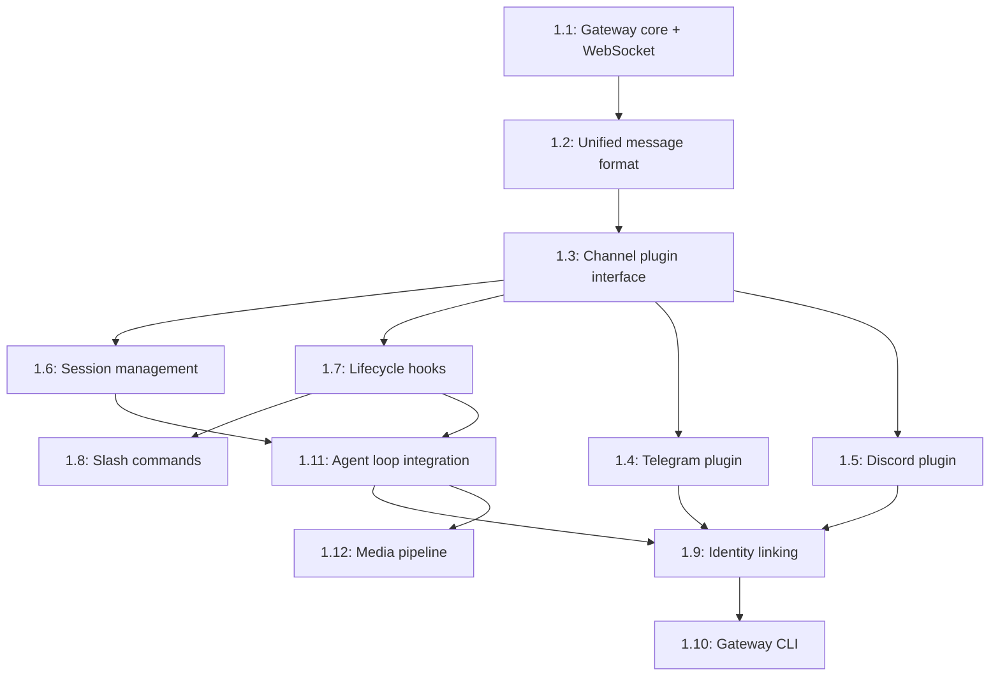

# Phase 1: Gateway & Channel Foundation

## Overview

This phase establishes the messaging infrastructure that makes AgenC agents reachable via external platforms (Telegram, Discord, etc.). The Gateway wraps the existing AgentRuntime and adds multi-channel communication, session management, lifecycle hooks, and a chat execution loop that turns user messages into task completions.

**What this enables:**
- Users can interact with AgenC agents via chat platforms
- Agents maintain conversation context across sessions
- Extensible plugin architecture for adding new channels
- Media processing (voice, images)
- Cross-platform identity linking

## Dependencies

**None** — This is a greenfield implementation.

**Existing runtime infrastructure used:**
- `AgentRuntime` / `AgentBuilder` for lifecycle
- `ConnectionManager` for RPC
- `PolicyEngine` for permissions
- `ToolRegistry` for tool dispatch
- `MemoryBackend` for session storage
- `LLMTaskExecutor` pattern for chat execution

## Issue Dependency Graph



## Implementation Order

1. **1053** — Gateway core process and WebSocket control plane (L)
   - Foundation class, runtime integration, control socket for management
2. **1051** — Unified message format (S)
   - Type definitions for all message flows
3. **1054** — Channel plugin interface and ChannelContext (S)
   - Plugin contract, context object, plugin catalog
4. **1055** — Session management (M)
   - Session state, scoping, reset, compaction
5. **1056** — Lifecycle hook system (M)
   - Event hooks, dispatcher, built-in hooks
6. **1052** — Slash commands handler (S)
   - Command parser, built-in commands
7. **1060** — Telegram channel plugin (M)
   - First concrete channel implementation
8. **1061** — Discord channel plugin (M)
   - Second channel, validates plugin interface
9. **1063** — Agent loop integration (L)
   - ChatExecutor, model fallback, tool integration
10. **1057** — Cross-channel identity linking (M)
    - Link Telegram/Discord identities to single user profile
11. **1058** — Gateway CLI commands and setup wizard (M)
    - CLI for gateway start/stop/status, interactive setup
12. **1059** — Media pipeline (M)
    - Voice transcription, image description

**Rationale:** Core gateway → message types → plugin interface → session/hooks → first channels → agent loop → identity/CLI/media.

## Issue Details

### 1.1: Gateway core process and WebSocket control plane (#1053)

**Goal:** Create the Gateway service that wraps AgentRuntime and exposes a WebSocket control interface.

**Files to create:**
- `gateway/src/index.ts` — module barrel
- `gateway/src/gateway.ts` — Gateway class
- `gateway/src/types.ts` — GatewayConfig, GatewayState
- `gateway/src/control/server.ts` — WebSocket control plane
- `gateway/src/control/protocol.ts` — Control message protocol
- `gateway/package.json` — new package `@agenc/gateway`
- `gateway/tsconfig.json`
- `gateway/vitest.config.ts`
- `gateway/src/gateway.test.ts`

**Files to modify:**
- `package.json` (root) — add gateway to workspaces

**Integration points:**
- Wraps `AgentRuntime` from `@agenc/runtime`
- Uses `ConnectionManager` for RPC health
- Uses `MemoryBackend` for session storage
- Exposes control socket at `~/.agenc/gateway.sock`

**Patterns to follow:**
- Lifecycle pattern from `runtime/src/runtime.ts`
- Singleton service pattern from `runtime/src/connection/manager.ts`
- Error classes from `runtime/src/types/errors.ts`

**Key interfaces:**

```typescript
interface GatewayConfig {
  runtime: AgentRuntime;
  controlSocketPath?: string;
  sessionBackend: MemoryBackend;
}

interface Gateway {
  start(): Promise<void>;
  stop(): Promise<void>;
  getState(): GatewayState;
  registerChannel(plugin: ChannelPlugin): void;
}

interface ControlMessage {
  type: 'ping' | 'status' | 'reload' | 'stop';
  payload?: unknown;
}
```

**Testing strategy:**
- Mock `AgentRuntime` with stub start/stop
- Mock `MemoryBackend`
- Test control socket message dispatch
- Test graceful shutdown

**Estimated scope:** L (500-800 lines)

---

### 1.2: Unified message format (GatewayMessage / OutboundMessage) (#1051)

**Goal:** Define the canonical message types flowing through the gateway.

**Files to create:**
- `gateway/src/messages/types.ts` — GatewayMessage, OutboundMessage, MessageAttachment
- `gateway/src/messages/index.ts` — module barrel
- `gateway/src/messages/types.test.ts`

**Files to modify:**
- `gateway/src/index.ts` — export message types

**Integration points:**
- Used by all channel plugins
- Used by ChatExecutor
- Used by SessionManager

**Patterns to follow:**
- Type design from `runtime/src/events/types.ts`
- Discriminated unions for message types

**Key interfaces:**

```typescript
interface GatewayMessage {
  id: string;
  channelType: string;
  channelUserId: string;
  text: string;
  attachments?: MessageAttachment[];
  timestamp: number;
}

interface OutboundMessage {
  text: string;
  attachments?: MessageAttachment[];
  replyTo?: string;
}
```

**Testing strategy:**
- Type assertions
- Serialization round-trips
- Attachment validation

**Estimated scope:** S (200-300 lines)

---

### 1.3: Channel plugin interface and ChannelContext (#1054)

**Goal:** Define the plugin contract and context object passed to channels.

**Files to create:**
- `gateway/src/channels/plugin.ts` — ChannelPlugin interface
- `gateway/src/channels/context.ts` — ChannelContext class
- `gateway/src/channels/catalog.ts` — PluginCatalog (registry)
- `gateway/src/channels/index.ts` — module barrel
- `gateway/src/channels/plugin.test.ts`

**Files to modify:**
- `gateway/src/gateway.ts` — add `registerChannel()` method
- `gateway/src/index.ts` — export channel types

**Integration points:**
- Catalog pattern similar to `runtime/src/tools/registry.ts`
- Context passed to plugin lifecycle methods

**Patterns to follow:**
- Plugin interface from `runtime/src/skills/types.ts`
- Registry pattern from `runtime/src/tools/registry.ts`

**Key interfaces:**

```typescript
interface ChannelPlugin {
  readonly name: string;
  initialize(context: ChannelContext): Promise<void>;
  shutdown(): Promise<void>;
  sendMessage(userId: string, message: OutboundMessage): Promise<void>;
}

interface ChannelContext {
  gateway: Gateway;
  onMessage(handler: (msg: GatewayMessage) => Promise<void>): void;
  logger: Logger;
}
```

**Testing strategy:**
- Mock plugin implementations
- Test catalog registration/lookup
- Test context callback dispatch

**Estimated scope:** S (300-400 lines)

---

### 1.4: Telegram channel plugin (#1060)

**Goal:** Implement Telegram channel using telegraf library.

**Files to create:**
- `gateway/src/channels/telegram/plugin.ts` — TelegramChannelPlugin
- `gateway/src/channels/telegram/config.ts` — TelegramConfig
- `gateway/src/channels/telegram/index.ts`
- `gateway/src/channels/telegram/plugin.test.ts`

**Files to modify:**
- `gateway/package.json` — add `telegraf` as optional dependency
- `gateway/src/channels/index.ts` — export TelegramChannelPlugin

**Integration points:**
- Uses `ensureLazyModule()` to load telegraf
- Converts Telegram updates to GatewayMessage
- Sends OutboundMessage as Telegram replies

**Patterns to follow:**
- Lazy loading from `runtime/src/utils/lazy-import.ts`
- Error wrapping from `runtime/src/llm/providers/grok.ts`

**Key interfaces:**

```typescript
interface TelegramConfig {
  botToken: string;
  allowedUsers?: number[];
  webhookUrl?: string;
}

class TelegramChannelPlugin implements ChannelPlugin {
  readonly name = 'telegram';
  // implementation
}
```

**Testing strategy:**
- Mock telegraf bot
- Test message conversion (Telegram → Gateway)
- Test reply formatting (Gateway → Telegram)
- Test attachment handling

**Estimated scope:** M (400-600 lines)

---

### 1.5: Discord channel plugin (#1061)

**Goal:** Implement Discord channel using discord.js library.

**Files to create:**
- `gateway/src/channels/discord/plugin.ts` — DiscordChannelPlugin
- `gateway/src/channels/discord/config.ts` — DiscordConfig
- `gateway/src/channels/discord/index.ts`
- `gateway/src/channels/discord/plugin.test.ts`

**Files to modify:**
- `gateway/package.json` — add `discord.js` as optional dependency
- `gateway/src/channels/index.ts` — export DiscordChannelPlugin

**Integration points:**
- Uses `ensureLazyModule()` to load discord.js
- Converts Discord messages to GatewayMessage
- Sends OutboundMessage as Discord replies

**Patterns to follow:**
- Same lazy loading and error patterns as Telegram plugin
- Test patterns from TelegramChannelPlugin

**Key interfaces:**

```typescript
interface DiscordConfig {
  botToken: string;
  allowedGuilds?: string[];
  allowedChannels?: string[];
}

class DiscordChannelPlugin implements ChannelPlugin {
  readonly name = 'discord';
  // implementation
}
```

**Testing strategy:**
- Mock discord.js client
- Test message conversion
- Test reply formatting
- Test mention/role handling

**Estimated scope:** M (400-600 lines)

---

### 1.6: Session management (scoping, reset, compaction) (#1055)

**Goal:** Manage conversation sessions with memory backend integration.

**Files to create:**
- `gateway/src/session/manager.ts` — SessionManager class
- `gateway/src/session/types.ts` — Session, SessionConfig
- `gateway/src/session/compaction.ts` — Session compaction logic
- `gateway/src/session/index.ts`
- `gateway/src/session/manager.test.ts`

**Files to modify:**
- `gateway/src/gateway.ts` — integrate SessionManager
- `gateway/src/index.ts` — export session types

**Integration points:**
- Uses `MemoryBackend` for storage
- Session keys: `session:{channelType}:{userId}`
- Compaction triggers on token limit

**Patterns to follow:**
- Thread management from `runtime/src/memory/types.ts`
- Compaction pattern from future memory summarization

**Key interfaces:**

```typescript
interface Session {
  id: string;
  userId: string;
  channelType: string;
  createdAt: number;
  lastActivityAt: number;
}

interface SessionManager {
  getOrCreate(channelType: string, userId: string): Promise<Session>;
  reset(sessionId: string): Promise<void>;
  compact(sessionId: string): Promise<void>;
}
```

**Testing strategy:**
- Mock MemoryBackend
- Test session creation/retrieval
- Test reset clears history
- Test compaction token budget

**Estimated scope:** M (400-500 lines)

---

### 1.7: Lifecycle hook system (HookDispatcher) (#1056)

**Goal:** Provide event hooks for message lifecycle (before/after send, on error, etc.).

**Files to create:**
- `gateway/src/hooks/dispatcher.ts` — HookDispatcher class
- `gateway/src/hooks/types.ts` — HookHandler, HookEvent
- `gateway/src/hooks/builtin.ts` — Built-in hooks (logging, metrics)
- `gateway/src/hooks/index.ts`
- `gateway/src/hooks/dispatcher.test.ts`

**Files to modify:**
- `gateway/src/gateway.ts` — integrate HookDispatcher
- `gateway/src/index.ts` — export hook types

**Integration points:**
- Hooks fired by Gateway at lifecycle points
- Similar to `EventMonitor` subscription pattern

**Patterns to follow:**
- Subscription pattern from `runtime/src/events/monitor.ts`
- Error handling from `runtime/src/types/errors.ts`

**Key interfaces:**

```typescript
interface HookEvent {
  type: 'message:before' | 'message:after' | 'send:before' | 'send:after' | 'error';
  data: unknown;
  timestamp: number;
}

interface HookHandler {
  handle(event: HookEvent): Promise<void>;
}

interface HookDispatcher {
  register(type: HookEvent['type'], handler: HookHandler): void;
  dispatch(event: HookEvent): Promise<void>;
}
```

**Testing strategy:**
- Mock handlers
- Test dispatch order
- Test error isolation (one handler failure doesn't break others)
- Test built-in hooks

**Estimated scope:** M (350-450 lines)

---

### 1.8: Slash commands handler (#1052)

**Goal:** Parse and execute slash commands (/help, /reset, etc.).

**Files to create:**
- `gateway/src/commands/parser.ts` — Command parser
- `gateway/src/commands/registry.ts` — Command registry
- `gateway/src/commands/builtin.ts` — Built-in commands
- `gateway/src/commands/types.ts` — Command, CommandContext
- `gateway/src/commands/index.ts`
- `gateway/src/commands/parser.test.ts`

**Files to modify:**
- `gateway/src/gateway.ts` — integrate command dispatch
- `gateway/src/index.ts` — export command types

**Integration points:**
- Commands dispatched before ChatExecutor
- Commands can manipulate session state
- Hook into session reset, compaction

**Patterns to follow:**
- Registry pattern from `runtime/src/tools/registry.ts`
- Command pattern from CLI tools

**Key interfaces:**

```typescript
interface Command {
  name: string;
  description: string;
  execute(ctx: CommandContext, args: string[]): Promise<string>;
}

interface CommandContext {
  session: Session;
  gateway: Gateway;
}
```

**Testing strategy:**
- Test parser splits command and args
- Test built-in commands (/help, /reset, /status)
- Test unknown command handling

**Estimated scope:** S (250-350 lines)

---

### 1.9: Cross-channel identity linking (#1057)

**Goal:** Link Telegram and Discord identities to a single user profile.

**Files to create:**
- `gateway/src/identity/linker.ts` — IdentityLinker class
- `gateway/src/identity/types.ts` — UserProfile, IdentityLink
- `gateway/src/identity/storage.ts` — Storage adapter
- `gateway/src/identity/index.ts`
- `gateway/src/identity/linker.test.ts`

**Files to modify:**
- `gateway/src/gateway.ts` — integrate IdentityLinker
- `gateway/src/session/manager.ts` — use linked identity for session keys
- `gateway/src/index.ts` — export identity types

**Integration points:**
- Uses MemoryBackend for storage
- Session keys use canonical userId
- Link via `/link <code>` command

**Patterns to follow:**
- Storage patterns from `runtime/src/memory/types.ts`

**Key interfaces:**

```typescript
interface UserProfile {
  canonicalId: string;
  linkedIdentities: IdentityLink[];
  createdAt: number;
}

interface IdentityLink {
  channelType: string;
  channelUserId: string;
  linkedAt: number;
}

interface IdentityLinker {
  link(fromChannel: string, fromUserId: string, toUserId: string): Promise<void>;
  resolve(channelType: string, userId: string): Promise<string>;
}
```

**Testing strategy:**
- Test link creation
- Test resolution (channelUserId → canonicalId)
- Test unlinking
- Test multi-channel linking

**Estimated scope:** M (350-450 lines)

---

### 1.10: Gateway CLI commands and setup wizard (#1058)

**Goal:** CLI for gateway start/stop/status and interactive setup.

**Files to create:**
- `gateway/src/cli/gateway.ts` — Gateway CLI commands
- `gateway/src/cli/wizard.ts` — Interactive setup wizard
- `gateway/src/cli/index.ts`
- `gateway/src/bin/cli.ts` — CLI entry point

**Files to modify:**
- `gateway/package.json` — add bin entry for `agenc-gateway`
- `runtime/src/bin/cli.ts` — add gateway subcommands (or keep separate)

**Integration points:**
- Reads config from `~/.agenc/gateway.json`
- Communicates with control socket
- Setup wizard creates config interactively

**Patterns to follow:**
- CLI structure from `runtime/src/bin/cli.ts`
- Command pattern from `runtime/src/cli/health.ts`

**Key interfaces:**

```typescript
interface GatewayCommand {
  name: string;
  description: string;
  execute(args: string[]): Promise<void>;
}

interface SetupWizard {
  run(): Promise<GatewayConfig>;
}
```

**Testing strategy:**
- Mock control socket client
- Test setup wizard prompts
- Test config file read/write
- Test command dispatch

**Estimated scope:** M (400-500 lines)

---

### 1.11: Agent loop integration (ChatExecutor + model fallback) (#1063)

**Goal:** Execute chat messages through LLM with tool calling and model fallback.

**Files to create:**
- `gateway/src/executor/chat-executor.ts` — ChatExecutor class
- `gateway/src/executor/types.ts` — ChatExecutorConfig, ChatResult
- `gateway/src/executor/fallback.ts` — Model fallback logic
- `gateway/src/executor/index.ts`
- `gateway/src/executor/chat-executor.test.ts`

**Files to modify:**
- `gateway/src/gateway.ts` — integrate ChatExecutor
- `gateway/src/index.ts` — export executor types

**Integration points:**
- Uses LLM providers from `runtime/src/llm/`
- Uses ToolRegistry from `runtime/src/tools/`
- Uses MemoryBackend for conversation history
- Converts GatewayMessage → LLMMessage → OutboundMessage

**Patterns to follow:**
- Tool call loop from `runtime/src/llm/executor.ts`
- Error handling with fallback models

**Key interfaces:**

```typescript
interface ChatExecutorConfig {
  primaryModel: LLMProvider;
  fallbackModels?: LLMProvider[];
  tools: ToolRegistry;
  memory: MemoryBackend;
  maxToolRounds?: number;
}

interface ChatExecutor {
  execute(message: GatewayMessage, session: Session): Promise<OutboundMessage>;
}
```

**Testing strategy:**
- Mock LLMProvider
- Mock ToolRegistry
- Test tool call loop
- Test model fallback on error
- Test conversation history retrieval

**Estimated scope:** L (600-800 lines)

---

### 1.12: Media pipeline (voice transcription, image description) (#1059)

**Goal:** Process voice and image attachments before sending to LLM.

**Files to create:**
- `gateway/src/media/pipeline.ts` — MediaPipeline class
- `gateway/src/media/transcription.ts` — Voice transcription (Whisper API)
- `gateway/src/media/vision.ts` — Image description (GPT-4V or similar)
- `gateway/src/media/types.ts` — MediaProcessor interface
- `gateway/src/media/index.ts`
- `gateway/src/media/pipeline.test.ts`

**Files to modify:**
- `gateway/src/executor/chat-executor.ts` — run media pipeline before LLM
- `gateway/package.json` — add `form-data` dependency
- `gateway/src/index.ts` — export media types

**Integration points:**
- Runs before ChatExecutor
- Converts voice → text, image → description
- Appends results to message text

**Patterns to follow:**
- Lazy loading for API clients
- Error handling from `runtime/src/llm/providers/`

**Key interfaces:**

```typescript
interface MediaProcessor {
  process(attachment: MessageAttachment): Promise<string>;
}

interface MediaPipeline {
  processAttachments(attachments: MessageAttachment[]): Promise<string[]>;
}

interface TranscriptionConfig {
  apiKey: string;
  model?: string;
}
```

**Testing strategy:**
- Mock API calls
- Test voice transcription
- Test image description
- Test attachment filtering
- Test error handling (unsupported formats)

**Estimated scope:** M (400-500 lines)

---

## Integration Checklist

After completing all issues:

- [ ] Gateway can start/stop cleanly
- [ ] Telegram and Discord channels receive and send messages
- [ ] Sessions persist across gateway restarts
- [ ] Slash commands work (/help, /reset)
- [ ] Agent loop completes tool calls
- [ ] Voice messages transcribed
- [ ] Images described
- [ ] Identity linking connects Telegram and Discord
- [ ] CLI commands work (start, stop, status)
- [ ] All tests pass (~1200+ tests expected)

## Success Metrics

- Gateway startup time < 5 seconds
- Message round-trip latency < 2 seconds (excluding LLM)
- Zero memory leaks during 24h operation
- Graceful shutdown completes in < 5 seconds
- All channel plugins load without errors
