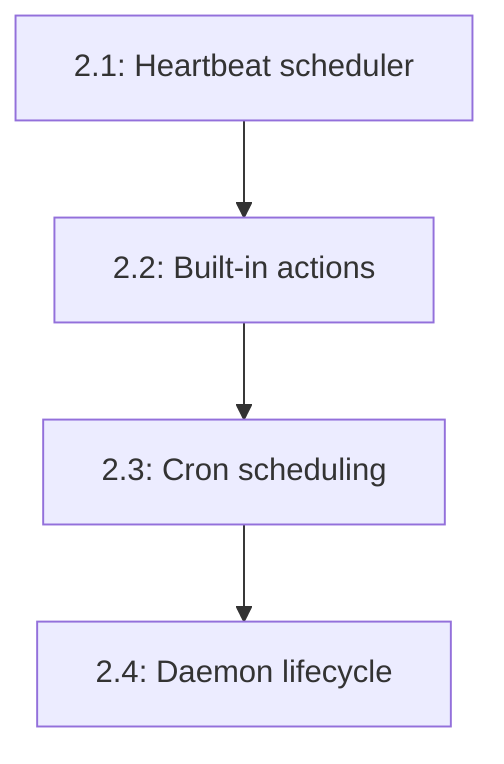

# Phase 2: Heartbeat & Autonomous Daemon

## Overview

This phase adds scheduled autonomous behavior to AgenC agents. The Heartbeat system allows agents to wake up on a schedule (cron-like) and perform actions without user input. The Daemon subsystem provides production-ready process management with PID files, signal handling, systemd integration, and crash recovery.

**What this enables:**
- Agents can scan for new tasks on a schedule
- Daily/weekly summaries sent to chat channels
- Portfolio monitoring and alerts
- Custom heartbeat actions via plugins
- Production deployment as a system service
- Graceful restarts and crash recovery

## Dependencies

**Phase 1:** Gateway & Channel Foundation
- Uses `Gateway` for sending autonomous messages
- Uses `ChannelPlugin` to deliver heartbeat results
- Uses `Session` for maintaining autonomous conversation threads

**Existing runtime infrastructure:**
- `TaskScanner` from `runtime/src/autonomous/scanner.ts`
- `TaskDiscovery` from `runtime/src/task/discovery.ts`
- CLI patterns from `runtime/src/bin/cli.ts`

## Issue Dependency Graph



## Implementation Order

1. **1081** — Heartbeat scheduler (M)
   - Core scheduler, action dispatch, quiet heartbeat contract
2. **1084** — Built-in heartbeat actions (M)
   - Task scan, daily summary, portfolio monitor
3. **1085** — Cron-like scheduling (S)
   - Per-action cron expressions
4. **1078** — Daemon lifecycle (M)
   - PID file, signal handling, systemd service, crash recovery

**Rationale:** Scheduler → actions → cron → daemon. Basic scheduler first, then actions to test it, then flexible scheduling, finally production hardening.

## Issue Details

### 2.1: Heartbeat scheduler (#1081)

**Goal:** Create a scheduler that runs heartbeat actions on intervals.

**Files to create:**
- `gateway/src/heartbeat/scheduler.ts` — HeartbeatScheduler class
- `gateway/src/heartbeat/types.ts` — HeartbeatAction, HeartbeatContext, HeartbeatResult
- `gateway/src/heartbeat/index.ts`
- `gateway/src/heartbeat/scheduler.test.ts`

**Files to modify:**
- `gateway/src/gateway.ts` — integrate HeartbeatScheduler
- `gateway/src/index.ts` — export heartbeat types

**Integration points:**
- Runs actions in isolated sessions (one session per action)
- Sends results via Gateway channels
- Implements "quiet heartbeat" contract: only send messages when actionable

**Patterns to follow:**
- Scheduler pattern similar to cron-based task runners
- Error isolation (one action failure doesn't crash scheduler)
- Logging from `runtime/src/utils/logger.ts`

**Key interfaces:**

```typescript
interface HeartbeatAction {
  readonly name: string;
  readonly description: string;
  execute(context: HeartbeatContext): Promise<HeartbeatResult>;
}

interface HeartbeatContext {
  gateway: Gateway;
  runtime: AgentRuntime;
  session: Session;
  logger: Logger;
}

interface HeartbeatResult {
  shouldNotify: boolean;
  message?: string;
  metadata?: Record<string, unknown>;
}

interface HeartbeatScheduler {
  registerAction(action: HeartbeatAction, intervalMs: number): void;
  start(): Promise<void>;
  stop(): Promise<void>;
}
```

**Testing strategy:**
- Mock Gateway, AgentRuntime
- Test action dispatch at intervals
- Test quiet heartbeat (shouldNotify=false → no message sent)
- Test error isolation
- Test scheduler start/stop

**Estimated scope:** M (400-500 lines)

---

### 2.2: Built-in heartbeat actions (task scan, summary, portfolio) (#1084)

**Goal:** Implement three core heartbeat actions.

**Files to create:**
- `gateway/src/heartbeat/actions/task-scan.ts` — TaskScanAction
- `gateway/src/heartbeat/actions/daily-summary.ts` — DailySummaryAction
- `gateway/src/heartbeat/actions/portfolio-monitor.ts` — PortfolioMonitorAction
- `gateway/src/heartbeat/actions/index.ts`
- `gateway/src/heartbeat/actions/task-scan.test.ts`
- `gateway/src/heartbeat/actions/daily-summary.test.ts`
- `gateway/src/heartbeat/actions/portfolio-monitor.test.ts`

**Files to modify:**
- `gateway/src/gateway.ts` — register built-in actions by default
- `gateway/src/heartbeat/index.ts` — export actions

**Integration points:**
- **TaskScanAction:** Uses `TaskScanner` from `runtime/src/autonomous/scanner.ts` to find claimable tasks
  - Quiet heartbeat: only notify if new tasks found
  - Message: "Found {count} new tasks matching your capabilities"
- **DailySummaryAction:** Summarizes last 24h of activity
  - Quiet heartbeat: always send (once per day)
  - Message: "Daily summary: {completions} tasks completed, {earnings} earned"
- **PortfolioMonitorAction:** Checks task portfolio for alerts (expiring deadlines, disputes)
  - Quiet heartbeat: only notify if alerts found
  - Message: "Alert: Task #{id} deadline in 2 hours"

**Patterns to follow:**
- Wraps existing `TaskScanner` class
- Uses `TaskOperations` for queries
- Uses `DisputeOperations` for dispute checks
- Error handling from `runtime/src/types/errors.ts`

**Key interfaces:**

```typescript
class TaskScanAction implements HeartbeatAction {
  readonly name = 'task-scan';
  readonly description = 'Scan for new claimable tasks';
  // implementation
}

class DailySummaryAction implements HeartbeatAction {
  readonly name = 'daily-summary';
  readonly description = 'Generate daily activity summary';
  // implementation
}

class PortfolioMonitorAction implements HeartbeatAction {
  readonly name = 'portfolio-monitor';
  readonly description = 'Monitor active tasks for alerts';
  // implementation
}
```

**Testing strategy:**
- Mock TaskScanner, TaskOperations, DisputeOperations
- Test TaskScanAction: new tasks → notify, no tasks → quiet
- Test DailySummaryAction: always notify, correct aggregation
- Test PortfolioMonitorAction: alerts → notify, no alerts → quiet
- Test error handling (scanner failure)

**Estimated scope:** M (500-700 lines total across 3 actions)

---

### 2.3: Cron-like scheduling with per-action schedules (#1085)

**Goal:** Replace fixed intervals with cron expressions for flexible scheduling.

**Files to create:**
- `gateway/src/heartbeat/cron-scheduler.ts` — CronScheduler class
- `gateway/src/heartbeat/cron-parser.ts` — Cron expression parser
- `gateway/src/heartbeat/cron-scheduler.test.ts`

**Files to modify:**
- `gateway/src/heartbeat/scheduler.ts` — integrate CronScheduler
- `gateway/src/heartbeat/types.ts` — add `schedule` field to action registration

**Integration points:**
- Uses `node-cron` or similar library for parsing
- Each action can have its own cron schedule
- Default schedules for built-in actions:
  - TaskScanAction: `*/5 * * * *` (every 5 minutes)
  - DailySummaryAction: `0 9 * * *` (9 AM daily)
  - PortfolioMonitorAction: `0 * * * *` (hourly)

**Patterns to follow:**
- Lazy loading for cron library via `ensureLazyModule()`
- Error handling for invalid cron expressions

**Key interfaces:**

```typescript
interface CronScheduler {
  schedule(action: HeartbeatAction, cronExpr: string): void;
  unschedule(actionName: string): void;
  start(): Promise<void>;
  stop(): Promise<void>;
}

interface CronExpression {
  minute: string;
  hour: string;
  dayOfMonth: string;
  month: string;
  dayOfWeek: string;
}
```

**Testing strategy:**
- Test cron expression parsing
- Test action dispatch at correct times (use fake timers)
- Test invalid cron expression rejection
- Test unschedule

**Estimated scope:** S (250-350 lines)

---

### 2.4: Daemon lifecycle (PID, signals, systemd, crash recovery) (#1078)

**Goal:** Production-ready daemon management with process supervision.

**Files to create:**
- `gateway/src/daemon/manager.ts` — DaemonManager class
- `gateway/src/daemon/pidfile.ts` — PID file management
- `gateway/src/daemon/signals.ts` — Signal handlers
- `gateway/src/daemon/recovery.ts` — Crash recovery logic
- `gateway/src/daemon/systemd.ts` — Systemd service generator
- `gateway/src/daemon/index.ts`
- `gateway/src/daemon/manager.test.ts`
- `scripts/install-systemd-service.sh` — Systemd install script

**Files to modify:**
- `gateway/src/bin/cli.ts` — add daemon commands (start, stop, restart, status)
- `gateway/src/gateway.ts` — integrate signal handlers

**Integration points:**
- PID file at `~/.agenc/gateway.pid`
- Signal handling:
  - `SIGTERM` → graceful shutdown (stop gateway, save state, exit)
  - `SIGHUP` → reload config (re-read `~/.agenc/gateway.json`)
  - `SIGINT` → graceful shutdown (same as SIGTERM)
- Systemd service template:
  - `Type=simple`
  - `Restart=on-failure`
  - `RestartSec=10s`
  - `WatchdogSec=60s`
- Crash recovery: detect unclean shutdown (PID file exists but process dead), log error, clean up

**Patterns to follow:**
- PID file pattern from standard Unix daemons
- Signal handling from Node.js process.on('SIGNAL')
- Error recovery patterns from `runtime/src/connection/manager.ts`

**Key interfaces:**

```typescript
interface DaemonManager {
  start(): Promise<void>;
  stop(): Promise<void>;
  restart(): Promise<void>;
  status(): DaemonStatus;
  setupSignalHandlers(): void;
}

interface DaemonStatus {
  running: boolean;
  pid?: number;
  uptime?: number;
  lastCrash?: number;
}

interface PidFile {
  write(pid: number): Promise<void>;
  read(): Promise<number | null>;
  remove(): Promise<void>;
  exists(): Promise<boolean>;
}
```

**Testing strategy:**
- Test PID file creation/removal
- Test signal handler registration
- Test graceful shutdown sequence
- Test crash detection (stale PID file)
- Test systemd service template generation
- Integration test: start daemon, send SIGTERM, verify clean shutdown

**Estimated scope:** M (500-700 lines)

---

## Integration Checklist

After completing all issues:

- [ ] Heartbeat actions run on schedule
- [ ] TaskScanAction finds and reports new tasks
- [ ] DailySummaryAction sends daily report
- [ ] PortfolioMonitorAction alerts on deadlines
- [ ] Cron expressions parsed correctly
- [ ] Daemon starts with PID file
- [ ] SIGTERM triggers graceful shutdown
- [ ] SIGHUP reloads config
- [ ] Systemd service installs and runs
- [ ] Crash recovery detects stale PID
- [ ] All tests pass (~400+ tests expected)

## Configuration Example

```json
{
  "heartbeat": {
    "enabled": true,
    "actions": [
      {
        "name": "task-scan",
        "schedule": "*/5 * * * *",
        "config": {
          "minReward": 100000000,
          "capabilities": 3
        }
      },
      {
        "name": "daily-summary",
        "schedule": "0 9 * * *"
      },
      {
        "name": "portfolio-monitor",
        "schedule": "0 * * * *"
      }
    ]
  },
  "daemon": {
    "pidFile": "~/.agenc/gateway.pid",
    "watchdogInterval": 60000
  }
}
```

## Systemd Service Template

```ini
[Unit]
Description=AgenC Gateway Daemon
After=network.target

[Service]
Type=simple
User=%i
ExecStart=/usr/bin/node /path/to/gateway/dist/bin/cli.js daemon start
Restart=on-failure
RestartSec=10s
WatchdogSec=60s
StandardOutput=journal
StandardError=journal

[Install]
WantedBy=multi-user.target
```

## Success Metrics

- Heartbeat actions fire within 1 second of scheduled time
- Daemon uptime > 7 days without manual intervention
- Graceful shutdown completes in < 5 seconds
- Crash recovery restarts within 10 seconds
- Zero memory leaks during 30-day operation
- Task scan latency < 2 seconds
