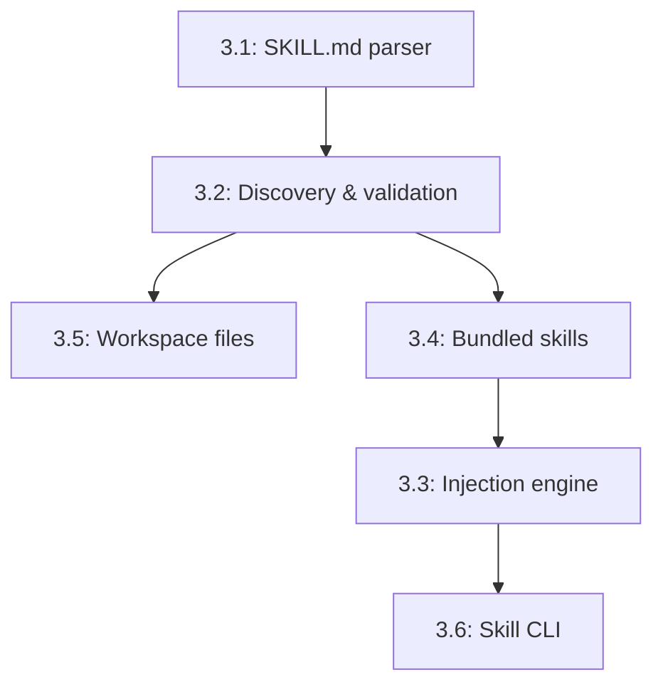

# Phase 3: Documentation-Centric Skills — SKILL.md

## Overview

This phase introduces a documentation-first approach to teaching agents new capabilities. Instead of writing code, users write markdown files (SKILL.md) with YAML frontmatter that describe skills, their requirements, and usage examples. The system discovers, validates, and injects these skills into the agent's context automatically.

**What this enables:**
- Non-programmers can teach agents new skills
- Skills self-document their requirements (binaries, env vars, OS)
- Context-aware skill injection (only load relevant skills)
- Compatible with OpenClaw SKILL.md format
- Agent personality and workspace context via markdown files
- Hierarchical skill discovery (agent > user > project > built-in)

## Dependencies

**Phase 1:** Gateway & Channel Foundation
- Uses system prompt assembly in ChatExecutor
- Skills injected as `<skill>` blocks before LLM calls

**Existing runtime infrastructure:**
- `SkillRegistry` from `runtime/src/skills/types.ts`
- Manifest/catalog patterns from `runtime/src/skills/`
- Tool integration from `runtime/src/tools/`

## Issue Dependency Graph



## Implementation Order

1. **1065** — SKILL.md parser (M)
   - YAML frontmatter extraction, markdown body parsing
2. **1070** — Discovery and validation (M)
   - 3-tier discovery, requirement checks, caching
3. **1066** — Workspace files (S)
   - AGENT.md, SOUL.md, USER.md, MEMORY.md
4. **1071** — Bundled skills (M)
   - 8 starter SKILL.md files
5. **1075** — Injection engine (M)
   - Context-aware selection, token budget, assembly
6. **1074** — Skill CLI (S)
   - list, info, validate, create, install commands

**Rationale:** Parser → discovery → workspace/bundled skills → injection → CLI. Foundation first, content second, then smart loading, finally management tools.

## Issue Details

### 3.1: SKILL.md parser (YAML frontmatter + markdown body) (#1065)

**Goal:** Parse SKILL.md files with YAML frontmatter and markdown body.

**Files to create:**
- `gateway/src/skills/parser.ts` — SkillParser class
- `gateway/src/skills/types.ts` — MarkdownSkill, SkillFrontmatter
- `gateway/src/skills/index.ts`
- `gateway/src/skills/parser.test.ts`

**Files to modify:**
- `gateway/src/index.ts` — export skill types

**Integration points:**
- Uses `yaml` library for frontmatter parsing
- Validates frontmatter schema (name, description, keywords, requirements)
- Markdown body becomes skill content
- Compatible with OpenClaw format via `metadata.agenc` namespace

**Patterns to follow:**
- Similar to manifest parsing in `runtime/src/skills/manifest.ts`
- YAML parsing pattern from config files

**Key interfaces:**

```typescript
interface MarkdownSkill {
  name: string;
  description: string;
  keywords: string[];
  requirements?: SkillRequirements;
  content: string;
  filePath: string;
}

interface SkillFrontmatter {
  name: string;
  description: string;
  keywords: string[];
  version?: string;
  requirements?: SkillRequirements;
  metadata?: {
    agenc?: {
      capabilities?: string[];
      priority?: number;
    };
  };
}

interface SkillRequirements {
  binaries?: string[];
  envVars?: string[];
  os?: ('linux' | 'darwin' | 'win32')[];
}

interface SkillParser {
  parse(filePath: string): Promise<MarkdownSkill>;
  validate(skill: MarkdownSkill): boolean;
}
```

**Testing strategy:**
- Test frontmatter extraction
- Test markdown body parsing
- Test missing required fields (name, description)
- Test invalid YAML
- Test requirements parsing
- Test metadata.agenc namespace

**Estimated scope:** M (400-500 lines)

---

### 3.2: Skill discovery and validation (3-tier, requirement checks) (#1070)

**Goal:** Discover skills from 4 locations and validate their requirements.

**Files to create:**
- `gateway/src/skills/discovery.ts` — SkillDiscovery class
- `gateway/src/skills/validator.ts` — SkillValidator class
- `gateway/src/skills/cache.ts` — Skill cache (mtime-based invalidation)
- `gateway/src/skills/discovery.test.ts`
- `gateway/src/skills/validator.test.ts`

**Files to modify:**
- `gateway/src/gateway.ts` — integrate SkillDiscovery
- `gateway/src/skills/index.ts` — export discovery/validator

**Integration points:**
- Discovery scans 4 locations (priority order):
  1. `~/.agenc/agents/{agent-id}/skills/` (agent-specific)
  2. `~/.agenc/skills/` (user global)
  3. `./skills/` (project-local, if in git repo)
  4. `gateway/bundled-skills/` (built-in)
- Validator checks:
  - Binaries exist on PATH (`which <binary>`)
  - Env vars are set
  - OS matches current platform
- Cache invalidates on file mtime change

**Patterns to follow:**
- Similar to skill catalog in `runtime/src/skills/catalog.ts`
- File scanning patterns from glob
- Binary checking: `execFile('which', [binary])`

**Key interfaces:**

```typescript
interface SkillDiscovery {
  discover(): Promise<MarkdownSkill[]>;
  discoverFromPath(path: string): Promise<MarkdownSkill[]>;
  getSkill(name: string): Promise<MarkdownSkill | null>;
  refresh(): Promise<void>;
}

interface SkillValidator {
  validate(skill: MarkdownSkill): Promise<ValidationResult>;
  checkBinary(name: string): Promise<boolean>;
  checkEnvVar(name: string): boolean;
  checkOS(skill: MarkdownSkill): boolean;
}

interface ValidationResult {
  valid: boolean;
  missingBinaries: string[];
  missingEnvVars: string[];
  osIncompatible: boolean;
}
```

**Testing strategy:**
- Mock file system for discovery
- Test 4-tier priority (agent > user > project > built-in)
- Test cache invalidation on mtime change
- Test binary validation (mock `which`)
- Test env var validation
- Test OS validation
- Test partial failures (some skills valid, some invalid)

**Estimated scope:** M (500-700 lines)

---

### 3.3: Skill injection engine (context-aware prompt assembly) (#1075)

**Goal:** Select and inject relevant skills into the system prompt.

**Files to create:**
- `gateway/src/skills/injector.ts` — SkillInjector class
- `gateway/src/skills/selector.ts` — Skill selection logic
- `gateway/src/skills/token-budget.ts` — Token budget enforcement
- `gateway/src/skills/injector.test.ts`

**Files to modify:**
- `gateway/src/executor/chat-executor.ts` — inject skills into system prompt
- `gateway/src/skills/index.ts` — export injector

**Integration points:**
- Runs before each LLM call
- Selects skills by:
  - Keyword matching (message keywords ∩ skill keywords)
  - Capability overlap (agent capabilities & skill required capabilities)
  - Manual priority (metadata.agenc.priority)
- Injects as `<skill name="...">content</skill>` blocks
- Token budget cap: 4000 tokens max for all skills
- Counts tokens using simple approximation (1 token ≈ 4 chars)

**Patterns to follow:**
- Context assembly from LLM executor
- Token counting patterns from memory compaction
- Selection scoring similar to bid marketplace scoring

**Key interfaces:**

```typescript
interface SkillInjector {
  inject(context: InjectionContext): Promise<string>;
  selectSkills(context: InjectionContext): Promise<MarkdownSkill[]>;
}

interface InjectionContext {
  message: GatewayMessage;
  agentCapabilities: bigint;
  maxTokens?: number;
}

interface SkillSelector {
  score(skill: MarkdownSkill, context: InjectionContext): number;
  rank(skills: MarkdownSkill[], context: InjectionContext): MarkdownSkill[];
}

interface TokenBudget {
  count(text: string): number;
  enforce(skills: MarkdownSkill[], budget: number): MarkdownSkill[];
}
```

**Testing strategy:**
- Test keyword matching (message → relevant skills)
- Test capability filtering
- Test priority sorting
- Test token budget enforcement (truncate at 4000 tokens)
- Test injection format (`<skill name="...">...</skill>`)
- Test empty case (no matching skills)

**Estimated scope:** M (400-500 lines)

---

### 3.4: Bundled skills (8 starter SKILL.md files) (#1071)

**Goal:** Create 8 high-quality SKILL.md files for common tasks.

**Files to create:**
- `gateway/bundled-skills/solana-wallet.md` — Wallet operations
- `gateway/bundled-skills/task-management.md` — Task lifecycle
- `gateway/bundled-skills/code-review.md` — Code review workflows
- `gateway/bundled-skills/data-analysis.md` — Data analysis patterns
- `gateway/bundled-skills/web-research.md` — Web research strategies
- `gateway/bundled-skills/deployment.md` — Deployment checklists
- `gateway/bundled-skills/debugging.md` — Debugging approaches
- `gateway/bundled-skills/testing.md` — Testing strategies

**Files to modify:**
- None (bundled skills are data files)

**Integration points:**
- Loaded by SkillDiscovery tier 4
- No requirements (usable by all agents)

**Patterns to follow:**
- Each skill should be 100-300 lines
- YAML frontmatter with 5-10 keywords
- Markdown body with:
  - Overview section
  - Step-by-step procedures
  - Example commands/code
  - Common pitfalls
  - Related skills

**Key structure (example for solana-wallet.md):**

```markdown
---
name: solana-wallet
description: Solana wallet operations and transaction signing
keywords: [solana, wallet, transaction, signature, keypair, balance]
version: 1.0.0
metadata:
  agenc:
    capabilities: [COMPUTE]
    priority: 5
---

# Solana Wallet Operations

## Overview
This skill covers Solana wallet management, balance queries, and transaction signing.

## Check Balance
Use `solana balance <address>` to check SOL balance.

## Send Transaction
1. Create transaction with `@solana/web3.js`
2. Sign with wallet keypair
3. Send via `connection.sendTransaction()`

## Common Pitfalls
- Don't expose private keys in logs
- Always check recent blockhash expiry
- Use recommended compute unit budgets

## Related Skills
- task-management (for claiming tasks)
- deployment (for program deploys)
```

**Testing strategy:**
- Test all 8 skills parse without errors
- Test frontmatter schema compliance
- Verify no requirements (should work everywhere)
- Check keyword diversity (no duplicate keyword sets)

**Estimated scope:** M (1500-2000 lines total across 8 files)

---

### 3.5: Workspace files (AGENT.md, SOUL.md, USER.md, etc.) (#1066)

**Goal:** Define workspace markdown files for agent context.

**Files to create:**
- `gateway/src/workspace/types.ts` — WorkspaceFiles interface
- `gateway/src/workspace/loader.ts` — Workspace file loader
- `gateway/src/workspace/index.ts`
- `gateway/src/workspace/loader.test.ts`
- `examples/workspace-templates/AGENT.md` — Agent identity template
- `examples/workspace-templates/SOUL.md` — Personality template
- `examples/workspace-templates/USER.md` — User preferences template
- `examples/workspace-templates/MEMORY.md` — Long-term memory template

**Files to modify:**
- `gateway/src/executor/chat-executor.ts` — load workspace files into system prompt
- `gateway/src/skills/index.ts` — export workspace types

**Integration points:**
- Loaded from `~/.agenc/workspace/` directory
- Injected into system prompt before skills
- Template format:
  - **AGENT.md:** Agent identity (name, role, backstory)
  - **SOUL.md:** Personality traits, tone, communication style
  - **USER.md:** User preferences, goals, context
  - **MEMORY.md:** Long-term facts (updated by memory ingestion)

**Patterns to follow:**
- Simple file loader (read markdown files)
- No frontmatter (pure markdown)
- Error handling for missing files (skip if not found)

**Key interfaces:**

```typescript
interface WorkspaceFiles {
  agent?: string;
  soul?: string;
  user?: string;
  memory?: string;
}

interface WorkspaceLoader {
  load(dir: string): Promise<WorkspaceFiles>;
  loadFile(path: string): Promise<string | null>;
}
```

**Testing strategy:**
- Test file loading
- Test missing files (should not error)
- Test template validation
- Test workspace assembly in system prompt

**Estimated scope:** S (200-300 lines + 4 template files)

---

### 3.6: Skill CLI commands (list, info, validate, create, install) (#1074)

**Goal:** CLI for skill management.

**Files to create:**
- `gateway/src/cli/skill-commands.ts` — Skill CLI commands
- `gateway/src/cli/skill-templates.ts` — SKILL.md template generator

**Files to modify:**
- `gateway/src/bin/cli.ts` — add skill subcommands
- `gateway/src/cli/index.ts` — export skill commands

**Integration points:**
- Uses SkillDiscovery for list/info
- Uses SkillValidator for validate
- Creates SKILL.md from template for create
- Copies SKILL.md to user skills dir for install

**Patterns to follow:**
- CLI structure from `runtime/src/bin/cli.ts`
- Command pattern from `gateway/src/commands/`

**Commands:**

| Command | Description |
|---------|-------------|
| `agenc skill list` | List all discovered skills with status (valid/invalid) |
| `agenc skill info <name>` | Show skill details (name, description, requirements, path) |
| `agenc skill validate <name>` | Validate skill requirements (binaries, env vars, OS) |
| `agenc skill create <name>` | Create new SKILL.md from template |
| `agenc skill install <path>` | Copy SKILL.md to user skills directory |

**Key interfaces:**

```typescript
interface SkillCommand {
  name: string;
  description: string;
  execute(args: string[]): Promise<void>;
}

interface SkillTemplate {
  generate(name: string, description: string): string;
}
```

**Testing strategy:**
- Mock SkillDiscovery, SkillValidator
- Test list command output
- Test info command formatting
- Test validate command (valid/invalid cases)
- Test create generates valid SKILL.md
- Test install copies to correct location

**Estimated scope:** S (300-400 lines)

---

## Integration Checklist

After completing all issues:

- [ ] SKILL.md parser handles frontmatter + markdown
- [ ] Discovery finds skills in all 4 tiers
- [ ] Validator checks binaries, env vars, OS
- [ ] Injector selects relevant skills by keyword/capability
- [ ] Token budget enforced (max 4000 tokens)
- [ ] 8 bundled skills available
- [ ] Workspace files (AGENT.md, SOUL.md, etc.) load correctly
- [ ] CLI commands work (list, info, validate, create, install)
- [ ] Skills appear in system prompt as `<skill>` blocks
- [ ] All tests pass (~600+ tests expected)

## Configuration Example

```json
{
  "skills": {
    "enabled": true,
    "discoveryPaths": [
      "~/.agenc/agents/{agent-id}/skills",
      "~/.agenc/skills",
      "./skills",
      "gateway/bundled-skills"
    ],
    "tokenBudget": 4000,
    "autoValidate": true
  },
  "workspace": {
    "directory": "~/.agenc/workspace",
    "files": ["AGENT.md", "SOUL.md", "USER.md", "MEMORY.md"]
  }
}
```

## Example SKILL.md (Task Management)

```markdown
---
name: task-management
description: AgenC task lifecycle operations
keywords: [task, claim, complete, cancel, dispute, agenc, solana]
version: 1.0.0
requirements:
  binaries: [solana]
metadata:
  agenc:
    capabilities: [COMPUTE]
    priority: 8
---

# Task Management

## Overview
Manage tasks on the AgenC protocol: claim, complete, cancel, dispute.

## Claim Task
1. Find claimable tasks: `agenc task list --status open`
2. Claim: `agenc task claim <task-id>`
3. Verify claim: `agenc task get <task-id>`

## Complete Task
1. Execute task requirements
2. Generate proof if needed
3. Submit: `agenc task complete <task-id> --proof <path>`

## Cancel Task
Only creator can cancel before claim: `agenc task cancel <task-id>`

## Initiate Dispute
If worker submission is invalid: `agenc dispute initiate <task-id> --reason <reason>`

## Common Pitfalls
- Can't claim if insufficient stake
- Deadline expires → auto-cancel
- Dispute requires arbiter votes

## Related Skills
- solana-wallet (for transaction signing)
- debugging (for proof generation issues)
```

## Success Metrics

- Skill discovery completes in < 500ms
- Skill injection adds < 100ms latency to LLM calls
- Token budget never exceeded
- 80%+ of bundled skills pass validation on common platforms
- CLI commands complete in < 1 second
