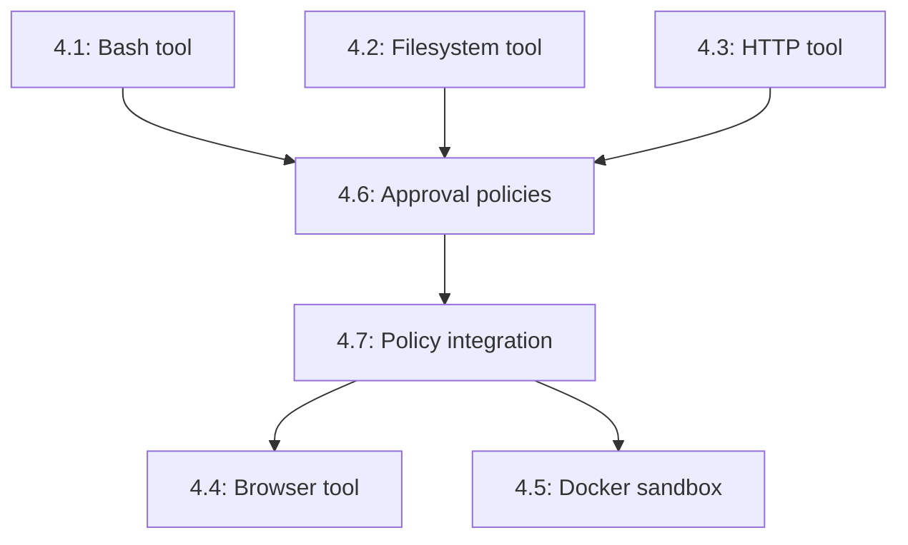

# Phase 4: System Tools

## Overview

This phase provides the agent with controlled access to the host system: executing commands, reading/writing files, making HTTP requests, and browsing web pages. All tools are gated by approval policies to prevent unauthorized operations. Optional Docker sandboxing provides an additional security layer.

**What this enables:**
- Agents can execute bash commands (with allow/deny lists)
- Read/write files (with path restrictions)
- Make HTTP requests (with domain control)
- Browse web pages and extract content
- Approval workflows for sensitive operations
- Optional execution sandboxing via Docker

## Dependencies

**Phase 1:** Gateway & Channel Foundation
- Uses `ToolRegistry` for tool registration
- Uses `PolicyEngine` for permission enforcement
- Uses lifecycle hooks for approval gates

**Existing runtime infrastructure:**
- `Tool` interface from `runtime/src/tools/types.ts`
- `ToolRegistry` from `runtime/src/tools/registry.ts`
- `PolicyEngine` from `runtime/src/policy/engine.ts`
- Lazy loading from `runtime/src/utils/lazy-import.ts`

## Issue Dependency Graph



## Implementation Order

1. **1067** — Bash tool (M)
   - Command execution with allow/deny lists
2. **1068** — Filesystem tool (M)
   - Read, write, list, stat, delete operations
3. **1069** — HTTP tool (M)
   - GET, POST, fetch with domain control
4. **1073** — Approval policies (M)
   - Per-tool, per-amount approval rules
5. **1077** — Policy integration (S)
   - Extend PolicyEngine with ToolPolicy
6. **1072** — Browser tool (L)
   - HTML extraction + optional Playwright
7. **1076** — Docker sandbox (L)
   - Optional sandboxed execution environment

**Rationale:** Core tools → approval system → policy integration → advanced tools → sandboxing. Build security layer before adding powerful tools.

## Issue Details

### 4.1: Bash tool (command execution with allow/deny lists) (#1067)

**Goal:** Execute bash commands with security controls.

**Files to create:**
- `gateway/src/tools/bash/tool.ts` — BashTool class
- `gateway/src/tools/bash/config.ts` — BashToolConfig
- `gateway/src/tools/bash/security.ts` — Command validation
- `gateway/src/tools/bash/index.ts`
- `gateway/src/tools/bash/tool.test.ts`

**Files to modify:**
- `gateway/src/gateway.ts` — register BashTool by default
- `gateway/src/tools/index.ts` — export bash tool

**Integration points:**
- Uses `child_process.execFile()` (NOT `exec()` for shell injection safety)
- Implements `Tool` interface from `runtime/src/tools/types.ts`
- Security features:
  - Allow list (only whitelisted commands)
  - Deny list (blocked commands)
  - Timeout enforcement (default 30s)
  - Output truncation (max 10KB)
  - Working directory restriction

**Patterns to follow:**
- Tool interface from `runtime/src/tools/agenc/tools.ts`
- Error handling from `runtime/src/types/errors.ts`
- Timeout patterns from SDK proof generation

**Key interfaces:**

```typescript
interface BashToolConfig {
  allowedCommands?: string[];
  deniedCommands?: string[];
  allowedDirectories?: string[];
  timeoutMs?: number;
  maxOutputBytes?: number;
}

class BashTool implements Tool {
  readonly name = 'bash';
  readonly description = 'Execute bash commands';
  readonly inputSchema: JSONSchema;
  // implementation
}

interface BashToolInput {
  command: string;
  args?: string[];
  cwd?: string;
}

interface BashToolResult extends ToolResult {
  exitCode?: number;
  stdout?: string;
  stderr?: string;
}
```

**Testing strategy:**
- Test allowed command execution
- Test denied command rejection
- Test timeout enforcement
- Test output truncation
- Test working directory validation
- Test shell injection prevention (e.g., `command; rm -rf /`)
- Mock `execFile` for most tests

**Estimated scope:** M (500-700 lines)

---

### 4.2: Filesystem tool (read, write, list, stat, delete) (#1068)

**Goal:** File system operations with path traversal prevention.

**Files to create:**
- `gateway/src/tools/filesystem/tool.ts` — FileSystemTool class
- `gateway/src/tools/filesystem/config.ts` — FileSystemToolConfig
- `gateway/src/tools/filesystem/security.ts` — Path validation
- `gateway/src/tools/filesystem/operations.ts` — File operations
- `gateway/src/tools/filesystem/index.ts`
- `gateway/src/tools/filesystem/tool.test.ts`

**Files to modify:**
- `gateway/src/gateway.ts` — register FileSystemTool by default
- `gateway/src/tools/index.ts` — export filesystem tool

**Integration points:**
- Uses Node.js `fs/promises` API
- Implements `Tool` interface
- Security features:
  - Path traversal prevention (`../` attacks)
  - Allowed directories whitelist
  - File size limits
  - Read-only mode option
  - Symlink resolution

**Patterns to follow:**
- Tool interface from `runtime/src/tools/types.ts`
- Path validation from `sdk/src/validation.ts`

**Key interfaces:**

```typescript
interface FileSystemToolConfig {
  allowedDirectories?: string[];
  readOnly?: boolean;
  maxFileSize?: number;
  followSymlinks?: boolean;
}

class FileSystemTool implements Tool {
  readonly name = 'filesystem';
  readonly description = 'File system operations';
  readonly inputSchema: JSONSchema;
  // implementation
}

interface FileSystemOperation {
  operation: 'read' | 'write' | 'list' | 'stat' | 'delete';
  path: string;
  content?: string;
  encoding?: string;
}
```

**Testing strategy:**
- Test read operation
- Test write operation (creates file)
- Test list directory
- Test stat (file metadata)
- Test delete operation
- Test path traversal prevention (`../../etc/passwd`)
- Test allowed directory enforcement
- Test read-only mode blocks writes
- Test file size limit enforcement
- Mock `fs/promises` for tests

**Estimated scope:** M (600-800 lines)

---

### 4.3: HTTP tool (GET, POST, fetch with domain control) (#1069)

**Goal:** HTTP requests with domain whitelisting.

**Files to create:**
- `gateway/src/tools/http/tool.ts` — HttpTool class
- `gateway/src/tools/http/config.ts` — HttpToolConfig
- `gateway/src/tools/http/security.ts` — Domain validation
- `gateway/src/tools/http/index.ts`
- `gateway/src/tools/http/tool.test.ts`

**Files to modify:**
- `gateway/src/gateway.ts` — register HttpTool by default
- `gateway/src/tools/index.ts` — export http tool

**Integration points:**
- Uses `node-fetch` or native `fetch` (Node 18+)
- Implements `Tool` interface
- Security features:
  - Allowed domains list
  - Blocked domains list (e.g., localhost, private IPs)
  - Timeout enforcement
  - Response size limits
  - Header control

**Patterns to follow:**
- Tool interface from `runtime/src/tools/types.ts`
- HTTP patterns from RPC connection
- Domain validation similar to CORS checks

**Key interfaces:**

```typescript
interface HttpToolConfig {
  allowedDomains?: string[];
  blockedDomains?: string[];
  timeoutMs?: number;
  maxResponseSize?: number;
  allowedMethods?: string[];
}

class HttpTool implements Tool {
  readonly name = 'http';
  readonly description = 'HTTP requests';
  readonly inputSchema: JSONSchema;
  // implementation
}

interface HttpRequest {
  method: 'GET' | 'POST' | 'PUT' | 'DELETE';
  url: string;
  headers?: Record<string, string>;
  body?: string;
}

interface HttpResponse {
  status: number;
  headers: Record<string, string>;
  body: string;
}
```

**Testing strategy:**
- Test GET request
- Test POST request with body
- Test allowed domain enforcement
- Test blocked domain rejection (localhost, 127.0.0.1, 10.0.0.0/8)
- Test timeout enforcement
- Test response size truncation
- Mock fetch for tests

**Estimated scope:** M (400-600 lines)

---

### 4.4: Browser tool (HTML extraction + optional Playwright) (#1072)

**Goal:** Web page rendering and content extraction.

**Files to create:**
- `gateway/src/tools/browser/tool.ts` — BrowserTool class
- `gateway/src/tools/browser/config.ts` — BrowserToolConfig
- `gateway/src/tools/browser/extractor.ts` — HTML content extraction
- `gateway/src/tools/browser/playwright.ts` — Playwright integration (optional)
- `gateway/src/tools/browser/index.ts`
- `gateway/src/tools/browser/tool.test.ts`

**Files to modify:**
- `gateway/src/gateway.ts` — register BrowserTool if enabled
- `gateway/src/tools/index.ts` — export browser tool
- `gateway/package.json` — add `playwright` as optional dependency

**Integration points:**
- Two modes:
  1. **Simple:** Fetch HTML + extract text (no JS execution)
  2. **Playwright:** Full browser rendering (lazy-loaded)
- Uses `ensureLazyModule()` for Playwright
- Implements `Tool` interface
- Reuses domain security from HttpTool

**Patterns to follow:**
- Lazy loading from `runtime/src/utils/lazy-import.ts`
- HTML extraction patterns from readability libraries
- Tool interface from `runtime/src/tools/types.ts`

**Key interfaces:**

```typescript
interface BrowserToolConfig {
  mode: 'simple' | 'playwright';
  timeoutMs?: number;
  maxContentLength?: number;
  allowedDomains?: string[];
}

class BrowserTool implements Tool {
  readonly name = 'browser';
  readonly description = 'Browse web pages';
  readonly inputSchema: JSONSchema;
  // implementation
}

interface BrowseRequest {
  url: string;
  waitForSelector?: string;
  screenshot?: boolean;
}

interface BrowseResult {
  title: string;
  content: string;
  screenshot?: string;
}
```

**Testing strategy:**
- Test simple mode (fetch + extract)
- Test Playwright mode (lazy load)
- Test content extraction (strip scripts, styles)
- Test screenshot capture
- Test wait for selector
- Test timeout enforcement
- Mock fetch and Playwright for tests

**Estimated scope:** L (700-1000 lines)

---

### 4.5: Execution sandboxing via Docker (#1076)

**Goal:** Optional Docker container for isolated tool execution.

**Files to create:**
- `gateway/src/tools/sandbox/docker.ts` — DockerSandbox class
- `gateway/src/tools/sandbox/config.ts` — SandboxConfig
- `gateway/src/tools/sandbox/image.ts` — Docker image management
- `gateway/src/tools/sandbox/index.ts`
- `gateway/src/tools/sandbox/docker.test.ts`
- `docker/sandbox/Dockerfile` — Sandbox container image
- `docker/sandbox/entrypoint.sh` — Container entrypoint script

**Files to modify:**
- `gateway/src/tools/bash/tool.ts` — use sandbox if configured
- `gateway/src/gateway.ts` — initialize sandbox if enabled
- `gateway/package.json` — add `dockerode` as optional dependency

**Integration points:**
- Wraps tool execution in Docker container
- Uses `dockerode` library (lazy-loaded)
- Container lifecycle: create → start → exec → stop → remove
- Volume mounts for file I/O
- Network isolation (no internet by default)

**Patterns to follow:**
- Lazy loading from `runtime/src/utils/lazy-import.ts`
- Resource cleanup patterns
- Error handling for Docker failures

**Key interfaces:**

```typescript
interface SandboxConfig {
  enabled: boolean;
  image?: string;
  networkMode?: 'none' | 'bridge';
  memoryLimit?: string;
  cpuLimit?: number;
  volumeMounts?: Record<string, string>;
}

class DockerSandbox {
  initialize(): Promise<void>;
  execute(command: string, args: string[]): Promise<SandboxResult>;
  cleanup(): Promise<void>;
}

interface SandboxResult {
  exitCode: number;
  stdout: string;
  stderr: string;
  duration: number;
}
```

**Testing strategy:**
- Test container creation
- Test command execution in container
- Test volume mounts
- Test network isolation
- Test memory/CPU limits
- Test cleanup on shutdown
- Mock dockerode for most tests
- Integration test requires Docker installed

**Estimated scope:** L (600-900 lines)

---

### 4.6: Approval policies (per-tool, per-amount rules) (#1073)

**Goal:** Define approval rules for tool execution.

**Files to create:**
- `gateway/src/approval/policy.ts` — ApprovalPolicy class
- `gateway/src/approval/rules.ts` — ApprovalRule types
- `gateway/src/approval/gate.ts` — Approval gate (hook handler)
- `gateway/src/approval/index.ts`
- `gateway/src/approval/policy.test.ts`

**Files to modify:**
- `gateway/src/hooks/builtin.ts` — add approval gate hook
- `gateway/src/gateway.ts` — register approval policy
- `gateway/src/index.ts` — export approval types

**Integration points:**
- Hooks into `tool:before` lifecycle event
- Approval methods:
  - **Auto-approve:** Always allow (for safe tools)
  - **Auto-deny:** Always block (for dangerous tools)
  - **Prompt:** Ask user via chat channel
  - **Budget:** Approve up to daily/monthly limit
- User approves via `/approve <request-id>` or `/deny <request-id>`

**Patterns to follow:**
- Policy engine from `runtime/src/policy/engine.ts`
- Hook handler from `gateway/src/hooks/types.ts`
- Interactive prompts via Gateway channels

**Key interfaces:**

```typescript
interface ApprovalPolicy {
  rules: ApprovalRule[];
  evaluate(toolName: string, input: unknown): Promise<ApprovalDecision>;
}

interface ApprovalRule {
  toolName: string;
  action: 'approve' | 'deny' | 'prompt' | 'budget';
  condition?: (input: unknown) => boolean;
  budgetLimit?: number;
  budgetPeriod?: 'daily' | 'weekly' | 'monthly';
}

interface ApprovalDecision {
  approved: boolean;
  requiresPrompt: boolean;
  requestId?: string;
  message?: string;
}

interface ApprovalGate {
  handle(event: HookEvent): Promise<void>;
  waitForApproval(requestId: string): Promise<boolean>;
}
```

**Testing strategy:**
- Test auto-approve rule
- Test auto-deny rule
- Test prompt rule (mock user response)
- Test budget rule (enforce daily limit)
- Test condition evaluation
- Test approval gate hook integration

**Estimated scope:** M (500-700 lines)

---

### 4.7: Tool permission policy integration (extend PolicyEngine) (#1077)

**Goal:** Extend PolicyEngine to support tool permissions.

**Files to create:**
- `gateway/src/policy/tool-policy.ts` — ToolPolicy class
- `gateway/src/policy/tool-policy.test.ts`

**Files to modify:**
- `runtime/src/policy/engine.ts` — add ToolPolicy support (or keep in gateway)
- `gateway/src/gateway.ts` — integrate ToolPolicy into PolicyEngine
- `gateway/src/policy/index.ts` — export tool policy

**Integration points:**
- Extends PolicyEngine from `runtime/src/policy/engine.ts`
- Policy checks:
  - Tool enabled/disabled
  - Per-tool rate limits
  - Per-tool resource limits (CPU, memory, duration)
- Integrates with ApprovalPolicy

**Patterns to follow:**
- Policy engine patterns from `runtime/src/policy/engine.ts`
- Budget enforcement similar to budget policies

**Key interfaces:**

```typescript
interface ToolPolicy {
  enabled: Map<string, boolean>;
  rateLimits: Map<string, RateLimit>;
  resourceLimits: Map<string, ResourceLimit>;
  check(toolName: string, action: string): Promise<PolicyDecision>;
}

interface ResourceLimit {
  maxDuration?: number;
  maxMemory?: number;
  maxCpu?: number;
}

interface PolicyDecision {
  allowed: boolean;
  reason?: string;
  retryAfter?: number;
}
```

**Testing strategy:**
- Test tool enabled/disabled check
- Test rate limit enforcement
- Test resource limit enforcement
- Test policy decision integration with approval gate
- Test policy violation logging

**Estimated scope:** S (300-400 lines)

---

## Integration Checklist

After completing all issues:

- [ ] BashTool executes allowed commands
- [ ] FileSystemTool reads/writes files safely
- [ ] HttpTool makes requests to allowed domains
- [ ] BrowserTool extracts web page content
- [ ] ApprovalPolicy gates sensitive operations
- [ ] ToolPolicy enforces resource limits
- [ ] Docker sandbox isolates execution
- [ ] All tools registered in ToolRegistry
- [ ] Approval prompts appear in chat
- [ ] `/approve` and `/deny` commands work
- [ ] All tests pass (~1000+ tests expected)

## Configuration Example

```json
{
  "tools": {
    "bash": {
      "enabled": true,
      "allowedCommands": ["ls", "cat", "grep", "git"],
      "deniedCommands": ["rm", "sudo"],
      "allowedDirectories": ["/home/user/projects"],
      "timeoutMs": 30000
    },
    "filesystem": {
      "enabled": true,
      "allowedDirectories": ["/home/user/projects", "/tmp"],
      "readOnly": false,
      "maxFileSize": 10485760
    },
    "http": {
      "enabled": true,
      "allowedDomains": ["api.github.com", "docs.solana.com"],
      "blockedDomains": ["localhost", "127.0.0.1"],
      "timeoutMs": 30000
    },
    "browser": {
      "enabled": true,
      "mode": "simple",
      "allowedDomains": ["*"]
    },
    "sandbox": {
      "enabled": false,
      "image": "agenc/sandbox:latest",
      "networkMode": "none",
      "memoryLimit": "512m"
    }
  },
  "approval": {
    "rules": [
      {
        "toolName": "bash",
        "action": "prompt"
      },
      {
        "toolName": "filesystem",
        "action": "budget",
        "budgetLimit": 100,
        "budgetPeriod": "daily"
      },
      {
        "toolName": "http",
        "action": "approve"
      }
    ]
  },
  "policy": {
    "rateLimits": {
      "bash": { "maxCalls": 10, "windowMs": 60000 },
      "filesystem": { "maxCalls": 50, "windowMs": 60000 }
    }
  }
}
```

## Security Considerations

### Path Traversal Prevention

```typescript
function validatePath(path: string, allowedDirs: string[]): boolean {
  const resolved = resolve(path);
  return allowedDirs.some(dir => resolved.startsWith(resolve(dir)));
}
```

### Domain Validation

```typescript
function validateDomain(url: string, allowed: string[]): boolean {
  const hostname = new URL(url).hostname;
  return allowed.some(pattern =>
    pattern === '*' || hostname === pattern || hostname.endsWith('.' + pattern)
  );
}
```

### Command Injection Prevention

```typescript
// NEVER use exec or spawn with shell: true
// ALWAYS use execFile with explicit args
execFile(command, args, { timeout: 30000 });
```

## Success Metrics

- Tool execution latency < 100ms overhead (excluding operation itself)
- Zero path traversal vulnerabilities
- Zero command injection vulnerabilities
- Approval prompts appear within 500ms
- Docker sandbox startup < 2 seconds
- All tools handle timeouts gracefully
