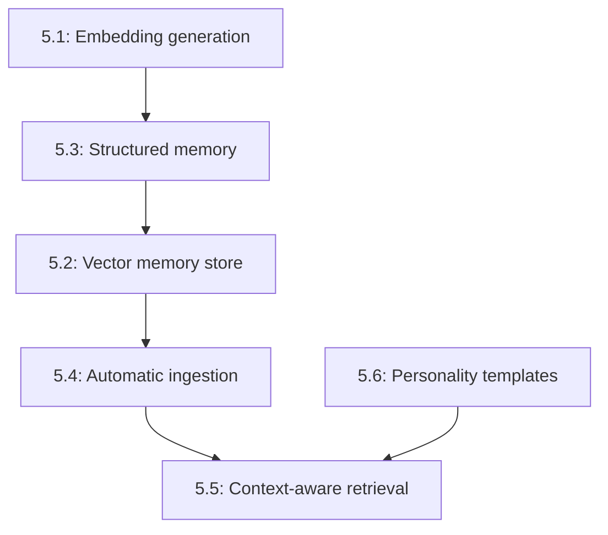

# Phase 5: Semantic Memory & Agent Personality

## Overview

This phase transforms the agent from a stateless conversation handler into a persistent entity with long-term memory and personality. Semantic memory uses vector embeddings for context-aware retrieval, while structured memory models organize facts, entities, and daily logs. Agent personality files define communication style and behavioral traits.

**What this enables:**
- Agents remember conversations across sessions
- Semantic search retrieves relevant past interactions
- Hybrid search combines keyword + vector similarity
- Three-tier memory: daily logs, curated facts, entity extraction
- Automatic memory ingestion after each conversation turn
- Configurable agent personality and communication style
- Context-aware prompt assembly with relevant memories

## Dependencies

**Phase 1:** Gateway & Channel Foundation
- Uses `Session` for conversation context
- Uses `MemoryBackend` for storage
- Injects memories into system prompt via `ChatExecutor`

**Existing runtime infrastructure:**
- `MemoryBackend` from `runtime/src/memory/types.ts`
- `InMemoryBackend`, `SqliteBackend`, `RedisBackend` from `runtime/src/memory/`
- `LLMProvider` from `runtime/src/llm/types.ts`
- Lazy loading from `runtime/src/utils/lazy-import.ts`

## Issue Dependency Graph



## Implementation Order

1. **1079** — Embedding generation (M)
   - Multi-provider interface (OpenAI, Ollama)
2. **1080** — Structured memory model (M)
   - Daily logs, curated facts, entity extraction
3. **1082** — Vector memory store (L)
   - Cosine similarity + hybrid BM25 search
4. **1083** — Agent personality file templates (S)
   - Template files and loader
5. **1086** — Automatic memory ingestion (M)
   - Per-turn and session-end hooks
6. **1087** — Context-aware retrieval (M)
   - Semantic search in prompt assembly

**Rationale:** Embeddings → structured model → vector store → personality → ingestion → retrieval. Build foundation first, then automation and smart retrieval.

## Issue Details

### 5.1: Embedding generation (multi-provider interface) (#1079)

**Goal:** Generate vector embeddings for memory entries.

**Files to create:**
- `gateway/src/memory/embeddings/types.ts` — EmbeddingProvider interface
- `gateway/src/memory/embeddings/openai.ts` — OpenAIEmbeddingProvider
- `gateway/src/memory/embeddings/ollama.ts` — OllamaEmbeddingProvider
- `gateway/src/memory/embeddings/index.ts`
- `gateway/src/memory/embeddings/openai.test.ts`
- `gateway/src/memory/embeddings/ollama.test.ts`

**Files to modify:**
- `gateway/package.json` — add `openai` and `ollama` as optional dependencies
- `gateway/src/memory/index.ts` — export embedding types

**Integration points:**
- Uses `ensureLazyModule()` for provider SDKs
- OpenAI: `text-embedding-3-small` model (1536 dimensions)
- Ollama: `nomic-embed-text` model (768 dimensions)
- Implements async batching for efficiency

**Patterns to follow:**
- Provider pattern from `runtime/src/llm/providers/`
- Lazy loading from `runtime/src/utils/lazy-import.ts`
- Error handling from `runtime/src/types/errors.ts`

**Key interfaces:**

```typescript
interface EmbeddingProvider {
  readonly name: string;
  readonly dimensions: number;
  generate(text: string): Promise<number[]>;
  generateBatch(texts: string[]): Promise<number[][]>;
}

class OpenAIEmbeddingProvider implements EmbeddingProvider {
  readonly name = 'openai';
  readonly dimensions = 1536;
  // implementation
}

class OllamaEmbeddingProvider implements EmbeddingProvider {
  readonly name = 'ollama';
  readonly dimensions = 768;
  // implementation
}

interface EmbeddingConfig {
  provider: 'openai' | 'ollama';
  apiKey?: string;
  baseUrl?: string;
  model?: string;
}
```

**Testing strategy:**
- Mock OpenAI API
- Mock Ollama API
- Test single embedding generation
- Test batch embedding generation
- Test error handling (API failures)
- Test lazy provider loading
- Test dimension validation

**Estimated scope:** M (500-700 lines)

---

### 5.2: Vector memory store (cosine similarity + hybrid BM25) (#1082)

**Goal:** Storage and retrieval of vector embeddings with hybrid search.

**Files to create:**
- `gateway/src/memory/vector/backend.ts` — VectorMemoryBackend class
- `gateway/src/memory/vector/types.ts` — Vector types, search options
- `gateway/src/memory/vector/search.ts` — Similarity search algorithms
- `gateway/src/memory/vector/bm25.ts` — BM25 keyword scoring
- `gateway/src/memory/vector/hybrid.ts` — Hybrid search combiner
- `gateway/src/memory/vector/index.ts`
- `gateway/src/memory/vector/backend.test.ts`
- `gateway/src/memory/vector/search.test.ts`
- `gateway/src/memory/vector/hybrid.test.ts`

**Files to modify:**
- `runtime/src/memory/types.ts` — extend MemoryBackend interface (or create new interface)
- `gateway/src/memory/index.ts` — export vector types

**Integration points:**
- Extends `MemoryBackend` with vector operations
- Stores embeddings alongside memory entries
- Three backends: InMemory (cosine), SQLite (vector extension), Redis (RediSearch)
- Hybrid search combines BM25 keyword score + cosine similarity

**Patterns to follow:**
- Backend pattern from `runtime/src/memory/`
- SQLite vector extension usage
- Redis RediSearch patterns

**Key interfaces:**

```typescript
interface VectorMemoryBackend extends MemoryBackend {
  storeWithEmbedding(
    sessionId: string,
    entry: MemoryEntry,
    embedding: number[]
  ): Promise<void>;

  searchSimilar(
    sessionId: string,
    queryEmbedding: number[],
    options?: VectorSearchOptions
  ): Promise<ScoredMemoryEntry[]>;

  searchHybrid(
    sessionId: string,
    queryText: string,
    queryEmbedding: number[],
    options?: HybridSearchOptions
  ): Promise<ScoredMemoryEntry[]>;
}

interface VectorSearchOptions {
  limit?: number;
  threshold?: number;
  includeMetadata?: boolean;
}

interface HybridSearchOptions extends VectorSearchOptions {
  vectorWeight?: number;
  keywordWeight?: number;
}

interface ScoredMemoryEntry {
  entry: MemoryEntry;
  score: number;
  vectorScore?: number;
  keywordScore?: number;
}

interface BM25Scorer {
  score(query: string, document: string): number;
}

interface HybridSearch {
  combine(
    vectorResults: ScoredMemoryEntry[],
    keywordResults: ScoredMemoryEntry[],
    weights: { vector: number; keyword: number }
  ): ScoredMemoryEntry[];
}
```

**Testing strategy:**
- Test cosine similarity calculation
- Test vector search (return top-k)
- Test BM25 keyword scoring
- Test hybrid search combination
- Test threshold filtering
- Test backend-specific implementations (InMemory, SQLite, Redis)
- Mock embedding provider

**Estimated scope:** L (900-1200 lines)

---

### 5.3: Structured memory model (daily logs + curated facts + entities) (#1080)

**Goal:** Three-tier memory organization for different data types.

**Files to create:**
- `gateway/src/memory/structured/model.ts` — StructuredMemoryModel class
- `gateway/src/memory/structured/types.ts` — Memory tiers, entity types
- `gateway/src/memory/structured/extractor.ts` — Entity extraction
- `gateway/src/memory/structured/curator.ts` — Fact curation
- `gateway/src/memory/structured/index.ts`
- `gateway/src/memory/structured/model.test.ts`
- `gateway/src/memory/structured/extractor.test.ts`

**Files to modify:**
- `gateway/src/memory/index.ts` — export structured types

**Integration points:**
- Three memory tiers:
  1. **Daily logs:** Raw conversation turns (expires after 30 days)
  2. **Curated facts:** Important statements extracted by LLM (permanent)
  3. **Entities:** People, places, things mentioned (permanent)
- Entity extraction uses LLM with structured output
- Fact curation runs at session end

**Patterns to follow:**
- Tiered storage similar to cache hierarchies
- LLM structured output for extraction
- Storage in VectorMemoryBackend

**Key interfaces:**

```typescript
interface StructuredMemoryModel {
  addDailyLog(sessionId: string, entry: ConversationTurn): Promise<void>;
  extractEntities(text: string): Promise<Entity[]>;
  curateFacts(sessionId: string): Promise<CuratedFact[]>;
  search(query: string, tiers?: MemoryTier[]): Promise<MemorySearchResult[]>;
}

interface ConversationTurn {
  role: 'user' | 'assistant';
  content: string;
  timestamp: number;
  sessionId: string;
}

interface Entity {
  type: 'person' | 'place' | 'thing' | 'concept';
  name: string;
  description?: string;
  firstSeen: number;
  lastSeen: number;
  mentions: number;
}

interface CuratedFact {
  statement: string;
  source: string;
  confidence: number;
  createdAt: number;
}

enum MemoryTier {
  DailyLogs = 'daily-logs',
  Facts = 'facts',
  Entities = 'entities'
}

interface MemorySearchResult {
  tier: MemoryTier;
  content: string;
  score: number;
  metadata: Record<string, unknown>;
}
```

**Testing strategy:**
- Test daily log storage
- Test entity extraction (mock LLM)
- Test fact curation (mock LLM)
- Test cross-tier search
- Test daily log expiry (30 days)
- Test entity deduplication

**Estimated scope:** M (600-800 lines)

---

### 5.4: Automatic memory ingestion (per-turn + session-end) (#1086)

**Goal:** Automatically capture conversation turns and extract entities/facts.

**Files to create:**
- `gateway/src/memory/ingestion/ingester.ts` — MemoryIngester class
- `gateway/src/memory/ingestion/hooks.ts` — Ingestion hook handlers
- `gateway/src/memory/ingestion/types.ts` — Ingestion config
- `gateway/src/memory/ingestion/index.ts`
- `gateway/src/memory/ingestion/ingester.test.ts`

**Files to modify:**
- `gateway/src/hooks/builtin.ts` — add ingestion hooks
- `gateway/src/executor/chat-executor.ts` — trigger ingestion after LLM response
- `gateway/src/session/manager.ts` — trigger fact curation on session end

**Integration points:**
- Hooks into lifecycle events:
  - `message:after` → store daily log
  - `session:end` → curate facts
- Uses `StructuredMemoryModel` for storage
- Uses `EmbeddingProvider` for vectorization

**Patterns to follow:**
- Hook handler from `gateway/src/hooks/types.ts`
- Async background processing (don't block response)
- Error isolation (ingestion failures don't break chat)

**Key interfaces:**

```typescript
interface MemoryIngester {
  ingestTurn(sessionId: string, turn: ConversationTurn): Promise<void>;
  ingestSessionEnd(sessionId: string): Promise<void>;
}

interface IngestionConfig {
  enableDailyLogs: boolean;
  enableEntityExtraction: boolean;
  enableFactCuration: boolean;
  backgroundProcessing: boolean;
}

class IngestionHookHandler implements HookHandler {
  async handle(event: HookEvent): Promise<void>;
}
```

**Testing strategy:**
- Test turn ingestion (message:after hook)
- Test session-end fact curation
- Test background processing (async)
- Test error isolation
- Test ingestion config flags
- Mock StructuredMemoryModel, EmbeddingProvider

**Estimated scope:** M (400-600 lines)

---

### 5.5: Context-aware retrieval (semantic search in prompt assembly) (#1087)

**Goal:** Retrieve relevant memories before each LLM call.

**Files to create:**
- `gateway/src/memory/retrieval/retriever.ts` — MemoryRetriever class
- `gateway/src/memory/retrieval/types.ts` — Retrieval config, result types
- `gateway/src/memory/retrieval/ranker.ts` — Result ranking/deduplication
- `gateway/src/memory/retrieval/formatter.ts` — Memory formatting for prompts
- `gateway/src/memory/retrieval/index.ts`
- `gateway/src/memory/retrieval/retriever.test.ts`

**Files to modify:**
- `gateway/src/executor/chat-executor.ts` — run retrieval before LLM call
- `gateway/src/memory/index.ts` — export retrieval types

**Integration points:**
- Runs before each LLM call
- Generates embedding for user message
- Searches VectorMemoryBackend with hybrid search
- Injects top-k results as `<memory>` blocks in system prompt
- Token budget: max 2000 tokens for memories

**Patterns to follow:**
- Similar to skill injection from Phase 3
- Token budget enforcement
- Result ranking similar to marketplace scoring

**Key interfaces:**

```typescript
interface MemoryRetriever {
  retrieve(query: string, sessionId: string): Promise<RetrievalResult>;
}

interface RetrievalConfig {
  enabled: boolean;
  maxResults?: number;
  maxTokens?: number;
  includeEntities?: boolean;
  includeFacts?: boolean;
  includeLogs?: boolean;
  hybridWeights?: { vector: number; keyword: number };
}

interface RetrievalResult {
  memories: MemorySearchResult[];
  formattedPrompt: string;
  tokenCount: number;
}

interface MemoryRanker {
  rank(results: MemorySearchResult[]): MemorySearchResult[];
  deduplicate(results: MemorySearchResult[]): MemorySearchResult[];
}

interface MemoryFormatter {
  format(results: MemorySearchResult[]): string;
}
```

**Testing strategy:**
- Test retrieval flow (query → embedding → search → format)
- Test hybrid search weights
- Test result ranking
- Test deduplication
- Test token budget enforcement (truncate at 2000 tokens)
- Test memory block formatting (`<memory tier="...">content</memory>`)
- Mock VectorMemoryBackend, EmbeddingProvider

**Estimated scope:** M (500-700 lines)

---

### 5.6: Agent personality file templates and loading (#1083)

**Goal:** Define agent personality via configuration files.

**Files to create:**
- `gateway/src/personality/types.ts` — PersonalityConfig, Trait types
- `gateway/src/personality/loader.ts` — Personality file loader
- `gateway/src/personality/formatter.ts` — Personality prompt formatter
- `gateway/src/personality/index.ts`
- `gateway/src/personality/loader.test.ts`
- `examples/personalities/default.json` — Default personality
- `examples/personalities/professional.json` — Professional tone
- `examples/personalities/casual.json` — Casual tone
- `examples/personalities/creative.json` — Creative tone

**Files to modify:**
- `gateway/src/executor/chat-executor.ts` — inject personality into system prompt
- `gateway/src/gateway.ts` — load personality on startup

**Integration points:**
- Loaded from `~/.agenc/personality.json` or custom path
- Injected into system prompt before workspace files
- Defines:
  - Communication style (formal, casual, technical)
  - Tone (friendly, professional, playful)
  - Behavioral traits (proactive, cautious, curious)
  - Response preferences (concise, detailed, step-by-step)

**Patterns to follow:**
- Config file loading patterns
- System prompt assembly from ChatExecutor

**Key interfaces:**

```typescript
interface PersonalityConfig {
  name: string;
  description: string;
  style: CommunicationStyle;
  tone: Tone[];
  traits: Trait[];
  preferences: ResponsePreferences;
}

enum CommunicationStyle {
  Formal = 'formal',
  Casual = 'casual',
  Technical = 'technical',
  Creative = 'creative'
}

enum Tone {
  Friendly = 'friendly',
  Professional = 'professional',
  Playful = 'playful',
  Empathetic = 'empathetic',
  Direct = 'direct'
}

interface Trait {
  name: string;
  description: string;
  intensity: number;
}

interface ResponsePreferences {
  length: 'concise' | 'balanced' | 'detailed';
  structure: 'narrative' | 'bulleted' | 'step-by-step';
  examples: boolean;
  codeBlocks: boolean;
}

interface PersonalityLoader {
  load(path: string): Promise<PersonalityConfig>;
}

interface PersonalityFormatter {
  format(config: PersonalityConfig): string;
}
```

**Testing strategy:**
- Test personality file loading
- Test missing file handling (use default)
- Test invalid JSON rejection
- Test prompt formatting
- Test all 4 example personalities
- Validate prompt injection quality

**Estimated scope:** S (300-400 lines + 4 template files)

---

## Integration Checklist

After completing all issues:

- [ ] Embeddings generated for all memory entries
- [ ] Vector search returns relevant memories
- [ ] Hybrid search combines keyword + vector scores
- [ ] Daily logs stored after each turn
- [ ] Entities extracted automatically
- [ ] Facts curated at session end
- [ ] Memory retrieval runs before LLM calls
- [ ] Memories appear in system prompt as `<memory>` blocks
- [ ] Personality loaded from config file
- [ ] Token budgets enforced (2000 for memories, 4000 for skills)
- [ ] All tests pass (~1000+ tests expected)

## Configuration Example

```json
{
  "memory": {
    "embeddings": {
      "provider": "openai",
      "apiKey": "sk-...",
      "model": "text-embedding-3-small"
    },
    "backend": "sqlite",
    "ingestion": {
      "enableDailyLogs": true,
      "enableEntityExtraction": true,
      "enableFactCuration": true,
      "backgroundProcessing": true
    },
    "retrieval": {
      "enabled": true,
      "maxResults": 10,
      "maxTokens": 2000,
      "includeEntities": true,
      "includeFacts": true,
      "includeLogs": true,
      "hybridWeights": {
        "vector": 0.7,
        "keyword": 0.3
      }
    }
  },
  "personality": {
    "path": "~/.agenc/personality.json"
  }
}
```

## Example Personality Config

```json
{
  "name": "Professional Assistant",
  "description": "A professional, detail-oriented assistant",
  "style": "professional",
  "tone": ["professional", "empathetic", "direct"],
  "traits": [
    {
      "name": "proactive",
      "description": "Anticipates needs and suggests next steps",
      "intensity": 8
    },
    {
      "name": "thorough",
      "description": "Provides complete, detailed responses",
      "intensity": 9
    },
    {
      "name": "cautious",
      "description": "Asks for confirmation before risky actions",
      "intensity": 7
    }
  ],
  "preferences": {
    "length": "detailed",
    "structure": "step-by-step",
    "examples": true,
    "codeBlocks": true
  }
}
```

## Memory Prompt Format

```
<memory tier="facts">
User prefers TypeScript over JavaScript.
User works on AgenC protocol development.
User's timezone is UTC-8.
</memory>

<memory tier="entities">
Entity: AgenC (project) - Solana-based AI agent coordination protocol
Entity: Tetsuo (person) - Project maintainer
</memory>

<memory tier="daily-logs">
[2026-02-14 10:23] User asked about implementing gateway architecture
[2026-02-14 10:45] Discussed Phase 1 implementation order
</memory>
```

## Success Metrics

- Embedding generation latency < 200ms per message
- Vector search returns results in < 100ms
- Hybrid search improves relevance by 30%+ vs pure keyword
- Entity extraction accuracy > 80%
- Fact curation reduces logs by 90%+ while preserving key info
- Memory retrieval adds < 150ms to LLM call latency
- Personality injection produces consistent tone across conversations
