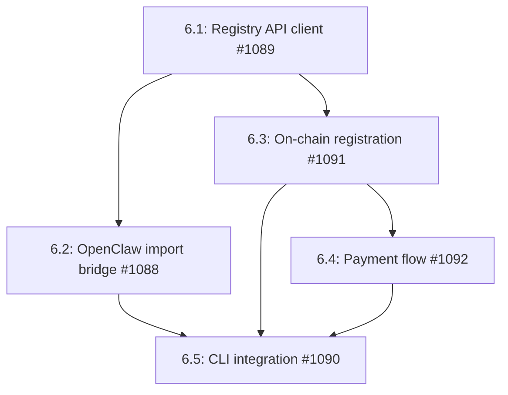

# Phase 6: Remote Skill Registry

## Overview

This phase implements a decentralized on-chain skill registry that allows agents to discover, install, and publish skills. The registry provides a marketplace for skill developers to distribute and monetize their work, while enabling agents to extend their capabilities dynamically. The registry includes skill metadata, versioning, ratings, and payment flows.

## Dependencies

- Phase 3 (SKILL.md system) - Required for skill loading and execution
- Existing Solana program (`programs/agenc-coordination/`) - Required for on-chain storage
- Existing SPL token escrow pattern - Required for payment flows

## Issue Dependency Graph



## Implementation Order

1. **1089** - Registry API client first - establishes the TypeScript interface patterns
2. **1088** - OpenClaw bridge next - enables immediate skill import without waiting for on-chain
3. **1091** - On-chain registration - core blockchain storage for skill metadata
4. **1092** - Payment flow - enables skill monetization
5. **1090** - CLI integration last - provides user-facing tools once all backend pieces exist

## Issue Details

### 6.1: Registry API Client (#1089)

- **Goal:** Create TypeScript client for skill discovery, installation, publishing, and rating operations
- **Files to create:**
  - `runtime/src/skills/registry/client.ts`
  - `runtime/src/skills/registry/types.ts`
  - `runtime/src/skills/registry/errors.ts`
  - `runtime/src/skills/registry/client.test.ts`
  - `runtime/src/skills/registry/index.ts`
- **Files to modify:**
  - `runtime/src/index.ts` (export registry)
  - `runtime/src/skills/index.ts` (export registry)
- **Integration points:**
  - Uses `runtime/src/connection/manager.ts` for RPC calls
  - Uses `runtime/src/utils/pda.ts` for skill PDA derivation
  - Integrates with existing `SkillRegistry` for local installation
- **Patterns to follow:**
  - Follow `runtime/src/task/operations.ts` query patterns (memcmp filters, treasury caching)
  - Follow `runtime/src/dispute/operations.ts` error mapping patterns
  - Use `runtime/src/types/errors.ts` RuntimeErrorCodes 38-42 (REGISTRY_*)
- **Key interfaces:**
```typescript
interface SkillRegistryClient {
  search(query: SkillSearchQuery): Promise<SkillListing[]>;
  install(skillId: string, author: PublicKey): Promise<void>;
  publish(metadata: PublishMetadata): Promise<string>;
  rate(skillId: string, rating: number, review?: string): Promise<void>;
}

interface SkillListing {
  skillId: string;
  author: PublicKey;
  name: string;
  version: string;
  capabilities: bigint;
  ipfsHash: string;
  ratingAverage: number;
  ratingCount: number;
  installCount: number;
}

interface SkillSearchQuery {
  name?: string;
  author?: PublicKey;
  capabilities?: bigint;
  minRating?: number;
  limit?: number;
}
```
- **Testing strategy:**
  - Mock `Program<AgencCoordination>` methods
  - Test search filters (by name, author, capabilities)
  - Test install flow (PDA derivation, account creation)
  - Test publish validation (metadata schema)
  - Test rating bounds (1-5 stars)
- **Estimated scope:** L (4-6 days)

### 6.2: OpenClaw Skill Import Bridge (#1088)

- **Goal:** Enable importing OpenClaw skills with namespace mapping and metadata translation
- **Files to create:**
  - `runtime/src/skills/openclaw/bridge.ts`
  - `runtime/src/skills/openclaw/types.ts`
  - `runtime/src/skills/openclaw/bridge.test.ts`
  - `runtime/src/skills/openclaw/index.ts`
- **Files to modify:**
  - `runtime/src/skills/markdown/parser.ts` (add openclaw metadata namespace)
  - `runtime/src/skills/markdown/compat.ts` (add openclaw compat layer)
  - `runtime/src/skills/registry/client.ts` (integrate bridge in install)
- **Integration points:**
  - Uses existing `runtime/src/skills/markdown/parser.ts` for skill loading
  - Adds `metadata.openclaw` namespace alongside `metadata.agenc`
  - Integrates with `SkillRegistryClient.install()` to fetch from OpenClaw registry
- **Patterns to follow:**
  - Follow existing `runtime/src/skills/markdown/compat.ts` namespace pattern
  - Use same lazy loading as `runtime/src/utils/lazy-import.ts`
- **Key interfaces:**
```typescript
interface OpenClawBridge {
  importSkill(openclawId: string): Promise<string>;
  translateMetadata(openclaw: OpenClawMetadata): AgencMetadata;
}

interface OpenClawMetadata {
  id: string;
  name: string;
  actions: OpenClawAction[];
  author?: string;
}
```
- **Testing strategy:**
  - Mock OpenClaw registry API responses
  - Test metadata translation (openclaw → agenc)
  - Test namespace isolation (metadata.openclaw vs metadata.agenc)
  - Test action schema mapping
- **Estimated scope:** S (1-2 days)

### 6.3: On-Chain Skill Registration Instructions (#1091)

- **Goal:** Add Solana program instructions for skill registration, updates, and deactivation
- **Files to create:**
  - `programs/agenc-coordination/src/instructions/register_skill.rs`
  - `programs/agenc-coordination/src/instructions/update_skill.rs`
  - `programs/agenc-coordination/src/instructions/deactivate_skill.rs`
  - `programs/agenc-coordination/src/state/skill.rs`
  - `tests/skill-registration.ts`
- **Files to modify:**
  - `programs/agenc-coordination/src/instructions/mod.rs` (add new instructions)
  - `programs/agenc-coordination/src/lib.rs` (export instructions)
  - `programs/agenc-coordination/src/state.rs` (export skill accounts)
  - `programs/agenc-coordination/src/errors.rs` (add skill error codes)
  - `programs/agenc-coordination/src/events.rs` (add SkillRegistered event)
- **Integration points:**
  - PDA seeds: `["skill", author, skill_id]` for SkillRegistration
  - PDA seeds: `["skill_rating", skill_pda, rater]` for SkillRating
  - Emit events for off-chain indexing
- **Patterns to follow:**
  - Follow `programs/agenc-coordination/src/instructions/register_agent.rs` account pattern
  - Use `programs/agenc-coordination/src/instructions/validation.rs` helpers
  - Follow existing event emission pattern from `events.rs`
- **Key interfaces:**
```rust
#[account]
pub struct SkillRegistration {
    pub skill_id: [u8; 32],
    pub author: Pubkey,
    pub name: String,
    pub version: String,
    pub ipfs_hash: String,
    pub capabilities: u64,
    pub install_count: u64,
    pub rating_sum: u64,
    pub rating_count: u64,
    pub active: bool,
    pub created_at: i64,
}

#[account]
pub struct SkillRating {
    pub skill: Pubkey,
    pub rater: Pubkey,
    pub rating: u8,
    pub review_ipfs_hash: Option<String>,
    pub created_at: i64,
}
```
- **Testing strategy:**
  - Test skill registration (PDA creation, metadata storage)
  - Test skill updates (version bumps, IPFS hash changes)
  - Test deactivation (active flag flip)
  - Test rating bounds (1-5 stars)
  - Test duplicate registration rejection
  - Use LiteSVM pattern from `tests/litesvm-helpers.ts`
- **Estimated scope:** L (5-7 days)

### 6.4: Skill Payment Flow (#1092)

- **Goal:** Implement SPL token escrow for paid skills with protocol fee distribution
- **Files to create:**
  - `programs/agenc-coordination/src/instructions/purchase_skill.rs`
  - `programs/agenc-coordination/src/instructions/claim_skill_revenue.rs`
  - `runtime/src/skills/registry/payment.ts`
  - `runtime/src/skills/registry/payment.test.ts`
  - `tests/skill-payment.ts`
- **Files to modify:**
  - `programs/agenc-coordination/src/instructions/mod.rs` (add payment instructions)
  - `programs/agenc-coordination/src/lib.rs` (export instructions)
  - `programs/agenc-coordination/src/state/skill.rs` (add price, revenue fields)
  - `runtime/src/skills/registry/client.ts` (add payment methods)
- **Integration points:**
  - Reuses existing SPL token escrow pattern from `programs/agenc-coordination/src/instructions/token_helpers.rs`
  - Uses same protocol fee calculation as `programs/agenc-coordination/src/instructions/completion_helpers.rs`
  - PDA seeds: `["skill_escrow", skill_pda]` for payment escrow
- **Patterns to follow:**
  - Follow `programs/agenc-coordination/src/instructions/complete_task.rs` payment flow
  - Use `programs/agenc-coordination/src/instructions/token_helpers.rs` CPI helpers
  - Follow `runtime/src/task/operations.ts` transaction building pattern
- **Key interfaces:**
```typescript
interface SkillPayment {
  purchaseSkill(skillId: string, author: PublicKey, paymentMint: PublicKey): Promise<string>;
  claimRevenue(skillId: string): Promise<string>;
}

interface SkillPricing {
  price: bigint;
  paymentMint: PublicKey;
  protocolFeeBps: number;
}
```
- **Testing strategy:**
  - Test purchase flow (SPL token transfer to escrow)
  - Test protocol fee split (90% author, 10% protocol)
  - Test claim revenue (transfer from escrow to author)
  - Test free skills (price = 0, no payment)
  - Mock SPL token accounts using LiteSVM
- **Estimated scope:** M (3-4 days)

### 6.5: Registry CLI Integration (#1090)

- **Goal:** Add CLI commands for searching, installing, and publishing skills
- **Files to create:**
  - `runtime/src/cli/registry-cli.ts`
  - `runtime/src/cli/registry-cli.test.ts`
- **Files to modify:**
  - `runtime/src/cli/index.ts` (add registry commands)
  - `runtime/src/bin/index.ts` (wire up registry subcommands)
  - `package.json` (update bin entry)
- **Integration points:**
  - Uses `SkillRegistryClient` for all operations
  - Uses existing `runtime/src/skills/markdown/parser.ts` for local skill loading
  - Integrates with existing `runtime/src/cli/skills-cli.ts` for skill management
- **Patterns to follow:**
  - Follow `runtime/src/cli/skills-cli.ts` command structure
  - Use same arg parsing as `runtime/src/cli/health-cli.ts`
  - Follow existing CLI logger pattern
- **Key interfaces:**
```typescript
interface RegistryCLI {
  search(query: string): Promise<void>;
  install(skillId: string, author: string): Promise<void>;
  publish(skillPath: string, price?: string, mint?: string): Promise<void>;
  rate(skillId: string, rating: number, review?: string): Promise<void>;
}
```
- **Testing strategy:**
  - Mock `SkillRegistryClient` methods
  - Test search output formatting (table display)
  - Test install success/error messages
  - Test publish validation (skill file exists, valid metadata)
  - Test rating validation (1-5 stars)
- **Estimated scope:** S (1-2 days)

## Testing Strategy

- Unit tests for all TypeScript modules (vitest)
- Integration tests for on-chain instructions (LiteSVM)
- End-to-end CLI tests (mocked registry client)
- Payment flow tests with SPL token mocks

## Success Criteria

- Agents can search the on-chain registry for skills
- Agents can install skills from the registry with one command
- Skill developers can publish skills to the registry
- Users can rate and review skills
- Paid skills require token payment with protocol fee distribution
- OpenClaw skills can be imported with namespace compatibility
