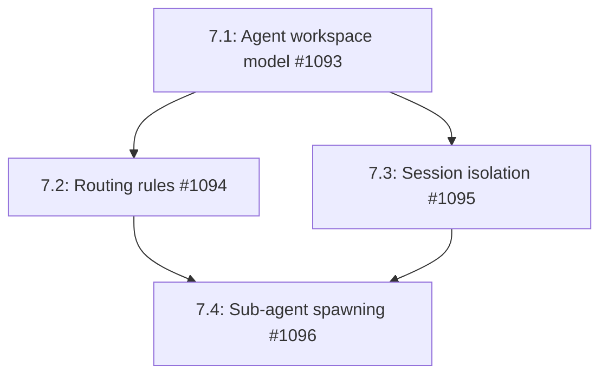

# Phase 7: Multi-Agent Routing & Sub-Agents

## Overview

This phase enables running multiple agent personalities with isolated configurations, routing different channels or users to specific agents, and spawning sub-agents for parallel work. Each agent workspace maintains its own memory, skills, policies, and LLM configuration. Sub-agents can be spawned for complex workflows that require parallelization or specialized capabilities.

## Dependencies

- Phase 1 (Gateway) - Required for channel abstraction and message routing
- Phase 5 (Personality files) - Required for agent personality configuration
- Existing `AutonomousAgent` - Required for sub-agent spawning
- Existing `MemoryBackend` - Required for session isolation

## Issue Dependency Graph



## Implementation Order

1. **1093** - Agent workspace model first - defines the isolation boundaries
2. **1094** - Routing rules next - enables channel-to-agent mapping
3. **1095** - Session isolation - ensures workspaces don't interfere
4. **1096** - Sub-agent spawning last - requires all isolation infrastructure

## Issue Details

### 7.1: Agent Workspace Model (#1093)

- **Goal:** Create isolated agent workspaces with independent configurations, memory, tools, and policies
- **Files to create:**
  - `runtime/src/workspace/workspace.ts`
  - `runtime/src/workspace/types.ts`
  - `runtime/src/workspace/loader.ts`
  - `runtime/src/workspace/errors.ts`
  - `runtime/src/workspace/workspace.test.ts`
  - `runtime/src/workspace/index.ts`
- **Files to modify:**
  - `runtime/src/index.ts` (export workspace)
  - `runtime/src/runtime.ts` (integrate workspace loading)
  - `runtime/src/gateway/types.ts` (add workspaceId field)
- **Integration points:**
  - Each workspace loads a `.personality.md` file (Phase 5)
  - Each workspace has isolated `MemoryBackend` namespace
  - Each workspace has separate `SkillRegistry` instance
  - Each workspace has independent `PolicyEngine` configuration
  - Each workspace has separate LLM provider config
- **Patterns to follow:**
  - Follow `runtime/src/builder.ts` configuration pattern
  - Use same lazy loading as `runtime/src/memory/sqlite/backend.ts`
  - Follow `runtime/src/skills/registry.ts` registry pattern
- **Key interfaces:**
```typescript
interface AgentWorkspace {
  id: string;
  name: string;
  personalityPath: string;
  memoryNamespace: string;
  skillRegistry: SkillRegistry;
  policyEngine: PolicyEngine;
  llmConfig: LLMProviderConfig;
  toolRegistry: ToolRegistry;
  state: WorkspaceState;
}

interface WorkspaceFiles {
  personalityPath: string;
  skillsDir?: string;
  memoryPath?: string;
  policyPath?: string;
}

interface WorkspaceState {
  loaded: boolean;
  activeChannels: Set<string>;
  activeSessions: Set<string>;
}
```
- **Testing strategy:**
  - Test workspace isolation (separate memory namespaces)
  - Test configuration loading (personality, skills, policies)
  - Test workspace lifecycle (load, unload, reload)
  - Test concurrent workspace access
  - Mock all external dependencies (memory, LLM, tools)
- **Estimated scope:** M (3-4 days)

### 7.2: Routing Rules (#1094)

- **Goal:** Route incoming messages to appropriate agent workspaces based on peer, guild, channel, or content
- **Files to create:**
  - `runtime/src/workspace/routing.ts`
  - `runtime/src/workspace/routing-types.ts`
  - `runtime/src/workspace/routing.test.ts`
- **Files to modify:**
  - `runtime/src/gateway/types.ts` (add routing metadata)
  - `runtime/src/gateway/gateway.ts` (integrate routing engine)
  - `runtime/src/workspace/workspace.ts` (add routing API)
- **Integration points:**
  - Uses `IncomingMessage` metadata for routing decisions
  - Evaluates rules by precedence: peer → guildId → accountId → channel → default
  - Routes to fallback workspace if no rules match
  - Can route based on message content patterns (regex)
- **Patterns to follow:**
  - Follow `runtime/src/policy/engine.ts` rule evaluation pattern
  - Use same precedence logic as `runtime/src/marketplace/matching.ts`
  - Follow `runtime/src/gateway/types.ts` message type pattern
- **Key interfaces:**
```typescript
interface RoutingRule {
  id: string;
  priority: number;
  matcher: RoutingMatcher;
  targetWorkspace: string;
  enabled: boolean;
}

interface RoutingMatcher {
  peerId?: string;
  guildId?: string;
  accountId?: string;
  channelId?: string;
  contentPattern?: RegExp;
  platform?: string;
}

interface RoutingEngine {
  evaluate(message: IncomingMessage): string | null;
  addRule(rule: RoutingRule): void;
  removeRule(ruleId: string): void;
  setDefaultWorkspace(workspaceId: string): void;
}
```
- **Testing strategy:**
  - Test rule precedence (peer overrides guild overrides channel)
  - Test pattern matching (regex content filters)
  - Test default fallback
  - Test rule updates (add, remove, enable, disable)
  - Test concurrent routing decisions
- **Estimated scope:** M (3-4 days)

### 7.3: Session Isolation (#1095)

- **Goal:** Ensure each workspace has isolated memory, policy enforcement, and authentication
- **Files to create:**
  - `runtime/src/workspace/session.ts`
  - `runtime/src/workspace/session-types.ts`
  - `runtime/src/workspace/session.test.ts`
- **Files to modify:**
  - `runtime/src/memory/types.ts` (add workspace isolation)
  - `runtime/src/policy/engine.ts` (add per-workspace budgets)
  - `runtime/src/gateway/gateway.ts` (integrate session management)
- **Integration points:**
  - Memory namespaces use format: `workspace:{workspaceId}:session:{sessionId}`
  - Policy budgets tracked separately per workspace
  - Each workspace can have separate authentication rules
  - Session state persists across message handling
- **Patterns to follow:**
  - Follow `runtime/src/memory/in-memory/backend.ts` namespace pattern
  - Use `runtime/src/policy/engine.ts` budget tracking pattern
  - Follow `runtime/src/gateway/types.ts` session model
- **Key interfaces:**
```typescript
interface WorkspaceSession {
  id: string;
  workspaceId: string;
  peerId: string;
  memoryNamespace: string;
  policyContext: PolicyContext;
  authState: AuthState;
  createdAt: number;
  lastActive: number;
}

interface PolicyContext {
  budgetSpent: bigint;
  operationCounts: Map<string, number>;
  circuitBreakerState: CircuitBreakerState;
}

interface AuthState {
  authenticated: boolean;
  permissions: Set<string>;
  walletAddress?: PublicKey;
}
```
- **Testing strategy:**
  - Test memory namespace isolation (workspace A cannot read workspace B)
  - Test policy budget isolation (separate per workspace)
  - Test session lifecycle (create, resume, expire)
  - Test authentication state persistence
  - Test concurrent sessions across workspaces
- **Estimated scope:** M (3-4 days)

### 7.4: Sub-Agent Spawning (#1096)

- **Goal:** Spawn isolated sub-agents for parallel work with timeout and session isolation
- **Files to create:**
  - `runtime/src/workspace/subagent.ts`
  - `runtime/src/workspace/subagent-types.ts`
  - `runtime/src/workspace/subagent.test.ts`
- **Files to modify:**
  - `runtime/src/autonomous/agent.ts` (add sub-agent spawn API)
  - `runtime/src/workflow/orchestrator.ts` (integrate sub-agents in DAG)
  - `runtime/src/marketplace/matching.ts` (sub-agents can claim subtasks)
- **Integration points:**
  - Sub-agents are isolated `AutonomousAgent` instances
  - Sub-agents can claim subtasks in DAG workflows
  - Sub-agents share workspace configuration but have separate sessions
  - Sub-agents report results back to parent agent
  - Timeout enforcement prevents runaway sub-agents
- **Patterns to follow:**
  - Follow `runtime/src/autonomous/agent.ts` instantiation pattern
  - Use `runtime/src/workflow/orchestrator.ts` task coordination pattern
  - Follow `runtime/src/policy/engine.ts` timeout enforcement pattern
- **Key interfaces:**
```typescript
interface SubAgentConfig {
  workspaceId: string;
  parentSessionId: string;
  capabilities: bigint;
  maxDurationMs: number;
  taskFilter?: TaskFilter;
}

interface SubAgentResult {
  subAgentId: string;
  status: 'completed' | 'timeout' | 'error';
  output?: unknown;
  error?: string;
  durationMs: number;
  tasksCompleted: number;
}

interface SubAgentManager {
  spawn(config: SubAgentConfig): Promise<string>;
  await(subAgentId: string): Promise<SubAgentResult>;
  cancel(subAgentId: string): Promise<void>;
  listActive(): Promise<SubAgentResult[]>;
}
```
- **Testing strategy:**
  - Test sub-agent spawning (isolated instance creation)
  - Test timeout enforcement (kills runaway sub-agents)
  - Test result collection (await pattern)
  - Test sub-agent task claiming (DAG integration)
  - Test concurrent sub-agents (parallel work)
  - Test parent-child communication
  - Mock on-chain operations
- **Estimated scope:** L (5-6 days)

## Testing Strategy

- Unit tests for all workspace modules (vitest)
- Integration tests for routing engine (multiple workspaces)
- End-to-end tests for session isolation
- Sub-agent spawning tests with mocked AutonomousAgent
- Concurrency tests for parallel sub-agents

## Success Criteria

- Multiple agent personalities can run concurrently
- Messages route to correct workspace based on rules
- Workspaces maintain isolated memory and policies
- Sub-agents can be spawned for parallel work
- Sub-agents complete and report results within timeout
- No cross-workspace data leakage
