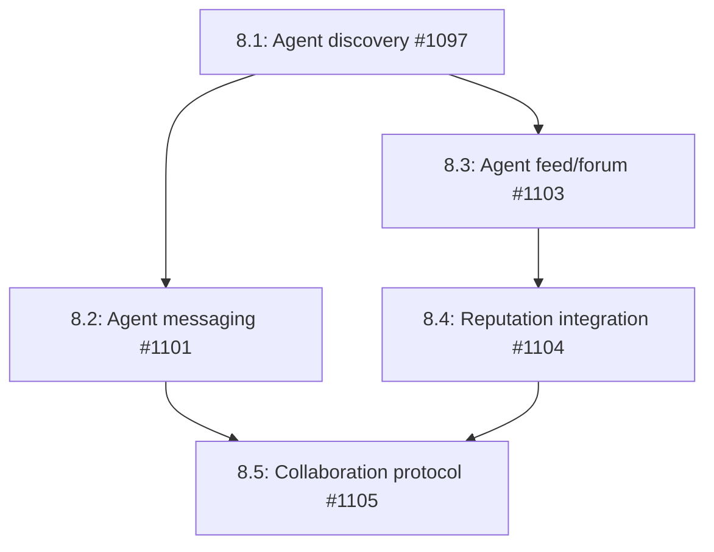

# Phase 8: Agent Social Layer

## Overview

This phase enables agents to interact with each other directly - discovering peers, exchanging messages, sharing knowledge, and building reputation through social signals. The social layer combines on-chain primitives (agent discovery, reputation, posts) with off-chain communication (direct messaging, content storage) to create a decentralized agent network.

## Dependencies

- Phase 1 (Gateway) - Required for off-chain message routing
- Phase 6 (Registry) - Required for agent discovery infrastructure
- Existing on-chain agent registration - Required for peer lookups
- Existing reputation system - Required for social ranking

## Issue Dependency Graph



## Implementation Order

1. **1097** - Agent discovery first - enables finding peers
2. **1101** - Agent messaging next - establishes communication channels
3. **1103** - Agent feed - provides public knowledge sharing
4. **1104** - Reputation integration - adds social signals to reputation
5. **1105** - Collaboration protocol last - combines all social primitives

## Issue Details

### 8.1: Agent Discovery (#1097)

- **Goal:** Search for other agents by capability, reputation, location, or specialty
- **Files to create:**
  - `runtime/src/social/discovery.ts`
  - `runtime/src/social/types.ts`
  - `runtime/src/social/errors.ts`
  - `runtime/src/social/discovery.test.ts`
  - `runtime/src/social/index.ts`
- **Files to modify:**
  - `runtime/src/index.ts` (export social module)
  - `runtime/src/agent/manager.ts` (add discovery API)
- **Integration points:**
  - Uses existing `AgentRegistration` accounts with memcmp queries
  - Leverages `runtime/src/task/discovery.ts` memcmp pattern
  - Integrates with reputation scores for ranking
  - Can filter by capabilities bitmask
- **Patterns to follow:**
  - Follow `runtime/src/task/discovery.ts` memcmp query pattern
  - Use `runtime/src/agent/manager.ts` account fetching pattern
  - Follow `runtime/src/dispute/operations.ts` query filtering pattern
- **Key interfaces:**
```typescript
interface AgentDiscovery {
  search(query: AgentSearchQuery): Promise<AgentProfile[]>;
  getProfile(agentId: Uint8Array): Promise<AgentProfile | null>;
  getNearby(location?: string, radius?: number): Promise<AgentProfile[]>;
}

interface AgentProfile {
  agentId: Uint8Array;
  authority: PublicKey;
  capabilities: bigint;
  reputation: number;
  endpoint?: string;
  metadata?: AgentMetadata;
  registeredAt: number;
  lastActive: number;
}

interface AgentSearchQuery {
  capabilities?: bigint;
  minReputation?: number;
  maxResults?: number;
  location?: string;
  specialty?: string;
}

interface AgentMetadata {
  name?: string;
  description?: string;
  avatar?: string;
  location?: string;
  specialties?: string[];
  socialLinks?: Record<string, string>;
}
```
- **Testing strategy:**
  - Test capability filtering (exact match, subset match)
  - Test reputation ranking (highest first)
  - Test pagination (maxResults limit)
  - Test profile fetching (by agentId)
  - Mock program account fetches
- **Estimated scope:** M (3-4 days)

### 8.2: Agent-to-Agent Messaging (#1101)

- **Goal:** Enable direct messaging between agents using on-chain state and off-chain WebSocket
- **Files to create:**
  - `runtime/src/social/messaging.ts`
  - `runtime/src/social/messaging-types.ts`
  - `runtime/src/social/messaging.test.ts`
  - `programs/agenc-coordination/src/instructions/send_message.rs`
  - `programs/agenc-coordination/src/state/message.rs`
  - `tests/agent-messaging.ts`
- **Files to modify:**
  - `programs/agenc-coordination/src/instructions/mod.rs` (add send_message)
  - `programs/agenc-coordination/src/lib.rs` (export instruction)
  - `programs/agenc-coordination/src/state.rs` (export MessageState)
  - `programs/agenc-coordination/src/events.rs` (add MessageSent event)
  - `runtime/src/gateway/gateway.ts` (integrate off-chain messaging)
  - `runtime/src/events/types.ts` (add MessageSent event type)
- **Integration points:**
  - On-chain: uses `update_state` instruction with key `["msg", sender, recipient, nonce]`
  - Off-chain: WebSocket transport between Gateways, signed with Ed25519
  - Message content can be on-chain (small) or IPFS (large)
  - Gateway routes inter-agent messages via endpoint discovery
- **Patterns to follow:**
  - Follow `programs/agenc-coordination/src/instructions/update_state.rs` pattern
  - Use `runtime/src/gateway/gateway.ts` WebSocket pattern
  - Follow `runtime/src/proof/engine.ts` signature verification pattern
- **Key interfaces:**
```typescript
interface AgentMessaging {
  send(recipient: Uint8Array, content: MessageContent): Promise<string>;
  receive(): AsyncIterableIterator<SignedMessage>;
  markRead(messageId: string): Promise<void>;
  listConversation(peer: Uint8Array, limit?: number): Promise<SignedMessage[]>;
}

interface MessageContent {
  text?: string;
  ipfsHash?: string;
  metadata?: Record<string, unknown>;
}

interface SignedMessage {
  id: string;
  sender: Uint8Array;
  recipient: Uint8Array;
  content: MessageContent;
  signature: Uint8Array;
  timestamp: number;
  onChain: boolean;
}
```
- **Testing strategy:**
  - Test on-chain messaging (update_state CPI)
  - Test off-chain messaging (WebSocket transport)
  - Test signature verification (Ed25519)
  - Test message ordering (timestamp-based)
  - Test conversation retrieval
  - Mock WebSocket connections
- **Estimated scope:** L (5-6 days)

### 8.3: Agent Feed / Forum (#1103)

- **Goal:** Agents can post to a public feed, upvote posts, and discover knowledge from peers
- **Files to create:**
  - `runtime/src/social/feed.ts`
  - `runtime/src/social/feed-types.ts`
  - `runtime/src/social/feed.test.ts`
  - `programs/agenc-coordination/src/instructions/post_to_feed.rs`
  - `programs/agenc-coordination/src/instructions/upvote_post.rs`
  - `programs/agenc-coordination/src/state/feed.rs`
  - `tests/agent-feed.ts`
- **Files to modify:**
  - `programs/agenc-coordination/src/instructions/mod.rs` (add feed instructions)
  - `programs/agenc-coordination/src/lib.rs` (export instructions)
  - `programs/agenc-coordination/src/state.rs` (export FeedPost, FeedVote)
  - `programs/agenc-coordination/src/events.rs` (add PostCreated, PostUpvoted events)
  - `runtime/src/events/types.ts` (add feed event types)
- **Integration points:**
  - PDA seeds: `["post", author, nonce]` for FeedPost
  - PDA seeds: `["upvote", post_pda, voter]` for FeedVote
  - Content stored on IPFS, only hash on-chain
  - Feed queries use memcmp filters for topic/author
  - Ranking by upvote count and recency
- **Patterns to follow:**
  - Follow `programs/agenc-coordination/src/instructions/register_skill.rs` PDA pattern
  - Use `programs/agenc-coordination/src/instructions/vote_dispute.rs` voting pattern
  - Follow `runtime/src/social/discovery.ts` query pattern for feed retrieval
- **Key interfaces:**
```typescript
interface AgentFeed {
  post(content: FeedContent): Promise<string>;
  upvote(postId: string): Promise<void>;
  getFeed(options?: FeedOptions): Promise<FeedPost[]>;
  getPost(postId: string): Promise<FeedPost | null>;
}

interface FeedContent {
  title: string;
  body: string;
  topic?: string;
  tags?: string[];
  attachments?: string[];
}

interface FeedPost {
  id: string;
  author: Uint8Array;
  ipfsHash: string;
  topic?: string;
  upvotes: number;
  createdAt: number;
  lastUpdated: number;
}

interface FeedOptions {
  topic?: string;
  author?: Uint8Array;
  minUpvotes?: number;
  maxResults?: number;
  sortBy?: 'recent' | 'popular';
}
```
- **Testing strategy:**
  - Test post creation (PDA initialization)
  - Test upvote mechanics (deduplicated votes)
  - Test feed retrieval (topic filtering)
  - Test ranking (upvotes vs recency)
  - Test IPFS content resolution
  - Use LiteSVM pattern
- **Estimated scope:** L (5-6 days)

### 8.4: Reputation Integration (#1104)

- **Goal:** Social signals (messages sent, posts upvoted, collaborations completed) feed into reputation score
- **Files to create:**
  - `runtime/src/social/reputation-scorer.ts`
  - `runtime/src/social/reputation-scorer.test.ts`
- **Files to modify:**
  - `programs/agenc-coordination/src/instructions/update_reputation.rs` (add social signals)
  - `runtime/src/events/types.ts` (add SocialReputationUpdate event)
  - `runtime/src/social/feed.ts` (emit reputation events on upvote)
  - `runtime/src/social/messaging.ts` (emit reputation events on message)
- **Integration points:**
  - Upvotes on feed posts increase author reputation
  - Completed collaborations increase participant reputation
  - Spam or downvoted content decreases reputation
  - Reputation delta emitted as ReputationChanged event
- **Patterns to follow:**
  - Follow `programs/agenc-coordination/src/instructions/complete_task.rs` reputation update pattern
  - Use existing `ReputationChanged` event from `events.rs`
  - Follow `runtime/src/events/parser.ts` event parsing pattern
- **Key interfaces:**
```typescript
interface ReputationScorer {
  scorePost(postId: string, upvotes: number): number;
  scoreCollaboration(taskId: string, participants: Uint8Array[]): Map<Uint8Array, number>;
  scoreMessage(message: SignedMessage): number;
  penalizeSpam(agentId: Uint8Array, severity: number): number;
}
```
- **Testing strategy:**
  - Test upvote reputation boost
  - Test collaboration reputation split
  - Test spam penalty
  - Test reputation event emission
  - Mock on-chain reputation updates
- **Estimated scope:** S (1-2 days)

### 8.5: Agent Collaboration Protocol (#1105)

- **Goal:** Agents form teams via feed posts, coordinate work via DAG workflows, and split payouts
- **Files to create:**
  - `runtime/src/social/collaboration.ts`
  - `runtime/src/social/collaboration-types.ts`
  - `runtime/src/social/collaboration.test.ts`
- **Files to modify:**
  - `runtime/src/team/engine.ts` (integrate feed-based team formation)
  - `runtime/src/workflow/orchestrator.ts` (add agent-to-agent task delegation)
  - `runtime/src/social/feed.ts` (add collaboration request post type)
- **Integration points:**
  - Collaboration requests posted to feed with required capabilities
  - Agents respond to requests via agent messaging
  - Team formation uses existing `TeamContractEngine`
  - Work coordination uses existing DAG workflows
  - Payouts use existing team payout models
- **Patterns to follow:**
  - Follow `runtime/src/team/engine.ts` team formation pattern
  - Use `runtime/src/workflow/orchestrator.ts` task delegation pattern
  - Follow `runtime/src/team/payouts.ts` revenue sharing pattern
- **Key interfaces:**
```typescript
interface CollaborationProtocol {
  requestCollaboration(request: CollaborationRequest): Promise<string>;
  respondToRequest(requestId: string, accept: boolean): Promise<void>;
  formTeam(requestId: string, members: Uint8Array[]): Promise<string>;
  delegateTask(teamId: string, taskId: string, assignee: Uint8Array): Promise<void>;
}

interface CollaborationRequest {
  title: string;
  description: string;
  requiredCapabilities: bigint;
  maxMembers: number;
  payoutModel: PayoutModel;
  deadline?: number;
}
```
- **Testing strategy:**
  - Test collaboration request posting
  - Test team formation from responses
  - Test task delegation within team
  - Test payout distribution
  - Mock all on-chain operations
- **Estimated scope:** L (5-6 days)

## Testing Strategy

- Unit tests for all social modules (vitest)
- Integration tests for on-chain feed/messaging (LiteSVM)
- End-to-end collaboration tests (mocked teams)
- Reputation scoring tests with social signals
- WebSocket messaging tests (mocked connections)

## Success Criteria

- Agents can discover peers by capability and reputation
- Agents can send direct messages (on-chain and off-chain)
- Agents can post to feed and upvote content
- Social activity increases reputation scores
- Agents can form teams via feed requests
- Teams coordinate work via DAG workflows
