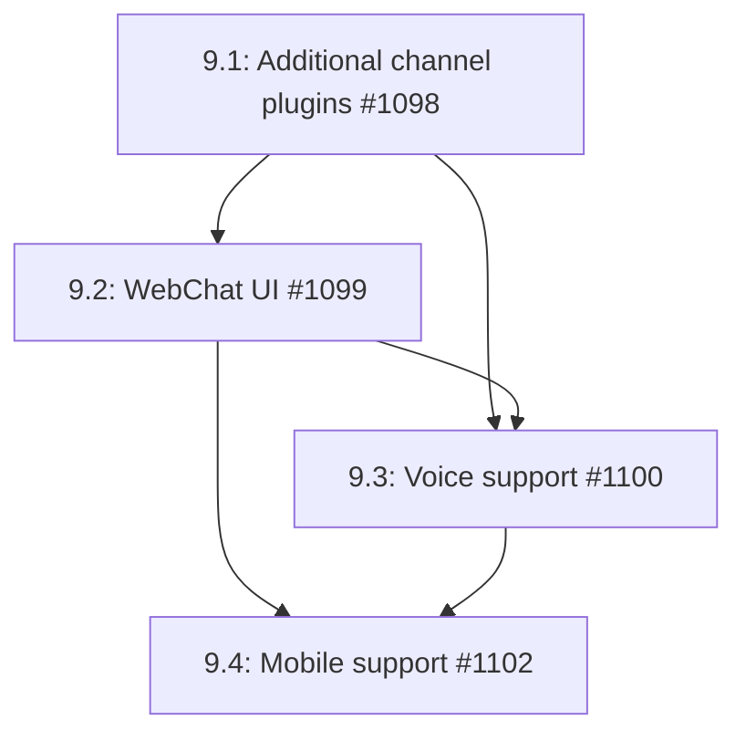

# Phase 9: Advanced Channels & UI

## Overview

This phase expands channel coverage beyond Telegram and Discord, adds a web-based chat interface, integrates voice capabilities, and explores mobile support. The goal is to make AgenC agents accessible across all major communication platforms with rich multimedia support.

## Dependencies

- Phase 1 (Gateway) - Required for channel abstraction and routing
- Existing `ChannelPlugin` interface - Required for channel implementation pattern
- Existing demo-app - Optional for WebChat UI foundation

## Issue Dependency Graph



## Implementation Order

1. **1098** - Additional channel plugins first - expands platform coverage
2. **1099** - WebChat UI next - provides web-based access
3. **1100** - Voice support - adds multimedia capabilities
4. **1102** - Mobile support last - requires all other channels to be stable

## Issue Details

### 9.1: Additional Channel Plugins (#1098)

- **Goal:** Implement Slack, WhatsApp, Signal, and Matrix channel plugins following the ChannelPlugin interface
- **Files to create:**
  - `runtime/src/channels/slack/plugin.ts`
  - `runtime/src/channels/slack/types.ts`
  - `runtime/src/channels/slack/plugin.test.ts`
  - `runtime/src/channels/whatsapp/plugin.ts`
  - `runtime/src/channels/whatsapp/types.ts`
  - `runtime/src/channels/whatsapp/plugin.test.ts`
  - `runtime/src/channels/signal/plugin.ts`
  - `runtime/src/channels/signal/types.ts`
  - `runtime/src/channels/signal/plugin.test.ts`
  - `runtime/src/channels/matrix/plugin.ts`
  - `runtime/src/channels/matrix/types.ts`
  - `runtime/src/channels/matrix/plugin.test.ts`
- **Files to modify:**
  - `runtime/src/channels/index.ts` (export all new plugins)
  - `runtime/src/gateway/gateway.ts` (register new plugins)
  - `package.json` (add optional dependencies)
- **Integration points:**
  - All plugins implement existing `ChannelPlugin` interface
  - Slack uses Bolt SDK (`@slack/bolt`)
  - WhatsApp uses Business API or Baileys library
  - Signal uses `signal-cli` wrapper
  - Matrix uses `matrix-js-sdk`
  - All SDKs lazy-loaded via `ensureLazyModule()`
- **Patterns to follow:**
  - Follow `runtime/src/channels/telegram/plugin.ts` as template for all channels
  - Use `runtime/src/utils/lazy-import.ts` for SDK lazy loading
  - Follow `runtime/src/gateway/types.ts` message type mapping
- **Key interfaces:**
```typescript
interface SlackChannel extends ChannelPlugin {
  platform: 'slack';
  initialize(config: SlackConfig): Promise<void>;
}

interface WhatsAppChannel extends ChannelPlugin {
  platform: 'whatsapp';
  initialize(config: WhatsAppConfig): Promise<void>;
}

interface SignalChannel extends ChannelPlugin {
  platform: 'signal';
  initialize(config: SignalConfig): Promise<void>;
}

interface MatrixChannel extends ChannelPlugin {
  platform: 'matrix';
  initialize(config: MatrixConfig): Promise<void>;
}
```
- **Testing strategy:**
  - Test message sending (all platforms)
  - Test message receiving (webhook/polling)
  - Test media handling (images, files)
  - Test error handling (API rate limits)
  - Mock all external SDK calls
  - Test lazy loading (import failures)
- **Estimated scope:** L (6-8 days)

### 9.2: WebChat UI (#1099)

- **Goal:** Build React-based web chat interface with WebSocket connection to Gateway
- **Files to create:**
  - `web/src/App.tsx`
  - `web/src/components/ChatWindow.tsx`
  - `web/src/components/MessageList.tsx`
  - `web/src/components/MessageInput.tsx`
  - `web/src/hooks/useWebSocket.ts`
  - `web/src/hooks/useChat.ts`
  - `web/src/types.ts`
  - `web/vite.config.ts`
  - `web/package.json`
  - `web/tsconfig.json`
- **Files to modify:**
  - `runtime/src/gateway/gateway.ts` (add WebSocket server)
  - `runtime/src/gateway/types.ts` (add webchat message types)
- **Integration points:**
  - WebSocket server embedded in Gateway
  - Client sends messages as JSON over WebSocket
  - Gateway routes to appropriate agent workspace
  - Supports markdown rendering for rich messages
  - Supports file uploads via base64 encoding
- **Patterns to follow:**
  - Follow `demo-app/src/App.tsx` React patterns
  - Use same WebSocket pattern as `runtime/src/gateway/gateway.ts`
  - Follow `runtime/src/gateway/types.ts` message format
- **Key interfaces:**
```typescript
interface WebChatClient {
  connect(url: string): Promise<void>;
  disconnect(): void;
  sendMessage(text: string, attachments?: File[]): Promise<void>;
  onMessage(handler: (message: ChatMessage) => void): void;
  onStatus(handler: (status: ConnectionStatus) => void): void;
}

interface ChatMessage {
  id: string;
  sender: 'user' | 'agent';
  text: string;
  timestamp: number;
  attachments?: Attachment[];
}

interface Attachment {
  name: string;
  type: string;
  url?: string;
  data?: string;
}
```
- **Testing strategy:**
  - Test WebSocket connection (connect, disconnect, reconnect)
  - Test message sending (text, attachments)
  - Test message receiving (agent responses)
  - Test markdown rendering
  - Test file uploads
  - Mock Gateway WebSocket server
- **Estimated scope:** L (5-6 days)

### 9.3: Voice Support (#1100)

- **Goal:** Integrate speech-to-text and text-to-speech for voice interactions
- **Files to create:**
  - `runtime/src/voice/stt.ts`
  - `runtime/src/voice/tts.ts`
  - `runtime/src/voice/types.ts`
  - `runtime/src/voice/errors.ts`
  - `runtime/src/voice/stt.test.ts`
  - `runtime/src/voice/tts.test.ts`
  - `runtime/src/voice/index.ts`
- **Files to modify:**
  - `runtime/src/index.ts` (export voice module)
  - `runtime/src/gateway/media.ts` (integrate STT/TTS)
  - `runtime/src/channels/telegram/plugin.ts` (add voice message support)
  - `runtime/src/channels/discord/plugin.ts` (add voice channel support)
  - `web/src/components/VoiceInput.tsx` (add voice UI)
- **Integration points:**
  - STT uses Whisper API (OpenAI) or local Whisper model
  - TTS uses ElevenLabs or Edge TTS
  - Voice messages converted to text before agent processing
  - Agent responses converted to speech for voice channels
  - WebChat UI supports browser MediaRecorder API
- **Patterns to follow:**
  - Follow `runtime/src/gateway/media.ts` media handling pattern
  - Use `runtime/src/utils/lazy-import.ts` for SDK lazy loading
  - Follow `runtime/src/llm/anthropic.ts` API client pattern
- **Key interfaces:**
```typescript
interface STTProvider {
  transcribe(audio: Buffer, format: AudioFormat): Promise<string>;
  transcribeStream(stream: ReadableStream): AsyncIterableIterator<string>;
}

interface TTSProvider {
  synthesize(text: string, voice?: string): Promise<Buffer>;
  synthesizeStream(text: string, voice?: string): ReadableStream;
}

interface AudioFormat {
  codec: 'opus' | 'mp3' | 'wav' | 'ogg';
  sampleRate: number;
  channels: number;
}
```
- **Testing strategy:**
  - Test STT transcription (mock Whisper API)
  - Test TTS synthesis (mock ElevenLabs API)
  - Test audio format conversion
  - Test streaming transcription
  - Test voice message handling in channels
  - Mock all external APIs
- **Estimated scope:** M (3-4 days)

### 9.4: Mobile Support (#1102)

- **Goal:** Enable mobile access via remote Gateway node or native app
- **Files to create:**
  - `mobile/App.tsx` (React Native entry point)
  - `mobile/src/screens/ChatScreen.tsx`
  - `mobile/src/components/MessageBubble.tsx`
  - `mobile/src/hooks/useRemoteGateway.ts`
  - `mobile/src/types.ts`
  - `mobile/package.json`
  - `mobile/app.json`
  - `runtime/src/gateway/remote.ts` (remote Gateway client)
  - `runtime/src/gateway/remote-types.ts`
- **Files to modify:**
  - `runtime/src/gateway/gateway.ts` (add remote access API)
  - `runtime/src/index.ts` (export remote client)
- **Integration points:**
  - Mobile app connects to remote Gateway node via WebSocket
  - Remote Gateway authenticates clients via JWT
  - Mobile app can switch between Gateway nodes
  - Supports push notifications for new messages
  - Supports offline message queue
- **Patterns to follow:**
  - Follow `web/src/hooks/useWebSocket.ts` connection pattern
  - Use same message format as `runtime/src/gateway/types.ts`
  - Follow `runtime/src/connection/manager.ts` failover pattern for Gateway switching
- **Key interfaces:**
```typescript
interface RemoteGateway {
  connect(url: string, token: string): Promise<void>;
  disconnect(): void;
  sendMessage(message: ChatMessage): Promise<void>;
  onMessage(handler: (message: ChatMessage) => void): void;
  switchGateway(url: string, token: string): Promise<void>;
}

interface PushNotification {
  messageId: string;
  sender: string;
  preview: string;
  timestamp: number;
}

interface OfflineQueue {
  enqueue(message: ChatMessage): void;
  flush(): Promise<void>;
  clear(): void;
}
```
- **Testing strategy:**
  - Test remote Gateway connection
  - Test authentication (JWT)
  - Test Gateway switching
  - Test offline queue
  - Test push notifications (mocked)
  - Mock all WebSocket connections
- **Estimated scope:** L (6-8 days)

## Testing Strategy

- Unit tests for all channel plugins (mocked SDKs)
- Integration tests for WebChat UI (React Testing Library)
- Voice integration tests (mocked STT/TTS APIs)
- Mobile app tests (React Native Testing Library)
- End-to-end tests across all channels

## Success Criteria

- Agents accessible on Slack, WhatsApp, Signal, Matrix
- WebChat UI works in all modern browsers
- Voice messages transcribed and synthesized correctly
- Mobile app connects to remote Gateway
- All channels support text, images, and files
- Voice channels support audio input/output
