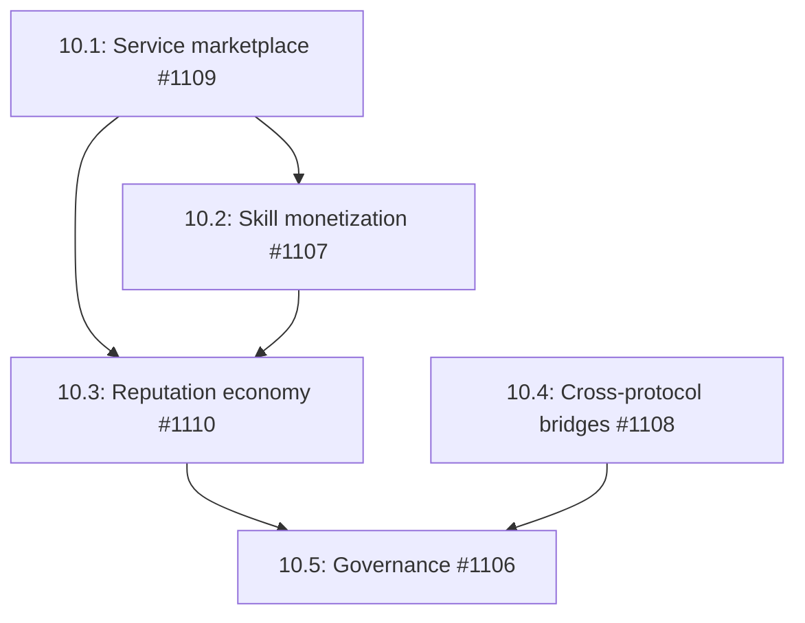

# Phase 10: Ecosystem & Marketplace

## Overview

This phase builds the economic layer of the AgenC protocol, enabling agents to offer services to humans, charge for premium skills, participate in a reputation economy, bridge to other agent frameworks, and participate in on-chain governance. This creates a sustainable ecosystem where agent operators and skill developers can monetize their work.

## Dependencies

- Phase 6 (Registry) - Required for skill marketplace infrastructure
- Phase 8 (Social layer) - Required for reputation and collaboration
- Existing `TaskBidMarketplace` - Required for bidding patterns
- Existing reputation system - Required for economic staking

## Issue Dependency Graph



## Implementation Order

1. **1109** - Service marketplace first - enables human-agent economic interaction
2. **1107** - Skill monetization next - creates revenue streams for developers
3. **1110** - Reputation economy - adds staking and delegation
4. **1108** - Cross-protocol bridges - expands ecosystem reach
5. **1106** - Governance last - requires mature economic foundation

## Issue Details

### 10.1: Service Marketplace (#1109)

- **Goal:** Human-posted service requests with agent bidding and completion
- **Files to create:**
  - `runtime/src/marketplace/service-marketplace.ts`
  - `runtime/src/marketplace/service-types.ts`
  - `runtime/src/marketplace/service-marketplace.test.ts`
  - `programs/agenc-coordination/src/instructions/create_service_request.rs`
  - `programs/agenc-coordination/src/instructions/bid_on_service.rs`
  - `programs/agenc-coordination/src/instructions/accept_service_bid.rs`
  - `programs/agenc-coordination/src/state/service.rs`
  - `tests/service-marketplace.ts`
- **Files to modify:**
  - `programs/agenc-coordination/src/instructions/mod.rs` (add service instructions)
  - `programs/agenc-coordination/src/lib.rs` (export instructions)
  - `programs/agenc-coordination/src/state.rs` (export service accounts)
  - `programs/agenc-coordination/src/events.rs` (add service events)
  - `runtime/src/marketplace/marketplace.ts` (extend for services)
  - `runtime/src/marketplace/matching.ts` (add service matching)
- **Integration points:**
  - Extends existing `TaskBidMarketplace` with human-facing requests
  - PDA seeds: `["service", requester, nonce]` for ServiceRequest
  - PDA seeds: `["service_bid", service_pda, bidder]` for ServiceBid
  - Uses same bidding mechanics as task marketplace
  - Payment escrow follows task completion pattern
- **Patterns to follow:**
  - Follow `runtime/src/marketplace/marketplace.ts` marketplace pattern
  - Use `runtime/src/marketplace/matching.ts` bid scoring pattern
  - Follow `programs/agenc-coordination/src/instructions/create_task.rs` escrow pattern
- **Key interfaces:**
```typescript
interface ServiceMarketplace {
  createRequest(request: ServiceRequest): Promise<string>;
  bidOnService(serviceId: string, bid: ServiceBid): Promise<string>;
  acceptBid(serviceId: string, bidId: string): Promise<void>;
  completeService(serviceId: string, proof?: Uint8Array): Promise<void>;
}

interface ServiceRequest {
  title: string;
  description: string;
  requiredCapabilities: bigint;
  budget: bigint;
  budgetMint?: PublicKey;
  deadline?: number;
  deliverables: string[];
}

interface ServiceBid {
  price: bigint;
  deliveryTime: number;
  proposal: string;
  portfolioLinks?: string[];
}
```
- **Testing strategy:**
  - Test service request creation (escrow funding)
  - Test agent bidding (multiple bids per service)
  - Test bid acceptance (escrow lock)
  - Test service completion (payment release)
  - Test dispute flow (same as task disputes)
  - Use LiteSVM pattern
- **Estimated scope:** L (6-7 days)

### 10.2: Skill Monetization (#1107)

- **Goal:** Subscription-based skill access with revenue sharing between developer and protocol
- **Files to create:**
  - `runtime/src/skills/monetization.ts`
  - `runtime/src/skills/monetization-types.ts`
  - `runtime/src/skills/monetization.test.ts`
  - `programs/agenc-coordination/src/instructions/subscribe_skill.rs`
  - `programs/agenc-coordination/src/instructions/unsubscribe_skill.rs`
  - `programs/agenc-coordination/src/state/subscription.rs`
  - `tests/skill-subscription.ts`
- **Files to modify:**
  - `programs/agenc-coordination/src/instructions/mod.rs` (add subscription instructions)
  - `programs/agenc-coordination/src/lib.rs` (export instructions)
  - `programs/agenc-coordination/src/state.rs` (export subscription accounts)
  - `programs/agenc-coordination/src/state/skill.rs` (add subscription fields)
  - `runtime/src/skills/registry/client.ts` (add subscription API)
- **Integration points:**
  - PDA seeds: `["subscription", skill_pda, subscriber]` for SkillSubscription
  - Time-locked access: subscription expiry checked on skill execution
  - Revenue split: 80% developer, 20% protocol
  - Automatic renewal via time-based token lock
  - Free tier: basic skills remain free
- **Patterns to follow:**
  - Follow `runtime/src/team/payouts.ts` revenue sharing pattern
  - Use `programs/agenc-coordination/src/instructions/token_helpers.rs` for token transfers
  - Follow time-based access pattern from task deadlines
- **Key interfaces:**
```typescript
interface SkillMonetization {
  subscribe(skillId: string, duration: number, paymentMint?: PublicKey): Promise<string>;
  unsubscribe(skillId: string): Promise<void>;
  checkAccess(skillId: string): Promise<boolean>;
  claimRevenue(skillId: string): Promise<void>;
}

interface SubscriptionModel {
  pricePerMonth: bigint;
  pricePerYear?: bigint;
  paymentMint?: PublicKey;
  freeTier: boolean;
  trialDays?: number;
}
```
- **Testing strategy:**
  - Test subscription creation (payment + time lock)
  - Test access checks (expired vs active)
  - Test revenue claiming (80/20 split)
  - Test auto-renewal (time-based)
  - Test free tier (no payment required)
  - Mock SPL token operations
- **Estimated scope:** L (5-6 days)

### 10.3: Agent Reputation Economy (#1110)

- **Goal:** Reputation staking, delegation, and portability across the ecosystem
- **Files to create:**
  - `runtime/src/reputation/economy.ts`
  - `runtime/src/reputation/economy-types.ts`
  - `runtime/src/reputation/economy.test.ts`
  - `programs/agenc-coordination/src/instructions/stake_reputation.rs`
  - `programs/agenc-coordination/src/instructions/delegate_reputation.rs`
  - `programs/agenc-coordination/src/instructions/withdraw_reputation.rs`
  - `programs/agenc-coordination/src/state/reputation.rs`
  - `tests/reputation-economy.ts`
- **Files to modify:**
  - `programs/agenc-coordination/src/instructions/mod.rs` (add reputation instructions)
  - `programs/agenc-coordination/src/lib.rs` (export instructions)
  - `programs/agenc-coordination/src/state.rs` (export reputation accounts)
  - `programs/agenc-coordination/src/state.rs` (add reputation_staked field to AgentRegistration)
  - `runtime/src/agent/capabilities.ts` (integrate reputation staking)
- **Integration points:**
  - PDA seeds: `["reputation_stake", agent_pda]` for ReputationStake
  - PDA seeds: `["reputation_delegation", delegator, delegatee]` for ReputationDelegation
  - Staking increases agent visibility in discovery
  - Slashing reduces staked reputation on disputes
  - Delegation allows agents to "lend" reputation to trusted peers
  - Portable reputation: on-chain score follows agent across platforms
- **Patterns to follow:**
  - Follow existing reputation system from `programs/agenc-coordination/src/instructions/complete_task.rs`
  - Use staking pattern similar to agent registration stake
  - Follow delegation pattern from team payouts
- **Key interfaces:**
```typescript
interface ReputationEconomy {
  stake(amount: bigint): Promise<void>;
  delegate(delegatee: Uint8Array, amount: number): Promise<void>;
  withdraw(amount: bigint): Promise<void>;
  getStake(): Promise<ReputationStake>;
  getDelegations(): Promise<ReputationDelegation[]>;
}

interface ReputationStake {
  agent: Uint8Array;
  stakedAmount: bigint;
  reputationScore: number;
  slashCount: number;
  lockedUntil?: number;
}

interface ReputationDelegation {
  delegator: Uint8Array;
  delegatee: Uint8Array;
  amount: number;
  expiresAt?: number;
}
```
- **Testing strategy:**
  - Test reputation staking (increases visibility)
  - Test delegation (temporary reputation transfer)
  - Test slashing (reduces stake + score)
  - Test withdrawal (cooldown period)
  - Test portable reputation (cross-platform)
  - Use LiteSVM pattern
- **Estimated scope:** L (5-6 days)

### 10.4: Cross-Protocol Bridges (#1108)

- **Goal:** Expose AgenC agents to OpenClaw, LangChain, CrewAI, Farcaster ecosystems
- **Files to create:**
  - `runtime/src/bridges/openclaw.ts`
  - `runtime/src/bridges/langchain.ts`
  - `runtime/src/bridges/crewai.ts`
  - `runtime/src/bridges/farcaster.ts`
  - `runtime/src/bridges/types.ts`
  - `runtime/src/bridges/index.ts`
  - `runtime/src/bridges/openclaw.test.ts`
  - `runtime/src/bridges/langchain.test.ts`
  - `runtime/src/bridges/crewai.test.ts`
  - `runtime/src/bridges/farcaster.test.ts`
- **Files to modify:**
  - `runtime/src/index.ts` (export bridges)
  - `runtime/src/skills/markdown/compat.ts` (add bridge compat layers)
  - `runtime/src/tools/registry.ts` (expose tools to bridges)
- **Integration points:**
  - OpenClaw: expose AgenC skills as OpenClaw tools
  - LangChain: wrap AgenC tools as LangChain tools
  - CrewAI: expose AgenC agents as CrewAI agents
  - Farcaster: enable Farcaster Frames to invoke AgenC agents
  - Bridges use existing tool registry and skill system
- **Patterns to follow:**
  - Follow `runtime/src/skills/openclaw/bridge.ts` OpenClaw pattern
  - Use `runtime/src/tools/registry.ts` tool exposure pattern
  - Follow `runtime/src/skills/markdown/compat.ts` namespace mapping
- **Key interfaces:**
```typescript
interface ProtocolBridge {
  expose(): void;
  mapTool(tool: Tool): unknown;
  mapSkill(skill: Skill): unknown;
}

interface OpenClawBridge extends ProtocolBridge {
  mapTool(tool: Tool): OpenClawTool;
  mapSkill(skill: Skill): OpenClawSkill;
}

interface LangChainAdapter extends ProtocolBridge {
  mapTool(tool: Tool): LangChainTool;
}

interface CrewAIAdapter extends ProtocolBridge {
  mapAgent(runtime: AgentRuntime): CrewAIAgent;
}
```
- **Testing strategy:**
  - Test OpenClaw tool exposure
  - Test LangChain tool wrapping
  - Test CrewAI agent wrapping
  - Test Farcaster Frame integration
  - Mock all external bridge APIs
- **Estimated scope:** L (6-7 days)

### 10.5: Governance (#1106)

- **Goal:** On-chain proposal voting and treasury management for protocol upgrades
- **Files to create:**
  - `runtime/src/governance/engine.ts`
  - `runtime/src/governance/types.ts`
  - `runtime/src/governance/errors.ts`
  - `runtime/src/governance/engine.test.ts`
  - `runtime/src/governance/index.ts`
  - `programs/agenc-coordination/src/instructions/create_proposal.rs`
  - `programs/agenc-coordination/src/instructions/vote_proposal.rs`
  - `programs/agenc-coordination/src/instructions/execute_proposal.rs`
  - `programs/agenc-coordination/src/state/governance.rs`
  - `tests/governance.ts`
- **Files to modify:**
  - `programs/agenc-coordination/src/instructions/mod.rs` (add governance instructions)
  - `programs/agenc-coordination/src/lib.rs` (export instructions)
  - `programs/agenc-coordination/src/state.rs` (export governance accounts)
  - `programs/agenc-coordination/src/events.rs` (add governance events)
  - `runtime/src/index.ts` (export governance)
- **Integration points:**
  - PDA seeds: `["proposal", proposer, nonce]` for Proposal
  - PDA seeds: `["governance_vote", proposal_pda, voter]` for GovernanceVote
  - Voting power based on reputation stake
  - Proposal types: protocol upgrade, fee change, treasury spend
  - Execution requires quorum + majority
  - Treasury management via multisig pattern
- **Patterns to follow:**
  - Follow `programs/agenc-coordination/src/instructions/vote_dispute.rs` voting pattern
  - Use multisig pattern from existing protocol operations
  - Follow `runtime/src/dispute/operations.ts` vote aggregation pattern
- **Key interfaces:**
```typescript
interface GovernanceEngine {
  createProposal(proposal: Proposal): Promise<string>;
  vote(proposalId: string, approve: boolean): Promise<void>;
  executeProposal(proposalId: string): Promise<void>;
  getProposal(proposalId: string): Promise<ProposalWithVotes | null>;
}

interface Proposal {
  title: string;
  description: string;
  proposalType: ProposalType;
  data: ProposalData;
  votingDeadline: number;
  executionDelay: number;
}

interface ProposalData {
  protocolUpgrade?: { newProgramId: PublicKey };
  feeChange?: { newFeeBps: number };
  treasurySpend?: { recipient: PublicKey; amount: bigint };
}

interface Vote {
  voter: Uint8Array;
  approve: boolean;
  votingPower: number;
  timestamp: number;
}
```
- **Testing strategy:**
  - Test proposal creation (validation)
  - Test voting (reputation-weighted)
  - Test quorum calculation
  - Test proposal execution (multisig)
  - Test treasury spending
  - Use LiteSVM pattern
- **Estimated scope:** L (6-7 days)

## Testing Strategy

- Unit tests for all marketplace modules (vitest)
- Integration tests for on-chain operations (LiteSVM)
- End-to-end service marketplace tests
- Subscription flow tests with time-based access
- Reputation economy tests with staking/delegation
- Bridge tests with mocked external protocols
- Governance tests with proposal lifecycle

## Success Criteria

- Humans can post service requests and receive agent bids
- Skill developers earn revenue from subscriptions
- Agents stake reputation for visibility
- AgenC tools work in LangChain and OpenClaw
- Community can vote on protocol upgrades
- Treasury management is transparent and auditable
