# Runtime Module Dependency Diagram

The `@agenc/runtime` package (~90k lines) is organized into 7 dependency layers. Modules may only depend on modules in the same or lower layers.

## Layer Diagram

```mermaid
flowchart TB
    subgraph L7["Layer 7: API Surface"]
        runtime["runtime.ts\nAgentRuntime"]
        builder["builder.ts\nAgentBuilder"]
        idl["idl.ts\nIDL + Program factories"]
        index["index.ts\nBarrel exports"]
    end

    subgraph L6["Layer 6: Specialized"]
        policy["policy/\nPolicyEngine"]
        team["team/\nTeamContractEngine"]
        marketplace["marketplace/\nTaskBidMarketplace"]
        eval_mod["eval/\nBenchmarks + Mutations"]
        replay["replay/\nReplayStore + Projector"]
        telemetry["telemetry/\nMetrics + Sinks"]
    end

    subgraph L5["Layer 5: Workflow"]
        workflow["workflow/\nDAGOrchestrator\nGoalCompiler\nOptimizer"]
    end

    subgraph L4["Layer 4: Autonomous"]
        autonomous["autonomous/\nAutonomousAgent\nScanner + Verifier"]
    end

    subgraph L3["Layer 3: Task + AI"]
        task["task/\nTaskOperations\nDiscovery\nSpeculativeExecutor"]
        memory["memory/\nInMemory + SQLite + Redis"]
        skills["skills/\nSkillRegistry\nJupiterSkill"]
        tools["tools/\nToolRegistry\nBuilt-in tools"]
        llm["llm/\nGrok + Anthropic + Ollama\nLLMTaskExecutor"]
    end

    subgraph L2["Layer 2: Core"]
        agent["agent/\nAgentManager\nEvents + PDA"]
        proof["proof/\nProofEngine\nCache"]
        events["events/\nEventMonitor\nParsing"]
        dispute["dispute/\nDisputeOperations"]
        connection["connection/\nConnectionManager"]
    end

    subgraph L1["Layer 1: Foundation"]
        types["types/\nErrors + Wallet + Protocol"]
        utils["utils/\nEncoding + Logger\nPDA + Treasury"]
    end

    %% Layer 7 → Layer 6
    runtime --> autonomous
    runtime --> agent
    runtime --> connection
    runtime --> telemetry
    builder --> llm
    builder --> memory
    builder --> proof
    builder --> tools
    builder --> connection

    %% Layer 6 → lower
    policy --> types
    team --> task
    marketplace --> task
    eval_mod --> llm
    eval_mod --> tools
    replay --> events
    replay --> types
    telemetry --> types

    %% Layer 5 → Layer 3/4
    workflow --> task
    workflow --> llm

    %% Layer 4 → Layer 3
    autonomous --> task
    autonomous --> llm
    autonomous --> proof
    autonomous --> tools
    autonomous --> events

    %% Layer 3 → Layer 2
    task --> agent
    task --> events
    task --> connection
    llm --> tools
    skills --> tools
    memory --> types

    %% Layer 2 → Layer 1
    agent --> types
    agent --> utils
    proof --> types
    events --> types
    events --> utils
    dispute --> agent
    dispute --> types
    connection --> types
    connection --> utils
```

## Module Summary

### Layer 1: Foundation

| Module | Primary Export | Error Codes | Tests |
|--------|--------------|-------------|-------|
| `types/` | `RuntimeError`, `RuntimeErrorCodes`, `WalletAdapter` | 1-37 (all) | ~50 |
| `utils/` | `toUint8Array`, `Logger`, `derivePda`, `fetchTreasury`, `ensureLazyModule` | — | ~30 |

### Layer 2: Core

| Module | Primary Export | Error Codes | Tests |
|--------|--------------|-------------|-------|
| `agent/` | `AgentManager`, `AgentCapabilities` | 1-5 | ~80 |
| `proof/` | `ProofEngine` | 25-27 | ~37 |
| `events/` | `EventMonitor`, event type parsers | — | ~40 |
| `dispute/` | `DisputeOperations` | 28-31 | ~56 |
| `connection/` | `ConnectionManager` | 36-37 | ~45 |

### Layer 3: Task + AI

| Module | Primary Export | Error Codes | Tests |
|--------|--------------|-------------|-------|
| `task/` | `TaskOperations`, `TaskDiscovery`, `SpeculativeExecutor` | 6-12 | ~120 |
| `memory/` | `InMemoryBackend`, `SqliteBackend`, `RedisBackend` | 22-24 | ~105 |
| `skills/` | `SkillRegistry`, `JupiterSkill` | — | ~30 |
| `tools/` | `ToolRegistry`, `createAgencTools`, `skillToTools` | — | ~60 |
| `llm/` | `GrokProvider`, `AnthropicProvider`, `OllamaProvider`, `LLMTaskExecutor` | 17-21 | ~80 |

### Layer 4: Autonomous

| Module | Primary Export | Error Codes | Tests |
|--------|--------------|-------------|-------|
| `autonomous/` | `AutonomousAgent`, `TaskScanner`, `VerifierScheduler` | 13-16 | ~150 |

### Layer 5: Workflow

| Module | Primary Export | Error Codes | Tests |
|--------|--------------|-------------|-------|
| `workflow/` | `DAGOrchestrator`, `GoalCompiler`, `WorkflowOptimizer` | 32-35 | ~100 |

### Layer 6: Specialized

| Module | Primary Export | Error Codes | Tests |
|--------|--------------|-------------|-------|
| `policy/` | `PolicyEngine` | — | ~40 |
| `team/` | `TeamContractEngine`, `computeTeamPayout` | — | ~50 |
| `marketplace/` | `TaskBidMarketplace`, bid strategies | — | ~60 |
| `eval/` | `BenchmarkRunner`, `MutationRunner` | — | ~80 |
| `replay/` | `ReplayStore`, `ReplayProjector`, `IncidentReconstructor` | — | ~70 |
| `telemetry/` | `UnifiedTelemetryCollector`, `NoopTelemetryCollector` | — | ~30 |

### Layer 7: API Surface

| Module | Primary Export | Description |
|--------|--------------|-------------|
| `runtime.ts` | `AgentRuntime` | Lifecycle wrapper (start/stop) |
| `builder.ts` | `AgentBuilder` | Fluent composition API |
| `idl.ts` | `IDL`, `createProgram`, `createReadOnlyProgram` | IDL and Program factories |
| `index.ts` | All public exports | Barrel re-exports (~920 lines) |

## Dependency Rules

1. **No circular dependencies** — modules only import from same or lower layers
2. **Foundation is pure** — `types/` and `utils/` have zero internal dependencies
3. **Core modules are independent** — modules in Layer 2 don't depend on each other (except `dispute/` → `agent/`)
4. **AI modules compose** — `llm/` uses `tools/`, `skills/` provides tools, `memory/` is standalone
5. **Autonomous wraps everything** — `autonomous/` is the integration point for task + LLM + proof
6. **API surface is thin** — `runtime.ts` and `builder.ts` only compose, never implement

## Cross-Layer Communication

| Pattern | Example | Mechanism |
|---------|---------|-----------|
| Event-driven | Agent registration → EventMonitor callback | WebSocket subscription |
| Dependency injection | AgentBuilder → AutonomousAgent with LLM + tools | Constructor params |
| Shared utilities | All modules → `fetchTreasury()`, `toUint8Array()` | Direct import from utils |
| Interface contracts | `ProofEngine` implements `ProofGenerator` | TypeScript interface |
| Lazy loading | LLM adapters load SDKs on first use | `ensureLazyModule()` |
