# AgenC Speculative Execution: Architecture Design Document

**Version:** 1.0.0  
**Status:** Draft  
**Authors:** AgenC Core Team  
**Created:** 2025-01-28  
**Last Updated:** 2025-01-28  

**Related Issues:**
- [#259](https://github.com/tetsuo-ai/AgenC/issues/259) - Speculative Execution Overview
- [#261](https://github.com/tetsuo-ai/AgenC/issues/261) - DependencyGraph Component
- [#264](https://github.com/tetsuo-ai/AgenC/issues/264) - ProofDeferralManager
- [#266](https://github.com/tetsuo-ai/AgenC/issues/266) - CommitmentLedger
- [#269](https://github.com/tetsuo-ai/AgenC/issues/269) - RollbackController
- [#271](https://github.com/tetsuo-ai/AgenC/issues/271) - SpeculativeTaskScheduler
- [#273](https://github.com/tetsuo-ai/AgenC/issues/273) - On-Chain Components
- [#275](https://github.com/tetsuo-ai/AgenC/issues/275) - Security Model
- [#278](https://github.com/tetsuo-ai/AgenC/issues/278) - Performance Benchmarks
- [#282](https://github.com/tetsuo-ai/AgenC/issues/282) - Testing Strategy
- [#285](https://github.com/tetsuo-ai/AgenC/issues/285) - Configuration & Operations

---

## Table of Contents

1. [Executive Summary](#1-executive-summary)
2. [Problem Statement](#2-problem-statement)
3. [Goals and Non-Goals](#3-goals-and-non-goals)
4. [System Context](#4-system-context)
5. [High-Level Architecture](#5-high-level-architecture)
6. [Component Descriptions](#6-component-descriptions)
7. [On-Chain Components](#7-on-chain-components)
8. [Data Flow](#8-data-flow)
9. [Security Considerations](#9-security-considerations)
10. [Performance Considerations](#10-performance-considerations)
11. [Failure Modes and Recovery](#11-failure-modes-and-recovery)
12. [Configuration Options](#12-configuration-options)
13. [Future Enhancements](#13-future-enhancements)
14. [Glossary](#14-glossary)

---

## 1. Executive Summary

### Overview

Speculative Execution is a performance optimization layer for the AgenC coordination protocol that enables agents to begin work on dependent tasks **before** their prerequisite proofs have been fully verified on-chain. By allowing controlled, stake-backed speculation, we can dramatically reduce end-to-end latency for complex multi-task workflows while maintaining the protocol's cryptographic integrity guarantees.

### Key Benefits

| Benefit | Impact |
|---------|--------|
| **Reduced Latency** | Up to 85% reduction in multi-task completion time |
| **Improved Throughput** | 3-5x increase in tasks processed per unit time |
| **Economic Efficiency** | Lower per-task gas costs through batched settlements |
| **Maintained Security** | Stake-based guarantees prevent abuse without sacrificing performance |

### Design Principles

1. **Optimistic by Default, Secure by Design** — Assume success, prepare for failure
2. **Economic Alignment** — Make honest behavior profitable, dishonest behavior expensive
3. **Graceful Degradation** — Fall back to sequential execution when speculation is unsafe
4. **Observability First** — Comprehensive metrics for debugging and optimization
5. **Privacy Preservation** — Speculative state never compromises ZK proof integrity

---

## 2. Problem Statement

### The Latency Challenge

In the current AgenC architecture, multi-task workflows execute **sequentially**. Each task must:

1. Be claimed by an agent
2. Be executed off-chain
3. Have its proof generated (ZK proof for private tasks)
4. Submit proof to chain and wait for confirmation (~400ms on Solana)
5. Have the proof verified on-chain
6. Only then can dependent tasks begin

For complex workflows with deep dependency chains, this creates substantial latency.

### Latency Analysis: Sequential vs. Speculative

Consider a typical 5-task dependency chain:


```mermaid
graph LR
    T1[Task 1] --> T2[Task 2]
    T2 --> T3[Task 3]
    T3 --> T4[Task 4]
    T4 --> T5[Task 5]
    
    style T1 fill:#3498db,stroke:#2980b9,color:#fff
    style T2 fill:#3498db,stroke:#2980b9,color:#fff
    style T3 fill:#3498db,stroke:#2980b9,color:#fff
    style T4 fill:#3498db,stroke:#2980b9,color:#fff
    style T5 fill:#3498db,stroke:#2980b9,color:#fff
```

#### Sequential Execution Timing

| Phase | Time per Task | Tasks | Total |
|-------|---------------|-------|-------|
| Claim Transaction | 400ms | 5 | 2,000ms |
| Off-chain Execution | 500ms | 5 | 2,500ms |
| ZK Proof Generation | 2,000ms | 5 | 10,000ms |
| Submit & Confirm | 400ms | 5 | 2,000ms |
| On-chain Verification | 50ms | 5 | 250ms |
| **Total Sequential** | | | **16,750ms** |

#### Speculative Execution Timing

With speculation, tasks execute in parallel where the dependency graph allows:

| Phase | Description | Time |
|-------|-------------|------|
| Claim T1 | Initial task | 400ms |
| Execute T1 + Start Speculative T2-T5 | Parallel execution | 500ms |
| Proof Generation (all tasks) | Parallel proofs | 2,000ms |
| Batch Submit & Confirm | Single batch | 400ms |
| Batch Verification | Amortized | 100ms |
| **Total Speculative** | | **3,400ms** |

**Latency Improvement: 79.7% reduction** (16,750ms → 3,400ms)

### Deeper Chain Analysis

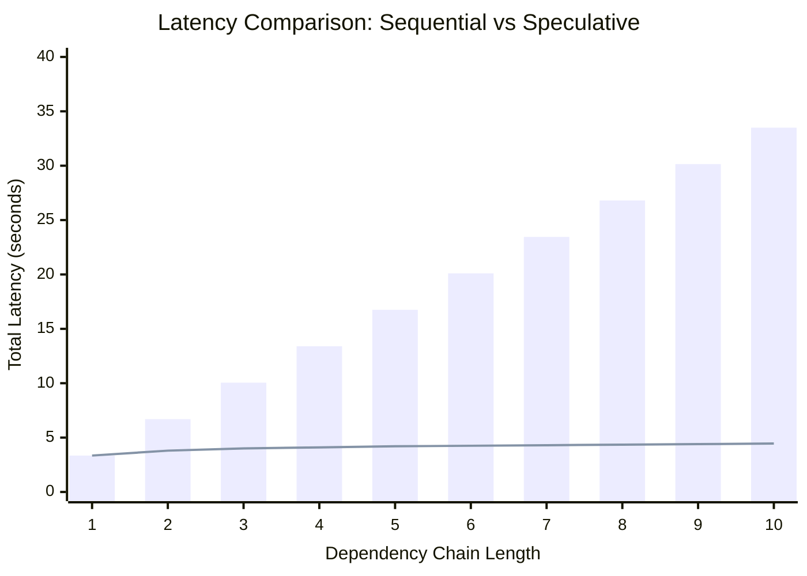
```mermaid
xychart-beta
    title "Latency Comparison: Sequential vs Speculative"
    x-axis "Dependency Chain Length" [1, 2, 3, 4, 5, 6, 7, 8, 9, 10]
    y-axis "Total Latency (seconds)" 0 --> 40
    bar [3.35, 6.7, 10.05, 13.4, 16.75, 20.1, 23.45, 26.8, 30.15, 33.5]
    line [3.35, 3.8, 4.0, 4.1, 4.2, 4.25, 4.3, 4.35, 4.4, 4.45]
```

| Chain Length | Sequential (ms) | Speculative (ms) | Improvement |
|--------------|-----------------|------------------|-------------|
| 1 | 3,350 | 3,350 | 0% |
| 3 | 10,050 | 4,000 | 60.2% |
| 5 | 16,750 | 4,200 | 74.9% |
| 10 | 33,500 | 4,450 | 86.7% |

### The Economic Challenge

Without proper incentives, speculative execution introduces risks:

- **Free Option Problem**: Agents could speculate on tasks, abandon them if results are unfavorable
- **Cascade Failures**: One failed speculation could invalidate a chain of dependent work
- **Resource Waste**: Speculative work that fails verification wastes computational resources
- **Gaming Vectors**: Malicious actors could exploit the system for economic gain

Our design addresses these through **stake-based commitments** and **economic bonding**.

---

## 3. Goals and Non-Goals

### Goals

| ID | Goal | Priority | Success Metric |
|----|------|----------|----------------|
| G1 | Reduce multi-task latency by >70% for chains of 5+ tasks | P0 | Measured via benchmark suite |
| G2 | Maintain protocol security guarantees | P0 | No new attack vectors introduced |
| G3 | Preserve privacy model integrity | P0 | ZK proofs remain unforgeable |
| G4 | Enable graceful fallback to sequential execution | P0 | 100% fallback success rate |
| G5 | Provide configurable risk tolerance | P1 | Per-agent and per-task configuration |
| G6 | Support partial speculation (some tasks speculative, some not) | P1 | Mixed-mode workflows function correctly |
| G7 | Minimize on-chain footprint | P2 | <10% additional CU cost per speculative task |
| G8 | Enable monitoring and debugging | P2 | Full observability via events |

### Non-Goals

| ID | Non-Goal | Rationale |
|----|----------|-----------|
| NG1 | Cross-program speculation | Out of scope; focus on AgenC-internal workflows |
| NG2 | Speculation across multiple chains | Future enhancement; single-chain focus for v1 |
| NG3 | Automatic agent trust scoring | Complex ML problem; deferred to v2 |
| NG4 | Speculation for disputed tasks | Too risky; disputes require verified state |
| NG5 | Zero-stake speculation | Economic alignment requires skin in the game |
| NG6 | Real-time speculation adjustment | Async batch model is sufficient for v1 |

### Constraints

1. **Backward Compatibility** — Existing tasks must work without modification
2. **Anchor 0.32+ Compatibility** — Must use stable Anchor features
3. **Solana CU Limits** — Operations must fit within 200k CU budget
4. **Privacy Cash Integration** — Must work with existing privacy pool
5. **ZK Circuit Compatibility** — No changes to existing Circom circuits

---

## 4. System Context

### Where Speculation Fits

Speculative execution operates as a **middleware layer** between task discovery and proof submission. It does not modify the core protocol—it optimizes the execution path.

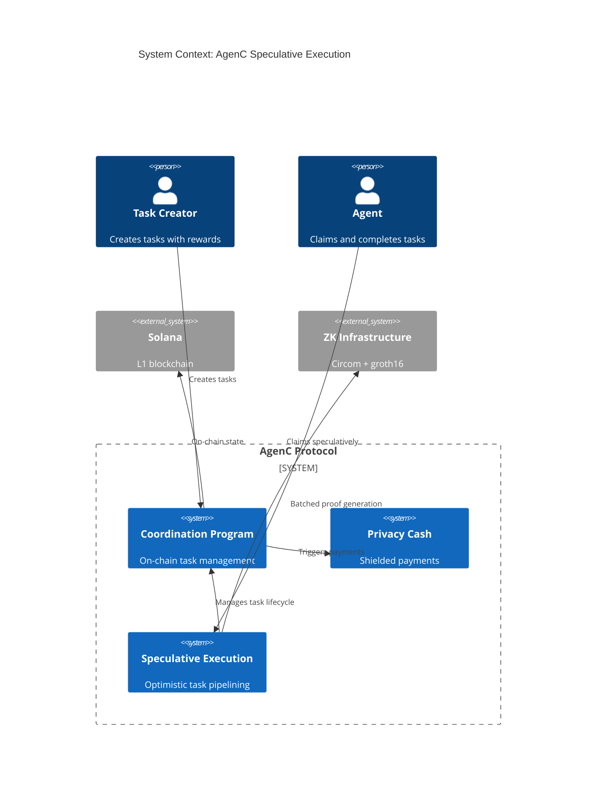
```mermaid
C4Context
    title System Context: AgenC Speculative Execution
    
    Person(creator, "Task Creator", "Creates tasks with rewards")
    Person(agent, "Agent", "Claims and completes tasks")
    
    System_Boundary(agenc, "AgenC Protocol") {
        System(coordination, "Coordination Program", "On-chain task management")
        System(privacy, "Privacy Cash", "Shielded payments")
        System(speculation, "Speculative Execution", "Optimistic task pipelining")
    }
    
    System_Ext(solana, "Solana", "L1 blockchain")
    System_Ext(zk, "ZK Infrastructure", "Circom + groth16")
    
    Rel(creator, coordination, "Creates tasks")
    Rel(agent, speculation, "Claims speculatively")
    Rel(speculation, coordination, "Manages task lifecycle")
    Rel(coordination, privacy, "Triggers payments")
    Rel(coordination, solana, "On-chain state")
    Rel(speculation, zk, "Batched proof generation")
```

### Integration Points

| Component | Integration Type | Data Flow |
|-----------|------------------|-----------|
| **Coordination Program** | Bidirectional | Task state, proof submission, claims |
| **Privacy Cash** | Outbound | Payment authorization after confirmation |
| **Agent SDK** | Bidirectional | Speculation decisions, execution results |
| **Circom Circuits** | Outbound | Batch proof requests |
| **Event System** | Outbound | Observability events |

### Interaction with Existing Components

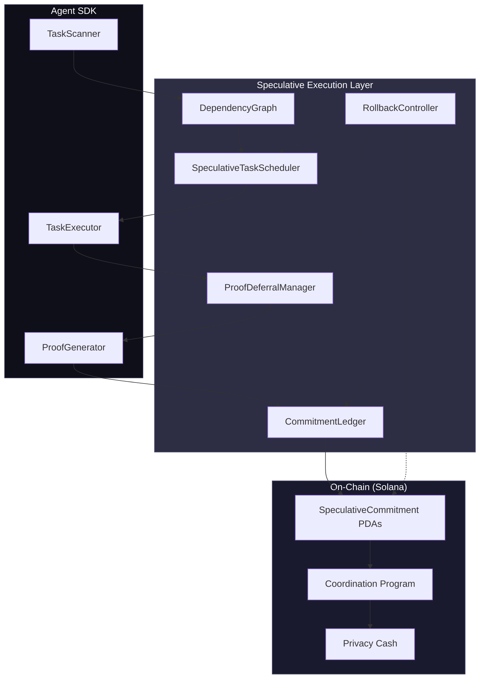
```mermaid
flowchart TB
    subgraph SDK["Agent SDK"]
        TS[TaskScanner]
        TE[TaskExecutor]
        PG[ProofGenerator]
    end
    
    subgraph Speculation["Speculative Execution Layer"]
        DG[DependencyGraph]
        STS[SpeculativeTaskScheduler]
        PDM[ProofDeferralManager]
        CL[CommitmentLedger]
        RC[RollbackController]
    end
    
    subgraph OnChain["On-Chain (Solana)"]
        CP[Coordination Program]
        SC[SpeculativeCommitment PDAs]
        PC[Privacy Cash]
    end
    
    TS --> DG
    DG --> STS
    STS --> TE
    TE --> PDM
    PDM --> PG
    PG --> CL
    CL --> SC
    SC --> CP
    
    RC -.-> CL
    RC -.-> STS
    RC -.-> SC
    
    CP --> PC
    
    style Speculation fill:#2d2d44,stroke:#5a5a7a,color:#fff
    style OnChain fill:#1a1a2e,stroke:#4a4a6a,color:#fff
    style SDK fill:#0f0f1a,stroke:#3a3a5a,color:#fff
```

---

## 5. High-Level Architecture

### Component Overview

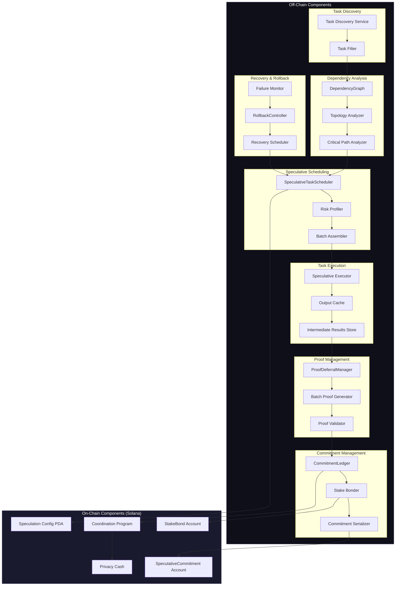
```mermaid
flowchart TB
    subgraph OffChain["Off-Chain Components"]
        direction TB
        
        subgraph Discovery["Task Discovery"]
            TD[Task Discovery Service]
            TF[Task Filter]
        end
        
        subgraph Analysis["Dependency Analysis"]
            DG[DependencyGraph]
            TA[Topology Analyzer]
            CPA[Critical Path Analyzer]
        end
        
        subgraph Scheduling["Speculative Scheduling"]
            STS[SpeculativeTaskScheduler]
            RP[Risk Profiler]
            BA[Batch Assembler]
        end
        
        subgraph Execution["Task Execution"]
            SE[Speculative Executor]
            OC[Output Cache]
            IR[Intermediate Results Store]
        end
        
        subgraph Proofs["Proof Management"]
            PDM[ProofDeferralManager]
            BPG[Batch Proof Generator]
            PV[Proof Validator]
        end
        
        subgraph Commitment["Commitment Management"]
            CL[CommitmentLedger]
            SB[Stake Bonder]
            CS[Commitment Serializer]
        end
        
        subgraph Recovery["Recovery & Rollback"]
            RC[RollbackController]
            FM[Failure Monitor]
            RS[Recovery Scheduler]
        end
    end
    
    subgraph OnChain["On-Chain Components (Solana)"]
        direction TB
        SCA[SpeculativeCommitment Account]
        SBA[StakeBond Account]
        SCP[Speculation Config PDA]
        CP[Coordination Program]
        PC[Privacy Cash]
    end
    
    TD --> TF --> DG
    DG --> TA --> CPA
    CPA --> STS
    STS --> RP --> BA
    BA --> SE
    SE --> OC --> IR
    IR --> PDM
    PDM --> BPG --> PV
    PV --> CL
    CL --> SB --> CS
    
    FM --> RC --> RS
    RS --> STS
    
    CS --> SCA
    SB --> SBA
    STS --> SCP
    CL --> CP
    CP --> PC
    
    style OffChain fill:#0f0f1a,stroke:#3a3a5a,color:#fff
    style OnChain fill:#1a1a2e,stroke:#4a4a6a,color:#fff
```

### Component Responsibilities

| Component | Responsibility | Key Interfaces |
|-----------|----------------|----------------|
| **DependencyGraph** | Build and maintain task dependency DAG | `addTask()`, `getDependents()`, `getCriticalPath()` |
| **SpeculativeTaskScheduler** | Decide which tasks to speculate on | `scheduleSpeculative()`, `getExecutionPlan()` |
| **ProofDeferralManager** | Queue proofs for batch generation | `deferProof()`, `flushBatch()`, `getProofStatus()` |
| **CommitmentLedger** | Track speculative commitments | `recordCommitment()`, `confirmCommitment()`, `rollbackCommitment()` |
| **RollbackController** | Coordinate failure recovery | `initiateRollback()`, `propagateRollback()`, `completeRollback()` |

### State Transitions

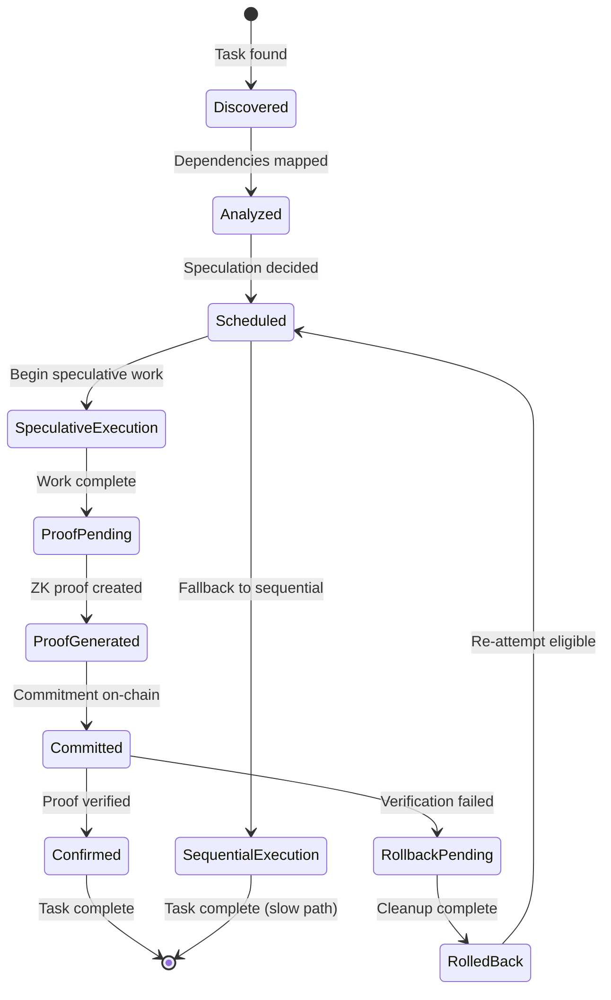
```mermaid
stateDiagram-v2
    [*] --> Discovered: Task found
    Discovered --> Analyzed: Dependencies mapped
    Analyzed --> Scheduled: Speculation decided
    
    Scheduled --> SpeculativeExecution: Begin speculative work
    Scheduled --> SequentialExecution: Fallback to sequential
    
    SpeculativeExecution --> ProofPending: Work complete
    ProofPending --> ProofGenerated: ZK proof created
    ProofGenerated --> Committed: Commitment on-chain
    
    Committed --> Confirmed: Proof verified
    Committed --> RollbackPending: Verification failed
    
    RollbackPending --> RolledBack: Cleanup complete
    RolledBack --> Scheduled: Re-attempt eligible
    
    Confirmed --> [*]: Task complete
    SequentialExecution --> [*]: Task complete (slow path)
```

---

## 6. Component Descriptions

### 6.1 DependencyGraph

**Purpose:** Builds and maintains a directed acyclic graph (DAG) of task dependencies, enabling efficient traversal and critical path analysis.

**Reference:** [Issue #261](https://github.com/tetsuo-ai/AgenC/issues/261)

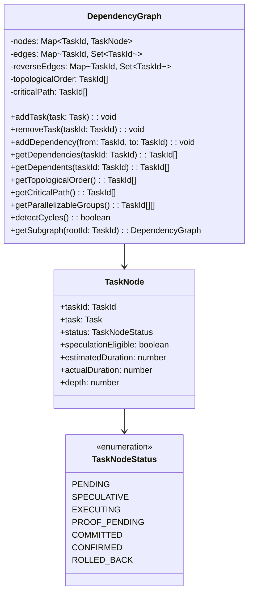
```mermaid
classDiagram
    class DependencyGraph {
        -nodes: Map~TaskId, TaskNode~
        -edges: Map~TaskId, Set~TaskId~~
        -reverseEdges: Map~TaskId, Set~TaskId~~
        -topologicalOrder: TaskId[]
        -criticalPath: TaskId[]
        +addTask(task: Task): void
        +removeTask(taskId: TaskId): void
        +addDependency(from: TaskId, to: TaskId): void
        +getDependencies(taskId: TaskId): TaskId[]
        +getDependents(taskId: TaskId): TaskId[]
        +getTopologicalOrder(): TaskId[]
        +getCriticalPath(): TaskId[]
        +getParallelizableGroups(): TaskId[][]
        +detectCycles(): boolean
        +getSubgraph(rootId: TaskId): DependencyGraph
    }
    
    class TaskNode {
        +taskId: TaskId
        +task: Task
        +status: TaskNodeStatus
        +speculationEligible: boolean
        +estimatedDuration: number
        +actualDuration: number
        +depth: number
    }
    
    class TaskNodeStatus {
        <<enumeration>>
        PENDING
        SPECULATIVE
        EXECUTING
        PROOF_PENDING
        COMMITTED
        CONFIRMED
        ROLLED_BACK
    }
    
    DependencyGraph --> TaskNode
    TaskNode --> TaskNodeStatus
```

**Key Algorithms:**

1. **Topological Sort** — Kahn's algorithm for DAG traversal
2. **Critical Path Method (CPM)** — Identify longest dependency chain
3. **Parallelization Analysis** — Group independent tasks for concurrent execution

**Example:**

```typescript
const graph = new DependencyGraph();

// Add tasks with dependencies
graph.addTask(taskA);
graph.addTask(taskB);
graph.addTask(taskC);
graph.addDependency(taskA.id, taskB.id);  // B depends on A
graph.addDependency(taskA.id, taskC.id);  // C depends on A

// Analyze
const criticalPath = graph.getCriticalPath();
// [taskA, taskB] or [taskA, taskC] depending on durations

const parallel = graph.getParallelizableGroups();
// [[taskA], [taskB, taskC]]  // B and C can run in parallel
```

---

### 6.2 ProofDeferralManager

**Purpose:** Manages the deferral and batching of ZK proof generation, optimizing for throughput while maintaining proof integrity.

**Reference:** [Issue #264](https://github.com/tetsuo-ai/AgenC/issues/264)

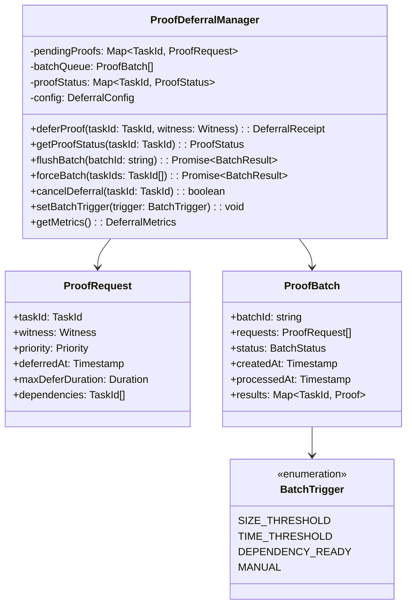
```mermaid
classDiagram
    class ProofDeferralManager {
        -pendingProofs: Map~TaskId, ProofRequest~
        -batchQueue: ProofBatch[]
        -proofStatus: Map~TaskId, ProofStatus~
        -config: DeferralConfig
        +deferProof(taskId: TaskId, witness: Witness): DeferralReceipt
        +getProofStatus(taskId: TaskId): ProofStatus
        +flushBatch(batchId: string): Promise~BatchResult~
        +forceBatch(taskIds: TaskId[]): Promise~BatchResult~
        +cancelDeferral(taskId: TaskId): boolean
        +setBatchTrigger(trigger: BatchTrigger): void
        +getMetrics(): DeferralMetrics
    }
    
    class ProofRequest {
        +taskId: TaskId
        +witness: Witness
        +priority: Priority
        +deferredAt: Timestamp
        +maxDeferDuration: Duration
        +dependencies: TaskId[]
    }
    
    class ProofBatch {
        +batchId: string
        +requests: ProofRequest[]
        +status: BatchStatus
        +createdAt: Timestamp
        +processedAt: Timestamp
        +results: Map~TaskId, Proof~
    }
    
    class BatchTrigger {
        <<enumeration>>
        SIZE_THRESHOLD
        TIME_THRESHOLD
        DEPENDENCY_READY
        MANUAL
    }
    
    ProofDeferralManager --> ProofRequest
    ProofDeferralManager --> ProofBatch
    ProofBatch --> BatchTrigger
```

**Batching Strategies:**

| Strategy | Trigger | Use Case |
|----------|---------|----------|
| **Size-based** | N proofs accumulated | High-throughput scenarios |
| **Time-based** | T milliseconds elapsed | Latency-sensitive workflows |
| **Dependency-based** | All deps confirmed | Complex DAG execution |
| **Manual** | Explicit flush call | Testing, debugging |

**Proof Lifecycle:**

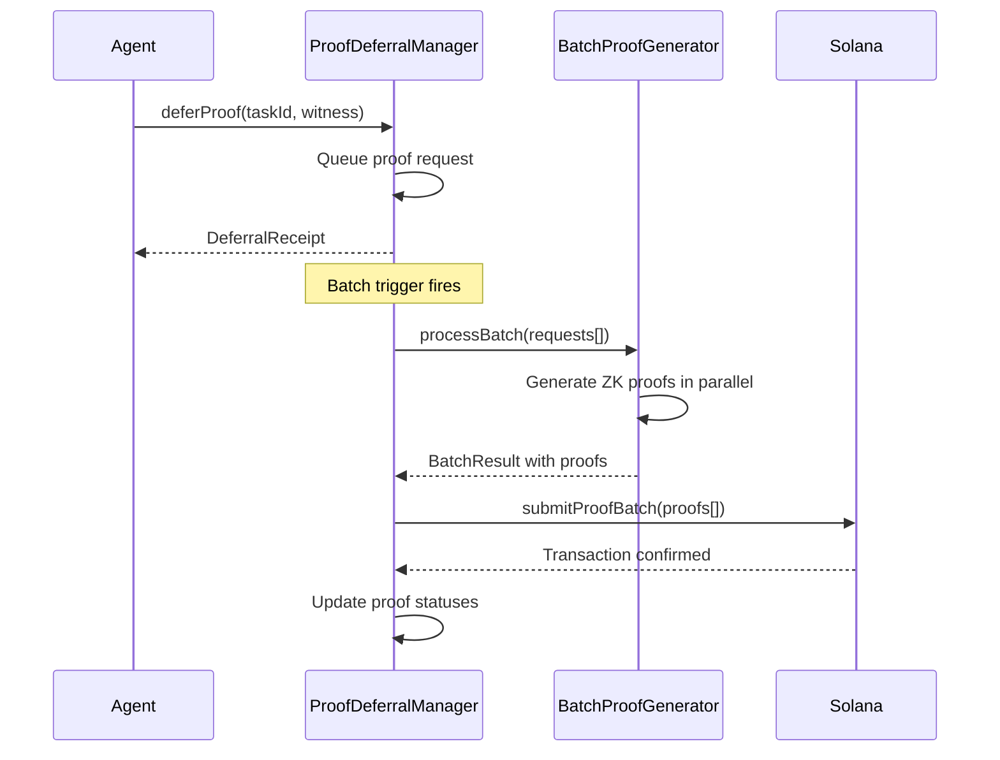
```mermaid
sequenceDiagram
    participant Agent
    participant PDM as ProofDeferralManager
    participant BPG as BatchProofGenerator
    participant Chain as Solana
    
    Agent->>PDM: deferProof(taskId, witness)
    PDM->>PDM: Queue proof request
    PDM-->>Agent: DeferralReceipt
    
    Note over PDM: Batch trigger fires
    
    PDM->>BPG: processBatch(requests[])
    BPG->>BPG: Generate ZK proofs in parallel
    BPG-->>PDM: BatchResult with proofs
    
    PDM->>Chain: submitProofBatch(proofs[])
    Chain-->>PDM: Transaction confirmed
    
    PDM->>PDM: Update proof statuses
```

---

### 6.3 CommitmentLedger

**Purpose:** Maintains an ordered, immutable record of speculative commitments, enabling audit trails and coordinated rollbacks.

**Reference:** [Issue #266](https://github.com/tetsuo-ai/AgenC/issues/266)

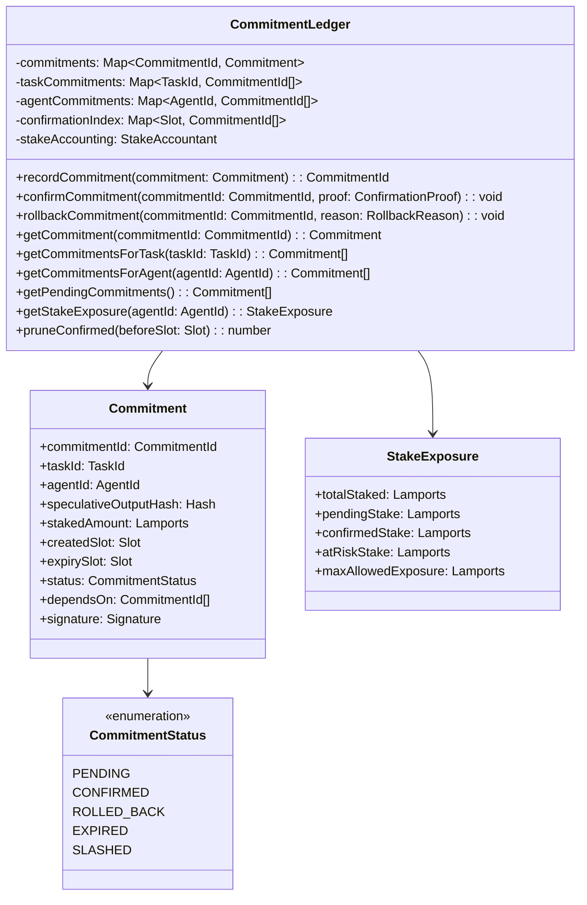
```mermaid
classDiagram
    class CommitmentLedger {
        -commitments: Map~CommitmentId, Commitment~
        -taskCommitments: Map~TaskId, CommitmentId[]~
        -agentCommitments: Map~AgentId, CommitmentId[]~
        -confirmationIndex: Map~Slot, CommitmentId[]~
        -stakeAccounting: StakeAccountant
        +recordCommitment(commitment: Commitment): CommitmentId
        +confirmCommitment(commitmentId: CommitmentId, proof: ConfirmationProof): void
        +rollbackCommitment(commitmentId: CommitmentId, reason: RollbackReason): void
        +getCommitment(commitmentId: CommitmentId): Commitment
        +getCommitmentsForTask(taskId: TaskId): Commitment[]
        +getCommitmentsForAgent(agentId: AgentId): Commitment[]
        +getPendingCommitments(): Commitment[]
        +getStakeExposure(agentId: AgentId): StakeExposure
        +pruneConfirmed(beforeSlot: Slot): number
    }
    
    class Commitment {
        +commitmentId: CommitmentId
        +taskId: TaskId
        +agentId: AgentId
        +speculativeOutputHash: Hash
        +stakedAmount: Lamports
        +createdSlot: Slot
        +expirySlot: Slot
        +status: CommitmentStatus
        +dependsOn: CommitmentId[]
        +signature: Signature
    }
    
    class CommitmentStatus {
        <<enumeration>>
        PENDING
        CONFIRMED
        ROLLED_BACK
        EXPIRED
        SLASHED
    }
    
    class StakeExposure {
        +totalStaked: Lamports
        +pendingStake: Lamports
        +confirmedStake: Lamports
        +atRiskStake: Lamports
        +maxAllowedExposure: Lamports
    }
    
    CommitmentLedger --> Commitment
    Commitment --> CommitmentStatus
    CommitmentLedger --> StakeExposure
```

**Commitment Structure:**

```
┌─────────────────────────────────────────────────────────────────┐
│                     Commitment Record                            │
├─────────────────────────────────────────────────────────────────┤
│  commitmentId: "comm_abc123..."                                  │
│  taskId: "task_xyz789..."                                        │
│  agentId: "agent_def456..."                                      │
│  speculativeOutputHash: 0x1234...                                │
│  stakedAmount: 100_000_000 lamports (0.1 SOL)                   │
│  createdSlot: 250_000_000                                        │
│  expirySlot: 250_000_500 (~3.3 minutes @ 400ms/slot)            │
│  status: PENDING                                                 │
│  dependsOn: ["comm_prev1...", "comm_prev2..."]                  │
│  signature: <agent_signature>                                    │
└─────────────────────────────────────────────────────────────────┘
```

---

### 6.4 RollbackController

**Purpose:** Coordinates the recovery process when speculative execution fails, ensuring consistent state across all components.

**Reference:** [Issue #269](https://github.com/tetsuo-ai/AgenC/issues/269)

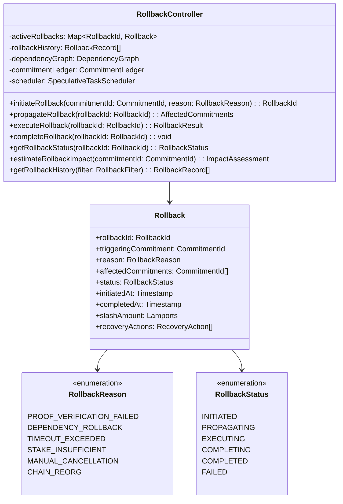
```mermaid
classDiagram
    class RollbackController {
        -activeRollbacks: Map~RollbackId, Rollback~
        -rollbackHistory: RollbackRecord[]
        -dependencyGraph: DependencyGraph
        -commitmentLedger: CommitmentLedger
        -scheduler: SpeculativeTaskScheduler
        +initiateRollback(commitmentId: CommitmentId, reason: RollbackReason): RollbackId
        +propagateRollback(rollbackId: RollbackId): AffectedCommitments
        +executeRollback(rollbackId: RollbackId): RollbackResult
        +completeRollback(rollbackId: RollbackId): void
        +getRollbackStatus(rollbackId: RollbackId): RollbackStatus
        +estimateRollbackImpact(commitmentId: CommitmentId): ImpactAssessment
        +getRollbackHistory(filter: RollbackFilter): RollbackRecord[]
    }
    
    class Rollback {
        +rollbackId: RollbackId
        +triggeringCommitment: CommitmentId
        +reason: RollbackReason
        +affectedCommitments: CommitmentId[]
        +status: RollbackStatus
        +initiatedAt: Timestamp
        +completedAt: Timestamp
        +slashAmount: Lamports
        +recoveryActions: RecoveryAction[]
    }
    
    class RollbackReason {
        <<enumeration>>
        PROOF_VERIFICATION_FAILED
        DEPENDENCY_ROLLBACK
        TIMEOUT_EXCEEDED
        STAKE_INSUFFICIENT
        MANUAL_CANCELLATION
        CHAIN_REORG
    }
    
    class RollbackStatus {
        <<enumeration>>
        INITIATED
        PROPAGATING
        EXECUTING
        COMPLETING
        COMPLETED
        FAILED
    }
    
    RollbackController --> Rollback
    Rollback --> RollbackReason
    Rollback --> RollbackStatus
```

**Rollback Propagation:**

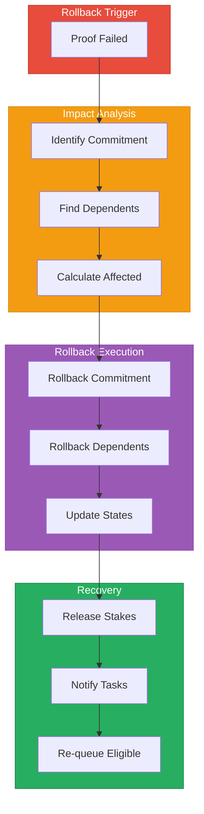
```mermaid
flowchart TB
    subgraph Trigger["Rollback Trigger"]
        PF[Proof Failed]
    end
    
    subgraph Analysis["Impact Analysis"]
        IC[Identify Commitment]
        FD[Find Dependents]
        CA[Calculate Affected]
    end
    
    subgraph Execution["Rollback Execution"]
        RC[Rollback Commitment]
        RD[Rollback Dependents]
        US[Update States]
    end
    
    subgraph Recovery["Recovery"]
        RS[Release Stakes]
        NT[Notify Tasks]
        RQ[Re-queue Eligible]
    end
    
    PF --> IC --> FD --> CA
    CA --> RC --> RD --> US
    US --> RS --> NT --> RQ
    
    style Trigger fill:#e74c3c,stroke:#c0392b,color:#fff
    style Analysis fill:#f39c12,stroke:#d68910,color:#fff
    style Execution fill:#9b59b6,stroke:#8e44ad,color:#fff
    style Recovery fill:#27ae60,stroke:#1e8449,color:#fff
```

**Cascade Rollback Example:**

```
Initial State:
  C1 (Task A) ← C2 (Task B) ← C3 (Task C)
                    ↖ C4 (Task D)
  
If C2 fails verification:
  1. C2 marked ROLLED_BACK
  2. Find dependents: C3, C4
  3. C3 marked ROLLED_BACK (depends on C2)
  4. C4 marked ROLLED_BACK (depends on C2)
  5. C1 remains CONFIRMED (independent)
  
Stake impact:
  - Agent of C2: slashed (proof failed)
  - Agents of C3, C4: stakes returned (cascade victims)
```

---

### 6.5 SpeculativeTaskScheduler

**Purpose:** Makes intelligent decisions about which tasks to execute speculatively, balancing risk against performance gains.

**Reference:** [Issue #271](https://github.com/tetsuo-ai/AgenC/issues/271)

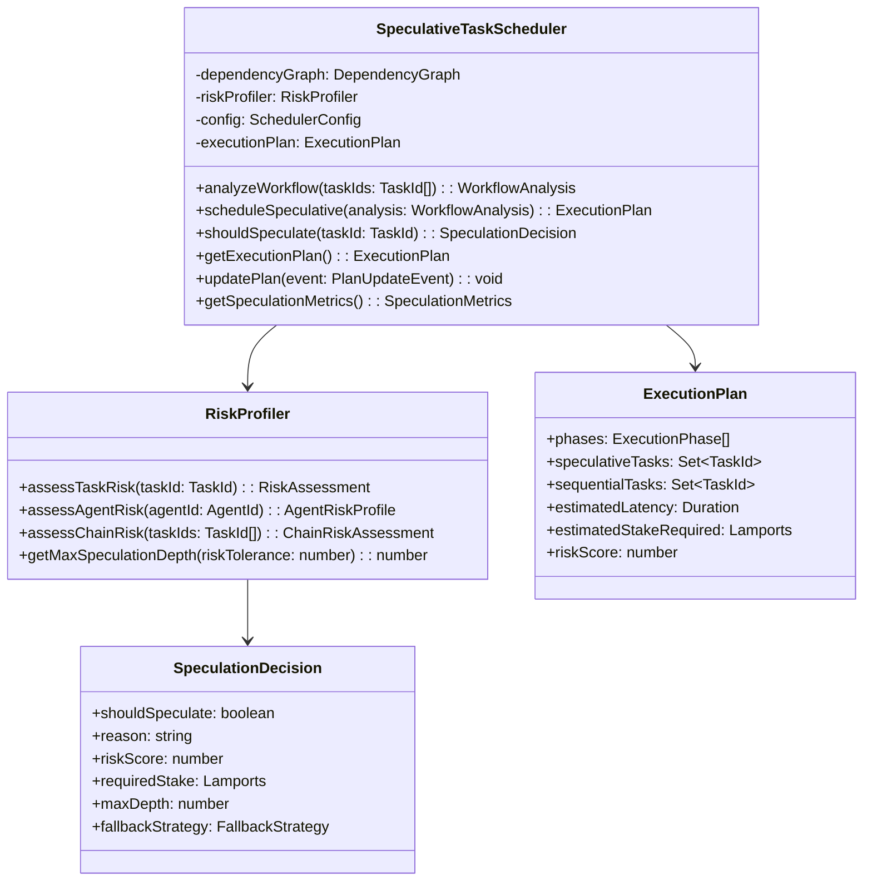
```mermaid
classDiagram
    class SpeculativeTaskScheduler {
        -dependencyGraph: DependencyGraph
        -riskProfiler: RiskProfiler
        -config: SchedulerConfig
        -executionPlan: ExecutionPlan
        +analyzeWorkflow(taskIds: TaskId[]): WorkflowAnalysis
        +scheduleSpeculative(analysis: WorkflowAnalysis): ExecutionPlan
        +shouldSpeculate(taskId: TaskId): SpeculationDecision
        +getExecutionPlan(): ExecutionPlan
        +updatePlan(event: PlanUpdateEvent): void
        +getSpeculationMetrics(): SpeculationMetrics
    }
    
    class RiskProfiler {
        +assessTaskRisk(taskId: TaskId): RiskAssessment
        +assessAgentRisk(agentId: AgentId): AgentRiskProfile
        +assessChainRisk(taskIds: TaskId[]): ChainRiskAssessment
        +getMaxSpeculationDepth(riskTolerance: number): number
    }
    
    class ExecutionPlan {
        +phases: ExecutionPhase[]
        +speculativeTasks: Set~TaskId~
        +sequentialTasks: Set~TaskId~
        +estimatedLatency: Duration
        +estimatedStakeRequired: Lamports
        +riskScore: number
    }
    
    class SpeculationDecision {
        +shouldSpeculate: boolean
        +reason: string
        +riskScore: number
        +requiredStake: Lamports
        +maxDepth: number
        +fallbackStrategy: FallbackStrategy
    }
    
    SpeculativeTaskScheduler --> RiskProfiler
    SpeculativeTaskScheduler --> ExecutionPlan
    RiskProfiler --> SpeculationDecision
```

**Speculation Decision Factors:**

| Factor | Weight | Description |
|--------|--------|-------------|
| **Dependency Depth** | 0.25 | Deeper chains benefit more from speculation |
| **Historical Success** | 0.20 | Agent's past speculation success rate |
| **Stake Ratio** | 0.20 | Stake relative to task reward |
| **Task Complexity** | 0.15 | Estimated proof generation time |
| **Chain Confidence** | 0.10 | Confidence in predecessor proofs |
| **Network Conditions** | 0.10 | Current Solana congestion |

**Decision Tree:**

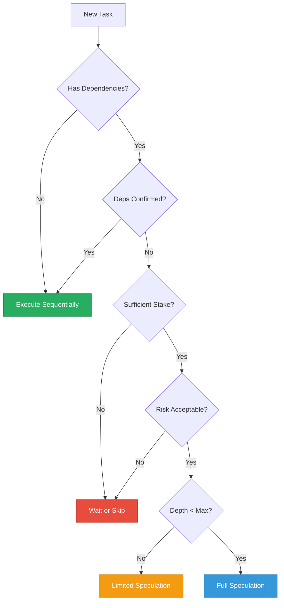
```mermaid
flowchart TB
    Start[New Task] --> HasDeps{Has Dependencies?}
    HasDeps -->|No| Sequential[Execute Sequentially]
    HasDeps -->|Yes| DepConfirmed{Deps Confirmed?}
    
    DepConfirmed -->|Yes| Sequential
    DepConfirmed -->|No| CheckStake{Sufficient Stake?}
    
    CheckStake -->|No| WaitOrSkip[Wait or Skip]
    CheckStake -->|Yes| CheckRisk{Risk Acceptable?}
    
    CheckRisk -->|No| WaitOrSkip
    CheckRisk -->|Yes| CheckDepth{Depth < Max?}
    
    CheckDepth -->|No| LimitedSpec[Limited Speculation]
    CheckDepth -->|Yes| FullSpec[Full Speculation]
    
    style Sequential fill:#27ae60,stroke:#1e8449,color:#fff
    style WaitOrSkip fill:#e74c3c,stroke:#c0392b,color:#fff
    style LimitedSpec fill:#f39c12,stroke:#d68910,color:#fff
    style FullSpec fill:#3498db,stroke:#2980b9,color:#fff
```

---

## 7. On-Chain Components

### 7.1 Account Structures

**Reference:** [Issue #273](https://github.com/tetsuo-ai/AgenC/issues/273)

#### SpeculativeCommitment Account

```rust
/// On-chain record of a speculative commitment
/// PDA seeds: ["speculative_commitment", task_id, agent_pubkey]
#[account]
pub struct SpeculativeCommitment {
    /// The task this commitment relates to
    pub task_id: [u8; 32],
    
    /// The agent making the commitment
    pub agent: Pubkey,
    
    /// Hash of the speculative output (commitment, not revealed)
    pub output_commitment: [u8; 32],
    
    /// Amount of stake bonded for this commitment
    pub bonded_stake: u64,
    
    /// Slot when commitment was created
    pub created_slot: u64,
    
    /// Slot after which commitment expires if not confirmed
    pub expiry_slot: u64,
    
    /// Commitments this depends on (max 4 for CU efficiency)
    pub dependencies: [[u8; 32]; 4],
    
    /// Number of active dependencies (0-4)
    pub dependency_count: u8,
    
    /// Current status
    pub status: SpeculativeCommitmentStatus,
    
    /// PDA bump seed
    pub bump: u8,
    
    /// Reserved for future use
    pub _reserved: [u8; 32],
}

impl SpeculativeCommitment {
    pub const SIZE: usize = 8 +    // discriminator
        32 +   // task_id
        32 +   // agent
        32 +   // output_commitment
        8 +    // bonded_stake
        8 +    // created_slot
        8 +    // expiry_slot
        128 +  // dependencies (4 * 32)
        1 +    // dependency_count
        1 +    // status
        1 +    // bump
        32;    // _reserved
    // Total: 291 bytes
}

#[derive(AnchorSerialize, AnchorDeserialize, Clone, Copy, PartialEq, Eq)]
#[repr(u8)]
pub enum SpeculativeCommitmentStatus {
    Pending = 0,      // Awaiting proof verification
    Confirmed = 1,    // Proof verified, commitment honored
    RolledBack = 2,   // Commitment invalidated
    Expired = 3,      // TTL exceeded without confirmation
    Slashed = 4,      // Agent stake slashed due to failure
}
```

#### StakeBond Account

```rust
/// Tracks stake bonded across multiple speculative commitments
/// PDA seeds: ["stake_bond", agent_pubkey]
#[account]
pub struct StakeBond {
    /// The agent whose stake this tracks
    pub agent: Pubkey,
    
    /// Total stake currently bonded across all commitments
    pub total_bonded: u64,
    
    /// Maximum allowed bonded stake (set by agent)
    pub max_exposure: u64,
    
    /// Number of active commitments
    pub active_commitment_count: u32,
    
    /// Cumulative amount slashed historically
    pub total_slashed: u64,
    
    /// Cumulative successful confirmations
    pub successful_confirmations: u64,
    
    /// Last slot stake was modified
    pub last_modified_slot: u64,
    
    /// PDA bump seed
    pub bump: u8,
    
    /// Reserved for future use
    pub _reserved: [u8; 31],
}

impl StakeBond {
    pub const SIZE: usize = 8 +    // discriminator
        32 +   // agent
        8 +    // total_bonded
        8 +    // max_exposure
        4 +    // active_commitment_count
        8 +    // total_slashed
        8 +    // successful_confirmations
        8 +    // last_modified_slot
        1 +    // bump
        31;    // _reserved
    // Total: 116 bytes
}
```

#### SpeculationConfig Account

```rust
/// Protocol-level configuration for speculative execution
/// PDA seeds: ["speculation_config"]
#[account]
pub struct SpeculationConfig {
    /// Authority that can update config
    pub authority: Pubkey,
    
    /// Minimum stake required per speculative commitment (lamports)
    pub min_commitment_stake: u64,
    
    /// Maximum speculation depth (dependency chain length)
    pub max_speculation_depth: u8,
    
    /// Default TTL for commitments (slots)
    pub default_commitment_ttl: u64,
    
    /// Slash percentage for failed proofs (basis points, 0-10000)
    pub slash_rate_bps: u16,
    
    /// Whether speculation is globally enabled
    pub speculation_enabled: bool,
    
    /// Minimum agent reputation score to speculate (0-100)
    pub min_reputation_score: u8,
    
    /// Protocol fee on speculative rewards (basis points)
    pub speculation_fee_bps: u16,
    
    /// PDA bump seed
    pub bump: u8,
    
    /// Reserved for future use
    pub _reserved: [u8; 32],
}

impl SpeculationConfig {
    pub const SIZE: usize = 8 +    // discriminator
        32 +   // authority
        8 +    // min_commitment_stake
        1 +    // max_speculation_depth
        8 +    // default_commitment_ttl
        2 +    // slash_rate_bps
        1 +    // speculation_enabled
        1 +    // min_reputation_score
        2 +    // speculation_fee_bps
        1 +    // bump
        32;    // _reserved
    // Total: 96 bytes
}
```

### 7.2 Instructions

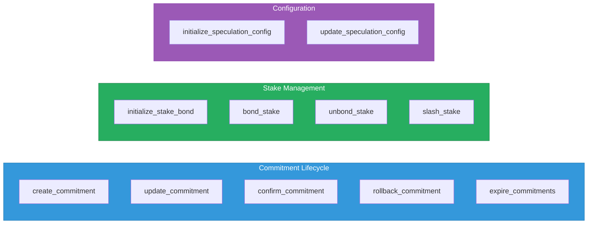
```mermaid
flowchart LR
    subgraph Create["Commitment Lifecycle"]
        CC[create_commitment]
        UC[update_commitment]
        CF[confirm_commitment]
        RB[rollback_commitment]
        EC[expire_commitments]
    end
    
    subgraph Stake["Stake Management"]
        ISB[initialize_stake_bond]
        BS[bond_stake]
        US[unbond_stake]
        SS[slash_stake]
    end
    
    subgraph Config["Configuration"]
        ISC[initialize_speculation_config]
        USC[update_speculation_config]
    end
    
    style Create fill:#3498db,stroke:#2980b9,color:#fff
    style Stake fill:#27ae60,stroke:#1e8449,color:#fff
    style Config fill:#9b59b6,stroke:#8e44ad,color:#fff
```

| Instruction | Description | CU Estimate |
|-------------|-------------|-------------|
| `create_commitment` | Create a new speculative commitment | ~25,000 |
| `confirm_commitment` | Confirm commitment after proof verification | ~15,000 |
| `rollback_commitment` | Rollback a failed commitment | ~20,000 |
| `expire_commitments` | Batch expire stale commitments (cranked) | ~50,000 |
| `initialize_stake_bond` | Initialize stake tracking for agent | ~10,000 |
| `bond_stake` | Bond additional stake | ~8,000 |
| `unbond_stake` | Unbond stake (with delay) | ~8,000 |
| `slash_stake` | Slash stake on failure | ~12,000 |
| `initialize_speculation_config` | One-time config setup | ~15,000 |
| `update_speculation_config` | Modify config parameters | ~10,000 |

### 7.3 Stake Bonding Model

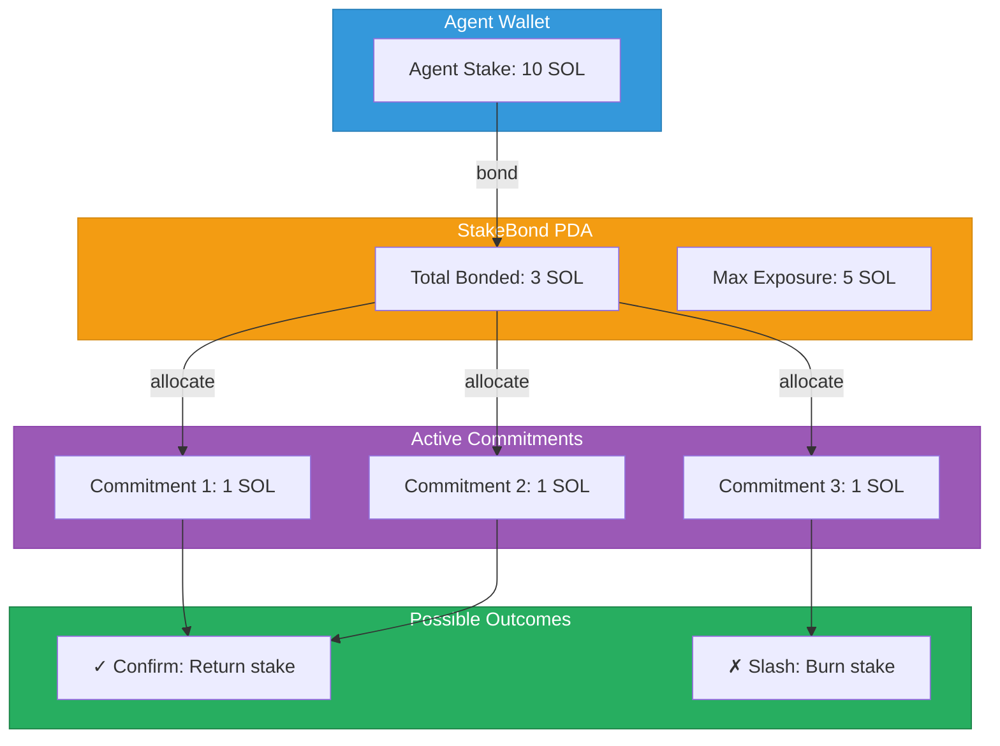
```mermaid
flowchart TB
    subgraph Agent["Agent Wallet"]
        AW[Agent Stake: 10 SOL]
    end
    
    subgraph Bond["StakeBond PDA"]
        TB[Total Bonded: 3 SOL]
        ME[Max Exposure: 5 SOL]
    end
    
    subgraph Commitments["Active Commitments"]
        C1[Commitment 1: 1 SOL]
        C2[Commitment 2: 1 SOL]
        C3[Commitment 3: 1 SOL]
    end
    
    subgraph Outcomes["Possible Outcomes"]
        direction LR
        SC[✓ Confirm: Return stake]
        SL[✗ Slash: Burn stake]
    end
    
    AW -->|bond| TB
    TB -->|allocate| C1
    TB -->|allocate| C2
    TB -->|allocate| C3
    
    C1 --> SC
    C2 --> SC
    C3 --> SL
    
    style Agent fill:#3498db,stroke:#2980b9,color:#fff
    style Bond fill:#f39c12,stroke:#d68910,color:#fff
    style Commitments fill:#9b59b6,stroke:#8e44ad,color:#fff
    style Outcomes fill:#27ae60,stroke:#1e8449,color:#fff
```

**Stake Bonding Rules:**

1. **Minimum Stake**: Each commitment requires `min_commitment_stake` (configurable, default 0.1 SOL)
2. **Exposure Limit**: Agent cannot bond more than their `max_exposure` setting
3. **Proportional Stake**: Higher reward tasks require proportionally higher stake
4. **Slash Rate**: Failed proofs result in `slash_rate_bps / 10000` of bonded stake being burned
5. **Unbonding Delay**: Stake cannot be withdrawn for `unbonding_period` slots after last commitment

---

## 8. Data Flow

### 8.1 End-to-End Flow

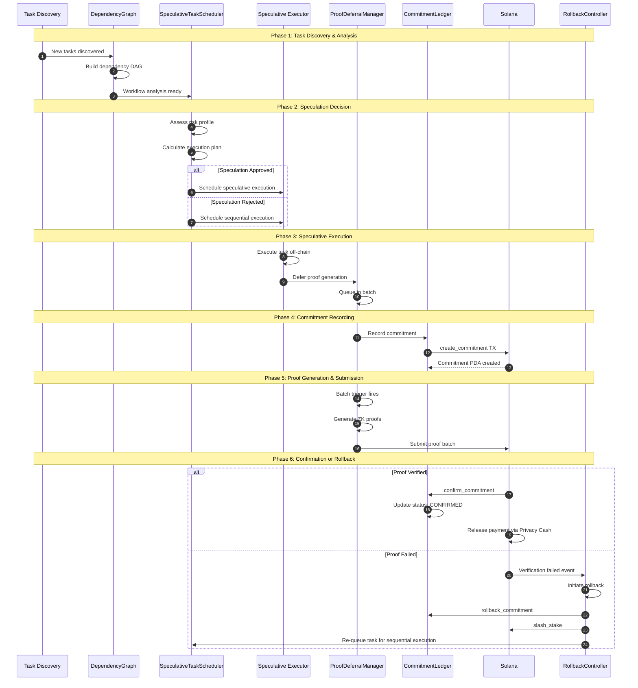
```mermaid
sequenceDiagram
    autonumber
    participant TD as Task Discovery
    participant DG as DependencyGraph
    participant STS as SpeculativeTaskScheduler
    participant SE as Speculative Executor
    participant PDM as ProofDeferralManager
    participant CL as CommitmentLedger
    participant Chain as Solana
    participant RC as RollbackController
    
    Note over TD,RC: Phase 1: Task Discovery & Analysis
    TD->>DG: New tasks discovered
    DG->>DG: Build dependency DAG
    DG->>STS: Workflow analysis ready
    
    Note over TD,RC: Phase 2: Speculation Decision
    STS->>STS: Assess risk profile
    STS->>STS: Calculate execution plan
    
    alt Speculation Approved
        STS->>SE: Schedule speculative execution
    else Speculation Rejected
        STS->>SE: Schedule sequential execution
    end
    
    Note over TD,RC: Phase 3: Speculative Execution
    SE->>SE: Execute task off-chain
    SE->>PDM: Defer proof generation
    PDM->>PDM: Queue in batch
    
    Note over TD,RC: Phase 4: Commitment Recording
    PDM->>CL: Record commitment
    CL->>Chain: create_commitment TX
    Chain-->>CL: Commitment PDA created
    
    Note over TD,RC: Phase 5: Proof Generation & Submission
    PDM->>PDM: Batch trigger fires
    PDM->>PDM: Generate ZK proofs
    PDM->>Chain: Submit proof batch
    
    Note over TD,RC: Phase 6: Confirmation or Rollback
    alt Proof Verified
        Chain->>CL: confirm_commitment
        CL->>CL: Update status: CONFIRMED
        Chain->>Chain: Release payment via Privacy Cash
    else Proof Failed
        Chain->>RC: Verification failed event
        RC->>RC: Initiate rollback
        RC->>CL: rollback_commitment
        RC->>Chain: slash_stake
        RC->>STS: Re-queue task for sequential execution
    end
```

### 8.2 Detailed Phase Breakdown

#### Phase 1: Task Discovery → Speculation Decision

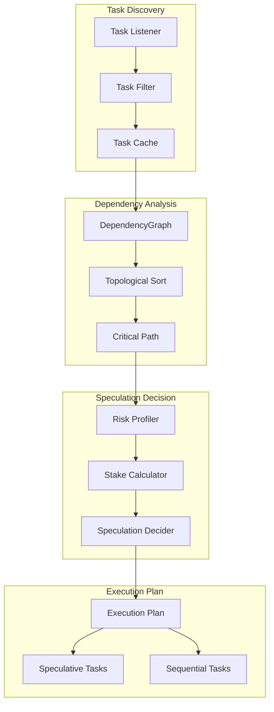
```mermaid
flowchart TB
    subgraph Discovery["Task Discovery"]
        TL[Task Listener]
        TF[Task Filter]
        TC[Task Cache]
    end
    
    subgraph Analysis["Dependency Analysis"]
        DG[DependencyGraph]
        TP[Topological Sort]
        CP[Critical Path]
    end
    
    subgraph Decision["Speculation Decision"]
        RP[Risk Profiler]
        SC[Stake Calculator]
        SD[Speculation Decider]
    end
    
    subgraph Output["Execution Plan"]
        EP[Execution Plan]
        ST[Speculative Tasks]
        SQ[Sequential Tasks]
    end
    
    TL --> TF --> TC
    TC --> DG
    DG --> TP --> CP
    CP --> RP
    RP --> SC --> SD
    SD --> EP
    EP --> ST
    EP --> SQ
```

#### Phase 2: Execution → Proof

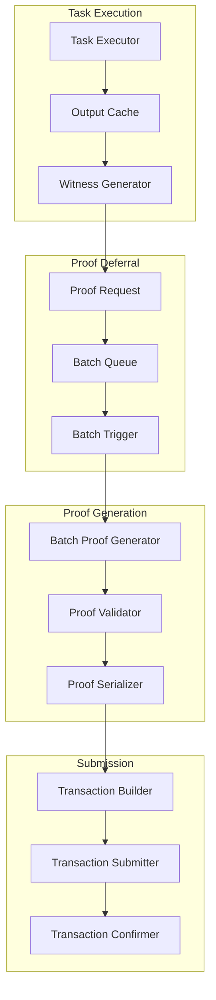
```mermaid
flowchart TB
    subgraph Execution["Task Execution"]
        TE[Task Executor]
        OC[Output Cache]
        WG[Witness Generator]
    end
    
    subgraph Deferral["Proof Deferral"]
        PR[Proof Request]
        BQ[Batch Queue]
        BT[Batch Trigger]
    end
    
    subgraph ProofGen["Proof Generation"]
        BPG[Batch Proof Generator]
        PV[Proof Validator]
        PS[Proof Serializer]
    end
    
    subgraph Submit["Submission"]
        TB[Transaction Builder]
        TS[Transaction Submitter]
        TC[Transaction Confirmer]
    end
    
    TE --> OC --> WG
    WG --> PR --> BQ
    BQ --> BT --> BPG
    BPG --> PV --> PS
    PS --> TB --> TS --> TC
```

#### Phase 3: Confirmation / Rollback

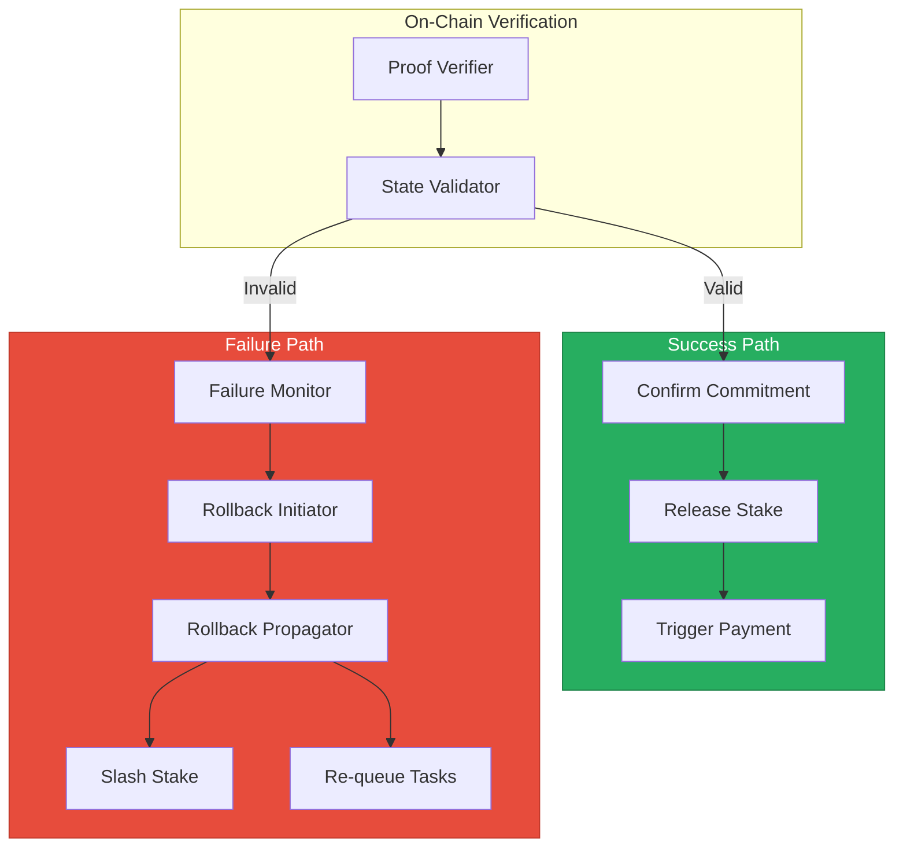
```mermaid
flowchart TB
    subgraph Verification["On-Chain Verification"]
        PV[Proof Verifier]
        SV[State Validator]
    end
    
    subgraph Success["Success Path"]
        CC[Confirm Commitment]
        RS[Release Stake]
        TP[Trigger Payment]
    end
    
    subgraph Failure["Failure Path"]
        FM[Failure Monitor]
        RI[Rollback Initiator]
        RP[Rollback Propagator]
        SS[Slash Stake]
        RQ[Re-queue Tasks]
    end
    
    PV --> SV
    
    SV -->|Valid| CC --> RS --> TP
    SV -->|Invalid| FM --> RI --> RP
    RP --> SS
    RP --> RQ
    
    style Success fill:#27ae60,stroke:#1e8449,color:#fff
    style Failure fill:#e74c3c,stroke:#c0392b,color:#fff
```

---

## 9. Security Considerations

**Reference:** [Issue #275](https://github.com/tetsuo-ai/AgenC/issues/275)

### 9.1 Threat Model

| Threat | Attack Vector | Mitigation |
|--------|---------------|------------|
| **Free Option Attack** | Agent speculates, abandons if unfavorable | Stake bonding with slash on abandonment |
| **Cascade Amplification** | Intentionally fail to cause max cascade | Cascade victims not slashed, only trigger agent |
| **Stake Drain** | Repeatedly speculate to drain competitors | Rate limiting, minimum stake proportional to reward |
| **Front-running** | MEV bot front-runs proof submission | Commit-reveal scheme with output commitment |
| **Proof Replay** | Reuse old proof for new commitment | Task ID and slot binding in proof |
| **State Manipulation** | Manipulate dependency graph | On-chain verification of all dependencies |
| **Griefing** | Create many commitments to waste resources | Minimum stake requirement, cleanup fees |

### 9.2 Economic Security

```mermaid
flowchart TB
    subgraph Honest["Honest Agent Incentives"]
        HE[Execute Task Correctly]
        HG[Generate Valid Proof]
        HR[Receive Reward + Stake Return]
        HP[Net Profit: Reward - Gas]
    end
    
    subgraph Dishonest["Dishonest Agent Incentives"]
        DE[Execute Task Incorrectly]
        DG[Generate Invalid Proof]
        DS[Stake Slashed]
        DP[Net Loss: -Stake - Gas]
    end
    
    HE --> HG --> HR --> HP
    DE --> DG --> DS --> DP
    
    style Honest fill:#27ae60,stroke:#1e8449,color:#fff
    style Dishonest fill:#e74c3c,stroke:#c0392b,color:#fff
```

**Economic Invariants:**

1. `stake_required >= reward * risk_factor` — Stake must exceed potential gain from cheating
2. `slash_amount > gas_cost` — Slashing must hurt more than attack costs
3. `cascade_slash = 0` for victims — Only trigger agent pays
4. `min_stake > dust_threshold` — Prevent spam attacks

### 9.3 Privacy Preservation

Speculative execution must NOT leak:

- **Task outputs** — Only commitment hash exposed, not actual output
- **Proof witness** — ZK proof reveals nothing about private inputs
- **Payment linkage** — Privacy Cash maintains payment unlinkability
- **Agent identity** — On-chain pseudonymity preserved

**Privacy Audit Checklist:**

- [ ] Output commitment uses cryptographically secure hash
- [ ] Commitment does not reveal output entropy
- [ ] Proof batching does not leak individual proof data
- [ ] Rollback events do not expose task results
- [ ] Stake bond amounts do not correlate to task values

### 9.4 Smart Contract Security

**Anchor Security Patterns Applied:**

1. **Signer checks** — All mutations require authorized signer
2. **PDA validation** — Seeds verified on every access
3. **Overflow protection** — All arithmetic uses checked operations
4. **Reentrancy guards** — State updated before external calls
5. **Access control** — Role-based permissions for admin functions

**Critical Invariants:**

```rust
// Commitment can only be confirmed with valid proof
require!(
    verify_groth16_proof(&commitment.output_commitment, &proof),
    SpeculationError::InvalidProof
);

// Slashing cannot exceed bonded amount
require!(
    slash_amount <= stake_bond.total_bonded,
    SpeculationError::InsufficientStake
);

// Commitment cannot be modified after confirmation
require!(
    commitment.status == SpeculativeCommitmentStatus::Pending,
    SpeculationError::CommitmentFinalized
);
```

---

## 10. Performance Considerations

**Reference:** [Issue #278](https://github.com/tetsuo-ai/AgenC/issues/278)

### 10.1 Latency Budget

| Operation | Target | Max | Notes |
|-----------|--------|-----|-------|
| Dependency graph construction | <10ms | 50ms | In-memory, no I/O |
| Speculation decision | <5ms | 20ms | Cached risk profiles |
| Commitment creation TX | 400ms | 2000ms | Solana finality |
| Batch proof generation | 2000ms | 10000ms | Parallelized |
| Commitment confirmation TX | 400ms | 2000ms | Solana finality |

### 10.2 Throughput Targets

| Metric | Target | Sustained | Notes |
|--------|--------|-----------|-------|
| Commitments per second | 50 | 30 | Per agent |
| Concurrent speculative tasks | 100 | 50 | Per agent |
| Batch size | 20 proofs | 50 proofs | Per batch |
| Rollback propagation | <100ms | <500ms | For 10-deep cascade |

### 10.3 Resource Utilization

**Compute Units:**

| Operation | CU Cost | Limit | Utilization |
|-----------|---------|-------|-------------|
| `create_commitment` | 25,000 | 200,000 | 12.5% |
| `confirm_commitment` | 15,000 | 200,000 | 7.5% |
| `rollback_commitment` | 20,000 | 200,000 | 10% |
| Batch of 10 | 150,000 | 200,000 | 75% |

**Memory:**

| Component | Memory | Notes |
|-----------|--------|-------|
| DependencyGraph (1000 tasks) | ~2 MB | Adjacency list |
| CommitmentLedger (1000 entries) | ~500 KB | Indexed maps |
| ProofDeferralManager queue | ~1 MB | Bounded queue |

### 10.4 Optimization Strategies

1. **Batch Transactions** — Group multiple commitment operations into single TX
2. **Lazy Proof Generation** — Defer proof gen until batch threshold
3. **Parallel Proof Generation** — Generate multiple proofs concurrently
4. **Commitment Pruning** — Remove confirmed commitments after grace period
5. **Hot Path Optimization** — Keep critical path tasks in memory cache

```mermaid
gantt
    title Parallel Execution Timeline (5-task chain)
    dateFormat X
    axisFormat %L ms
    
    section Sequential
    Task 1 Exec      :a1, 0, 500
    Task 1 Proof     :a2, after a1, 2000
    Task 1 Confirm   :a3, after a2, 400
    Task 2 Exec      :b1, after a3, 500
    Task 2 Proof     :b2, after b1, 2000
    Task 2 Confirm   :b3, after b2, 400
    
    section Speculative
    Task 1 Exec      :c1, 0, 500
    Task 2-5 Exec    :c2, after c1, 500
    All Proofs       :c3, after c2, 2000
    Batch Confirm    :c4, after c3, 400
```

---

## 11. Failure Modes and Recovery

### 11.1 Failure Classification

| Category | Severity | Recovery | Example |
|----------|----------|----------|---------|
| **Transient** | Low | Auto-retry | Network timeout, rate limit |
| **Recoverable** | Medium | Rollback + retry | Proof verification fail |
| **Permanent** | High | Rollback + alert | Invalid task state |
| **Critical** | Critical | Circuit breaker | Chain reorg, contract bug |

### 11.2 Failure Scenarios

#### Scenario 1: Proof Verification Failure

```mermaid
sequenceDiagram
    participant A as Agent
    participant P as ProofDeferralManager
    participant C as Chain
    participant R as RollbackController
    
    A->>P: Submit proof
    P->>C: verify_proof TX
    C-->>P: Verification FAILED
    P->>R: Notify failure
    R->>R: Identify cascade impact
    R->>C: rollback_commitment TX
    R->>C: slash_stake TX
    R->>A: Notify: task re-queued
    
    Note over A,R: Agent can retry sequentially
```

#### Scenario 2: Commitment Timeout

```mermaid
sequenceDiagram
    participant Crank as Crank Bot
    participant C as Chain
    participant R as RollbackController
    participant A as Agent
    
    Note over Crank,A: Commitment exceeds TTL
    
    Crank->>C: expire_commitments TX
    C->>C: Mark expired commitments
    C-->>R: ExpiredCommitment events
    R->>R: Process expirations
    R->>A: Notify: commitment expired
    
    Note over A: Stake returned (no slash for timeout)
```

#### Scenario 3: Cascade Rollback

```mermaid
sequenceDiagram
    participant C1 as Commitment 1
    participant C2 as Commitment 2 (depends on C1)
    participant C3 as Commitment 3 (depends on C2)
    participant R as RollbackController
    participant S as StakeBond
    
    Note over C1,S: C1 proof fails
    
    C1->>R: Rollback initiated
    R->>C1: Mark ROLLED_BACK
    R->>S: Slash C1 agent stake
    
    R->>R: Find dependents of C1
    R->>C2: Mark ROLLED_BACK (cascade)
    R->>S: Return C2 agent stake (victim)
    
    R->>R: Find dependents of C2
    R->>C3: Mark ROLLED_BACK (cascade)
    R->>S: Return C3 agent stake (victim)
    
    Note over C1,S: Only C1 agent slashed
```

### 11.3 Recovery Procedures

**Automatic Recovery:**

| Trigger | Action | Timeout |
|---------|--------|---------|
| TX timeout | Retry with higher priority fee | 3 attempts |
| Rate limit | Exponential backoff | 30s max |
| Proof gen failure | Retry with fresh witness | 2 attempts |

**Manual Recovery:**

| Trigger | Action | Escalation |
|---------|--------|------------|
| Contract error | Pause speculation, investigate | Page on-call |
| Repeated failures | Circuit breaker activation | Page on-call |
| Stake discrepancy | Freeze affected accounts | Security team |

### 11.4 Circuit Breaker

```mermaid
stateDiagram-v2
    [*] --> Closed: Normal operation
    
    Closed --> Open: Failure threshold exceeded
    Open --> HalfOpen: Cooldown elapsed
    HalfOpen --> Closed: Probe successful
    HalfOpen --> Open: Probe failed
    
    note right of Open: All speculation disabled
    note right of HalfOpen: Limited speculation allowed
```

**Circuit Breaker Thresholds:**

| Metric | Threshold | Window |
|--------|-----------|--------|
| Consecutive failures | 5 | N/A |
| Failure rate | >20% | 5 minutes |
| Cascade depth | >10 | Single cascade |
| Slash amount | >10 SOL | 1 hour |

---

## 12. Configuration Options

**Reference:** [Issue #285](https://github.com/tetsuo-ai/AgenC/issues/285)

### 12.1 Protocol-Level Configuration

Stored in `SpeculationConfig` PDA, modifiable by protocol authority:

| Parameter | Type | Default | Range | Description |
|-----------|------|---------|-------|-------------|
| `speculation_enabled` | bool | true | - | Global speculation toggle |
| `min_commitment_stake` | u64 | 100_000_000 | 1M - 10B | Min stake per commitment (lamports) |
| `max_speculation_depth` | u8 | 5 | 1-10 | Max dependency chain depth |
| `default_commitment_ttl` | u64 | 500 | 100-2000 | Commitment TTL (slots) |
| `slash_rate_bps` | u16 | 1000 | 0-5000 | Slash rate (10% default) |
| `min_reputation_score` | u8 | 50 | 0-100 | Min reputation to speculate |
| `speculation_fee_bps` | u16 | 50 | 0-500 | Protocol fee on speculative rewards |

### 12.2 Agent-Level Configuration

Stored in `StakeBond` PDA, modifiable by agent:

| Parameter | Type | Default | Range | Description |
|-----------|------|---------|-------|-------------|
| `max_exposure` | u64 | 1_000_000_000 | 0 - agent stake | Max total bonded stake |
| `auto_speculate` | bool | false | - | Auto-accept speculation opportunities |
| `risk_tolerance` | u8 | 50 | 0-100 | Risk appetite (affects decisions) |
| `min_reward_threshold` | u64 | 10_000_000 | 0 - ∞ | Min reward to consider speculation |

### 12.3 Task-Level Configuration

Specified at task creation:

| Parameter | Type | Default | Description |
|-----------|------|---------|-------------|
| `speculation_allowed` | bool | true | Whether task can be speculatively executed |
| `max_speculation_depth` | u8 | 3 | Max depth this task can participate in |
| `speculation_bonus_bps` | u16 | 0 | Extra reward for successful speculation |

### 12.4 SDK Configuration

```typescript
interface SpeculationConfig {
  // Scheduling
  batchSize: number;              // Default: 10
  batchTimeoutMs: number;         // Default: 5000
  maxConcurrentSpeculations: number; // Default: 20
  
  // Risk
  defaultRiskTolerance: number;   // Default: 0.5 (0-1)
  maxChainDepth: number;          // Default: 5
  
  // Proof generation
  proofGenerationTimeoutMs: number; // Default: 30000
  parallelProofWorkers: number;   // Default: 4
  
  // Recovery
  maxRetries: number;             // Default: 3
  retryBackoffMs: number;         // Default: 1000
  circuitBreakerThreshold: number; // Default: 5
  
  // Observability
  metricsEnabled: boolean;        // Default: true
  traceEnabled: boolean;          // Default: false
}
```

### 12.5 Environment Variables

```bash
# Core settings
AGENC_SPECULATION_ENABLED=true
AGENC_MAX_SPECULATION_DEPTH=5
AGENC_DEFAULT_RISK_TOLERANCE=50

# Performance tuning
AGENC_BATCH_SIZE=10
AGENC_BATCH_TIMEOUT_MS=5000
AGENC_PROOF_WORKERS=4

# Recovery
AGENC_CIRCUIT_BREAKER_ENABLED=true
AGENC_CIRCUIT_BREAKER_THRESHOLD=5
AGENC_MAX_RETRIES=3

# Observability
AGENC_METRICS_ENDPOINT=http://localhost:9090
AGENC_TRACE_ENDPOINT=http://localhost:4317
```

---

## 13. Future Enhancements

### 13.1 Short-Term (v1.1)

| Enhancement | Priority | Description |
|-------------|----------|-------------|
| Adaptive batch sizing | P1 | Dynamically adjust batch size based on network conditions |
| Reputation scoring | P1 | Track agent speculation success rate |
| Speculation insurance | P2 | Optional insurance pool for cascade victims |
| Multi-proof batching | P2 | Combine proofs from multiple agents in single TX |

### 13.2 Medium-Term (v2.0)

| Enhancement | Priority | Description |
|-------------|----------|-------------|
| Cross-agent speculation | P1 | Multiple agents collaborating on speculative chain |
| Partial speculation | P1 | Speculate on subset of task outputs |
| Speculation markets | P2 | Prediction market for speculation outcomes |
| ML-based risk profiling | P2 | Machine learning for risk assessment |

### 13.3 Long-Term (v3.0)

| Enhancement | Priority | Description |
|-------------|----------|-------------|
| Cross-chain speculation | P2 | Speculation across multiple blockchains |
| Hardware attestation | P3 | TEE-based execution for trusted speculation |
| Recursive speculation | P3 | Speculate on speculation outcomes |

### 13.4 Research Areas

- **Optimistic rollups integration** — Leverage L2 for cheaper speculation
- **Verifiable delay functions** — Time-locked speculation reveals
- **Multi-party computation** — Distributed speculative execution
- **Formal verification** — Prove speculation invariants

---

## 14. Glossary

| Term | Definition |
|------|------------|
| **Commitment** | A cryptographic binding to a speculative task output, backed by stake |
| **Confirmation** | On-chain verification that a speculative commitment's proof is valid |
| **Critical Path** | The longest dependency chain in a task workflow |
| **Cascade Rollback** | When one failed commitment causes dependent commitments to also fail |
| **Dependency Graph** | A DAG representing task dependencies |
| **Free Option Problem** | The risk that agents speculate without commitment to completion |
| **Output Commitment** | A hash of the speculative task output (commitment scheme) |
| **Proof Deferral** | Delaying ZK proof generation to enable batching |
| **Rollback** | The process of invalidating a failed speculative commitment |
| **Slash** | Burning a portion of an agent's stake as penalty |
| **Speculation Depth** | The number of unconfirmed commitments in a dependency chain |
| **Speculative Execution** | Executing dependent tasks before prerequisites are confirmed |
| **Stake Bond** | Collateral locked by an agent to back speculative commitments |
| **TTL (Time-To-Live)** | Maximum time a commitment can remain pending before expiration |
| **Witness** | Private inputs to a ZK circuit |

---

## Appendix A: Related Documents

- [DependencyGraph Design](./api/DEPENDENCY_GRAPH.md)
- [ProofDeferralManager Design](./api/PROOF_DEFERRAL.md)
- [CommitmentLedger Design](./api/COMMITMENT_LEDGER.md)
- [RollbackController Design](./api/ROLLBACK_CONTROLLER.md)
- [SpeculativeTaskScheduler Design](./api/SCHEDULER.md)
- [On-Chain Components Specification](./api/ON_CHAIN.md)
- [Security Model](./operations/SECURITY.md)
- [Testing Strategy](./testing/TEST_PLAN.md)
- [Operations Runbook](./operations/RUNBOOK.md)

---

## Appendix B: Change Log

| Version | Date | Author | Changes |
|---------|------|--------|---------|
| 1.0.0 | 2025-01-28 | AgenC Core Team | Initial architecture document |

---

## Appendix C: Reviewers

- [ ] Protocol Lead
- [ ] Security Team
- [ ] SDK Team
- [ ] DevOps Team
- [ ] External Auditor

---

*This document is the authoritative reference for AgenC Speculative Execution architecture. All implementation must conform to the specifications herein.*
