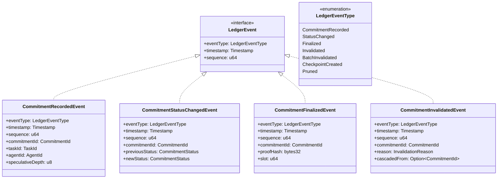
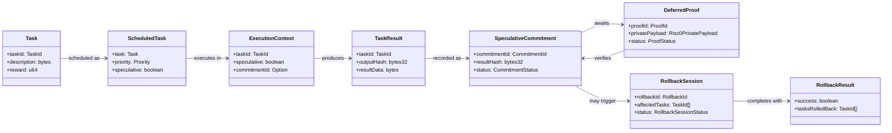

# AgenC Speculative Execution - UML Class Diagrams

Comprehensive class diagrams for the speculative execution subsystem, enabling deferred proof verification with rollback capability.

---

## Table of Contents

1. [System Overview](#1-system-overview)
2. [Core Runtime Classes](#2-core-runtime-classes)
3. [Data Types & Enums](#3-data-types--enums)
4. [Events & Callbacks](#4-events--callbacks)
5. [Full System Relationships](#5-full-system-relationships)

---

## 1. System Overview

High-level view of component relationships in the speculative execution system.


---

## 2. Core Runtime Classes

### 2.1 DependencyGraph

Manages task dependency relationships for speculative execution ordering and rollback traversal.


### 2.2 ProofDeferralManager

Manages the lifecycle of deferred proofs from submission through verification or timeout.


### 2.3 CommitmentLedger

On-chain storage for speculative commitments with query and mutation operations.


### 2.4 RollbackController

Handles failure recovery by traversing dependency graph and aborting affected speculative executions.


### 2.5 SpeculativeTaskScheduler

Main orchestrator that coordinates speculative execution decisions and manages the overall flow.


### 2.6 Supporting Classes (Strategy & Risk)


---

## 3. Data Types & Enums

### 3.1 Core Data Structures


### 3.2 All Enumerations

```mermaid
classDiagram
    class CommitmentStatus {
        <<enumeration>>
        Pending
        Active
        AwaitingProof
        Verified
        Finalized
        Invalidated
        Expired
        RolledBack
    }
    
    class ProofStatus {
        <<enumeration>>
        Submitted
        Queued
        Deferred
        Verifying
        Verified
        Failed
        Expired
        Cancelled
    }
    
    class RollbackReason {
        <<enumeration>>
        ProofVerificationFailed
        ProofTimeout
        DependencyFailed
        ManualCancellation
        ResourceExhausted
        CircuitError
        InvalidState
        Cascading
        PolicyViolation
    }
    
    class DependencyType {
        <<enumeration>>
        DataFlow
        Temporal
        Resource
        Causal
        Conditional
    }
    
    class Priority {
        <<enumeration>>
        Critical
        High
        Normal
        Low
        Background
    }
    
    class VerificationType {
        <<enumeration>>
        Groth16
        Plonk
        Stark
        Fflonk
        Custom
    }
    
    class ProofType {
        <<enumeration>>
        TaskCompletion
        StateTransition
        Aggregated
        Recursive
        Custom
    }
    
    class InvalidationReason {
        <<enumeration>>
        ProofFailed
        DependencyInvalidated
        Timeout
        ManualInvalidation
        DoubleSpend
        StateConflict
    }
    
    class CancellationReason {
        <<enumeration>>
        UserRequested
        Timeout
        DependencyFailed
        ResourceUnavailable
        PolicyViolation
    }
    
    class DeferralReason {
        <<enumeration>>
        QueueFull
        ResourceConstrained
        LowPriority
        BatchPending
        ManualDefer
    }
    
    class DecisionReason {
        <<enumeration>>
        DependenciesVerified
        HighConfidence
        LowRisk
        ResourceAvailable
        DeadlinePressure
        DependenciesPending
        HighRisk
        ResourceConstrained
        HistoricalFailures
        PolicyRestriction
    }
```



### 3.3 Identity & Reference Types


---

## 4. Events & Callbacks

### 4.1 Event Interfaces


### 4.2 Proof Events


### 4.3 Ledger Events



### 4.4 Rollback Events


### 4.5 Callback Signatures


---

## 5. Full System Relationships

### 5.1 Complete Component Relationships


### 5.2 Data Flow Relationships



### 5.3 Interface Implementations


### 5.4 Error Types


---

## Appendix: Quick Reference

### Type Aliases

| Alias | Underlying Type | Description |
|-------|-----------------|-------------|
| `TaskId` | `[u8; 32]` | Unique task identifier |
| `CommitmentId` | `[u8; 32]` | Unique commitment identifier |
| `ProofId` | `[u8; 32]` | Unique proof identifier |
| `AgentId` | `Pubkey` | Agent's public key |
| `RollbackId` | `[u8; 32]` | Unique rollback session identifier |
| `Timestamp` | `i64` | Unix timestamp in seconds |
| `Field` | `[u8; 32]` | ZK circuit field element |
| `bytes32` | `[u8; 32]` | 32-byte hash or data |

### Status State Machines

**CommitmentStatus Transitions:**
```
Pending → Active → AwaitingProof → Verified → Finalized
                                 ↘ Failed → Invalidated
                        (any) → RolledBack
                        (any) → Expired
```

**ProofStatus Transitions:**
```
Submitted → Queued → Deferred → Verifying → Verified
                              ↘ Failed
                   (any) → Expired
                   (any) → Cancelled
```

**RollbackSessionStatus Transitions:**
```
Pending → InProgress → CompensationPhase → Completing → Completed
                     ↘ Failed
         (any) → Aborted
```
