# AgenC Speculative Execution - Component Interactions

This document details the interaction patterns between components in the AgenC Speculative Execution system.

## Table of Contents
1. [Component Interaction Matrix](#1-component-interaction-matrix)
2. [Synchronous Interactions](#2-synchronous-interactions)
3. [Asynchronous Interactions](#3-asynchronous-interactions)
4. [Event-Driven Interactions](#4-event-driven-interactions)
5. [Error Propagation Paths](#5-error-propagation-paths)

---

## 1. Component Interaction Matrix

### 1.1 Container-Level Interactions

| From ↓ / To → | TaskExecutor | SpeculativeScheduler | ProofPipeline | OnChainSync |
|---------------|:------------:|:--------------------:|:-------------:|:-----------:|
| **TaskExecutor** | — | ✅ Sync | ✅ Async | ✅ Event |
| **SpeculativeScheduler** | ✅ Async | — | ❌ | ✅ Event |
| **ProofPipeline** | ✅ Event | ❌ | — | ✅ Async |
| **OnChainSync** | ✅ Event | ✅ Event | ✅ Event | — |

**Legend:**
- ✅ Sync = Synchronous request/response
- ✅ Async = Asynchronous (fire-and-forget with callback)
- ✅ Event = Event-driven (pub/sub)
- ❌ = No direct interaction

### 1.2 Detailed Component Interaction Matrix

```mermaid
flowchart TB
    subgraph Legend
        L1[Sync Call →]
        L2[Async Call ⇢]
        L3[Event ⟿]
    end
```



#### TaskExecutor Components

| Component | Calls | Called By | Events Published | Events Subscribed |
|-----------|-------|-----------|------------------|-------------------|
| **TaskManager** | ExecutionOrchestrator | External SDK, SpeculativeBridge | TaskCreated, TaskUpdated | FinalityEvent |
| **ExecutionOrchestrator** | AgentInterface, ResultCollector | TaskManager | TaskDispatched, TaskTimedOut | — |
| **ResultCollector** | CommitmentLedger, SpeculativeBridge | AgentInterface | CommitmentCreated | — |
| **SpeculativeBridge** | SpeculativeScheduler | ResultCollector, TaskManager | ModeChanged | RollbackEvent |
| **AgentInterface** | External Agents | ExecutionOrchestrator | AgentAssigned | — |

#### SpeculativeScheduler Components

| Component | Calls | Called By | Events Published | Events Subscribed |
|-----------|-------|-----------|------------------|-------------------|
| **DependencyAnalyzer** | DependencyGraph | SpeculativeBridge | GraphUpdated | TaskCreated |
| **ParallelScheduler** | SpeculationQueue | DependencyAnalyzer | WaveScheduled | — |
| **SpeculationQueue** | — | ParallelScheduler, RollbackDetector | TaskQueued, TaskDequeued | — |
| **RollbackDetector** | GraphTraverser, SpeculationQueue | — | RollbackInitiated | RollbackEvent, CommitmentFailed |
| **GraphTraverser** | DependencyGraph | RollbackDetector | — | — |

#### ProofPipeline Components

| Component | Calls | Called By | Events Published | Events Subscribed |
|-----------|-------|-----------|------------------|-------------------|
| **ProofQueue** | WitnessManager | ResultCollector | ProofRequested | — |
| **WitnessManager** | CircuitProcessor | ProofQueue | WitnessCollected | — |
| **CircuitProcessor** | ProofGenerator | WitnessManager | — | — |
| **ProofGenerator** | ProofVerifier | CircuitProcessor | ProofGenerated | — |
| **ProofVerifier** | OnChainSync | ProofGenerator | ProofVerified, ProofFailed | — |

#### OnChainSync Components

| Component | Calls | Called By | Events Published | Events Subscribed |
|-----------|-------|-----------|------------------|-------------------|
| **TransactionBuilder** | — | ProofVerifier, BondManager, SlashDistributor | TransactionBuilt | — |
| **TransactionSubmitter** | Solana RPC | TransactionBuilder | TransactionSubmitted | — |
| **FinalityTracker** | ChainStateInterface | TransactionSubmitter | FinalityEvent, RollbackEvent | SlotUpdate |
| **BondManager** | TransactionBuilder | FinalityTracker | BondEscrowed, BondReleased, SlashCalculated | TaskCreated, FinalityEvent |
| **SlashDistributor** | TransactionBuilder | BondManager | SlashDistributed | SlashCalculated |
| **ChainStateInterface** | Solana RPC/WS | FinalityTracker | ChainStateUpdated | — |

---

## 2. Synchronous Interactions

### 2.1 Overview

Synchronous interactions block the caller until completion. Used for operations requiring immediate results.


### 2.2 Synchronous Interaction Catalog

#### Task Scheduling (TaskExecutor → SpeculativeScheduler)


**Interface Definition:**
```typescript
interface ScheduleRequest {
  taskSpec: TaskSpec;
  dependencies: DependencyEdge[];
  speculationDepth: number;
}

interface ScheduleResult {
  scheduledTasks: ScheduledTask[];
  parallelGroups: ParallelGroup[];
  criticalPathLength: number;
  estimatedDuration: Duration;
}

// Sync call
function scheduleTask(request: ScheduleRequest): Promise<ScheduleResult>;
```

#### Commitment Query (TaskExecutor → CommitmentLedger)


#### Dependency Graph Query (SpeculativeScheduler → DependencyGraph)


### 2.3 Synchronous Interaction Summary

| Interaction | Caller | Target | Timeout | Retry |
|-------------|--------|--------|---------|-------|
| Schedule Task | SpeculativeBridge | DependencyAnalyzer | 5000ms | 3x |
| Query Commitment | ResultCollector | CommitmentLedger | 100ms | 0 |
| Query Dependencies | GraphTraverser | DependencyGraph | 1000ms | 0 |
| Get Bond Status | BondHandler | BondManager | 500ms | 2x |
| Verify Witness | ProofGenerator | WitnessManager | 2000ms | 1x |

---

## 3. Asynchronous Interactions

### 3.1 Overview

Asynchronous interactions don't block. The caller continues execution and handles results via callbacks or futures.


### 3.2 Asynchronous Interaction Catalog

#### Proof Generation (TaskExecutor → ProofPipeline)


**Interface Definition:**
```typescript
interface ProofRequest {
  commitmentId: string;
  commitment: Commitment;
  witness: WitnessData;
  priority: Priority;
}

interface ProofCallback {
  onComplete(proofId: string, proof: ZKProof): void;
  onError(proofId: string, error: ProofError): void;
  onProgress(proofId: string, progress: number): void;
}

// Async call
function requestProof(request: ProofRequest, callback: ProofCallback): ProofHandle;
```

#### Transaction Submission (ProofPipeline → OnChainSync)


#### Task Dispatch (TaskExecutor → Agents)


### 3.3 Asynchronous Interaction Summary

| Interaction | Caller | Target | Expected Latency | Callback Events |
|-------------|--------|--------|------------------|-----------------|
| Request Proof | ResultCollector | ProofQueue | 1-30s | onComplete, onError, onProgress |
| Submit Transaction | ProofVerifier | TransactionBuilder | 400ms-2s | onConfirmed, onFailed |
| Dispatch Task | ExecutionOrchestrator | AgentInterface | 100ms-60s | onTaskComplete, onTaskFailed |
| Escrow Bond | BondManager | TransactionSubmitter | 400ms-2s | onEscrowed, onFailed |
| Generate Witness | ProofQueue | WitnessManager | 50-500ms | onWitnessReady, onError |

---

## 4. Event-Driven Interactions

### 4.1 Overview

Event-driven interactions use publish/subscribe patterns. Components emit events without knowing subscribers.


### 4.2 Event Catalog

#### System Events


### 4.3 Event → Subscriber Mapping

| Event | Publishers | Subscribers | Action on Receipt |
|-------|------------|-------------|-------------------|
| **TaskCreated** | TaskManager | DependencyAnalyzer, BondManager | Update graph, initiate bond |
| **TaskCompleted** | ExecutionOrchestrator | ResultCollector | Create commitment |
| **CommitmentCreated** | ResultCollector | ProofQueue | Enqueue for proof generation |
| **CommitmentConfirmed** | FinalityTracker | TaskManager, BondManager | Finalize task, release bond |
| **CommitmentFailed** | FinalityTracker | RollbackDetector | Initiate rollback |
| **RollbackEvent** | FinalityTracker | RollbackDetector, SpeculativeBridge | Execute rollback cascade |
| **FinalityEvent** | FinalityTracker | TaskManager, BondManager | Mark confirmed |
| **SlashCalculated** | BondManager | SlashDistributor | Distribute slashed funds |
| **GraphUpdated** | DependencyAnalyzer | ParallelScheduler | Recompute schedule |
| **WaveScheduled** | ParallelScheduler | SpeculationQueue | Queue next wave |

### 4.4 Event Flow Diagrams

#### Task Lifecycle Event Flow

```mermaid
sequenceDiagram
    participant TM as TaskManager
    participant DA as DependencyAnalyzer
    participant BM as BondManager
    participant EO as ExecutionOrchestrator
    participant RC as ResultCollector
    participant PQ as ProofQueue
    participant FT as FinalityTracker
    participant RD as RollbackDetector

    Note over TM,RD: Task Creation
    TM->>TM: createTask()
    TM-->>DA: 📢 TaskCreated
    TM-->>BM: 📢 TaskCreated
    DA->>DA: updateGraph()
    BM->>BM: initiateEscrow()

    Note over TM,RD: Task Execution
    EO->>EO: dispatch()
    EO-->>TM: 📢 TaskDispatched
    
    alt Success
        EO-->>RC: 📢 TaskCompleted
        RC->>RC: createCommitment()
        RC-->>PQ: 📢 CommitmentCreated
        
        PQ->>PQ: generateProof()
        PQ-->>FT: 📢 ProofGenerated
        
        FT->>FT: trackFinality()
        FT-->>TM: 📢 FinalityEvent
        FT-->>BM: 📢 FinalityEvent
        
    else Failure
        EO-->>RD: 📢 TaskFailed
        FT-->>RD: 📢 CommitmentFailed
        RD->>RD: computeAffected()
        RD-->>TM: 📢 RollbackEvent
        RD-->>BM: 📢 RollbackEvent
    end
```



#### Rollback Event Cascade

```mermaid
sequenceDiagram
    participant SN as Solana Network
    participant FT as FinalityTracker
    participant RD as RollbackDetector
    participant GT as GraphTraverser
    participant SQ as SpeculationQueue
    participant SB as SpeculativeBridge
    participant RC as ResultCollector
    participant BM as BondManager

    SN-->>FT: ❌ Transaction failed
    FT->>FT: detectFailure()
    
    FT-->>RD: 📢 RollbackEvent{taskId: T1}
    
    RD->>GT: findDependents(T1)
    GT-->>RD: [T2, T3, T4, T5]
    
    loop For each affected task
        RD-->>SQ: 📢 AbortTask{taskId}
        RD-->>SB: 📢 RollbackTask{taskId}
        RD-->>RC: 📢 InvalidateCommitment{taskId}
    end
    
    RD-->>BM: 📢 SlashRequired{taskId: T1}
    
    BM->>BM: calculateSlash()
    BM-->>BM: 📢 SlashCalculated
```



### 4.5 Event Bus Implementation


---

## 5. Error Propagation Paths

### 5.1 Error Categories

| Category | Examples | Propagation Strategy |
|----------|----------|----------------------|
| **Transient** | Network timeout, RPC rate limit | Retry with backoff |
| **Recoverable** | Agent unavailable, proof generation failed | Reschedule/retry |
| **Fatal** | Invalid proof, consensus failure | Rollback + slash |
| **User Error** | Invalid task spec, insufficient bond | Reject immediately |

### 5.2 Error Propagation Diagram

```mermaid
flowchart TB
    subgraph Error Sources
        E1[🔴 Agent Execution Failure]
        E2[🔴 Proof Generation Failure]
        E3[🔴 Transaction Failure]
        E4[🔴 Consensus Failure]
        E5[🔴 Timeout]
    end

    subgraph Error Handlers
        H1[ExecutionOrchestrator]
        H2[ProofPipeline]
        H3[TransactionSubmitter]
        H4[FinalityTracker]
        H5[TimeoutMonitor]
    end

    subgraph Propagation Paths
        P1{Retryable?}
        P2{Recoverable?}
        P3[Rollback Path]
        P4[Slash Path]
    end

    subgraph Outcomes
        O1[✅ Retry Success]
        O2[✅ Reschedule Success]
        O3[⚠️ Task Rolled Back]
        O4[💸 Agent Slashed]
    end

    E1 --> H1
    E2 --> H2
    E3 --> H3
    E4 --> H4
    E5 --> H5

    H1 --> P1
    H2 --> P1
    H3 --> P1
    H4 --> P2
    H5 --> P2

    P1 -->|Yes| O1
    P1 -->|No| P2
    P2 -->|Yes| O2
    P2 -->|No| P3
    P3 --> O3
    P3 -->|Fault detected| P4
    P4 --> O4
```



### 5.3 Detailed Error Propagation Flows

#### Agent Execution Failure

```mermaid
sequenceDiagram
    participant AG as Agent
    participant AI as AgentInterface
    participant EO as ExecutionOrchestrator
    participant TM as TaskManager
    participant SS as SpeculativeScheduler
    participant RD as RollbackDetector
    participant BM as BondManager

    AG->>AI: ❌ Execution error
    AI->>EO: reportFailure(taskId, error)
    
    EO->>EO: analyzeError()
    
    alt Transient Error (retry)
        EO->>EO: incrementRetryCount()
        EO->>AI: retryDispatch(taskId)
    else Agent Fault
        EO->>TM: markFailed(taskId)
        TM-->>RD: 📢 TaskFailed
        RD->>SS: triggerRollback(taskId)
        RD->>BM: initiateSlash(agentId)
    else Task Error (not agent's fault)
        EO->>TM: markFailed(taskId)
        TM-->>RD: 📢 TaskFailed
        RD->>SS: triggerRollback(taskId)
        Note over BM: No slash (not agent's fault)
    end
```



#### Proof Generation Failure

```mermaid
sequenceDiagram
    participant PG as ProofGenerator
    participant PQ as ProofQueue
    participant RC as ResultCollector
    participant TM as TaskManager
    participant RD as RollbackDetector

    PG->>PQ: ❌ Proof generation failed
    
    PQ->>PQ: analyzeFailure()
    
    alt Transient (retry)
        PQ->>PQ: requeueWithDelay()
        PQ->>PG: retry()
    else Witness Invalid
        PQ->>RC: invalidateCommitment(commitmentId)
        RC->>TM: markProofFailed(taskId)
        TM-->>RD: 📢 CommitmentFailed
    else Circuit Error (system fault)
        PQ->>PQ: logSystemError()
        PQ->>RC: requeueForDifferentCircuit()
    end
```



#### Transaction/Finality Failure

```mermaid
sequenceDiagram
    participant SN as Solana Network
    participant TS as TransactionSubmitter
    participant FT as FinalityTracker
    participant OCS as OnChainSync
    participant RD as RollbackDetector
    participant BM as BondManager

    alt Transaction Rejected
        SN->>TS: ❌ Transaction rejected
        TS->>TS: analyzeRejection()
        
        alt Retryable (nonce, blockhash)
            TS->>TS: rebuildTransaction()
            TS->>SN: resubmit()
        else Non-retryable
            TS->>FT: reportFailure()
            FT-->>RD: 📢 RollbackEvent
        end
        
    else Finality Timeout
        FT->>FT: ⏰ Timeout waiting for finality
        FT->>FT: checkChainState()
        
        alt Transaction dropped
            FT->>TS: requestResubmit()
        else Consensus issue
            FT-->>RD: 📢 RollbackEvent
        end
        
    else Proof Challenged
        SN->>FT: Challenge event detected
        FT->>OCS: verifyChallenge()
        
        alt Challenge valid
            OCS-->>RD: 📢 RollbackEvent
            OCS->>BM: slashAgent(agentId)
        else Challenge invalid
            OCS->>BM: slashChallenger(challengerId)
        end
    end
```



### 5.4 Error Recovery Matrix

| Error Type | Component | Recovery Action | Max Retries | Escalation |
|------------|-----------|-----------------|-------------|------------|
| Network Timeout | TransactionSubmitter | Retry with backoff | 3 | Mark tx failed |
| RPC Rate Limit | ChainStateInterface | Exponential backoff | 5 | Switch RPC endpoint |
| Agent Timeout | ExecutionOrchestrator | Reassign to different agent | 2 | Fail task |
| Proof Gen Timeout | ProofGenerator | Retry with fresh witness | 2 | Fail commitment |
| Invalid Witness | WitnessManager | Re-collect witness | 1 | Fail task |
| Insufficient Funds | BondManager | Notify user | 0 | Reject task |
| Consensus Failure | FinalityTracker | None | 0 | Full rollback |
| Invalid Proof | ProofVerifier | None | 0 | Slash + rollback |

### 5.5 Error State Machine


---

## Appendix A: Interaction Protocols

### A.1 Request/Response Protocol

```typescript
interface Request<T> {
  requestId: string;
  timestamp: Timestamp;
  payload: T;
  timeout: Duration;
  retryPolicy?: RetryPolicy;
}

interface Response<T> {
  requestId: string;
  timestamp: Timestamp;
  status: 'success' | 'error';
  payload?: T;
  error?: ErrorDetails;
}

interface RetryPolicy {
  maxRetries: number;
  backoffMs: number;
  backoffMultiplier: number;
}
```

### A.2 Event Protocol

```typescript
interface Event<T> {
  eventId: string;
  eventType: string;
  timestamp: Timestamp;
  source: ComponentId;
  payload: T;
  correlationId?: string;  // Links related events
}

interface Subscription {
  eventTypes: string[];
  handler: (event: Event<any>) => Promise<void>;
  filter?: (event: Event<any>) => boolean;
}
```

### A.3 Callback Protocol

```typescript
interface AsyncCallback<T, E = Error> {
  onSuccess(result: T): void;
  onError(error: E): void;
  onProgress?(progress: ProgressInfo): void;
  onTimeout?(): void;
}

interface ProgressInfo {
  stage: string;
  percentComplete: number;
  estimatedRemainingMs: number;
}
```

---

## Appendix B: Component Dependencies

### B.1 Dependency Graph (Mermaid)


### B.2 Startup Order

```
1. DataStores (DependencyGraph, CommitmentLedger)
2. ChainStateInterface (connect to Solana)
3. OnChainSync components (TB, TS, FT, BM, SD)
4. ProofPipeline components (PQ, WM, CP, PG, PV)
5. SpeculativeScheduler components (DA, PS, SQ, RD, GT)
6. TaskExecutor components (TM, EO, RC, SB, AI)
7. Accept external connections (SDK, Agents)
```

### B.3 Shutdown Order (Reverse)

```
1. Stop accepting new tasks
2. Drain in-flight tasks (with timeout)
3. Flush pending proofs
4. Wait for pending transactions
5. Disconnect from Solana
6. Close data stores
```

---

*Last Updated: 2025-01-28*
*Document Version: 1.0*
