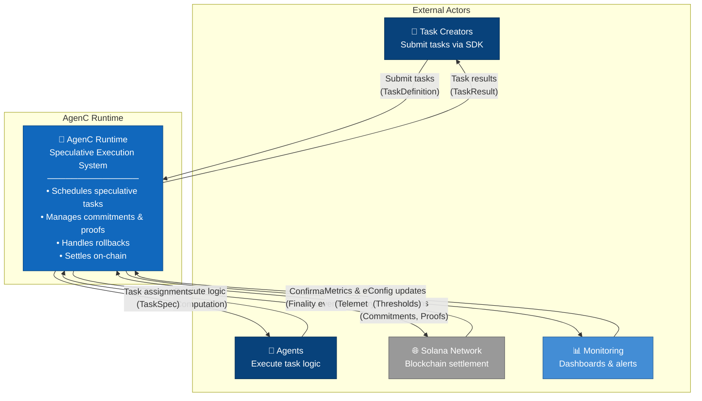
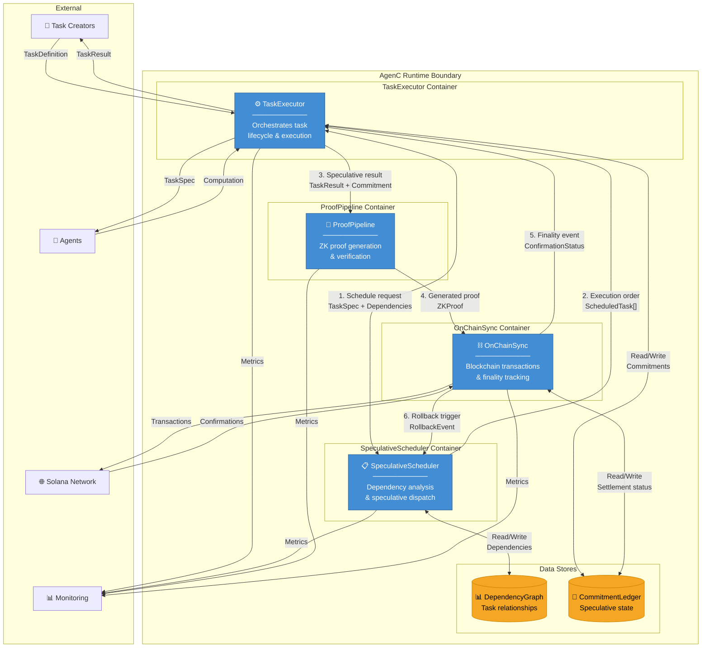
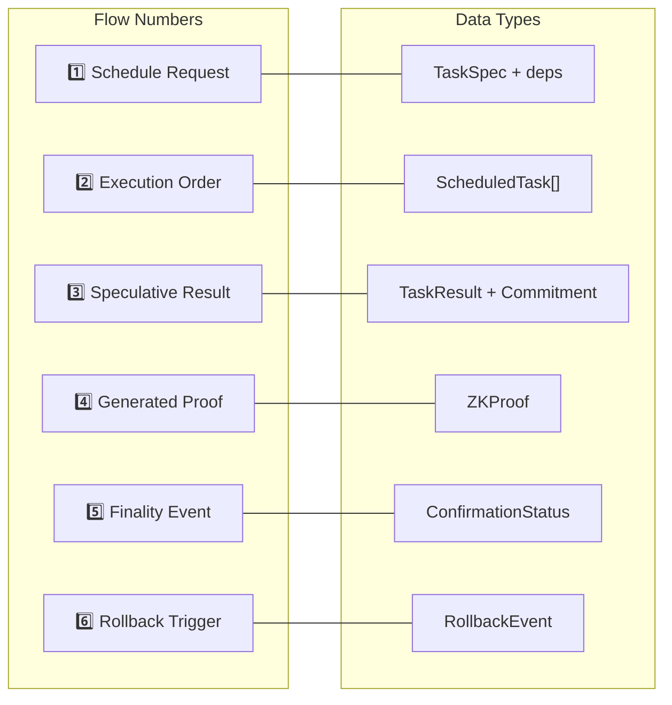
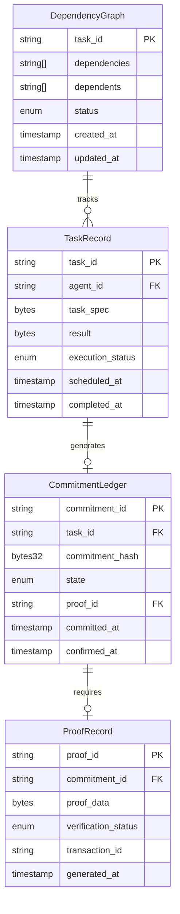
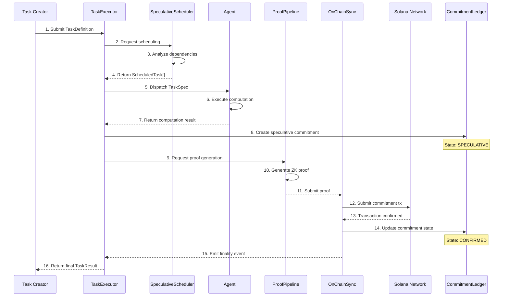
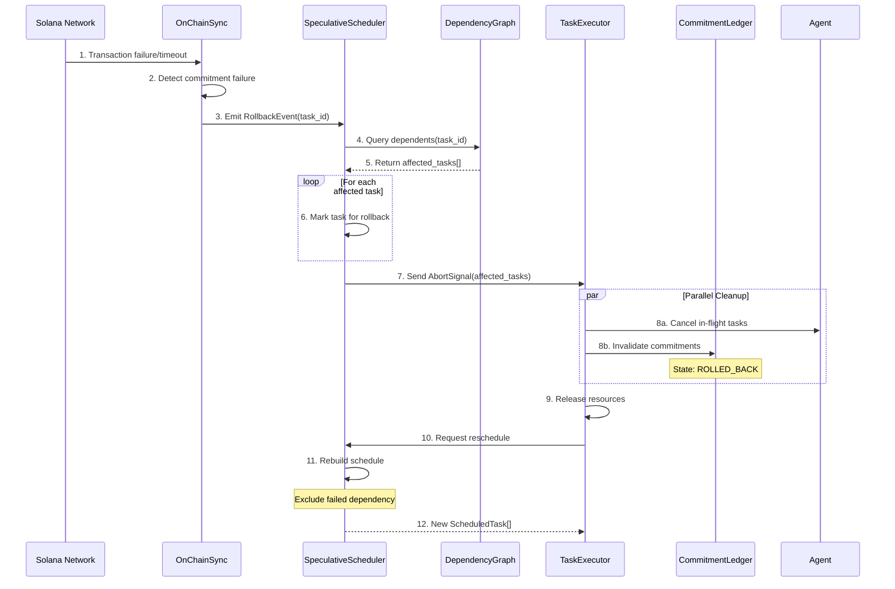
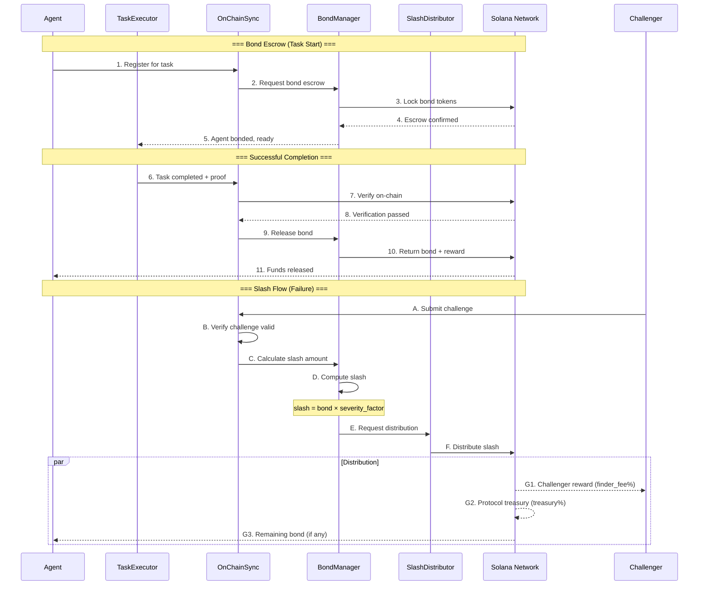
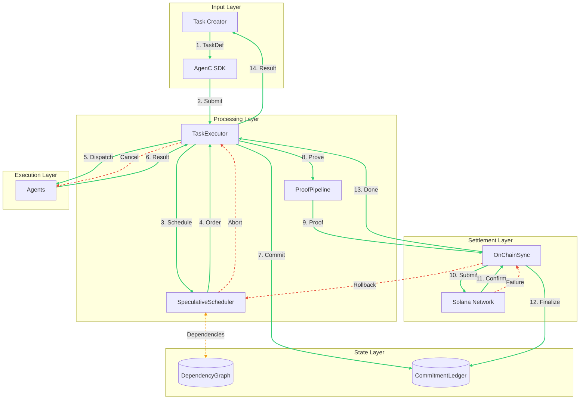
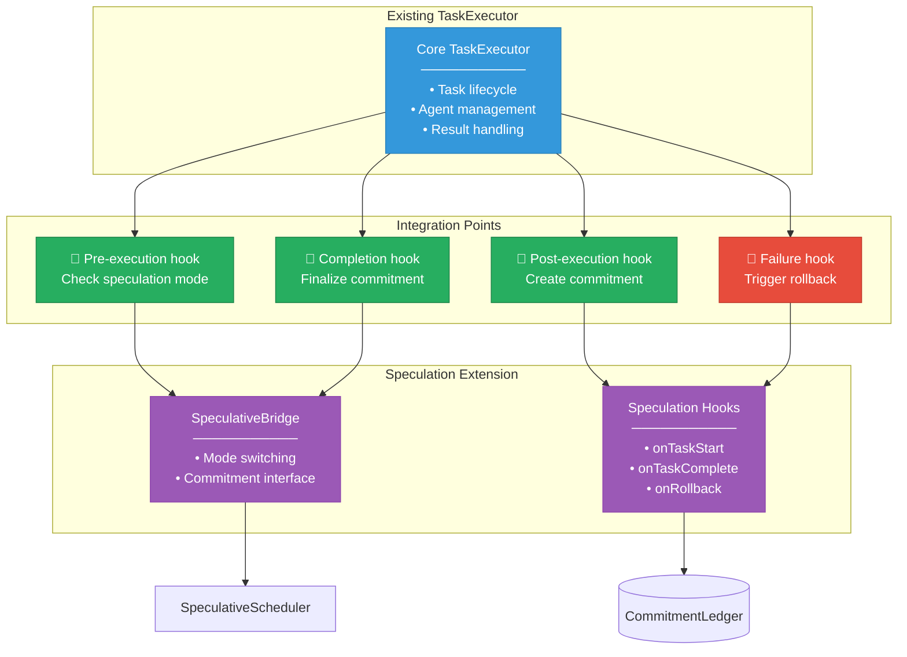
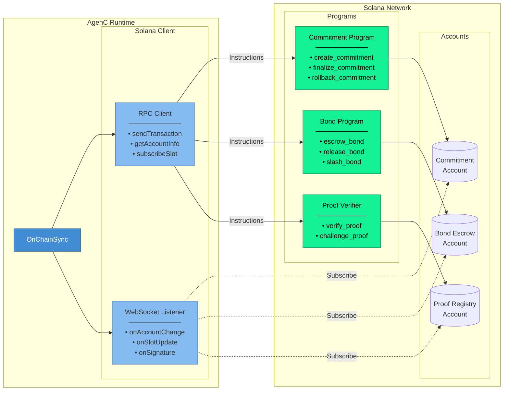

# AgenC Speculative Execution - Data Flow Diagrams

This document provides C4-style architecture diagrams and data flow visualizations for the AgenC Speculative Execution system.

## Table of Contents
1. [System Context (C4 Level 1)](#1-system-context-c4-level-1)
2. [Container Diagram (C4 Level 2)](#2-container-diagram-c4-level-2)
3. [Component Diagram (C4 Level 3)](#3-component-diagram-c4-level-3)
4. [Data Flow Diagrams](#4-data-flow-diagrams)
5. [Integration Points](#5-integration-points)

---

## 1. System Context (C4 Level 1)

The System Context diagram shows AgenC Runtime as the central system and its interactions with external actors.



### External Actor Descriptions

| Actor | Description | Data Exchanged |
|-------|-------------|----------------|
| **Task Creators** | Users/systems that submit tasks through the SDK | TaskDefinition → Runtime; TaskResult ← Runtime |
| **Agents** | Autonomous agents executing task logic | TaskSpec ← Runtime; Computation results → Runtime |
| **Solana Network** | On-chain settlement layer for commitments and proofs | Transactions → Chain; Confirmations ← Chain |
| **Monitoring** | Observability infrastructure (Grafana, alerting) | Telemetry → Monitoring; Config/thresholds ← Monitoring |

---

## 2. Container Diagram (C4 Level 2)

The Container diagram shows the major runtime containers and their data flows.



### Container Responsibilities

| Container | Responsibility | Key Data |
|-----------|----------------|----------|
| **TaskExecutor** | Orchestrates task lifecycle, manages agent interactions, tracks completion | TaskDefinition, TaskResult, TaskSpec |
| **SpeculativeScheduler** | Analyzes dependencies, determines execution order, enables parallel speculation | ScheduledTask, DependencyEdge |
| **ProofPipeline** | Generates ZK proofs for commitments, verifies proofs on confirmation | ZKProof, ProofRequest, ProofStatus |
| **OnChainSync** | Submits transactions, tracks finality, triggers rollbacks on failure | Transaction, ConfirmationStatus, RollbackEvent |

### Inter-Container Data Flows



---

## 3. Component Diagram (C4 Level 3)

Detailed component breakdown showing classes and their relationships.

### 3.1 TaskExecutor Components

```mermaid
flowchart TB
    subgraph TaskExecutor Container
        subgraph Core Components
            TM[TaskManager<br/>───────────<br/>• createTask()<br/>• getTask()<br/>• updateStatus()]
            
            EO[ExecutionOrchestrator<br/>───────────<br/>• dispatch()<br/>• awaitResult()<br/>• handleTimeout()]
            
            RC[ResultCollector<br/>───────────<br/>• collectResult()<br/>• validateOutput()<br/>• emitCommitment()]
        end

        subgraph Speculation Bridge
            SB[SpeculativeBridge<br/>───────────<br/>• enterSpeculativeMode()<br/>• exitSpeculativeMode()<br/>• queryCommitment()]
        end

        subgraph Agent Interface
            AI[AgentInterface<br/>───────────<br/>• assignTask()<br/>• receiveComputation()<br/>• reportHealth()]
        end
    end

    %% Internal flows
    TM -->|"Task created"| EO
    EO -->|"Dispatch to agent"| AI
    AI -->|"Computation result"| RC
    RC -->|"Emit commitment"| SB
    SB -->|"Update task status"| TM

    %% External connections
    EXT_AG[🤖 Agents] <-->|"Task execution"| AI
    EXT_SS[SpeculativeScheduler] <-->|"Schedule coordination"| SB
    EXT_CL[(CommitmentLedger)] <-->|"Read/Write"| RC

    style TM fill:#85BBF0,stroke:#5D8AC2
    style EO fill:#85BBF0,stroke:#5D8AC2
    style RC fill:#85BBF0,stroke:#5D8AC2
    style SB fill:#85BBF0,stroke:#5D8AC2
    style AI fill:#85BBF0,stroke:#5D8AC2
```

### 3.2 SpeculativeScheduler Components

```mermaid
flowchart TB
    subgraph SpeculativeScheduler Container
        subgraph Scheduling Core
            DA[DependencyAnalyzer<br/>───────────<br/>• buildGraph()<br/>• findCriticalPath()<br/>• detectCycles()]
            
            PS[ParallelScheduler<br/>───────────<br/>• identifyParallel()<br/>• scheduleWave()<br/>• optimizeOrder()]
            
            SQ[SpeculationQueue<br/>───────────<br/>• enqueue()<br/>• dequeue()<br/>• prioritize()]
        end

        subgraph Rollback Management
            RD[RollbackDetector<br/>───────────<br/>• detectFailure()<br/>• identifyAffected()<br/>• triggerRollback()]
            
            GT[GraphTraverser<br/>───────────<br/>• findDependents()<br/>• walkGraph()<br/>• computeSubtree()]
        end

        subgraph State
            DGI[DependencyGraph Interface<br/>───────────<br/>• addEdge()<br/>• removeNode()<br/>• queryDependents()]
        end
    end

    %% Internal flows
    DA -->|"Graph built"| PS
    PS -->|"Scheduled tasks"| SQ
    SQ -->|"Next task"| EXT_TE
    
    RD -->|"Failure detected"| GT
    GT -->|"Affected set"| RD
    RD -->|"Abort signals"| SQ

    DA <-->|"Graph operations"| DGI
    GT <-->|"Graph queries"| DGI

    %% External connections
    EXT_TE[TaskExecutor] -->|"Schedule request"| DA
    EXT_OCS[OnChainSync] -->|"Rollback event"| RD
    EXT_DG[(DependencyGraph)] <-->|"Persist"| DGI

    style DA fill:#85BBF0,stroke:#5D8AC2
    style PS fill:#85BBF0,stroke:#5D8AC2
    style SQ fill:#85BBF0,stroke:#5D8AC2
    style RD fill:#85BBF0,stroke:#5D8AC2
    style GT fill:#85BBF0,stroke:#5D8AC2
    style DGI fill:#85BBF0,stroke:#5D8AC2
```

### 3.3 ProofPipeline Components

```mermaid
flowchart TB
    subgraph ProofPipeline Container
        subgraph Proof Generation
            PG[ProofGenerator<br/>───────────<br/>• generateProof()<br/>• batchProofs()<br/>• estimateCost()]
            
            WM[WitnessManager<br/>───────────<br/>• collectWitness()<br/>• serializeInputs()<br/>• validateWitness()]
            
            CP[CircuitProcessor<br/>───────────<br/>• compileCircuit()<br/>• executeCircuit()<br/>• cacheResult()]
        end

        subgraph Verification
            PV[ProofVerifier<br/>───────────<br/>• verifyProof()<br/>• checkValidity()<br/>• reportResult()]
        end

        subgraph Queue Management
            PQ[ProofQueue<br/>───────────<br/>• submitRequest()<br/>• trackProgress()<br/>• handleCallback()]
        end
    end

    %% Internal flows
    PQ -->|"Proof request"| WM
    WM -->|"Witness data"| CP
    CP -->|"Circuit output"| PG
    PG -->|"Generated proof"| PV
    PV -->|"Verified proof"| EXT_OCS

    %% External connections
    EXT_TE[TaskExecutor] -->|"TaskResult + Commitment"| PQ
    EXT_OCS[OnChainSync] <-->|"Submit proof"| PV

    style PG fill:#85BBF0,stroke:#5D8AC2
    style WM fill:#85BBF0,stroke:#5D8AC2
    style CP fill:#85BBF0,stroke:#5D8AC2
    style PV fill:#85BBF0,stroke:#5D8AC2
    style PQ fill:#85BBF0,stroke:#5D8AC2
```

### 3.4 OnChainSync Components

```mermaid
flowchart TB
    subgraph OnChainSync Container
        subgraph Transaction Management
            TB[TransactionBuilder<br/>───────────<br/>• buildCommitmentTx()<br/>• buildProofTx()<br/>• buildSlashTx()]
            
            TS[TransactionSubmitter<br/>───────────<br/>• submit()<br/>• retry()<br/>• handleError()]
            
            FT[FinalityTracker<br/>───────────<br/>• trackConfirmation()<br/>• detectFinality()<br/>• emitEvent()]
        end

        subgraph Economic Logic
            BM[BondManager<br/>───────────<br/>• escrowBond()<br/>• releaseBond()<br/>• calculateSlash()]
            
            SD[SlashDistributor<br/>───────────<br/>• distributeSlash()<br/>• rewardChallenger()<br/>• updateBalances()]
        end

        subgraph State Sync
            CSI[ChainStateInterface<br/>───────────<br/>• queryState()<br/>• subscribeEvents()<br/>• syncLocal()]
        end
    end

    %% Internal flows
    TB -->|"Built transaction"| TS
    TS -->|"Submitted tx"| FT
    FT -->|"Finality reached"| EXT_TE
    FT -->|"Failure detected"| BM
    BM -->|"Slash calculated"| SD
    SD -->|"Update chain"| TB

    CSI <-->|"Chain queries"| EXT_SN

    %% External connections
    EXT_PP[ProofPipeline] -->|"ZK Proof"| TB
    EXT_TE[TaskExecutor] <-->|"Finality events"| FT
    EXT_SS[SpeculativeScheduler] <-->|"Rollback trigger"| FT
    EXT_SN[🌐 Solana Network] <-->|"Transactions"| TS
    EXT_CL[(CommitmentLedger)] <-->|"Settlement status"| CSI

    style TB fill:#85BBF0,stroke:#5D8AC2
    style TS fill:#85BBF0,stroke:#5D8AC2
    style FT fill:#85BBF0,stroke:#5D8AC2
    style BM fill:#85BBF0,stroke:#5D8AC2
    style SD fill:#85BBF0,stroke:#5D8AC2
    style CSI fill:#85BBF0,stroke:#5D8AC2
```

### 3.5 Data Store Schemas



---

## 4. Data Flow Diagrams

### 4.1 Task Result Flow (Happy Path)

Execution → Commitment → Proof → Confirmation



### 4.2 Rollback Data Flow (Failure Path)

Failure Detection → Graph Traversal → Abort Signals → Cleanup



### 4.3 Economic Data Flow

Bond Escrow → Slash Calculation → Distribution



### 4.4 Complete System Data Flow



---

## 5. Integration Points

### 5.1 TaskExecutor Integration

Shows how speculation integrates with the existing TaskExecutor.



### 5.2 On-Chain Integration

Shows how on-chain components integrate with the runtime.



### 5.3 SDK Integration Points

```mermaid
flowchart TB
    subgraph SDK Layer
        subgraph Client SDK
            TC[TaskClient<br/>───────────<br/>• submit()<br/>• await()<br/>• cancel()]
            
            SC[SpeculationClient<br/>───────────<br/>• enableSpeculation()<br/>• setMaxDepth()<br/>• queryCommitment()]
            
            MC[MonitoringClient<br/>───────────<br/>• onProgress()<br/>• onRollback()<br/>• onComplete()]
        end

        subgraph Agent SDK
            AH[AgentHandler<br/>───────────<br/>• registerAgent()<br/>• handleTask()<br/>• reportResult()]
            
            BH[BondHandler<br/>───────────<br/>• stakeBond()<br/>• checkBond()<br/>• withdrawBond()]
        end
    end

    subgraph Runtime
        TE[TaskExecutor]
        SS[SpeculativeScheduler]
        OCS[OnChainSync]
    end

    TC -->|"gRPC/REST"| TE
    SC -->|"gRPC/REST"| SS
    MC -->|"WebSocket"| TE
    AH -->|"gRPC"| TE
    BH -->|"gRPC"| OCS

    style TC fill:#e74c3c,stroke:#c0392b,color:#fff
    style SC fill:#e74c3c,stroke:#c0392b,color:#fff
    style MC fill:#e74c3c,stroke:#c0392b,color:#fff
    style AH fill:#3498db,stroke:#2980b9,color:#fff
    style BH fill:#3498db,stroke:#2980b9,color:#fff
```

### 5.4 Integration Summary Matrix

| Integration Point | Source | Target | Protocol | Data |
|-------------------|--------|--------|----------|------|
| Task Submission | SDK.TaskClient | TaskExecutor | gRPC | TaskDefinition |
| Speculation Config | SDK.SpeculationClient | SpeculativeScheduler | gRPC | SpecConfig |
| Progress Events | TaskExecutor | SDK.MonitoringClient | WebSocket | ProgressEvent |
| Agent Registration | SDK.AgentHandler | TaskExecutor | gRPC | AgentRegistration |
| Bond Operations | SDK.BondHandler | OnChainSync | gRPC | BondOperation |
| Chain Transactions | OnChainSync | Solana RPC | JSON-RPC | Transaction |
| Chain Events | Solana WebSocket | OnChainSync | WebSocket | AccountUpdate |

---

## Appendix: Data Type Definitions

```typescript
// Core Types
interface TaskDefinition {
  taskId: string;
  agentRequirements: AgentSpec;
  inputData: bytes;
  timeout: Duration;
  dependencies: string[];  // task IDs
  speculationConfig?: SpecConfig;
}

interface TaskResult {
  taskId: string;
  outputData: bytes;
  executionTime: Duration;
  agentId: string;
  commitmentId?: string;
}

interface SpecConfig {
  maxSpeculativeDepth: number;
  bondAmount: Lamports;
  proofDeadline: Duration;
}

// Commitment Types
interface Commitment {
  commitmentId: string;
  taskId: string;
  hash: bytes32;
  state: CommitmentState;
  proofId?: string;
}

enum CommitmentState {
  SPECULATIVE = 0,
  PROVING = 1,
  SUBMITTED = 2,
  CONFIRMED = 3,
  ROLLED_BACK = 4,
}

// Event Types
interface RollbackEvent {
  sourceTaskId: string;
  reason: RollbackReason;
  affectedTasks: string[];
  timestamp: Timestamp;
}

interface FinalityEvent {
  commitmentId: string;
  transactionSignature: string;
  slot: number;
  timestamp: Timestamp;
}
```

---

*Last Updated: 2025-01-28*
*Document Version: 1.0*
