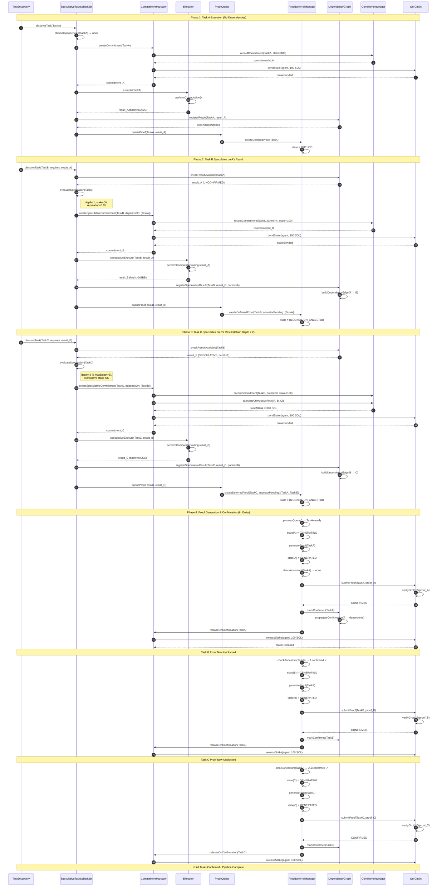

# Speculative Execution Sequence Diagrams

Comprehensive Mermaid sequence diagrams for AgenC's speculative execution system.

---

## 1. Happy Path: 3-Task Pipeline

This diagram shows the complete flow of a successful speculative execution chain where Tasks A → B → C execute speculatively and all proofs confirm in order.

---

## 2. Failure Path: Mid-Chain Proof Failure

This diagram shows what happens when Task B's proof fails verification, requiring rollback of Task C which depended on it.

```mermaid
sequenceDiagram
    autonumber
    participant STS as SpeculativeScheduler
    participant PDM as ProofDeferralManager
    participant DG as DependencyGraph
    participant RC as RollbackController
    participant CL as CommitmentLedger
    participant ESC as EscrowAccount
    participant TR as Treasury
    participant Chain as On-Chain

    Note over STS,Chain: Initial State: A confirmed, B & C speculative

    rect rgb(40, 60, 40)
        Note over STS,Chain: A: CONFIRMED | B: SPECULATIVE | C: SPECULATIVE
    end

    PDM->>PDM: state(B) = GENERATING
    PDM->>PDM: generateProof(TaskB)
    PDM->>PDM: state(B) = GENERATED

    PDM->>Chain: submitProof(TaskB, proof_B)
    Chain->>Chain: verifyGroth16(proof_B)

    rect rgb(80, 40, 40)
        Chain-->>PDM: VERIFICATION_FAILED ❌
        Note over Chain: Invalid witness or<br/>constraint violation
    end

    Note over STS,Chain: Phase 1: Initiate Rollback Cascade

    PDM->>RC: initiateRollback(TaskB, reason: PROOF_FAILED)
    RC->>RC: createRollbackContext(origin: TaskB)

    RC->>DG: getDependents(TaskB)
    DG->>DG: traverseForward(TaskB)
    DG-->>RC: dependents = [TaskC]

    RC->>RC: buildRollbackSet([TaskB, TaskC])
    RC->>RC: sortByDependencyOrder() → [C, B]
    Note right of RC: Process leaves first<br/>(reverse topological)

    Note over STS,Chain: Phase 2: Abort Task C (Leaf Node)

    RC->>CL: getCommitment(TaskC)
    CL-->>RC: commitment_C (stake=100, status=SPECULATIVE)

    RC->>STS: abortExecution(TaskC)
    STS->>STS: cancelPendingWork(TaskC)
    STS-->>RC: executionAborted

    RC->>PDM: cancelProof(TaskC)
    PDM->>PDM: state(C) = CANCELLED
    PDM-->>RC: proofCancelled

    RC->>CL: markAborted(TaskC, reason: ANCESTOR_FAILED)
    CL->>CL: status(C) = ABORTED

    rect rgb(80, 60, 40)
        Note over RC,ESC: Stake handling for aborted task (graceful)
        RC->>ESC: processAbortion(TaskC)
        ESC->>ESC: No slash (not at fault)
        ESC->>Chain: releaseStake(agent_C, 100 SOL)
        Chain-->>ESC: stakeReleased
    end

    Note over STS,Chain: Phase 3: Mark Task B Failed (Root Cause)

    RC->>CL: getCommitment(TaskB)
    CL-->>RC: commitment_B (stake=100, status=SPECULATIVE)

    RC->>CL: markFailed(TaskB, reason: PROOF_INVALID)
    CL->>CL: status(B) = FAILED

    rect rgb(80, 40, 40)
        Note over RC,TR: Slash stake for failed proof
        RC->>ESC: processFailure(TaskB)
        ESC->>ESC: calculateSlash(100 SOL, PROOF_FAILURE)
        ESC-->>ESC: slashAmount = 50 SOL (50%)

        ESC->>Chain: slashStake(agent_B, 50 SOL)
        Chain-->>ESC: stakeSlashed

        ESC->>TR: distributeSlash(50 SOL)
        TR->>TR: allocate(protocol: 25, affected: 25)
        TR->>Chain: transferToProtocol(25 SOL)
        TR->>Chain: compensateAffected(25 SOL)
    end

    RC->>ESC: releaseRemainder(TaskB)
    ESC->>Chain: releaseStake(agent_B, 50 SOL)

    Note over STS,Chain: Phase 4: Update Dependency Graph

    RC->>DG: invalidateResult(TaskB)
    DG->>DG: markInvalid(result_B)
    DG->>DG: propagateInvalidation(B → C)

    RC->>DG: cleanupEdges([B, C])
    DG->>DG: removeEdge(A → B)
    DG->>DG: removeEdge(B → C)

    Note over STS,Chain: Phase 5: Emit Events & Cleanup

    RC->>RC: emitRollbackComplete(TaskB, affected: [TaskC])

    RC->>STS: notifyRollbackComplete({
        Note right of RC: origin: TaskB<br/>aborted: [TaskC]<br/>slashed: 50 SOL
    STS->>STS: updateReputationScore(agent_B, -0.1)
    STS->>STS: clearSpeculativeResults([B, C])

    rect rgb(60, 60, 40)
        Note over STS,Chain: Task B now available for retry by different agent
        STS->>STS: requeueTask(TaskB)
    end
```

---

## 3. Speculation Decision Flow

This diagram shows the detailed decision-making process when the scheduler evaluates whether to speculatively execute a task.

```mermaid
sequenceDiagram
    autonumber
    participant TD as TaskDiscovery
    participant STS as SpeculativeTaskScheduler
    participant DG as DependencyGraph
    participant REP as ReputationOracle
    participant CL as CommitmentLedger
    participant CFG as ConfigManager
    participant EX as Executor

    Note over TD,EX: Task Becomes Available for Scheduling

    TD->>STS: taskAvailable(TaskX, dependencies: [TaskY])

    STS->>DG: checkDependencyStatus(TaskY)
    DG-->>STS: status(TaskY) = UNCONFIRMED

    alt TaskY is CONFIRMED
        STS->>STS: decision = EXECUTE_NORMAL
        Note right of STS: No speculation needed
    else TaskY is UNCONFIRMED (Speculative Path)
        STS->>STS: beginSpeculationEvaluation()
    end

    Note over TD,EX: Check 1: Speculation Depth Limit

    STS->>DG: getSpeculativeDepth(TaskY)
    DG->>DG: traverseAncestors(TaskY)
    DG-->>STS: depth = 2

    STS->>CFG: getMaxSpeculationDepth()
    CFG-->>STS: maxDepth = 3

    alt depth >= maxDepth
        rect rgb(80, 40, 40)
            STS->>STS: decision = WAIT
            Note right of STS: Depth limit exceeded<br/>Risk too high
            STS-->>TD: QUEUED_PENDING_CONFIRMATION
        end
    else depth < maxDepth
        STS->>STS: depthCheck = PASSED ✓
    end

    Note over TD,EX: Check 2: Producer Reputation

    STS->>DG: getProducer(TaskY)
    DG-->>STS: producer = agent_P

    STS->>REP: getReputationScore(agent_P)
    REP->>REP: queryHistoricalPerformance(agent_P)
    REP-->>STS: reputation = 0.85

    STS->>CFG: getMinReputationForSpeculation()
    CFG-->>STS: minReputation = 0.70

    alt reputation < minReputation
        rect rgb(80, 40, 40)
            STS->>STS: decision = WAIT
            Note right of STS: Producer reputation<br/>below threshold
            STS-->>TD: QUEUED_PENDING_CONFIRMATION
        end
    else reputation >= minReputation
        STS->>STS: reputationCheck = PASSED ✓
    end

    Note over TD,EX: Check 3: Cumulative Stake Limit

    STS->>CL: getCurrentStakeExposure(agent_X)
    CL-->>STS: currentExposure = 500 SOL

    STS->>CL: getTaskStakeRequirement(TaskX)
    CL-->>STS: requiredStake = 100 SOL

    STS->>DG: getAncestorChain(TaskX)
    DG-->>STS: ancestors = [TaskY, TaskZ]

    STS->>CL: calculateChainRisk(ancestors)
    CL->>CL: sumPendingStakes([Y, Z])
    CL-->>STS: chainRisk = 200 SOL

    STS->>STS: totalRisk = currentExposure + requiredStake + chainRisk
    Note right of STS: totalRisk = 500 + 100 + 200 = 800 SOL

    STS->>CFG: getMaxStakeExposure()
    CFG-->>STS: maxExposure = 1000 SOL

    alt totalRisk > maxExposure
        rect rgb(80, 40, 40)
            STS->>STS: decision = WAIT
            Note right of STS: Stake limit exceeded<br/>Would over-expose
            STS-->>TD: QUEUED_PENDING_STAKE_AVAILABLE
        end
    else totalRisk <= maxExposure
        STS->>STS: stakeCheck = PASSED ✓
    end

    Note over TD,EX: Check 4: Result Availability

    STS->>DG: getResult(TaskY)

    alt result not available
        rect rgb(80, 40, 40)
            STS->>STS: decision = WAIT
            Note right of STS: Cannot speculate without<br/>unconfirmed result to use
            STS-->>TD: QUEUED_PENDING_RESULT
        end
    else result available (unconfirmed)
        STS->>STS: resultCheck = PASSED ✓
        DG-->>STS: result_Y (UNCONFIRMED)
    end

    Note over TD,EX: Check 5: Circuit Breaker

    STS->>CL: getRecentFailureRate(agent_X, window: 1h)
    CL-->>STS: failureRate = 0.05 (5%)

    STS->>CFG: getCircuitBreakerThreshold()
    CFG-->>STS: threshold = 0.20 (20%)

    alt failureRate > threshold
        rect rgb(80, 40, 40)
            STS->>STS: decision = WAIT
            Note right of STS: Circuit breaker OPEN<br/>Too many recent failures
            STS-->>TD: QUEUED_CIRCUIT_BREAKER
        end
    else failureRate <= threshold
        STS->>STS: circuitBreakerCheck = PASSED ✓
    end

    Note over TD,EX: All Checks Passed - Proceed with Speculation

    rect rgb(40, 60, 40)
        STS->>STS: decision = SPECULATE ✓
        Note right of STS: All criteria met:<br/>✓ depth=2 < max=3<br/>✓ rep=0.85 > min=0.70<br/>✓ risk=800 < max=1000<br/>✓ result available<br/>✓ circuit breaker closed
    end

    STS->>CL: createSpeculativeCommitment(TaskX)
    CL-->>STS: commitment_X

    STS->>EX: speculativeExecute(TaskX, result_Y)
    EX-->>STS: result_X
```

---

## 4. Proof Lifecycle

This diagram shows the complete state machine and lifecycle of a deferred proof from generation through confirmation.

```mermaid
sequenceDiagram
    autonumber
    participant STS as SpeculativeScheduler
    participant PQ as ProofQueue
    participant PDM as ProofDeferralManager
    participant PG as ProofGenerator
    participant AC as AncestorChecker
    participant PS as ProofSubmitter
    participant Chain as On-Chain
    participant DG as DependencyGraph

    Note over STS,DG: Phase 1: Proof Queued

    STS->>PQ: queueProof(TaskX, result_X)
    PQ->>PQ: validateInput(result_X)
    PQ->>PDM: createDeferredProof(TaskX)

    PDM->>PDM: initializeProofState(TaskX)
    Note right of PDM: state = QUEUED<br/>createdAt = now<br/>attempts = 0

    PDM->>AC: getAncestorStatus(TaskX)
    AC->>DG: traverseAncestors(TaskX)
    DG-->>AC: ancestors = [TaskW, TaskY]
    AC->>AC: checkConfirmationStatus([W, Y])

    alt All ancestors confirmed
        AC-->>PDM: ancestorsReady = true
        PDM->>PDM: state = READY_FOR_GENERATION
    else Some ancestors pending
        AC-->>PDM: ancestorsReady = false, pending = [TaskY]
        PDM->>PDM: state = BLOCKED_ON_ANCESTOR
        Note right of PDM: blockedBy = [TaskY]
    end

    Note over STS,DG: Phase 2: Waiting on Ancestors (if blocked)

    rect rgb(60, 60, 40)
        loop Until ancestors confirm
            PDM->>PDM: poll ancestorStatus
            Note right of PDM: state = BLOCKED_ON_ANCESTOR

            DG-->>PDM: ancestorConfirmed(TaskY)
            PDM->>AC: recheckAncestors(TaskX)
            AC-->>PDM: allConfirmed = true
        end
    end

    PDM->>PDM: state = READY_FOR_GENERATION

    Note over STS,DG: Phase 3: Proof Generation

    PDM->>PG: requestGeneration(TaskX, result_X)
    PDM->>PDM: state = GENERATING
    Note right of PDM: generationStartedAt = now

    PG->>PG: loadCircuit(TaskX.circuitType)
    PG->>PG: computeWitness(result_X, privateInputs)

    alt Witness computation succeeds
        PG->>PG: generateGroth16Proof(witness)

        alt Proof generation succeeds
            PG-->>PDM: proof_X (256 bytes)
            PDM->>PDM: state = GENERATED
            Note right of PDM: proof = proof_X<br/>generatedAt = now
        else Proof generation fails
            PG-->>PDM: GenerationError
            PDM->>PDM: attempts++

            alt attempts < maxAttempts
                PDM->>PDM: state = READY_FOR_GENERATION
                Note right of PDM: Will retry
            else attempts >= maxAttempts
                PDM->>PDM: state = GENERATION_FAILED
                PDM->>STS: notifyGenerationFailed(TaskX)
            end
        end
    else Witness computation fails
        PG-->>PDM: WitnessError (invalid result)
        PDM->>PDM: state = GENERATION_FAILED
        PDM->>STS: notifyInvalidResult(TaskX)
    end

    Note over STS,DG: Phase 4: Final Ancestor Check Before Submission

    PDM->>AC: finalAncestorCheck(TaskX)
    AC->>DG: verifyAllConfirmed(ancestors)

    alt Any ancestor failed/rolled back
        rect rgb(80, 40, 40)
            AC-->>PDM: ancestorInvalid = true
            PDM->>PDM: state = CANCELLED
            Note right of PDM: Ancestor failure detected<br/>This proof is now invalid
            PDM->>STS: notifyAncestorFailure(TaskX)
        end
    else All ancestors still valid
        AC-->>PDM: ancestorsValid = true
        PDM->>PDM: state = READY_FOR_SUBMISSION
    end

    Note over STS,DG: Phase 5: Proof Submission

    PDM->>PS: submitProof(TaskX, proof_X)
    PDM->>PDM: state = SUBMITTING
    Note right of PDM: submissionAttempt = 1<br/>submittedAt = now

    PS->>Chain: sendTransaction(verifyProof(proof_X, publicInputs))

    alt Transaction succeeds
        Chain->>Chain: verifyGroth16(proof_X)

        alt Proof valid
            Chain-->>PS: VERIFIED ✓
            PS-->>PDM: confirmed(txHash)
            PDM->>PDM: state = CONFIRMED
            Note right of PDM: confirmedAt = now<br/>txHash = 0x...

            rect rgb(40, 60, 40)
                PDM->>DG: markConfirmed(TaskX)
                DG->>DG: propagateConfirmation(TaskX)
                DG-->>PDM: dependentsUnblocked = [TaskZ]

                PDM->>PDM: unblockDependentProofs([TaskZ])
            end

        else Proof invalid
            Chain-->>PS: VERIFICATION_FAILED
            PS-->>PDM: verificationFailed
            PDM->>PDM: state = VERIFICATION_FAILED
            PDM->>STS: initiateRollback(TaskX)
        end

    else Transaction fails (network/timeout)
        Chain-->>PS: TransactionError
        PS-->>PDM: submissionFailed(error)
        PDM->>PDM: submissionAttempt++

        alt submissionAttempt < maxSubmissionAttempts
            PDM->>PDM: state = READY_FOR_SUBMISSION
            Note right of PDM: Will retry submission
        else submissionAttempt >= maxSubmissionAttempts
            PDM->>PDM: state = SUBMISSION_FAILED
            PDM->>STS: notifySubmissionFailed(TaskX)
        end
    end

    Note over STS,DG: Final State Summary

    rect rgb(40, 40, 60)
        Note over PDM: Possible Terminal States:<br/>✓ CONFIRMED - Proof verified on-chain<br/>✗ GENERATION_FAILED - Could not generate valid proof<br/>✗ VERIFICATION_FAILED - Proof rejected by verifier<br/>✗ SUBMISSION_FAILED - Network errors exceeded retries<br/>✗ CANCELLED - Ancestor invalidated
    end
```

---

## 5. Stake Bonding Flow

This diagram shows the complete stake lifecycle from commitment creation through resolution (success or failure).

```mermaid
sequenceDiagram
    autonumber
    participant AG as Agent
    participant CM as CommitmentManager
    participant CL as CommitmentLedger
    participant ESC as EscrowAccount
    participant TR as Treasury
    participant REP as ReputationOracle
    participant Chain as On-Chain

    Note over AG,Chain: Phase 1: Commitment Creation & Stake Bonding

    AG->>CM: requestCommitment(TaskX, speculativeDepth=2)

    CM->>CL: calculateRequiredStake(TaskX)
    CL->>CL: baseStake = 100 SOL
    CL->>CL: depthMultiplier = 1.0 + (depth * 0.1) = 1.2
    CL-->>CM: requiredStake = 120 SOL

    CM->>ESC: checkBalance(agent)
    ESC->>Chain: getBalance(agent.escrowAccount)
    Chain-->>ESC: balance = 500 SOL
    ESC-->>CM: available = 500 SOL

    alt Insufficient balance
        rect rgb(80, 40, 40)
            CM-->>AG: InsufficientStakeError
            Note right of CM: Agent must deposit<br/>more to escrow
        end
    else Sufficient balance
        CM->>ESC: bondStake(agent, 120 SOL, TaskX)

        ESC->>Chain: transferToEscrow(agent, 120 SOL)
        Chain-->>ESC: txHash

        ESC->>ESC: recordBond(TaskX, 120 SOL, status=BONDED)
        ESC-->>CM: bondId_X

        CM->>CL: createCommitment(TaskX, bondId_X)
        CL->>CL: record(commitment_X)
        CL-->>CM: commitmentId_X

        CM-->>AG: commitment_X created
    end

    Note over AG,Chain: Phase 2a: Success Path - Proof Confirmed

    rect rgb(40, 60, 40)
        Note over CM,Chain: Proof successfully verified on-chain

        CM->>ESC: processSuccess(bondId_X)

        ESC->>ESC: status(bondId_X) = RELEASING

        ESC->>Chain: releaseFromEscrow(agent, 120 SOL)
        Chain-->>ESC: released

        ESC->>ESC: status(bondId_X) = RELEASED
        ESC-->>CM: stakeReleased

        CM->>CL: markComplete(commitmentId_X, outcome=SUCCESS)
        CL->>CL: status(commitment_X) = COMPLETED

        CM->>REP: recordSuccess(agent, TaskX)
        REP->>REP: updateScore(agent, +0.01)
        REP-->>CM: newScore = 0.86
    end

    Note over AG,Chain: Phase 2b: Failure Path - Proof Failed

    rect rgb(80, 40, 40)
        Note over CM,Chain: Proof verification failed

        CM->>ESC: processFailure(bondId_X, reason=PROOF_INVALID)

        ESC->>ESC: calculateSlashAmount(120 SOL, PROOF_INVALID)
        Note right of ESC: Slash rate: 50% for proof failure

        ESC->>ESC: slashAmount = 60 SOL
        ESC->>ESC: returnAmount = 60 SOL

        ESC->>Chain: slashFromEscrow(agent, 60 SOL)
        Chain-->>ESC: slashed

        ESC->>TR: receiveSlash(60 SOL, source=bondId_X)

        TR->>TR: calculateDistribution(60 SOL)
        Note right of TR: 40% protocol, 60% affected

        TR->>Chain: transferToProtocol(24 SOL)
        Chain-->>TR: transferred

        TR->>TR: identifyAffectedParties(bondId_X)
        Note right of TR: Downstream tasks that<br/>were invalidated

        loop For each affected agent
            TR->>Chain: compensate(affectedAgent, share)
            Chain-->>TR: compensated
        end

        ESC->>Chain: releaseRemainder(agent, 60 SOL)
        Chain-->>ESC: released

        ESC->>ESC: status(bondId_X) = SLASHED

        CM->>CL: markComplete(commitmentId_X, outcome=FAILED)
        CL->>CL: status(commitment_X) = FAILED

        CM->>REP: recordFailure(agent, TaskX, severity=HIGH)
        REP->>REP: updateScore(agent, -0.10)
        REP-->>CM: newScore = 0.75
    end

    Note over AG,Chain: Phase 2c: Abort Path - Ancestor Failed (No Fault)

    rect rgb(60, 60, 40)
        Note over CM,Chain: Task aborted due to ancestor failure

        CM->>ESC: processAbort(bondId_X, reason=ANCESTOR_FAILED)

        ESC->>ESC: status(bondId_X) = RELEASING
        Note right of ESC: No slash - not at fault

        ESC->>Chain: releaseFromEscrow(agent, 120 SOL)
        Chain-->>ESC: released

        ESC->>ESC: status(bondId_X) = RELEASED
        ESC-->>CM: stakeReleased (graceful)

        CM->>CL: markComplete(commitmentId_X, outcome=ABORTED)
        CL->>CL: status(commitment_X) = ABORTED

        CM->>REP: recordAbort(agent, TaskX)
        REP->>REP: noScoreChange(agent)
        Note right of REP: Neutral outcome -<br/>not agent's fault
    end

    Note over AG,Chain: Stake Lifecycle Summary

    rect rgb(40, 40, 60)
        Note over ESC: Bond States:<br/>BONDED → RELEASING → RELEASED (success/abort)<br/>BONDED → SLASHING → SLASHED (failure)

        Note over CL: Commitment Outcomes:<br/>✓ COMPLETED (SUCCESS) - Proof verified<br/>✗ COMPLETED (FAILED) - Proof invalid<br/>○ ABORTED - Ancestor failure
    end
```

---

## 6. Cross-Agent Speculation

This diagram shows how Agent B can speculatively execute using Agent A's unconfirmed result, including trust evaluation.

```mermaid
sequenceDiagram
    autonumber
    participant AgA as Agent A (Producer)
    participant AgB as Agent B (Consumer)
    participant DG as DependencyGraph
    participant REP as ReputationOracle
    participant TM as TrustManager
    participant STS_B as Agent B's Scheduler
    participant CL as CommitmentLedger
    participant PDM as ProofDeferralManager
    participant Chain as On-Chain

    Note over AgA,Chain: Phase 1: Agent A Produces Unconfirmed Result

    AgA->>AgA: execute(TaskA)
    AgA->>DG: publishResult(TaskA, result_A, status=UNCONFIRMED)
    DG->>DG: index(result_A, producer=AgA)
    DG-->>AgA: resultPublished

    AgA->>PDM: queueProof(TaskA)
    PDM->>PDM: state(A) = QUEUED
    Note right of PDM: Proof pending generation

    Note over AgA,Chain: Phase 2: Agent B Discovers Dependent Task

    AgB->>DG: discoverTask(TaskB, requires: result_A)
    DG-->>AgB: taskAvailable(TaskB)

    AgB->>DG: getResult(TaskA)
    DG-->>AgB: result_A (UNCONFIRMED, producer=AgA)

    Note over AgA,Chain: Phase 3: Cross-Agent Trust Evaluation

    STS_B->>TM: evaluateTrust(AgA)

    TM->>REP: getReputationScore(AgA)
    REP->>REP: queryPerformance(AgA)
    REP-->>TM: reputation = 0.92

    TM->>REP: getHistoricalInteractions(AgA, AgB)
    REP-->>TM: interactions = {
        Note right of REP: successfulCollabs: 47<br/>failedCollabs: 2<br/>totalValue: 5000 SOL
    REP-->>TM: }

    TM->>TM: calculateDirectTrust(AgA, AgB)
    Note right of TM: directTrust = 0.96<br/>(based on history)

    TM->>TM: calculateNetworkTrust(AgA)
    Note right of TM: networkTrust = 0.91<br/>(weighted by connections)

    TM->>TM: combineTrustScores(direct=0.96, network=0.91, reputation=0.92)
    TM-->>STS_B: trustScore = 0.93

    STS_B->>STS_B: checkTrustThreshold(0.93)
    Note right of STS_B: minCrossAgentTrust = 0.80

    alt trustScore < threshold
        rect rgb(80, 40, 40)
            STS_B->>STS_B: decision = WAIT
            Note right of STS_B: Don't trust AgA enough<br/>to speculate on their result
            STS_B-->>AgB: QUEUED_LOW_TRUST
        end
    else trustScore >= threshold
        rect rgb(40, 60, 40)
            STS_B->>STS_B: trustCheck = PASSED ✓
        end
    end

    Note over AgA,Chain: Phase 4: Risk-Adjusted Stake Calculation

    STS_B->>CL: calculateCrossAgentStake(TaskB, producer=AgA)

    CL->>CL: baseStake = 100 SOL
    CL->>CL: trustDiscount = (trustScore - 0.80) * 50
    Note right of CL: trustDiscount = (0.93 - 0.80) * 50 = 6.5 SOL

    CL->>CL: crossAgentPremium = 20 SOL
    Note right of CL: Premium for relying on external agent

    CL->>CL: adjustedStake = baseStake - trustDiscount + crossAgentPremium
    CL-->>STS_B: requiredStake = 113.5 SOL

    Note over AgA,Chain: Phase 5: Cross-Agent Speculative Commitment

    STS_B->>CL: createCrossAgentCommitment(TaskB, dependsOn: {
        Note right of STS_B: task: TaskA<br/>producer: AgA<br/>trustScore: 0.93
    STS_B->>CL: })

    CL->>CL: recordCommitment(TaskB)
    CL->>CL: recordCrossAgentDependency(AgB → AgA via TaskA)
    CL-->>STS_B: commitmentId_B

    CL->>Chain: bondStake(AgB, 113.5 SOL)
    Chain-->>CL: stakeBonded

    Note over AgA,Chain: Phase 6: Speculative Execution

    STS_B->>AgB: speculativeExecute(TaskB, using: result_A)
    AgB->>AgB: performComputation(result_A)
    AgB-->>STS_B: result_B

    STS_B->>DG: publishResult(TaskB, result_B, status=SPECULATIVE)
    DG->>DG: index(result_B, producer=AgB)
    DG->>DG: recordDependency(TaskB depends on TaskA by AgA)

    STS_B->>PDM: queueProof(TaskB, ancestorPending: [TaskA])
    PDM->>PDM: state(B) = BLOCKED_ON_ANCESTOR

    Note over AgA,Chain: Phase 7: Resolution Scenarios

    rect rgb(40, 60, 40)
        Note over AgA,Chain: Scenario A: Agent A's proof confirms
        AgA->>Chain: submitProof(TaskA)
        Chain-->>AgA: CONFIRMED ✓

        PDM->>PDM: unblock(TaskB)
        PDM->>PDM: state(B) = READY_FOR_GENERATION

        Note over TM: Trust relationship strengthened
        TM->>REP: recordSuccessfulInteraction(AgA, AgB)
        REP->>REP: updateDirectTrust(AgA, AgB, +0.01)
    end

    rect rgb(80, 40, 40)
        Note over AgA,Chain: Scenario B: Agent A's proof fails
        AgA->>Chain: submitProof(TaskA)
        Chain-->>AgA: VERIFICATION_FAILED ✗

        PDM->>PDM: cancelProof(TaskB, reason=ANCESTOR_FAILED)

        CL->>CL: processAbort(commitmentId_B)
        CL->>Chain: releaseStake(AgB, 113.5 SOL)
        Note right of CL: AgB not slashed -<br/>relied on bad actor

        Note over TM: Trust relationship damaged
        TM->>REP: recordFailedInteraction(AgA, AgB)
        REP->>REP: updateDirectTrust(AgA, AgB, -0.15)

        Note over REP: AgA penalized for affecting AgB
        REP->>REP: updateReputation(AgA, -0.10)
        REP->>REP: recordCrossAgentDamage(AgA, affected: [AgB])
    end

    Note over AgA,Chain: Cross-Agent Trust Summary

    rect rgb(40, 40, 60)
        Note over TM: Trust Components:<br/>• Direct Trust: Historical interactions between specific agents<br/>• Network Trust: Weighted reputation from mutual connections<br/>• Global Reputation: Overall track record

        Note over CL: Cross-Agent Stakes:<br/>• Premium for external dependency<br/>• Discount for high trust relationships<br/>• Full protection: consumer not slashed for producer failure
    end
```

---

## Diagram Legend

| Symbol | Meaning |
|--------|---------|
| `rect rgb(40, 60, 40)` | Success/positive path |
| `rect rgb(80, 40, 40)` | Failure/negative path |
| `rect rgb(60, 60, 40)` | Neutral/waiting state |
| `rect rgb(40, 40, 60)` | Summary/information box |
| `✓` | Check passed / Success |
| `✗` | Check failed / Failure |
| `○` | Neutral outcome |

## Component Reference

| Component | Responsibility |
|-----------|----------------|
| **TaskDiscovery** | Monitors for available tasks |
| **SpeculativeTaskScheduler** | Decides whether to speculate |
| **CommitmentManager** | Creates and manages commitments |
| **CommitmentLedger** | Records all commitments and their status |
| **Executor** | Performs actual task computation |
| **ProofQueue** | Queues proofs for generation |
| **ProofDeferralManager** | Manages proof lifecycle state machine |
| **ProofGenerator** | Generates ZK proofs |
| **AncestorChecker** | Validates ancestor confirmation status |
| **ProofSubmitter** | Submits proofs to chain |
| **DependencyGraph** | Tracks task dependencies and results |
| **RollbackController** | Orchestrates failure cascades |
| **EscrowAccount** | Holds bonded stakes |
| **Treasury** | Receives and distributes slashed stakes |
| **ReputationOracle** | Tracks agent reputation scores |
| **TrustManager** | Evaluates cross-agent trust |
| **ConfigManager** | Provides system configuration |
| **On-Chain** | Solana blockchain |
