# State Machine Diagrams for AgenC Speculative Execution

This document defines the formal state machines for the speculative execution subsystem. These diagrams are implementation-ready specifications using Mermaid `stateDiagram-v2` syntax.

---

## Table of Contents

1. [ProofStatus State Machine](#1-proofstatus-state-machine)
2. [SpeculativeCommitment Lifecycle](#2-speculativecommitment-lifecycle)
3. [Task Speculation State](#3-task-speculation-state)
4. [RollbackController State](#4-rollbackcontroller-state)
5. [CommitmentLedger Entry State](#5-commitmentledger-entry-state)
6. [Composite: Full Speculation Flow](#6-composite-full-speculation-flow)

---

## 1. ProofStatus State Machine

The ProofStatus state machine tracks the lifecycle of a zero-knowledge proof from request through on-chain confirmation.

### State Descriptions

| State | Description |
|-------|-------------|
| `pending` | Proof generation has been requested but not yet started |
| `generating` | Proof generation is in progress (RISC0 payload generation running) |
| `generated` | Proof successfully generated, awaiting submission |
| `submitting` | Proof transaction submitted to chain, awaiting confirmation |
| `confirmed` | Proof verified and confirmed on-chain |
| `failed` | Terminal failure state (unrecoverable) |

### State Diagram

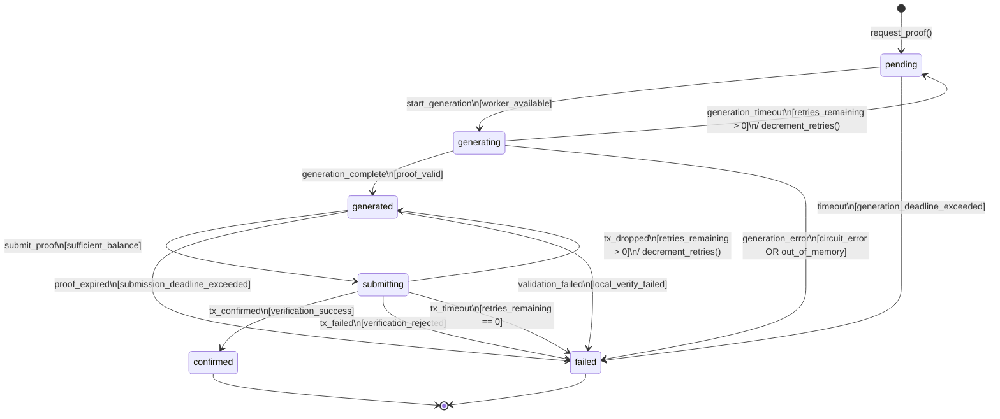

### Transition Table

| From | To | Event/Trigger | Guard | Action |
|------|-----|---------------|-------|--------|
| `[*]` | `pending` | `request_proof()` | - | `init_proof_context()`, `set_deadline()` |
| `pending` | `generating` | `start_generation` | `worker_available` | `spawn_proof_worker()`, `emit(ProofGenerationStarted)` |
| `pending` | `failed` | `timeout` | `generation_deadline_exceeded` | `emit(ProofGenerationTimeout)` |
| `generating` | `generated` | `generation_complete` | `proof_valid` | `store_proof()`, `emit(ProofGenerated)` |
| `generating` | `failed` | `generation_error` | `circuit_error OR out_of_memory` | `log_error()`, `emit(ProofGenerationFailed)` |
| `generating` | `pending` | `generation_timeout` | `retries_remaining > 0` | `decrement_retries()`, `reset_worker()` |
| `generated` | `submitting` | `submit_proof` | `sufficient_balance` | `build_tx()`, `send_tx()`, `emit(ProofSubmitting)` |
| `generated` | `failed` | `proof_expired` | `submission_deadline_exceeded` | `cleanup_proof()`, `emit(ProofExpired)` |
| `generated` | `failed` | `validation_failed` | `local_verify_failed` | `emit(ProofValidationFailed)` |
| `submitting` | `confirmed` | `tx_confirmed` | `verification_success` | `emit(ProofConfirmed)`, `update_commitment()` |
| `submitting` | `failed` | `tx_failed` | `verification_rejected` | `emit(ProofRejected)`, `trigger_rollback()` |
| `submitting` | `generated` | `tx_dropped` | `retries_remaining > 0` | `decrement_retries()` |
| `submitting` | `failed` | `tx_timeout` | `retries_remaining == 0` | `emit(ProofSubmissionTimeout)` |

### Entry/Exit Actions

```typescript
interface ProofStatusActions {
  // Entry actions
  onEnter: {
    pending: () => {
      this.deadline = now() + GENERATION_DEADLINE;
      this.retries = MAX_RETRIES;
    };
    generating: () => {
      this.workerHandle = spawnProofWorker(this.params);
      emit('ProofGenerationStarted', { taskId: this.taskId });
    };
    generated: () => {
      this.submissionDeadline = now() + SUBMISSION_DEADLINE;
    };
    submitting: () => {
      this.txHash = submitTransaction(this.proof);
      emit('ProofSubmitting', { txHash: this.txHash });
    };
    confirmed: () => {
      emit('ProofConfirmed', { taskId: this.taskId, slot: this.confirmedSlot });
    };
    failed: () => {
      emit('ProofFailed', { taskId: this.taskId, reason: this.failureReason });
      this.cleanup();
    };
  };
  
  // Exit actions
  onExit: {
    generating: () => {
      this.workerHandle?.cancel();
    };
    submitting: () => {
      this.pendingTx = null;
    };
  };
}
```

---

## 2. SpeculativeCommitment Lifecycle

The SpeculativeCommitment state machine manages on-chain economic commitments for speculative task execution, including bonding, slashing, and reward release.

### State Descriptions

| State | Description |
|-------|-------------|
| `created` | Commitment record created off-chain, not yet bonded |
| `bonded` | Bond locked on-chain, commitment is live |
| `executing` | Task execution in progress under speculation |
| `executed` | Execution complete, awaiting proof |
| `proof_pending` | Proof submitted, awaiting on-chain verification |
| `confirmed` | Proof verified, commitment fulfilled |
| `voided` | Commitment invalidated (slashed, rolled back, or cancelled) |

### State Diagram

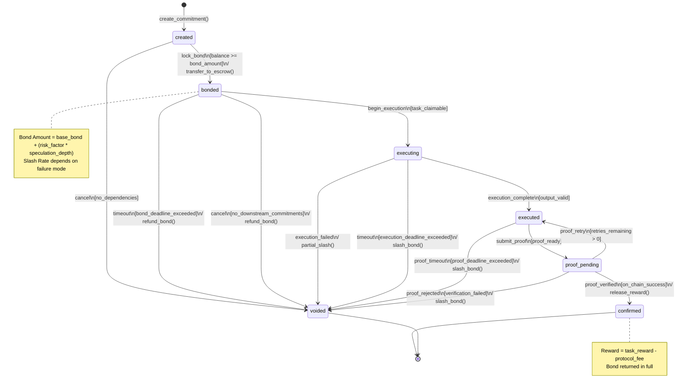

### On-Chain State Transitions

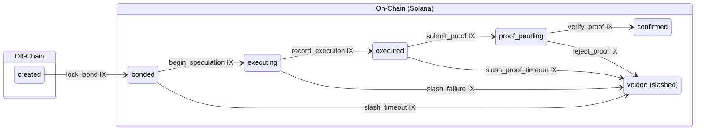

### Economic Triggers

| Trigger | From States | Action | Amount |
|---------|-------------|--------|--------|
| `lock_bond` | `created` | Transfer to escrow PDA | `bond_amount` |
| `refund_bond` | `bonded` | Return from escrow | `bond_amount` |
| `partial_slash` | `executing` | Burn portion of bond | `bond_amount * 0.25` |
| `slash_bond` | `executing`, `executed`, `proof_pending` | Burn full bond | `bond_amount` |
| `release_reward` | `proof_pending` | Transfer reward + return bond | `task_reward + bond_amount` |

### Transition Table

| From | To | Event | Guard | Action |
|------|-----|-------|-------|--------|
| `[*]` | `created` | `create_commitment()` | - | `init_commitment_record()`, `calculate_bond()` |
| `created` | `bonded` | `lock_bond` | `balance >= bond_amount` | `transfer_to_escrow()`, `emit(CommitmentBonded)` |
| `created` | `voided` | `cancel` | `no_dependencies` | `emit(CommitmentCancelled)` |
| `bonded` | `executing` | `begin_execution` | `task_claimable` | `claim_task()`, `start_timer()`, `emit(SpeculationStarted)` |
| `bonded` | `voided` | `timeout` | `bond_deadline_exceeded` | `refund_bond()`, `emit(CommitmentExpired)` |
| `bonded` | `voided` | `cancel` | `no_downstream_commitments` | `refund_bond()`, `emit(CommitmentCancelled)` |
| `executing` | `executed` | `execution_complete` | `output_valid` | `record_output()`, `emit(ExecutionComplete)` |
| `executing` | `voided` | `execution_failed` | - | `partial_slash()`, `emit(ExecutionFailed)` |
| `executing` | `voided` | `timeout` | `execution_deadline_exceeded` | `slash_bond()`, `emit(ExecutionTimeout)` |
| `executed` | `proof_pending` | `submit_proof` | `proof_ready` | `send_proof_tx()`, `emit(ProofSubmitted)` |
| `executed` | `voided` | `proof_timeout` | `proof_deadline_exceeded` | `slash_bond()`, `emit(ProofTimeout)` |
| `proof_pending` | `confirmed` | `proof_verified` | `on_chain_success` | `release_reward()`, `emit(CommitmentConfirmed)` |
| `proof_pending` | `voided` | `proof_rejected` | `verification_failed` | `slash_bond()`, `emit(ProofRejected)` |
| `proof_pending` | `executed` | `proof_retry` | `retries_remaining > 0` | `decrement_retries()` |

---

## 3. Task Speculation State

The Task Speculation state machine extends the base task lifecycle to support speculative execution with proof integration.

### State Descriptions

| State | Description |
|-------|-------------|
| `discovered` | Task identified for potential speculation |
| `evaluating` | Assessing speculation profitability and risk |
| `speculating` | Committed to speculation, executing speculatively |
| `executed` | Task executed, result computed |
| `proof_generating` | ZK proof generation in progress |
| `proof_submitted` | Proof submitted to chain |
| `confirmed` | Task completion verified on-chain |
| `rolled_back` | Speculation failed, effects reverted |

### State Diagram

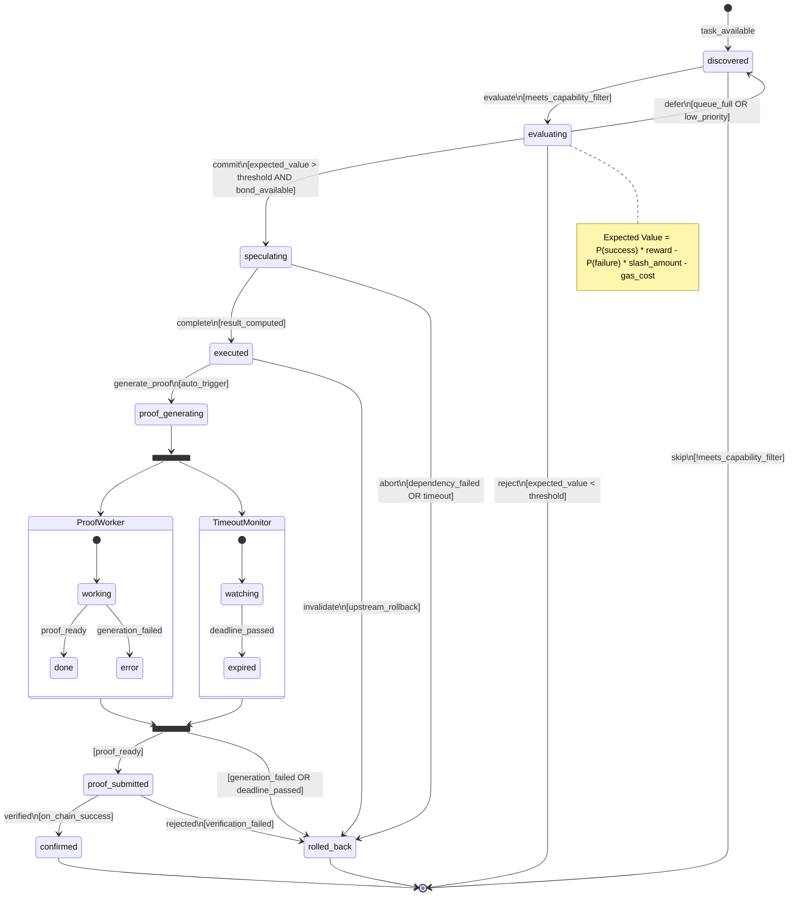

### Integration with ProofStatus State Machine

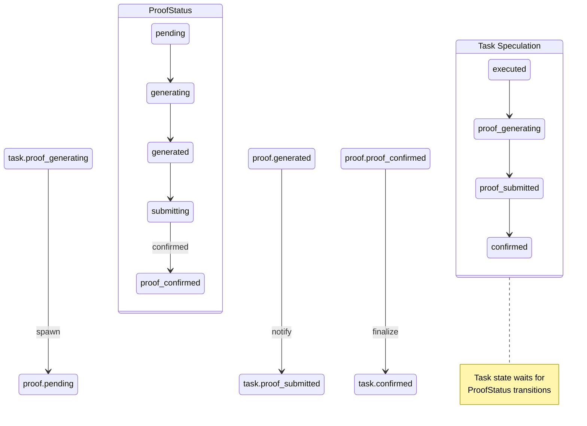

### Transition Table

| From | To | Event | Guard | Action |
|------|-----|-------|-------|--------|
| `[*]` | `discovered` | `task_available` | - | `fetch_task_details()` |
| `discovered` | `evaluating` | `evaluate` | `meets_capability_filter` | `compute_expected_value()` |
| `discovered` | `[*]` | `skip` | `!meets_capability_filter` | - |
| `evaluating` | `speculating` | `commit` | `expected_value > threshold AND bond_available` | `create_commitment()`, `lock_bond()`, `emit(SpeculationCommitted)` |
| `evaluating` | `discovered` | `defer` | `queue_full OR low_priority` | `enqueue_for_later()` |
| `evaluating` | `[*]` | `reject` | `expected_value < threshold` | `emit(TaskRejected)` |
| `speculating` | `executed` | `complete` | `result_computed` | `store_result()`, `update_commitment(executed)` |
| `speculating` | `rolled_back` | `abort` | `dependency_failed OR timeout` | `trigger_rollback()`, `void_commitment()` |
| `executed` | `proof_generating` | `generate_proof` | `auto_trigger` | `spawn_proof_state_machine()` |
| `executed` | `rolled_back` | `invalidate` | `upstream_rollback` | `cascade_rollback()` |
| `proof_generating` | `proof_submitted` | `proof_ready` | - | `submit_proof()`, `update_commitment(proof_pending)` |
| `proof_generating` | `rolled_back` | `generation_failed` | - | `void_commitment()`, `emit(ProofGenerationFailed)` |
| `proof_submitted` | `confirmed` | `verified` | `on_chain_success` | `finalize_commitment()`, `emit(TaskConfirmed)` |
| `proof_submitted` | `rolled_back` | `rejected` | `verification_failed` | `void_commitment()`, `emit(ProofRejected)` |

---

## 4. RollbackController State

The RollbackController manages the rollback of speculative state when a commitment fails or is voided. Handles concurrent rollbacks and dependency traversal.

### State Descriptions

| State | Description |
|-------|-------------|
| `idle` | No rollback in progress |
| `traversing` | Walking dependency graph to identify affected commitments |
| `aborting` | Cancelling in-flight operations |
| `cleaning` | Cleaning up state and releasing resources |
| `completed` | Rollback finished |

### State Diagram

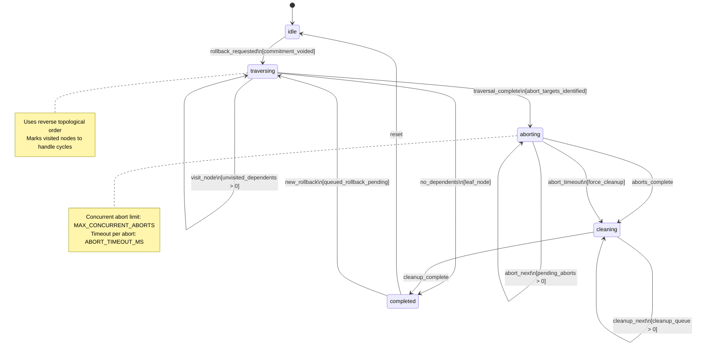

### Concurrent Rollback Handling

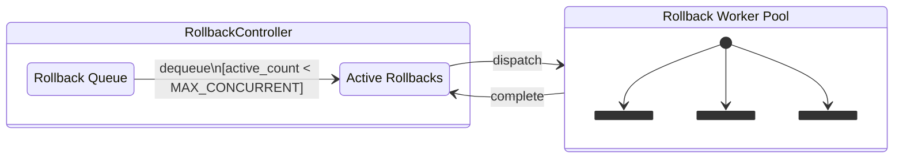

### Detailed Traversal State

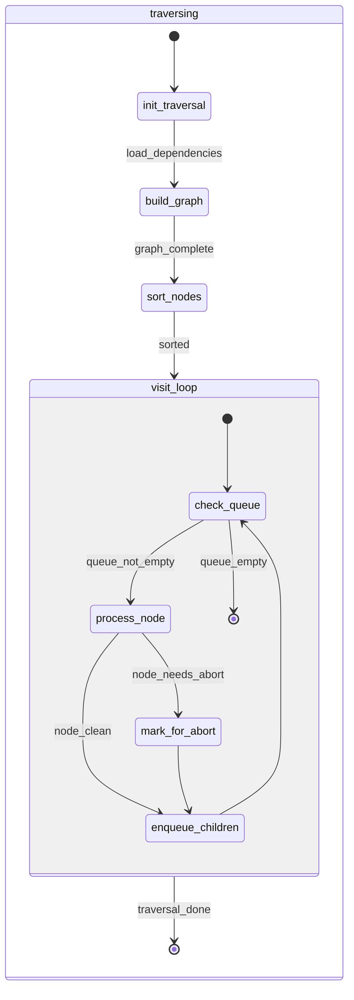

### Transition Table

| From | To | Event | Guard | Action |
|------|-----|-------|-------|--------|
| `[*]` | `idle` | - | - | `init_controller()` |
| `idle` | `traversing` | `rollback_requested` | `commitment_voided` | `init_traversal_context()`, `load_dependency_graph()` |
| `traversing` | `traversing` | `visit_node` | `unvisited_dependents > 0` | `mark_visited()`, `check_abort_needed()`, `enqueue_children()` |
| `traversing` | `aborting` | `traversal_complete` | `abort_targets_identified` | `build_abort_queue()`, `emit(TraversalComplete)` |
| `traversing` | `completed` | `no_dependents` | `leaf_node` | `cleanup_single()` |
| `aborting` | `aborting` | `abort_next` | `pending_aborts > 0` | `dispatch_abort()`, `emit(AbortingCommitment)` |
| `aborting` | `cleaning` | `aborts_complete` | - | `build_cleanup_queue()` |
| `aborting` | `cleaning` | `abort_timeout` | `force_cleanup` | `log_timeout()`, `force_abort_remaining()` |
| `cleaning` | `cleaning` | `cleanup_next` | `cleanup_queue > 0` | `cleanup_commitment()`, `release_resources()` |
| `cleaning` | `completed` | `cleanup_complete` | - | `emit(RollbackComplete)`, `update_metrics()` |
| `completed` | `idle` | `reset` | - | `clear_context()` |
| `completed` | `traversing` | `new_rollback` | `queued_rollback_pending` | `dequeue_rollback()`, `init_traversal_context()` |

### Entry/Exit Actions

```typescript
interface RollbackControllerActions {
  onEnter: {
    idle: () => {
      this.activeRollbacks = 0;
      this.metricsCollector.recordIdle();
    };
    traversing: (trigger: CommitmentId) => {
      this.rootCause = trigger;
      this.visited = new Set();
      this.abortQueue = [];
      this.dependencyGraph = loadDependencyGraph(trigger);
      emit('RollbackStarted', { root: trigger });
    };
    aborting: () => {
      this.abortStartTime = now();
      this.pendingAborts = new Set(this.abortQueue);
      emit('AbortPhaseStarted', { count: this.abortQueue.length });
    };
    cleaning: () => {
      this.cleanupQueue = buildCleanupOrder(this.visited);
    };
    completed: () => {
      const duration = now() - this.startTime;
      emit('RollbackComplete', {
        root: this.rootCause,
        affected: this.visited.size,
        duration,
      });
      this.metricsCollector.recordRollback(duration, this.visited.size);
    };
  };
  
  onExit: {
    aborting: () => {
      // Ensure all pending aborts are resolved
      for (const id of this.pendingAborts) {
        this.forceAbort(id);
      }
    };
  };
}
```

---

## 5. CommitmentLedger Entry State

The CommitmentLedger tracks all speculative commitments with their lifecycle states for auditing, recovery, and garbage collection.

### State Descriptions

| State | Description |
|-------|-------------|
| `active` | Commitment is live, tracking speculation |
| `confirmed` | Commitment successfully fulfilled |
| `failed` | Commitment failed (slashed or rolled back) |
| `pruned` | Entry removed from active ledger (archived) |

### State Diagram

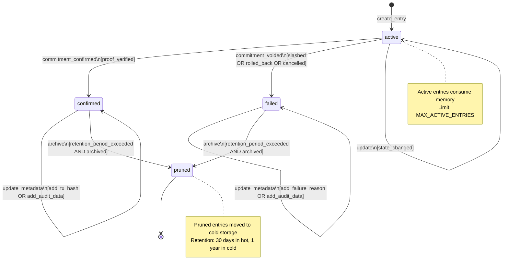

### Retention and Cleanup

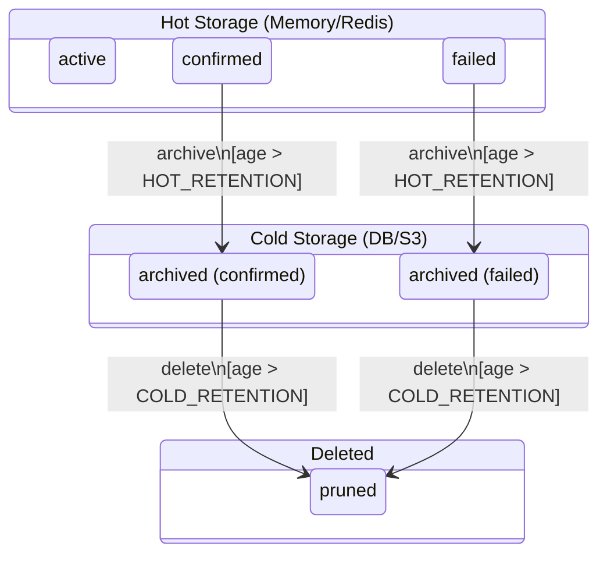

### Ledger Entry Schema

```typescript
interface CommitmentLedgerEntry {
  // Identity
  id: CommitmentId;
  taskId: TaskId;
  agentId: AgentId;
  
  // State
  state: 'active' | 'confirmed' | 'failed' | 'pruned';
  subState?: string; // Detailed sub-state from SpeculativeCommitment
  
  // Timestamps
  createdAt: Timestamp;
  updatedAt: Timestamp;
  confirmedAt?: Timestamp;
  failedAt?: Timestamp;
  prunedAt?: Timestamp;
  
  // Economics
  bondAmount: bigint;
  rewardAmount?: bigint;
  slashAmount?: bigint;
  
  // Audit trail
  transactionHashes: string[];
  failureReason?: string;
  rollbackRoot?: CommitmentId; // If failed due to cascade
  
  // Metadata
  speculationDepth: number;
  dependencies: CommitmentId[];
  dependents: CommitmentId[];
}
```

### Transition Table

| From | To | Event | Guard | Action |
|------|-----|-------|-------|--------|
| `[*]` | `active` | `create_entry` | - | `init_entry()`, `add_to_index()`, `emit(EntryCreated)` |
| `active` | `confirmed` | `commitment_confirmed` | `proof_verified` | `set_confirmed_at()`, `record_reward()`, `emit(EntryConfirmed)` |
| `active` | `failed` | `commitment_voided` | `slashed OR rolled_back OR cancelled` | `set_failed_at()`, `record_failure_reason()`, `emit(EntryFailed)` |
| `active` | `active` | `update` | `state_changed` | `update_sub_state()`, `set_updated_at()` |
| `confirmed` | `confirmed` | `update_metadata` | - | `append_audit_data()` |
| `confirmed` | `pruned` | `archive` | `retention_period_exceeded AND archived` | `remove_from_hot()`, `set_pruned_at()` |
| `failed` | `failed` | `update_metadata` | - | `append_audit_data()` |
| `failed` | `pruned` | `archive` | `retention_period_exceeded AND archived` | `remove_from_hot()`, `set_pruned_at()` |

### Cleanup Configuration

```typescript
interface LedgerCleanupConfig {
  // Retention periods
  hotRetentionMs: number;      // Default: 30 days
  coldRetentionMs: number;     // Default: 365 days
  
  // Cleanup intervals
  cleanupIntervalMs: number;   // Default: 1 hour
  archiveBatchSize: number;    // Default: 1000
  
  // Capacity limits
  maxActiveEntries: number;    // Default: 100,000
  maxHotEntries: number;       // Default: 500,000
  
  // Pressure thresholds
  pressureThreshold: number;   // Default: 0.8 (80% capacity)
  emergencyThreshold: number;  // Default: 0.95 (95% capacity)
}
```

---

## 6. Composite: Full Speculation Flow

This diagram shows how all state machines interact during a complete speculative execution lifecycle.

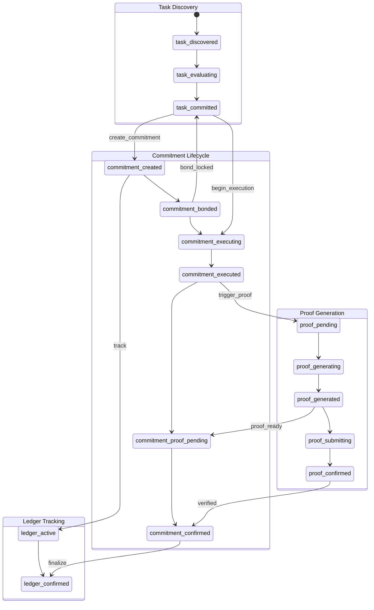

### Failure Cascade

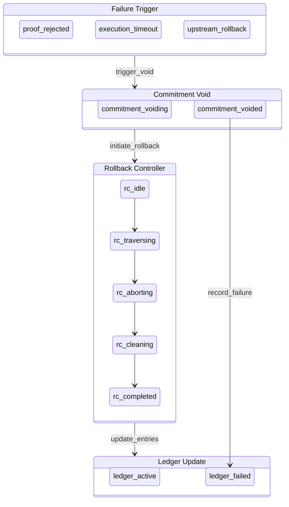

---

## Implementation Notes

### State Machine Framework Requirements

```typescript
interface StateMachine<S extends string, E extends string> {
  currentState: S;
  
  // Transitions
  transition(event: E): Promise<void>;
  canTransition(event: E): boolean;
  
  // Hooks
  onEnter(state: S, callback: () => void): void;
  onExit(state: S, callback: () => void): void;
  onTransition(from: S, to: S, callback: () => void): void;
  
  // Guards
  addGuard(from: S, to: S, guard: () => boolean): void;
  
  // Persistence
  serialize(): StateMachineSnapshot;
  deserialize(snapshot: StateMachineSnapshot): void;
}
```

### Error Recovery

All state machines should implement:

1. **Snapshot on transition** - Persist state before each transition
2. **Idempotent transitions** - Same event applied twice has same result
3. **Timeout recovery** - Stuck states auto-transition after configurable timeout
4. **Manual override** - Admin can force state transitions for recovery

### Metrics to Track

| Metric | Description |
|--------|-------------|
| `speculation_commitments_total` | Total commitments by final state |
| `speculation_proof_generation_duration_ms` | Histogram of proof generation times |
| `speculation_rollback_cascade_size` | Histogram of commitments affected per rollback |
| `speculation_ledger_entries_by_state` | Gauge of entries in each state |
| `speculation_bond_total_locked` | Total SOL currently locked in bonds |
| `speculation_slash_total` | Total SOL slashed |
| `speculation_reward_total` | Total rewards distributed |

---

## References

- [AgenC Whitepaper](../../WHITEPAPER.md)
- [SDK Documentation](../../../sdk/README.md)
- [Runtime Documentation](../../../runtime/README.md)
- [RISC Zero ZK Circuits](../../../zkvm/)
