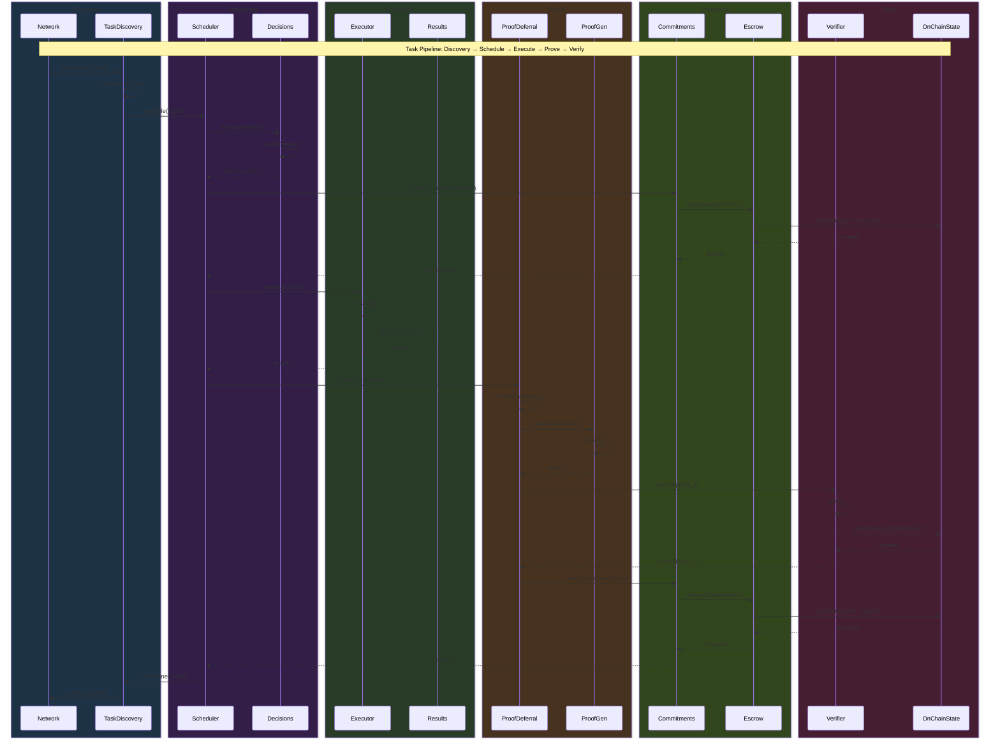

# Speculative Execution Swimlane Diagrams

Swimlane diagrams showing clear responsibility boundaries between components in AgenC's speculative execution system.

---

## 1. Speculation Orchestration

Shows the flow of responsibility across TaskDiscovery, SpeculativeScheduler, ProofDeferral, and OnChain components during speculative execution.

```mermaid
sequenceDiagram
    box rgb(30, 50, 70) Task Discovery Layer
        participant TD as TaskDiscovery
        participant TQ as TaskQueue
    end

    box rgb(50, 30, 70) Scheduling Layer
        participant STS as SpeculativeScheduler
        participant DEC as DecisionEngine
        participant EX as Executor
    end

    box rgb(70, 50, 30) Proof Management Layer
        participant PDM as ProofDeferralManager
        participant PG as ProofGenerator
        participant AC as AncestorChecker
    end

    box rgb(30, 70, 50) On-Chain Layer
        participant ESC as EscrowContract
        participant VER as VerifierContract
        participant STK as StakeAccount
    end

    Note over TD,STK: === TASK DISCOVERY PHASE ===

    TD->>TD: pollForNewTasks()
    TD->>TQ: enqueue(TaskX, deps=[TaskY])
    TQ-->>TD: queued

    TD->>STS: notifyTaskAvailable(TaskX)

    Note over TD,STK: === SCHEDULING DECISION PHASE ===

    STS->>DEC: evaluateTask(TaskX)

    DEC->>DEC: checkDependencyStatus(TaskY)
    Note right of DEC: TaskY = UNCONFIRMED

    DEC->>DEC: checkSpeculationCriteria()
    activate DEC
    DEC->>DEC: ✓ depthLimit
    DEC->>DEC: ✓ stakeLimit
    DEC->>DEC: ✓ reputation
    DEC->>DEC: ✓ circuitBreaker
    deactivate DEC

    DEC-->>STS: decision = SPECULATE

    STS->>ESC: requestStakeBond(agent, 100 SOL)
    ESC->>STK: transfer(agent → escrow, 100 SOL)
    STK-->>ESC: bonded
    ESC-->>STS: bondId_X

    Note over TD,STK: === EXECUTION PHASE ===

    STS->>EX: speculativeExecute(TaskX, input=result_Y)

    activate EX
    EX->>EX: loadTaskDefinition(TaskX)
    EX->>EX: validateInput(result_Y)
    EX->>EX: performComputation()
    EX->>EX: generateResult(result_X)
    deactivate EX

    EX-->>STS: result_X (hash: 0xAAA)

    STS->>STS: registerSpeculativeResult(TaskX, result_X)
    STS->>TQ: markInProgress(TaskX)

    Note over TD,STK: === PROOF DEFERRAL PHASE ===

    STS->>PDM: queueProof(TaskX, result_X, ancestors=[TaskY])

    PDM->>PDM: createProofRecord(TaskX)
    PDM->>AC: checkAncestors([TaskY])

    AC->>AC: queryStatus(TaskY)
    AC-->>PDM: status(TaskY) = UNCONFIRMED

    PDM->>PDM: state(TaskX) = BLOCKED_ON_ANCESTOR
    Note right of PDM: Waiting for TaskY proof

    rect rgb(60, 60, 40)
        Note over PDM,AC: === ANCESTOR CONFIRMATION WAIT ===

        loop Poll until ancestor confirms
            PDM->>AC: checkAncestors([TaskY])
            AC-->>PDM: still pending...
        end

        AC-->>PDM: status(TaskY) = CONFIRMED ✓
    end

    PDM->>PDM: state(TaskX) = READY_FOR_GENERATION

    Note over TD,STK: === PROOF GENERATION PHASE ===

    PDM->>PG: generateProof(TaskX, result_X)
    PDM->>PDM: state(TaskX) = GENERATING

    activate PG
    PG->>PG: loadCircuit(TaskX.type)
    PG->>PG: computeWitness(result_X, secrets)
    PG->>PG: runGroth16Prover(witness)
    PG-->>PDM: proof_X (256 bytes)
    deactivate PG

    PDM->>PDM: state(TaskX) = GENERATED

    PDM->>AC: finalAncestorCheck([TaskY])
    AC-->>PDM: allValid ✓

    PDM->>PDM: state(TaskX) = READY_FOR_SUBMISSION

    Note over TD,STK: === ON-CHAIN SUBMISSION PHASE ===

    PDM->>VER: submitProof(TaskX, proof_X, publicInputs)

    activate VER
    VER->>VER: deserializeProof(proof_X)
    VER->>VER: loadVerifyingKey(TaskX.circuit)
    VER->>VER: verifyGroth16(proof, vk, inputs)
    VER-->>PDM: VERIFIED ✓
    deactivate VER

    PDM->>PDM: state(TaskX) = CONFIRMED

    PDM->>ESC: releaseStake(bondId_X)
    ESC->>STK: transfer(escrow → agent, 100 SOL)
    STK-->>ESC: released
    ESC-->>PDM: stakeReleased

    PDM->>STS: notifyConfirmed(TaskX)
    STS->>TQ: markComplete(TaskX)
    TQ->>TD: taskCompleted(TaskX)

    Note over TD,STK: === ORCHESTRATION COMPLETE ===

    rect rgb(40, 40, 60)
        Note over TD,TQ: TaskDiscovery Responsibilities:<br/>• Find new tasks<br/>• Maintain task queue<br/>• Track task lifecycle

        Note over STS,EX: Scheduler Responsibilities:<br/>• Make speculation decisions<br/>• Coordinate execution<br/>• Manage commitments

        Note over PDM,AC: ProofDeferral Responsibilities:<br/>• Queue proofs<br/>• Track ancestor dependencies<br/>• Manage proof lifecycle

        Note over ESC,STK: OnChain Responsibilities:<br/>• Bond/release stakes<br/>• Verify proofs<br/>• Maintain escrow
    end
```

---

## 2. Rollback Cascade

Shows the flow of responsibility when a proof fails and requires cascading rollback across FailedTask, RollbackController, DependencyGraph, CommitmentLedger, and AffectedTasks.

```mermaid
sequenceDiagram
    box rgb(80, 40, 40) Failed Task
        participant FT as FailedTask (B)
        participant FP as FailedProof
    end

    box rgb(70, 50, 30) Rollback Controller
        participant RC as RollbackController
        participant RS as RollbackStrategy
        participant RE as RollbackExecutor
    end

    box rgb(50, 30, 70) Dependency Graph
        participant DG as DependencyGraph
        participant DT as DependencyTraverser
        participant RI as ResultInvalidator
    end

    box rgb(30, 50, 70) Commitment Ledger
        participant CL as CommitmentLedger
        participant SH as SlashHandler
        participant CM as CompensationManager
    end

    box rgb(60, 60, 40) Affected Tasks
        participant AT_C as AffectedTask (C)
        participant AT_D as AffectedTask (D)
        participant AT_E as AffectedTask (E)
    end

    Note over FT,AT_E: === FAILURE DETECTION ===

    FP->>FP: proofVerificationFailed()
    FP->>FT: notifyFailure(reason: INVALID_PROOF)

    FT->>RC: initiateRollback(TaskB, reason: PROOF_FAILED)

    Note over FT,AT_E: === DEPENDENCY ANALYSIS ===

    RC->>RS: selectStrategy(PROOF_FAILED)
    RS-->>RC: strategy = CASCADE_ROLLBACK

    RC->>DG: getDependencyTree(TaskB)

    DG->>DT: traverseForward(TaskB)

    activate DT
    DT->>DT: findDirectDependents(TaskB)
    DT-->>DT: dependents = [TaskC]

    DT->>DT: findDirectDependents(TaskC)
    DT-->>DT: dependents = [TaskD, TaskE]

    DT->>DT: buildAffectedSet()
    Note right of DT: TaskB → TaskC → [TaskD, TaskE]
    deactivate DT

    DT-->>DG: affectedTasks = [C, D, E]
    DG-->>RC: dependencyTree

    RC->>RC: sortByReverseTopology([C, D, E])
    Note right of RC: Process order: D, E, C, B<br/>(leaves first, root last)

    Note over FT,AT_E: === PROCESS LEAF NODES (D & E) ===

    par Process Task D
        RC->>RE: processAffected(TaskD)
        RE->>AT_D: abort()

        AT_D->>AT_D: cancelExecution()
        AT_D-->>RE: executionCancelled

        RE->>CL: getCommitment(TaskD)
        CL-->>RE: commitment_D (stake=100, owner=AgentD)

        RE->>CL: processAbortion(TaskD, reason=ANCESTOR_FAILED)
        CL->>CL: status(D) = ABORTED

        RE->>DG: removeResult(TaskD)
        DG->>RI: invalidate(result_D)
        RI-->>DG: invalidated

        RE-->>RC: processed(TaskD)
    and Process Task E
        RC->>RE: processAffected(TaskE)
        RE->>AT_E: abort()

        AT_E->>AT_E: cancelExecution()
        AT_E-->>RE: executionCancelled

        RE->>CL: getCommitment(TaskE)
        CL-->>RE: commitment_E (stake=100, owner=AgentE)

        RE->>CL: processAbortion(TaskE, reason=ANCESTOR_FAILED)
        CL->>CL: status(E) = ABORTED

        RE->>DG: removeResult(TaskE)
        DG->>RI: invalidate(result_E)
        RI-->>DG: invalidated

        RE-->>RC: processed(TaskE)
    end

    Note over FT,AT_E: === PROCESS INTERMEDIATE NODE (C) ===

    RC->>RE: processAffected(TaskC)
    RE->>AT_C: abort()

    AT_C->>AT_C: cancelExecution()
    AT_C->>AT_C: cancelPendingProof()
    AT_C-->>RE: executionCancelled

    RE->>CL: getCommitment(TaskC)
    CL-->>RE: commitment_C (stake=100, owner=AgentC)

    RE->>CL: processAbortion(TaskC, reason=ANCESTOR_FAILED)
    CL->>CL: status(C) = ABORTED

    RE->>DG: removeResult(TaskC)
    DG->>RI: invalidate(result_C)
    DG->>DG: removeEdge(B → C)
    DG->>DG: removeEdge(C → D)
    DG->>DG: removeEdge(C → E)
    RI-->>DG: invalidated

    RE-->>RC: processed(TaskC)

    Note over FT,AT_E: === PROCESS ROOT CAUSE (B) ===

    RC->>RE: processFailed(TaskB)

    RE->>CL: getCommitment(TaskB)
    CL-->>RE: commitment_B (stake=100, owner=AgentB)

    RE->>CL: processFailure(TaskB, reason=PROOF_INVALID)

    CL->>SH: calculateSlash(commitment_B)
    SH->>SH: slashRate = 50% (PROOF_FAILURE)
    SH->>SH: slashAmount = 50 SOL
    SH-->>CL: slashAmount

    CL->>SH: executeSlash(AgentB, 50 SOL)
    SH-->>CL: slashed

    CL->>CM: distributeCompensation(50 SOL, affected=[C,D,E])

    CM->>CM: calculateShares([C,D,E])
    Note right of CM: Protocol: 20 SOL<br/>TaskC owner: 15 SOL<br/>TaskD owner: 7.5 SOL<br/>TaskE owner: 7.5 SOL

    CM->>CM: transferToProtocol(20 SOL)
    CM->>CM: compensate(AgentC, 15 SOL)
    CM->>CM: compensate(AgentD, 7.5 SOL)
    CM->>CM: compensate(AgentE, 7.5 SOL)
    CM-->>CL: compensationDistributed

    CL->>CL: releaseRemainder(AgentB, 50 SOL)
    CL->>CL: status(B) = FAILED

    RE->>DG: removeResult(TaskB)
    DG->>RI: invalidate(result_B)
    DG->>DG: removeEdge(A → B)
    RI-->>DG: invalidated

    RE-->>RC: processed(TaskB)

    Note over FT,AT_E: === STAKE RELEASE FOR ABORTED TASKS ===

    rect rgb(60, 60, 40)
        Note over CL,CM: Release stakes for non-faulty aborted tasks

        CL->>CL: releaseStake(AgentC, 100 SOL)
        CL->>CL: releaseStake(AgentD, 100 SOL)
        CL->>CL: releaseStake(AgentE, 100 SOL)
    end

    Note over FT,AT_E: === EMIT ROLLBACK EVENTS ===

    RC->>RC: buildRollbackReport()

    rect rgb(40, 40, 60)
        Note over RC: RollbackReport:<br/>origin: TaskB<br/>reason: PROOF_FAILED<br/>aborted: [C, D, E]<br/>slashed: 50 SOL<br/>compensated: {C:15, D:7.5, E:7.5}
    end

    RC->>RC: emitRollbackComplete(report)

    Note over FT,AT_E: === REQUEUE TASKS ===

    RC->>RC: requeueForRetry([TaskB])
    Note right of RC: TaskB available for<br/>different agent to attempt

    Note over FT,AT_E: === RESPONSIBILITY SUMMARY ===

    rect rgb(40, 40, 60)
        Note over FT,FP: FailedTask Responsibilities:<br/>• Detect failure<br/>• Report to controller

        Note over RC,RE: RollbackController Responsibilities:<br/>• Orchestrate cascade<br/>• Determine processing order<br/>• Coordinate all components

        Note over DG,RI: DependencyGraph Responsibilities:<br/>• Find affected tasks<br/>• Traverse dependencies<br/>• Invalidate results

        Note over CL,CM: CommitmentLedger Responsibilities:<br/>• Track commitments<br/>• Execute slashing<br/>• Distribute compensation

        Note over AT_C,AT_E: AffectedTasks Responsibilities:<br/>• Cancel execution<br/>• Accept abort notification
    end
```

---

## 3. Economic Flow

Shows the flow of funds between Producer, EscrowAccount, Treasury, and AffectedAgents during stake bonding, success, and failure scenarios.

```mermaid
sequenceDiagram
    box rgb(30, 50, 70) Producer (Agent)
        participant AG as Agent
        participant WAL as Agent Wallet
    end

    box rgb(50, 70, 30) Escrow System
        participant ESC as EscrowAccount
        participant BOND as BondLedger
        participant REL as ReleaseManager
    end

    box rgb(70, 30, 50) Treasury
        participant TR as Treasury
        participant PROT as ProtocolFund
        participant COMP as CompensationPool
    end

    box rgb(60, 60, 40) Affected Agents
        participant AA1 as AffectedAgent1
        participant AA2 as AffectedAgent2
        participant AA_WAL as Affected Wallets
    end

    Note over AG,AA_WAL: ═══════════════════════════════════════════
    Note over AG,AA_WAL: PHASE 1: STAKE BONDING
    Note over AG,AA_WAL: ═══════════════════════════════════════════

    AG->>AG: commitToTask(TaskX)

    AG->>WAL: checkBalance()
    WAL-->>AG: balance = 500 SOL

    AG->>ESC: bondStake(TaskX, amount=100 SOL)

    ESC->>WAL: transfer(100 SOL)
    WAL->>WAL: debit(100 SOL)
    WAL-->>ESC: 100 SOL received

    ESC->>ESC: credit(agent_escrow, 100 SOL)

    ESC->>BOND: createBond(TaskX)
    BOND->>BOND: record({
        Note right of BOND: taskId: TaskX<br/>agent: AG<br/>amount: 100 SOL<br/>status: BONDED<br/>timestamp: now
    BOND->>BOND: })
    BOND-->>ESC: bondId_X

    ESC-->>AG: stakeBonded(bondId_X)

    rect rgb(40, 60, 40)
        Note over WAL,BOND: Funds Flow: Agent Wallet → Escrow Account<br/>Status: BONDED | At Risk: 100 SOL
    end

    Note over AG,AA_WAL: ═══════════════════════════════════════════
    Note over AG,AA_WAL: PHASE 2A: SUCCESS PATH
    Note over AG,AA_WAL: ═══════════════════════════════════════════

    rect rgb(40, 60, 40)
        AG->>AG: taskCompleted(TaskX)
        AG->>AG: proofVerified(TaskX) ✓

        AG->>ESC: claimStakeRelease(bondId_X)

        ESC->>BOND: getBond(bondId_X)
        BOND-->>ESC: bond (status=BONDED, amount=100)

        ESC->>BOND: updateStatus(bondId_X, RELEASING)

        ESC->>REL: processRelease(bondId_X)

        REL->>ESC: debit(agent_escrow, 100 SOL)
        REL->>WAL: transfer(100 SOL)
        WAL->>WAL: credit(100 SOL)

        REL->>BOND: updateStatus(bondId_X, RELEASED)
        REL-->>ESC: released

        ESC-->>AG: stakeReleased(100 SOL)

        Note over WAL,BOND: Funds Flow: Escrow Account → Agent Wallet<br/>Status: RELEASED | Agent made whole
    end

    Note over AG,AA_WAL: ═══════════════════════════════════════════
    Note over AG,AA_WAL: PHASE 2B: FAILURE PATH (with affected agents)
    Note over AG,AA_WAL: ═══════════════════════════════════════════

    rect rgb(80, 40, 40)
        AG->>AG: proofFailed(TaskX) ✗

        Note over ESC,COMP: Slash calculation triggered

        ESC->>BOND: getBond(bondId_X)
        BOND-->>ESC: bond (status=BONDED, amount=100)

        ESC->>ESC: calculateSlash(PROOF_FAILURE)
        Note right of ESC: slashRate = 50%<br/>slashAmount = 50 SOL<br/>returnAmount = 50 SOL

        ESC->>BOND: updateStatus(bondId_X, SLASHING)

        Note over AG,AA_WAL: --- Slash Execution ---

        ESC->>ESC: debit(agent_escrow, 100 SOL)

        ESC->>TR: receiveSlash(50 SOL, source=bondId_X)

        TR->>TR: calculateDistribution(50 SOL)
        Note right of TR: protocolShare = 40% = 20 SOL<br/>compensationShare = 60% = 30 SOL

        TR->>PROT: deposit(20 SOL)
        PROT->>PROT: credit(20 SOL)
        Note right of PROT: Protocol treasury grows<br/>Funds protocol development

        TR->>COMP: allocate(30 SOL, affected=[AA1, AA2])
        COMP->>COMP: calculateShares([AA1, AA2])
        Note right of COMP: AA1 stake: 100 SOL → 60%<br/>AA2 stake: 66 SOL → 40%

        Note over AG,AA_WAL: --- Compensation Distribution ---

        COMP->>AA1: compensate(18 SOL)
        AA1->>AA_WAL: transfer(18 SOL)
        AA_WAL->>AA_WAL: credit(AA1, 18 SOL)

        COMP->>AA2: compensate(12 SOL)
        AA2->>AA_WAL: transfer(12 SOL)
        AA_WAL->>AA_WAL: credit(AA2, 12 SOL)

        COMP-->>TR: distributed

        Note over AG,AA_WAL: --- Return Remainder to Agent ---

        ESC->>REL: processPartialReturn(bondId_X, 50 SOL)
        REL->>WAL: transfer(50 SOL)
        WAL->>WAL: credit(50 SOL)

        ESC->>BOND: updateStatus(bondId_X, SLASHED)

        Note over WAL,COMP: Funds Flow Summary:<br/>• Agent loses: 50 SOL (slash)<br/>• Protocol gains: 20 SOL<br/>• AA1 compensated: 18 SOL<br/>• AA2 compensated: 12 SOL<br/>• Agent returned: 50 SOL
    end

    Note over AG,AA_WAL: ═══════════════════════════════════════════
    Note over AG,AA_WAL: PHASE 2C: ABORT PATH (ancestor failed)
    Note over AG,AA_WAL: ═══════════════════════════════════════════

    rect rgb(60, 60, 40)
        AG->>AG: ancestorFailed(TaskY) → TaskX aborted

        AG->>ESC: claimAbortRelease(bondId_X, reason=ANCESTOR_FAILED)

        ESC->>BOND: getBond(bondId_X)
        BOND-->>ESC: bond (status=BONDED, amount=100)

        ESC->>ESC: validateAbortReason(ANCESTOR_FAILED)
        Note right of ESC: Abort is not agent's fault<br/>No slash applied

        ESC->>BOND: updateStatus(bondId_X, RELEASING)

        ESC->>REL: processFullReturn(bondId_X)
        REL->>ESC: debit(agent_escrow, 100 SOL)
        REL->>WAL: transfer(100 SOL)
        WAL->>WAL: credit(100 SOL)

        ESC->>BOND: updateStatus(bondId_X, RELEASED)

        ESC-->>AG: stakeReleased(100 SOL, reason=GRACEFUL_ABORT)

        Note over WAL,BOND: Funds Flow: Escrow → Agent (full return)<br/>Status: RELEASED | Agent made whole (not at fault)
    end

    Note over AG,AA_WAL: ═══════════════════════════════════════════
    Note over AG,AA_WAL: ECONOMIC FLOW SUMMARY
    Note over AG,AA_WAL: ═══════════════════════════════════════════

    rect rgb(40, 40, 60)
        Note over AG,WAL: Producer Responsibilities:<br/>• Provide stake capital<br/>• Accept success/failure outcomes<br/>• Receive compensation if affected

        Note over ESC,REL: Escrow Responsibilities:<br/>• Hold bonded stakes<br/>• Calculate slash amounts<br/>• Process releases and returns

        Note over TR,COMP: Treasury Responsibilities:<br/>• Receive slashed funds<br/>• Maintain protocol fund<br/>• Distribute compensation fairly

        Note over AA1,AA_WAL: Affected Agent Rights:<br/>• Receive compensation<br/>• Pro-rata based on stake<br/>• Full stake return if aborted
    end

    Note over AG,AA_WAL: ═══════════════════════════════════════════
    Note over AG,AA_WAL: FUND FLOW DIAGRAM
    Note over AG,AA_WAL: ═══════════════════════════════════════════

    rect rgb(50, 50, 50)
        Note over AG,AA_WAL: SUCCESS:<br/>Agent Wallet ──[100]──► Escrow ──[100]──► Agent Wallet

        Note over AG,AA_WAL: FAILURE:<br/>Agent Wallet ──[100]──► Escrow ──┬─[50]──► Agent Wallet<br/>                                    └─[50]──► Treasury ──┬─[20]──► Protocol<br/>                                                          └─[30]──► Affected

        Note over AG,AA_WAL: ABORT:<br/>Agent Wallet ──[100]──► Escrow ──[100]──► Agent Wallet
    end
```

---

## Additional: Complete System Swimlane

Shows all major components interacting across a complete speculative execution lifecycle.

---

## Diagram Index

| Diagram | Purpose | Key Components |
|---------|---------|----------------|
| **Speculation Orchestration** | End-to-end speculative execution flow | Discovery → Scheduler → ProofDeferral → Chain |
| **Rollback Cascade** | Failure handling and compensation | FailedTask → Controller → Graph → Ledger → Affected |
| **Economic Flow** | Fund movement through system | Producer → Escrow → Treasury → Compensated |
| **Complete System** | High-level overview | All major components |

## Component Responsibility Matrix

| Layer | Component | Primary Responsibilities |
|-------|-----------|-------------------------|
| **Discovery** | TaskDiscovery | Monitor network, validate tasks, maintain queue |
| | TaskQueue | Order tasks, track status, manage priorities |
| **Scheduling** | SpeculativeScheduler | Coordinate execution, manage commitments |
| | DecisionEngine | Evaluate criteria, make go/no-go decisions |
| | Executor | Run computations, produce results |
| **Proofs** | ProofDeferralManager | Track proof lifecycle, manage dependencies |
| | ProofGenerator | Create ZK proofs, compute witnesses |
| | AncestorChecker | Validate dependency status |
| **Economics** | CommitmentLedger | Record commitments, track outcomes |
| | EscrowAccount | Hold and release bonded stakes |
| | SlashHandler | Calculate and execute slashes |
| | CompensationManager | Distribute funds to affected parties |
| | Treasury | Protocol fund, compensation pool |
| **Rollback** | RollbackController | Orchestrate failure cascades |
| | RollbackStrategy | Select appropriate rollback approach |
| | RollbackExecutor | Execute individual task rollbacks |
| **Graph** | DependencyGraph | Track relationships between tasks |
| | DependencyTraverser | Navigate dependency structures |
| | ResultInvalidator | Remove invalid results |
| **Chain** | VerifierContract | Verify Groth16 proofs on-chain |
| | EscrowContract | On-chain escrow operations |
| | StakeAccount | Manage agent stake balances |
