# Class Diagram: Speculative Execution System

> **Related Issues:** #261, #264, #266, #269, #271  
> **Last Updated:** 2026-01-28

## Overview

This diagram shows the core classes and their relationships in the Speculative Execution subsystem.

```mermaid
classDiagram
    direction TB

    %% ============================================
    %% CORE SCHEDULER
    %% ============================================
    class SpeculativeTaskScheduler {
        -dependencyGraph: DependencyGraph
        -commitmentLedger: CommitmentLedger
        -proofDeferralManager: ProofDeferralManager
        -rollbackController: RollbackController
        -config: SpeculationConfig
        -metrics: SpeculationMetrics
        +start(): void
        +stop(): void
        +onTaskDiscovered(task: Task): void
        +onProofGenerated(taskId: Pubkey, proof: Proof): void
        +onProofConfirmed(taskId: Pubkey): void
        +onProofFailed(taskId: Pubkey, error: Error): void
        +canSpeculate(task: Task): SpeculationDecision
        +getSpeculationDepth(taskId: Pubkey): number
        +getPendingCommitments(): SpeculativeCommitment[]
    }

    class SpeculationConfig {
        +enabled: boolean
        +maxSpeculationDepth: number
        +claimBufferMs: number
        +proofTimeoutMs: number
        +baseBondLamports: bigint
        +slashPercentage: number
        +maxConcurrentSpeculations: number
        +onChainCommitmentsEnabled: boolean
    }

    class SpeculationDecision {
        +canSpeculate: boolean
        +reason: SpeculationRejectReason?
        +speculationDepth: number
        +requiredBond: bigint
        +ancestorChain: Pubkey[]
    }

    class SpeculationRejectReason {
        <<enumeration>>
        DISABLED
        MAX_DEPTH_EXCEEDED
        INSUFFICIENT_BOND
        CLAIM_EXPIRY_TOO_SOON
        ANCESTOR_FAILED
        ANCESTOR_ROLLING_BACK
        CIRCULAR_DEPENDENCY
    }

    %% ============================================
    %% DEPENDENCY GRAPH
    %% ============================================
    class DependencyGraph {
        -nodes: Map~Pubkey, TaskNode~
        -edges: Map~Pubkey, DependencyEdge[]~
        -reverseEdges: Map~Pubkey, DependencyEdge[]~
        +addTask(task: Task): TaskNode
        +removeTask(taskId: Pubkey): void
        +addDependency(from: Pubkey, to: Pubkey): DependencyEdge
        +getNode(taskId: Pubkey): TaskNode?
        +getAncestors(taskId: Pubkey): TaskNode[]
        +getDescendants(taskId: Pubkey): TaskNode[]
        +getSpeculationDepth(taskId: Pubkey): number
        +topologicalSort(): TaskNode[]
        +reverseTopologicalSort(): TaskNode[]
        +detectCycle(taskId: Pubkey): boolean
        +getUnconfirmedAncestors(taskId: Pubkey): TaskNode[]
    }

    class TaskNode {
        +taskId: Pubkey
        +task: Task
        +status: TaskNodeStatus
        +speculationDepth: number
        +claimExpiry: Date
        +createdAt: Date
        +executedAt: Date?
        +confirmedAt: Date?
    }

    class TaskNodeStatus {
        <<enumeration>>
        DISCOVERED
        AWAITING_ANCESTORS
        READY
        EXECUTING
        EXECUTED
        CONFIRMED
        FAILED
        ROLLED_BACK
    }

    class DependencyEdge {
        +from: Pubkey
        +to: Pubkey
        +dependencyType: DependencyType
        +createdAt: Date
    }

    class DependencyType {
        <<enumeration>>
        OUTPUT_INPUT
        SEQUENTIAL
        RESOURCE_LOCK
    }

    %% ============================================
    %% COMMITMENT LEDGER
    %% ============================================
    class CommitmentLedger {
        -commitments: Map~Pubkey, SpeculativeCommitment~
        -byStatus: Map~CommitmentStatus, Set~Pubkey~~
        -onChainEnabled: boolean
        +createCommitment(taskId: Pubkey, depth: number): SpeculativeCommitment
        +getCommitment(taskId: Pubkey): SpeculativeCommitment?
        +updateStatus(taskId: Pubkey, status: CommitmentStatus): void
        +getByStatus(status: CommitmentStatus): SpeculativeCommitment[]
        +calculateRequiredBond(depth: number): bigint
        +bondStake(taskId: Pubkey, amount: bigint): void
        +releaseStake(taskId: Pubkey): void
        +slashStake(taskId: Pubkey): SlashResult
        +persistToChain(commitment: SpeculativeCommitment): Promise~void~
    }

    class SpeculativeCommitment {
        +taskId: Pubkey
        +agentId: Pubkey
        +status: CommitmentStatus
        +speculationDepth: number
        +bondedStake: bigint
        +ancestorCommitments: Pubkey[]
        +executionStartedAt: Date?
        +executionCompletedAt: Date?
        +proofGeneratedAt: Date?
        +confirmedAt: Date?
        +failedAt: Date?
        +rollbackAt: Date?
        +errorReason: string?
    }

    class CommitmentStatus {
        <<enumeration>>
        PENDING
        EXECUTING
        EXECUTED
        PROOF_GENERATING
        PROOF_GENERATED
        AWAITING_ANCESTORS
        SUBMITTING
        CONFIRMED
        FAILED
        ROLLED_BACK
    }

    class SlashResult {
        +slashedAmount: bigint
        +treasuryShare: bigint
        +affectedAgentShares: Map~Pubkey, bigint~
    }

    %% ============================================
    %% PROOF DEFERRAL MANAGER
    %% ============================================
    class ProofDeferralManager {
        -proofJobs: Map~Pubkey, ProofGenerationJob~
        -deferredProofs: Map~Pubkey, DeferredProofStatus~
        -proverClient: ZKProverClient
        +startProofGeneration(taskId: Pubkey, inputs: ProofInputs): ProofGenerationJob
        +getJobStatus(taskId: Pubkey): ProofGenerationJob?
        +getDeferredStatus(taskId: Pubkey): DeferredProofStatus?
        +onProofReady(taskId: Pubkey, proof: Proof): void
        +canSubmitProof(taskId: Pubkey): boolean
        +submitProof(taskId: Pubkey): Promise~TransactionSignature~
        +cancelProofGeneration(taskId: Pubkey): void
        +getAncestorStatuses(taskId: Pubkey): AncestorStatus[]
    }

    class ProofGenerationJob {
        +taskId: Pubkey
        +status: ProofJobStatus
        +inputs: ProofInputs
        +proof: Proof?
        +startedAt: Date
        +completedAt: Date?
        +estimatedCompletionMs: number
        +retryCount: number
        +lastError: Error?
    }

    class ProofJobStatus {
        <<enumeration>>
        QUEUED
        GENERATING
        GENERATED
        FAILED
        CANCELLED
        TIMED_OUT
    }

    class DeferredProofStatus {
        +taskId: Pubkey
        +proof: Proof
        +status: DeferralStatus
        +waitingFor: Pubkey[]
        +deferredAt: Date
        +submittedAt: Date?
    }

    class DeferralStatus {
        <<enumeration>>
        AWAITING_ANCESTORS
        READY_TO_SUBMIT
        SUBMITTING
        SUBMITTED
        FAILED
    }

    class ProofInputs {
        +taskId: Pubkey
        +computeOutput: Buffer
        +inputHashes: Buffer[]
        +executionTrace: Buffer
    }

    %% ============================================
    %% ROLLBACK CONTROLLER
    %% ============================================
    class RollbackController {
        -activeRollbacks: Map~Pubkey, RollbackOperation~
        -dependencyGraph: DependencyGraph
        -commitmentLedger: CommitmentLedger
        +initiateRollback(taskId: Pubkey, reason: RollbackReason): RollbackResult
        +getRollbackStatus(taskId: Pubkey): RollbackOperation?
        +getAffectedTasks(taskId: Pubkey): Pubkey[]
        -cascadeRollback(taskId: Pubkey): RolledBackTask[]
        -rollbackSingleTask(taskId: Pubkey): RolledBackTask
        -notifyAffectedAgents(tasks: RolledBackTask[]): void
    }

    class RollbackOperation {
        +rootTaskId: Pubkey
        +reason: RollbackReason
        +status: RollbackOperationStatus
        +affectedTasks: Pubkey[]
        +rolledBackTasks: RolledBackTask[]
        +startedAt: Date
        +completedAt: Date?
    }

    class RollbackOperationStatus {
        <<enumeration>>
        IN_PROGRESS
        COMPLETED
        PARTIALLY_COMPLETED
        FAILED
    }

    class RollbackResult {
        +success: boolean
        +rootTaskId: Pubkey
        +rolledBackTasks: RolledBackTask[]
        +slashedAmount: bigint
        +errors: RollbackError[]
    }

    class RolledBackTask {
        +taskId: Pubkey
        +previousStatus: CommitmentStatus
        +computeWasted: bigint
        +bondReleased: bigint
        +rolledBackAt: Date
    }

    class RollbackReason {
        <<enumeration>>
        PROOF_VERIFICATION_FAILED
        PROOF_GENERATION_FAILED
        PROOF_TIMEOUT
        ANCESTOR_FAILED
        CLAIM_EXPIRED
        MANUAL_CANCEL
    }

    class RollbackError {
        +taskId: Pubkey
        +error: string
        +recoverable: boolean
    }

    %% ============================================
    %% EXTERNAL INTERFACES
    %% ============================================
    class Task {
        <<external>>
        +id: Pubkey
        +dependsOn: Pubkey?
        +claimant: Pubkey
        +claimExpiry: Date
        +inputHash: Buffer
        +status: TaskStatus
    }

    class Proof {
        <<external>>
        +taskId: Pubkey
        +proof: Buffer
        +publicInputs: Buffer
        +verificationKey: Pubkey
    }

    class ZKProverClient {
        <<interface>>
        +generateProof(inputs: ProofInputs): Promise~Proof~
        +cancelGeneration(jobId: string): void
        +estimateTime(inputs: ProofInputs): number
    }

    class SpeculationMetrics {
        +speculationsStarted: Counter
        +speculationsConfirmed: Counter
        +speculationsRolledBack: Counter
        +rollbackCascadeSize: Histogram
        +speculationDepth: Histogram
        +proofDeferralTime: Histogram
        +wastedComputeTokens: Counter
    }

    %% ============================================
    %% RELATIONSHIPS
    %% ============================================
    
    %% Scheduler owns/composes all components
    SpeculativeTaskScheduler *-- DependencyGraph : owns
    SpeculativeTaskScheduler *-- CommitmentLedger : owns
    SpeculativeTaskScheduler *-- ProofDeferralManager : owns
    SpeculativeTaskScheduler *-- RollbackController : owns
    SpeculativeTaskScheduler *-- SpeculationConfig : configured by
    SpeculativeTaskScheduler *-- SpeculationMetrics : tracks
    SpeculativeTaskScheduler ..> SpeculationDecision : produces

    %% DependencyGraph relationships
    DependencyGraph o-- TaskNode : contains
    DependencyGraph o-- DependencyEdge : contains
    TaskNode --> TaskNodeStatus : has
    TaskNode ..> Task : references
    DependencyEdge --> DependencyType : typed as

    %% CommitmentLedger relationships
    CommitmentLedger o-- SpeculativeCommitment : manages
    SpeculativeCommitment --> CommitmentStatus : has
    CommitmentLedger ..> SlashResult : produces

    %% ProofDeferralManager relationships
    ProofDeferralManager o-- ProofGenerationJob : manages
    ProofDeferralManager o-- DeferredProofStatus : tracks
    ProofGenerationJob --> ProofJobStatus : has
    ProofGenerationJob ..> ProofInputs : uses
    ProofGenerationJob ..> Proof : produces
    DeferredProofStatus --> DeferralStatus : has
    ProofDeferralManager --> ZKProverClient : uses

    %% RollbackController relationships
    RollbackController o-- RollbackOperation : executes
    RollbackOperation --> RollbackOperationStatus : has
    RollbackOperation o-- RolledBackTask : contains
    RollbackController ..> RollbackResult : produces
    RollbackResult o-- RolledBackTask : contains
    RollbackResult o-- RollbackError : may contain
    RollbackOperation --> RollbackReason : triggered by

    %% Cross-component dependencies
    RollbackController --> DependencyGraph : queries
    RollbackController --> CommitmentLedger : updates
    ProofDeferralManager --> DependencyGraph : queries ancestors

    %% Speculation decision enum
    SpeculationDecision --> SpeculationRejectReason : may have
```

## Component Responsibilities

| Component | Primary Responsibility | Issue |
|-----------|----------------------|-------|
| `SpeculativeTaskScheduler` | Orchestrates all speculation decisions and lifecycle | #271 |
| `DependencyGraph` | Tracks task dependencies and ancestor relationships | #261 |
| `CommitmentLedger` | Records speculative commitments and stake bonding | #266 |
| `ProofDeferralManager` | Manages proof generation and deferred submission | #264 |
| `RollbackController` | Handles cascading rollback when speculation fails | #269 |

## Key Invariants

1. **Proof Ordering (ADR-002):** A task's proof can only be submitted when ALL ancestor commitments are CONFIRMED
2. **Rollback Order (ADR-005):** Rollbacks proceed in reverse topological order (leaves first)
3. **Exponential Bonding (ADR-003):** `bonded_stake = base_bond × 2^depth`
