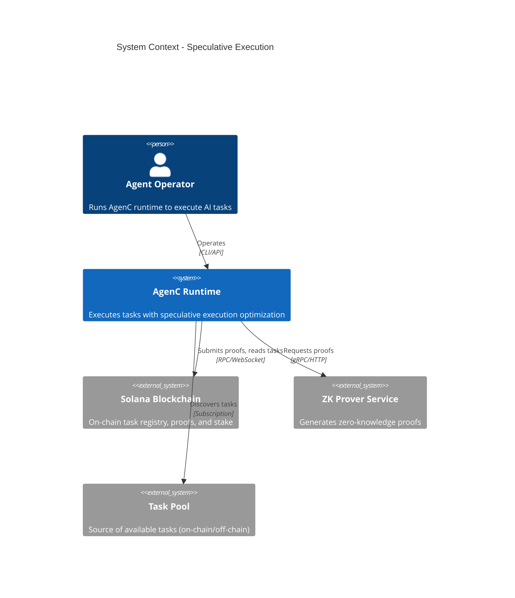
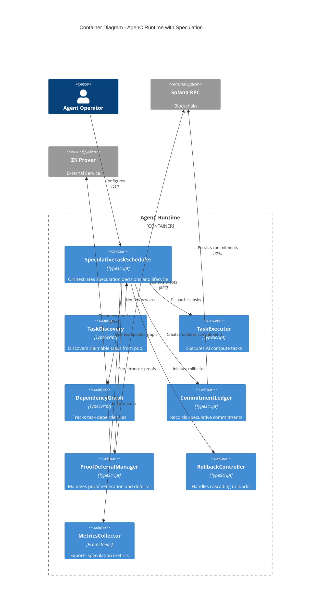
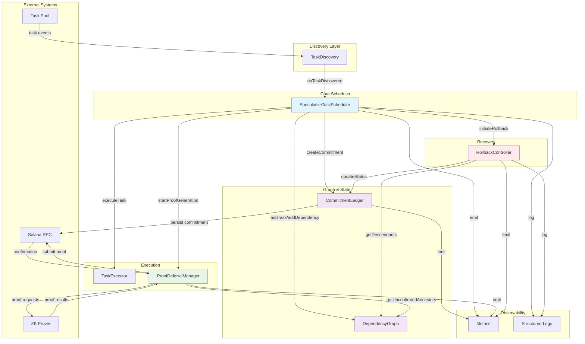
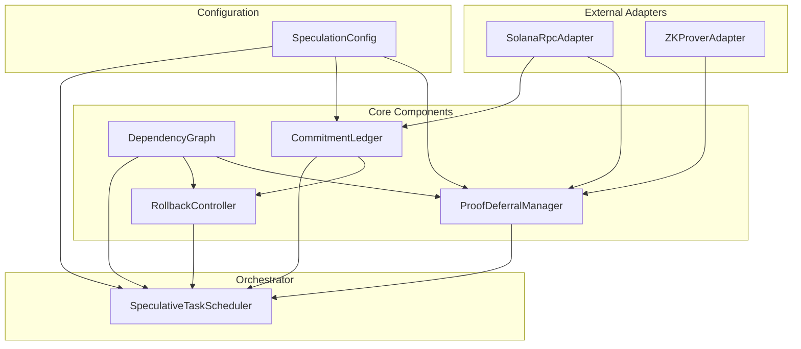
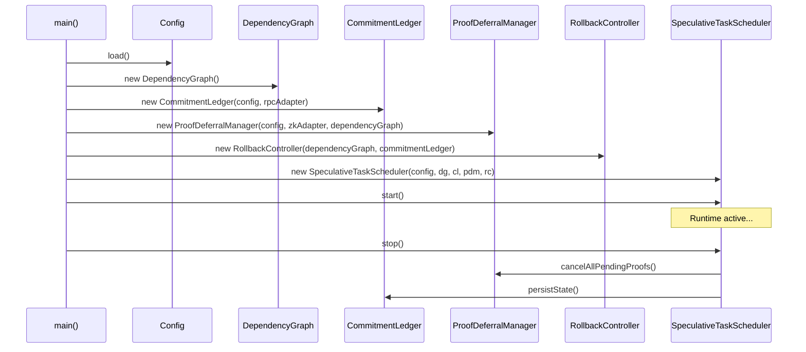
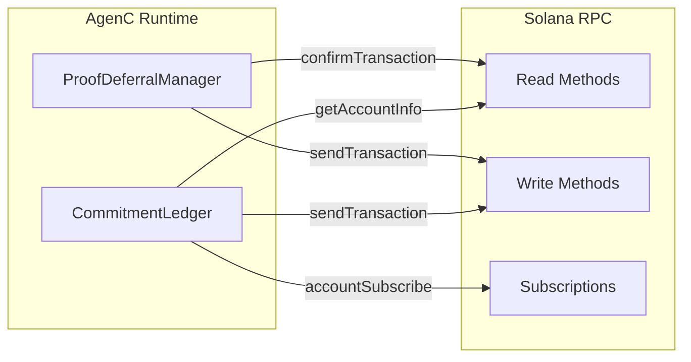
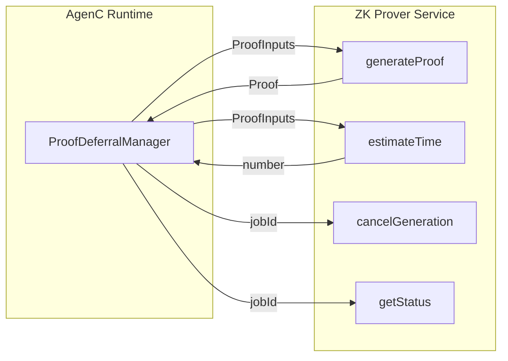
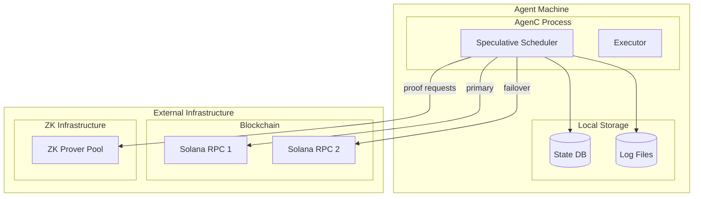
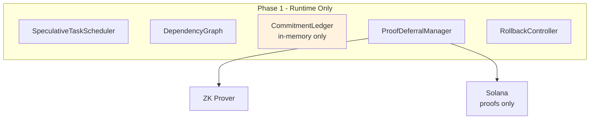
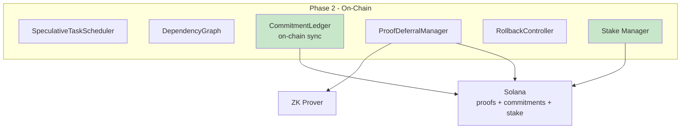

# Component Diagram: Speculative Execution System

> **Related Issues:** #261, #264, #266, #269, #271, #273  
> **Last Updated:** 2026-01-28

## Overview

This diagram shows the high-level component relationships in the Speculative Execution subsystem, including both runtime and external dependencies.

## C4 Context Diagram

## C4 Container Diagram

## Component Relationships

## Component Interface Matrix

| Component | Provides | Consumes |
|-----------|----------|----------|
| **TaskDiscovery** | `onTaskDiscovered(task)` events | Task Pool subscriptions |
| **SpeculativeTaskScheduler** | Orchestration, speculation decisions | All internal components |
| **DependencyGraph** | Graph queries, topological sorts | Task metadata |
| **CommitmentLedger** | Commitment CRUD, stake management | Solana RPC (optional) |
| **ProofDeferralManager** | Proof lifecycle management | ZK Prover, DependencyGraph |
| **RollbackController** | Rollback execution | DependencyGraph, CommitmentLedger |
| **TaskExecutor** | Task execution results | Task specifications |

## Dependency Injection Structure

## Component Lifecycle

## External System Interfaces

### Solana RPC Interface

**Required RPC Methods:**
- `getAccountInfo` - Read task and commitment accounts
- `sendTransaction` - Submit proofs, create commitments
- `confirmTransaction` - Wait for finality
- `accountSubscribe` - Watch for on-chain state changes

### ZK Prover Interface

**ZK Prover Methods:**
- `generateProof(inputs: ProofInputs): Promise<Proof>` - Generate ZK proof
- `estimateTime(inputs: ProofInputs): number` - Estimate generation time
- `cancelGeneration(jobId: string): void` - Cancel pending job
- `getStatus(jobId: string): ProofJobStatus` - Query job status

## Deployment Topology

## Phase 1 vs Phase 2 Components

### Phase 1: Runtime-Only (ADR-004)

### Phase 2: On-Chain Commitments

