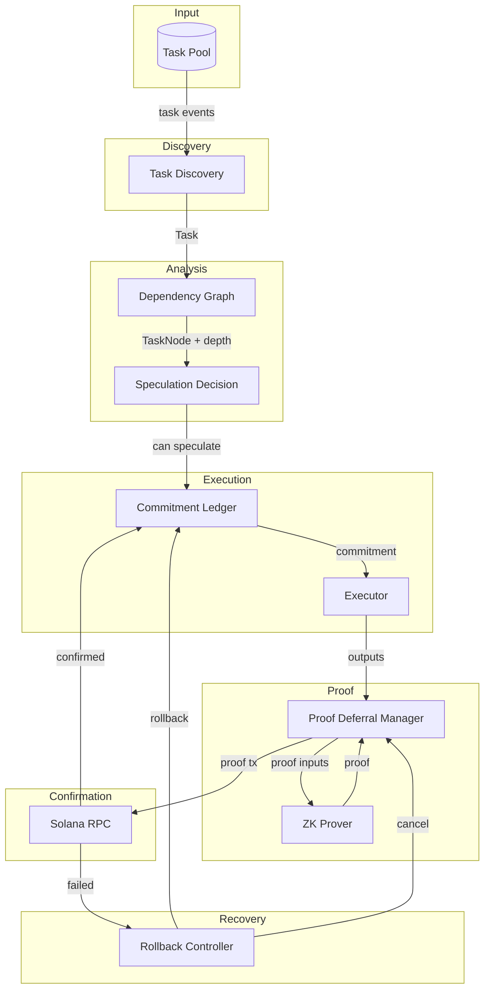
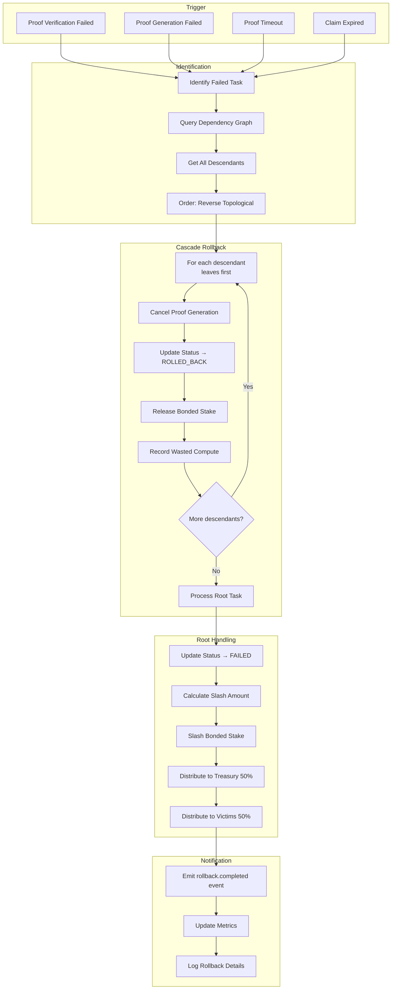
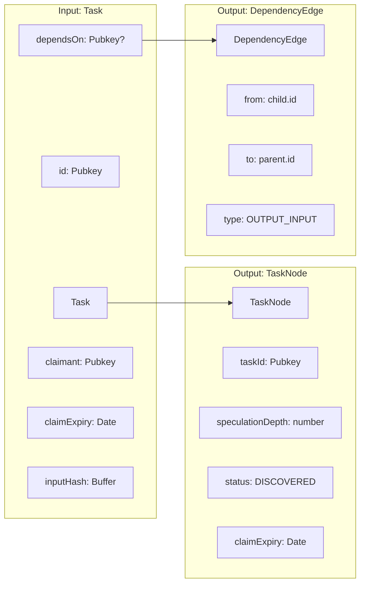
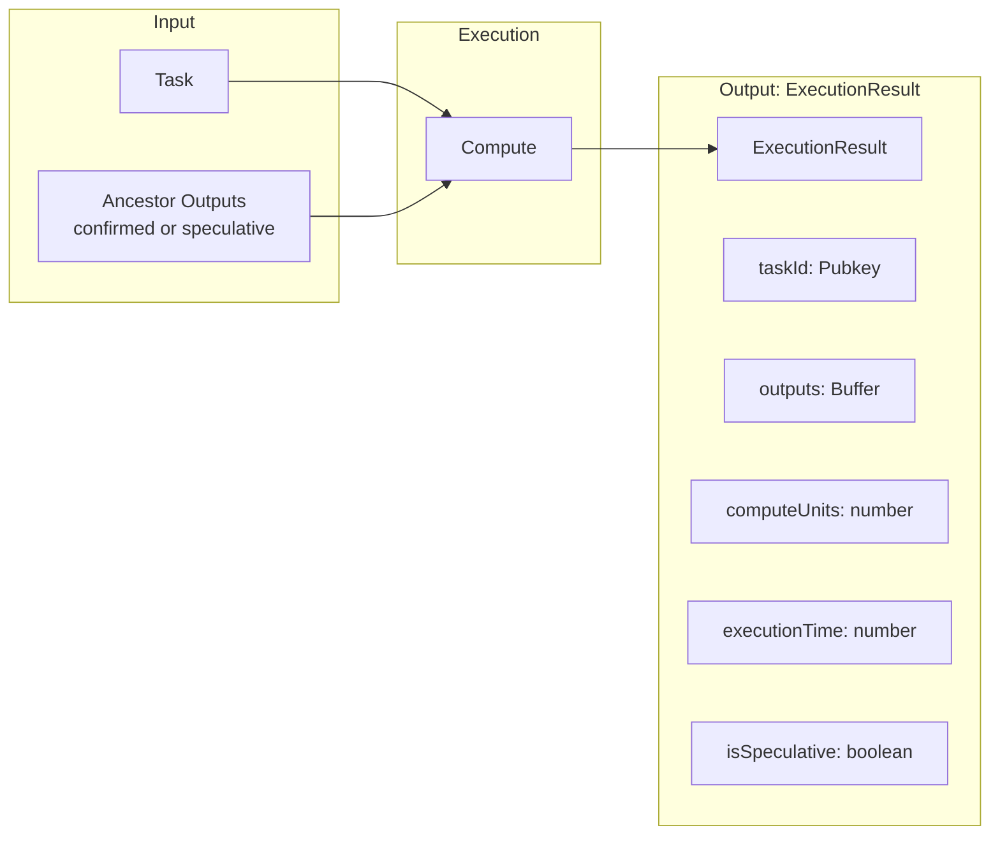
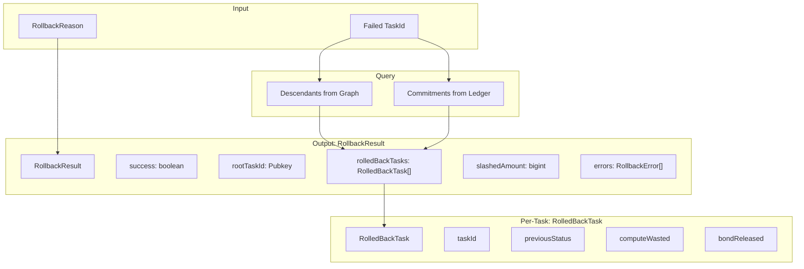
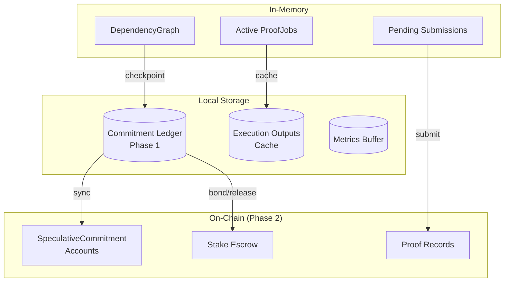
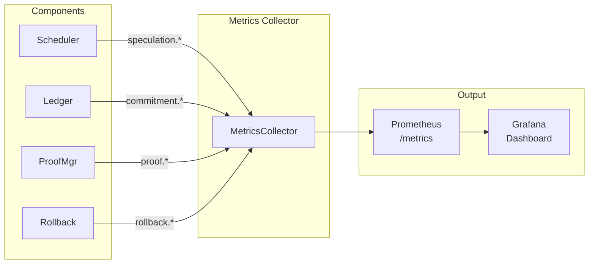

# Data Flow Diagram: Speculative Execution

> **Related Issues:** #261, #264, #266, #269, #271  
> **Last Updated:** 2026-01-28

## Overview

This document shows how data flows through the Speculative Execution system, from task discovery through confirmation or rollback.

## High-Level Data Flow



## Detailed Data Flow - Happy Path

```mermaid
flowchart LR
    subgraph "1. Discovery"
        A1[Task Event] --> A2[Parse Task]
        A2 --> A3{Has depends_on?}
        A3 -->|Yes| A4[Extract Parent ID]
        A3 -->|No| A5[Standalone Task]
    end
    
    subgraph "2. Graph Building"
        A4 --> B1[Create TaskNode]
        A5 --> B1
        B1 --> B2[Add to Graph]
        B2 --> B3[Create DependencyEdge]
        B3 --> B4[Calculate Depth]
    end
    
    subgraph "3. Speculation Decision"
        B4 --> C1{Can Speculate?}
        C1 -->|Check depth| C2[depth ≤ maxDepth?]
        C1 -->|Check ancestors| C3[ancestors not failed?]
        C1 -->|Check expiry| C4[claim not expiring?]
        C2 --> C5{All checks pass?}
        C3 --> C5
        C4 --> C5
        C5 -->|Yes| C6[Create Commitment]
        C5 -->|No| C7[Wait for Ancestors]
    end
    
    subgraph "4. Execution"
        C6 --> D1[Bond Stake]
        D1 --> D2[Fetch Inputs]
        D2 --> D3{Ancestor outputs<br/>available?}
        D3 -->|Yes, confirmed| D4[Use confirmed outputs]
        D3 -->|Yes, speculative| D5[Use speculative outputs]
        D4 --> D6[Execute Task]
        D5 --> D6
        D6 --> D7[Store Outputs]
    end
    
    subgraph "5. Proof Generation"
        D7 --> E1[Build ProofInputs]
        E1 --> E2[Queue Proof Job]
        E2 --> E3[ZK Prover Generates]
        E3 --> E4[Proof Ready]
    end
    
    subgraph "6. Proof Submission"
        E4 --> F1{Ancestors Confirmed?}
        F1 -->|No| F2[Defer Proof]
        F1 -->|Yes| F3[Build Transaction]
        F2 -->|ancestor confirms| F3
        F3 --> F4[Submit to Solana]
        F4 --> F5[Await Confirmation]
        F5 --> F6[Proof Confirmed!]
    end
    
    subgraph "7. Finalization"
        F6 --> G1[Update Commitment Status]
        G1 --> G2[Release Stake]
        G2 --> G3[Notify Descendants]
    end
```



## Data Flow - Rollback Path



## Data Structures in Flow

### Task Discovery → Graph



### Speculation Decision Data

```mermaid
flowchart TB
    subgraph "Input"
        I1[TaskNode]
        I2[Current Graph State]
        I3[Config]
    end
    
    subgraph "Checks"
        C1{depth ≤ maxDepth?}
        C2{bond affordable?}
        C3{claim expiry OK?}
        C4{no failed ancestors?}
        C5{no cycles?}
    end
    
    subgraph "Output: SpeculationDecision"
        O[SpeculationDecision]
        O1[canSpeculate: boolean]
        O2[reason?: RejectReason]
        O3[speculationDepth: number]
        O4[requiredBond: bigint]
        O5[ancestorChain: Pubkey[]]
    end
    
    I1 --> C1
    I2 --> C1
    I3 --> C1
    C1 --> C2 --> C3 --> C4 --> C5 --> O
```

### Execution Flow Data



### Proof Flow Data

```mermaid
flowchart LR
    subgraph "Input: ProofInputs"
        I[ProofInputs]
        I1[taskId]
        I2[computeOutput]
        I3[inputHashes]
        I4[executionTrace]
    end
    
    subgraph "ZK Prover"
        ZK[Generate Proof]
    end
    
    subgraph "Output: Proof"
        O[Proof]
        O1[taskId]
        O2[proof: Buffer]
        O3[publicInputs: Buffer]
        O4[verificationKey: Pubkey]
    end
    
    I --> ZK --> O
```



### Rollback Flow Data



## Data Persistence Points



## Event Flow Timeline

```mermaid
gantt
    title Speculative Execution Event Timeline
    dateFormat X
    axisFormat %s
    
    section Task A
    Discovered           :a1, 0, 1
    Graph Updated        :a2, after a1, 1
    Commitment Created   :a3, after a2, 1
    Executing            :a4, after a3, 10
    Proof Generating     :a5, after a4, 60
    Proof Submitted      :a6, after a5, 5
    Confirmed            :a7, after a6, 1
    
    section Task B (speculative)
    Discovered           :b1, 5, 1
    Graph Updated        :b2, after b1, 1
    Speculation Decided  :b3, after b2, 1
    Commitment Created   :b4, after b3, 1
    Executing (speculative) :b5, after b4, 10
    Proof Generating     :b6, after b5, 60
    Awaiting Ancestor    :b7, after b6, 5
    Proof Submitted      :b8, after a7, 5
    Confirmed            :b9, after b8, 1
```



## Metrics Data Flow



**Key Metrics Collected:**
| Source | Metrics |
|--------|---------|
| Scheduler | `speculation.started`, `speculation.confirmed`, `speculation.depth` |
| Ledger | `commitment.created`, `stake.bonded`, `stake.released`, `stake.slashed` |
| ProofMgr | `proof.queued`, `proof.generated`, `proof.deferred`, `proof.submitted` |
| Rollback | `rollback.initiated`, `rollback.cascade_size`, `compute.wasted` |
