# Sequence Diagram: Successful Speculative Execution

> **Related Issues:** #271, #264, #266  
> **Last Updated:** 2026-01-28

## Overview

This diagram shows the happy path where Task A completes and its dependent Task B speculatively executes successfully, with both proofs confirming on-chain.

```mermaid
sequenceDiagram
    autonumber
    
    participant TD as TaskDiscovery
    participant STS as SpeculativeTaskScheduler
    participant DG as DependencyGraph
    participant CL as CommitmentLedger
    participant PDM as ProofDeferralManager
    participant EX as Executor
    participant ZK as ZK Prover
    participant SOL as Solana RPC

    %% ============================================
    %% PHASE 1: Task A Discovery and Execution
    %% ============================================
    rect rgb(230, 245, 230)
        Note over TD,SOL: Phase 1: Task A Discovered and Executed
        
        TD->>STS: onTaskDiscovered(TaskA)
        STS->>DG: addTask(TaskA)
        DG-->>STS: TaskNode(A, depth=0)
        
        STS->>CL: createCommitment(A, depth=0)
        CL->>CL: calculateRequiredBond(0) → baseBond
        CL-->>STS: SpeculativeCommitment(A, PENDING)
        
        STS->>CL: bondStake(A, baseBond)
        CL->>CL: updateStatus(A, EXECUTING)
        
        STS->>EX: executeTask(TaskA)
        activate EX
        Note right of EX: Task A computes...
        EX-->>STS: ExecutionResult(A, outputs)
        deactivate EX
        
        STS->>CL: updateStatus(A, EXECUTED)
        
        STS->>PDM: startProofGeneration(A, outputs)
        PDM->>ZK: generateProof(A, inputs)
        activate ZK
        Note right of ZK: Proof generation begins<br/>(async, may take minutes)
        
        STS->>CL: updateStatus(A, PROOF_GENERATING)
    end

    %% ============================================
    %% PHASE 2: Task B Discovery and Speculative Execution
    %% ============================================
    rect rgb(230, 240, 255)
        Note over TD,SOL: Phase 2: Task B Discovered (depends on A)
        
        TD->>STS: onTaskDiscovered(TaskB, dependsOn=A)
        
        STS->>DG: addTask(TaskB)
        STS->>DG: addDependency(B, A)
        DG->>DG: calculateSpeculationDepth(B) → 1
        DG-->>STS: TaskNode(B, depth=1)
        
        STS->>STS: canSpeculate(TaskB)?
        Note right of STS: Check conditions:<br/>- A status is EXECUTED ✓<br/>- depth(1) ≤ maxDepth ✓<br/>- claim not expiring soon ✓
        
        STS->>CL: createCommitment(B, depth=1)
        CL->>CL: calculateRequiredBond(1) → 2×baseBond
        CL-->>STS: SpeculativeCommitment(B, PENDING)
        
        STS->>CL: bondStake(B, 2×baseBond)
        Note right of CL: 2x stake for depth=1<br/>(exponential bonding)
        
        STS->>CL: updateStatus(B, EXECUTING)
        
        STS->>EX: executeTask(TaskB, speculativeInputs=A.outputs)
        activate EX
        Note right of EX: Task B executes speculatively<br/>using A's unconfirmed outputs
        EX-->>STS: ExecutionResult(B, outputs)
        deactivate EX
        
        STS->>CL: updateStatus(B, EXECUTED)
        
        STS->>PDM: startProofGeneration(B, outputs)
        PDM->>ZK: generateProof(B, inputs)
        Note right of ZK: B's proof generation starts<br/>while A's is still running
        
        STS->>CL: updateStatus(B, PROOF_GENERATING)
    end

    %% ============================================
    %% PHASE 3: Task A Proof Completes and Confirms
    %% ============================================
    rect rgb(255, 250, 230)
        Note over TD,SOL: Phase 3: Task A Proof Ready and Submitted
        
        ZK-->>PDM: proofReady(A, proof)
        deactivate ZK
        
        PDM->>PDM: storeProof(A, proof)
        PDM-->>STS: onProofGenerated(A, proof)
        
        STS->>CL: updateStatus(A, PROOF_GENERATED)
        
        STS->>DG: getUnconfirmedAncestors(A)
        DG-->>STS: [] (no ancestors)
        
        STS->>PDM: canSubmitProof(A)?
        PDM-->>STS: true (no unconfirmed ancestors)
        
        STS->>CL: updateStatus(A, SUBMITTING)
        
        STS->>PDM: submitProof(A)
        PDM->>SOL: submitProof(A, proof)
        activate SOL
        Note right of SOL: On-chain verification
        SOL-->>PDM: TransactionSignature
        SOL-->>PDM: confirmation
        deactivate SOL
        
        PDM-->>STS: onProofConfirmed(A)
        
        STS->>CL: updateStatus(A, CONFIRMED)
        STS->>CL: releaseStake(A)
        Note right of CL: A's bond returned<br/>Speculation succeeded!
        
        STS->>DG: updateNodeStatus(A, CONFIRMED)
    end

    %% ============================================
    %% PHASE 4: Task B Proof Completes and Confirms
    %% ============================================
    rect rgb(230, 255, 230)
        Note over TD,SOL: Phase 4: Task B Proof Ready and Submitted
        
        ZK-->>PDM: proofReady(B, proof)
        
        PDM->>PDM: storeProof(B, proof)
        PDM-->>STS: onProofGenerated(B, proof)
        
        STS->>CL: updateStatus(B, PROOF_GENERATED)
        
        STS->>DG: getUnconfirmedAncestors(B)
        DG-->>STS: [] (A is now CONFIRMED)
        
        STS->>PDM: canSubmitProof(B)?
        PDM-->>STS: true (ancestor A confirmed)
        
        Note right of STS: ADR-002 satisfied:<br/>All ancestors confirmed ✓
        
        STS->>CL: updateStatus(B, SUBMITTING)
        
        STS->>PDM: submitProof(B)
        PDM->>SOL: submitProof(B, proof)
        activate SOL
        Note right of SOL: On-chain verification<br/>with valid ancestor state
        SOL-->>PDM: TransactionSignature
        SOL-->>PDM: confirmation
        deactivate SOL
        
        PDM-->>STS: onProofConfirmed(B)
        
        STS->>CL: updateStatus(B, CONFIRMED)
        STS->>CL: releaseStake(B)
        Note right of CL: B's bond returned<br/>Speculative execution succeeded!
        
        STS->>DG: updateNodeStatus(B, CONFIRMED)
    end

    Note over TD,SOL: ✅ Both tasks confirmed!<br/>Total latency reduced by overlapping<br/>B's execution with A's proof generation
```



## Timeline Comparison

### Without Speculation (Sequential)
```
|-- A executes --|-- A proof gen --|-- A confirms --|-- B executes --|-- B proof gen --|-- B confirms --|
     t=0-10s         t=10-70s          t=70-75s         t=75-85s         t=85-145s         t=145-150s
                                                                                      
Total: ~150 seconds
```

### With Speculation (Overlapped)
```
|-- A executes --|-- A proof gen ------------------------|-- A confirms --|
     t=0-10s         t=10-70s                                t=70-75s
                   |-- B executes --|-- B proof gen ---------|-- B confirms --|
                        t=10-20s         t=20-80s                 t=75-80s
                                                                                      
Total: ~80 seconds (47% reduction!)
```

## Key Observations

1. **Overlap Period:** Task B's execution and proof generation run in parallel with Task A's proof generation
2. **Ordering Preserved:** B's proof waits until A confirms before submission (ADR-002)
3. **Stake Progression:** B requires 2x stake due to depth=1 (ADR-003)
4. **Risk Period:** Between B's execution (t=10-20s) and A's confirmation (t=70-75s), B's work is at risk

## Metrics Emitted

| Event | Metric | Value |
|-------|--------|-------|
| Task B speculated | `speculation.started` | +1 |
| A proof confirms | `proof.confirmed` | +1 |
| B proof confirms | `speculation.confirmed` | +1 |
| B confirmed | `speculation.depth` | 1 |
| Pipeline complete | `speculation.latency_saved_ms` | ~70000 |
