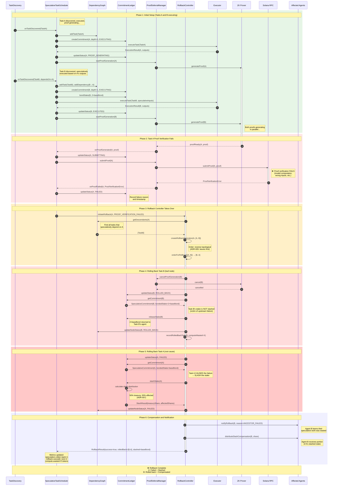
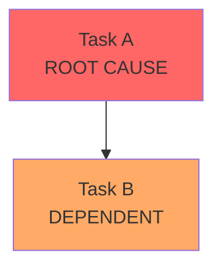
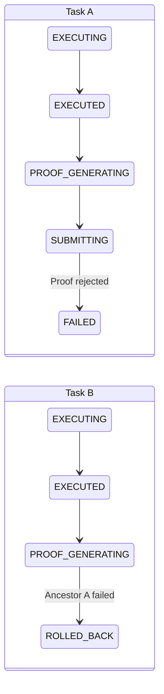

# Sequence Diagram: Rollback on Proof Failure

> **Related Issues:** #269, #271, #275  
> **Last Updated:** 2026-01-28

## Overview

This diagram shows the rollback cascade when Task A's proof fails, requiring Task B (which speculatively executed based on A's unconfirmed outputs) to be rolled back and its work discarded.



## Rollback Order Explanation (ADR-005)

The rollback proceeds in **reverse topological order** (leaves first):



**Rollback sequence:** B → A (not A → B)

**Why?**
- Rolling back A first would leave B in an inconsistent state
- B's outputs may reference A's outputs that no longer exist
- Processing leaves first ensures clean state at each level

## Stake Treatment

| Task | Role | Stake Treatment |
|------|------|-----------------|
| Task A | **Root cause** (proof failed) | **SLASHED** - Agent A loses stake |
| Task B | **Victim** (depended on A) | **RETURNED** - Agent B recovers full stake |

## Compensation Distribution (ADR-007)

When Task A's stake is slashed:

```
Slashed Amount: baseBond
├── 50% → Protocol Treasury
└── 50% → Affected Agents (proportional to wasted compute)
           └── Agent B: receives their share
```

## State Transitions



## Metrics Emitted

| Event | Metric | Value |
|-------|--------|-------|
| Rollback initiated | `rollback.initiated` | +1 |
| Task B rolled back | `speculation.rolled_back` | +1 |
| Cascade size | `rollback.cascade_size` | 2 |
| A's stake slashed | `stake.slashed_lamports` | baseBond |
| B's compute wasted | `compute.wasted_tokens` | X |

## Edge Cases

### Multiple Descendants
If Task A had multiple dependents (B, C, D), all would be rolled back:

```
Rollback order: D → C → B → A (all leaves, then root)
```

### Nested Speculation (A → B → C)
If C speculatively executed based on B's unconfirmed outputs:

```
Rollback order: C → B → A (deepest first)
```

C and B get stake returned (victims); only A gets slashed (root cause).
