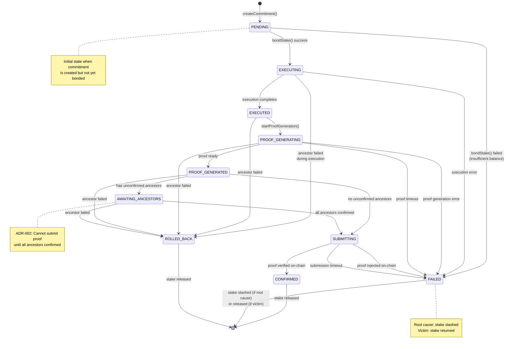
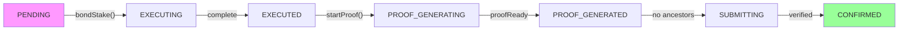
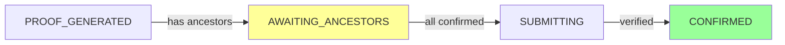
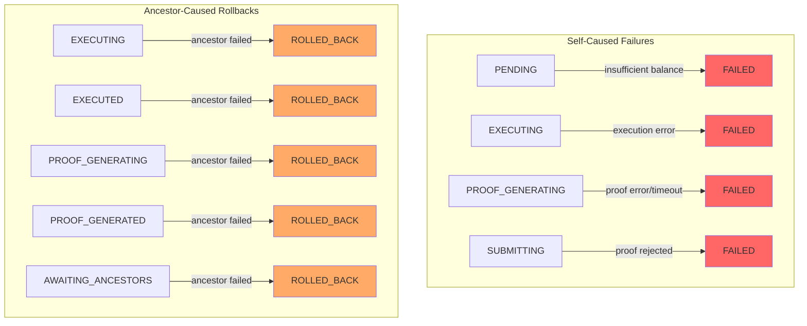

# State Machine: SpeculativeCommitment Lifecycle

> **Related Issues:** #266, #271  
> **Last Updated:** 2026-01-28

## Overview

This state machine defines the lifecycle of a `SpeculativeCommitment`, from creation through confirmation or rollback.

## State Diagram



## State Descriptions

| State | Description | Entry Conditions | Exit Conditions |
|-------|-------------|------------------|-----------------|
| `PENDING` | Commitment created, awaiting stake bond | `createCommitment()` called | Stake bonded or bond failed |
| `EXECUTING` | Task is actively computing | Stake successfully bonded | Execution completes or fails |
| `EXECUTED` | Compute finished, results available | Execution returned successfully | Proof generation starts or rollback |
| `PROOF_GENERATING` | ZK proof being generated | `startProofGeneration()` called | Proof ready, error, or timeout |
| `PROOF_GENERATED` | Proof ready, checking ancestor status | Prover returned valid proof | Ancestors checked |
| `AWAITING_ANCESTORS` | Proof ready but waiting for ancestor confirmations | Has unconfirmed ancestors | All ancestors confirmed or one fails |
| `SUBMITTING` | Proof being submitted to Solana | All ancestors confirmed | On-chain result received |
| `CONFIRMED` | Proof verified, commitment finalized | On-chain verification passed | Stake released (terminal) |
| `FAILED` | Commitment failed (various reasons) | See failure transitions | Stake handled (terminal) |
| `ROLLED_BACK` | Rolled back due to ancestor failure | Ancestor entered FAILED state | Stake released (terminal) |

## Transition Details

### Happy Path Transitions



### Speculative Path (With Ancestors)



### Failure Paths



## State Entry Actions

| State | Entry Actions |
|-------|---------------|
| `PENDING` | Initialize commitment record, record creation timestamp |
| `EXECUTING` | Lock bonded stake, emit `speculation.started` metric |
| `EXECUTED` | Record execution timestamp, store outputs |
| `PROOF_GENERATING` | Start proof job, set timeout timer |
| `PROOF_GENERATED` | Store proof, query ancestor statuses |
| `AWAITING_ANCESTORS` | Subscribe to ancestor status changes |
| `SUBMITTING` | Create and submit transaction |
| `CONFIRMED` | Release stake, emit `speculation.confirmed` metric |
| `FAILED` | Determine if root cause, slash or release stake |
| `ROLLED_BACK` | Release stake, emit `speculation.rolled_back` metric |

## Valid Transition Matrix

| From \ To | PENDING | EXECUTING | EXECUTED | PROOF_GEN | PROOF_READY | AWAIT | SUBMIT | CONFIRMED | FAILED | ROLLED_BACK |
|-----------|---------|-----------|----------|-----------|-------------|-------|--------|-----------|--------|-------------|
| PENDING | - | ✓ | - | - | - | - | - | - | ✓ | - |
| EXECUTING | - | - | ✓ | - | - | - | - | - | ✓ | ✓ |
| EXECUTED | - | - | - | ✓ | - | - | - | - | - | ✓ |
| PROOF_GEN | - | - | - | - | ✓ | - | - | - | ✓ | ✓ |
| PROOF_READY | - | - | - | - | - | ✓ | ✓ | - | - | ✓ |
| AWAIT | - | - | - | - | - | - | ✓ | - | - | ✓ |
| SUBMIT | - | - | - | - | - | - | - | ✓ | ✓ | - |
| CONFIRMED | - | - | - | - | - | - | - | - | - | - |
| FAILED | - | - | - | - | - | - | - | - | - | - |
| ROLLED_BACK | - | - | - | - | - | - | - | - | - | - |

## Invariants

1. **Terminal states are final:** `CONFIRMED`, `FAILED`, and `ROLLED_BACK` have no outgoing transitions
2. **Stake lifecycle:**
   - Bonded in `PENDING` → `EXECUTING`
   - Released in `CONFIRMED` or `ROLLED_BACK`
   - Slashed in `FAILED` (if root cause)
3. **Proof ordering (ADR-002):** Cannot transition from `PROOF_GENERATED` to `SUBMITTING` if any ancestor is not `CONFIRMED`
4. **Ancestor failure propagation:** Any non-terminal state can transition to `ROLLED_BACK` when an ancestor enters `FAILED`

## Implementation Notes

```typescript
class SpeculativeCommitment {
  // Valid transitions for each state
  private static VALID_TRANSITIONS: Record<CommitmentStatus, CommitmentStatus[]> = {
    [CommitmentStatus.PENDING]: [CommitmentStatus.EXECUTING, CommitmentStatus.FAILED],
    [CommitmentStatus.EXECUTING]: [CommitmentStatus.EXECUTED, CommitmentStatus.FAILED, CommitmentStatus.ROLLED_BACK],
    [CommitmentStatus.EXECUTED]: [CommitmentStatus.PROOF_GENERATING, CommitmentStatus.ROLLED_BACK],
    [CommitmentStatus.PROOF_GENERATING]: [CommitmentStatus.PROOF_GENERATED, CommitmentStatus.FAILED, CommitmentStatus.ROLLED_BACK],
    [CommitmentStatus.PROOF_GENERATED]: [CommitmentStatus.AWAITING_ANCESTORS, CommitmentStatus.SUBMITTING, CommitmentStatus.ROLLED_BACK],
    [CommitmentStatus.AWAITING_ANCESTORS]: [CommitmentStatus.SUBMITTING, CommitmentStatus.ROLLED_BACK],
    [CommitmentStatus.SUBMITTING]: [CommitmentStatus.CONFIRMED, CommitmentStatus.FAILED],
    [CommitmentStatus.CONFIRMED]: [],  // Terminal
    [CommitmentStatus.FAILED]: [],      // Terminal
    [CommitmentStatus.ROLLED_BACK]: [], // Terminal
  };
  
  transitionTo(newStatus: CommitmentStatus): void {
    if (!SpeculativeCommitment.VALID_TRANSITIONS[this.status].includes(newStatus)) {
      throw new InvalidStateTransitionError(this.status, newStatus);
    }
    this.status = newStatus;
  }
}
```
