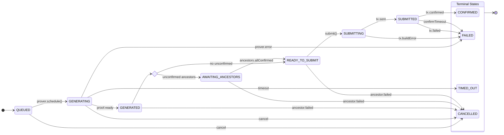
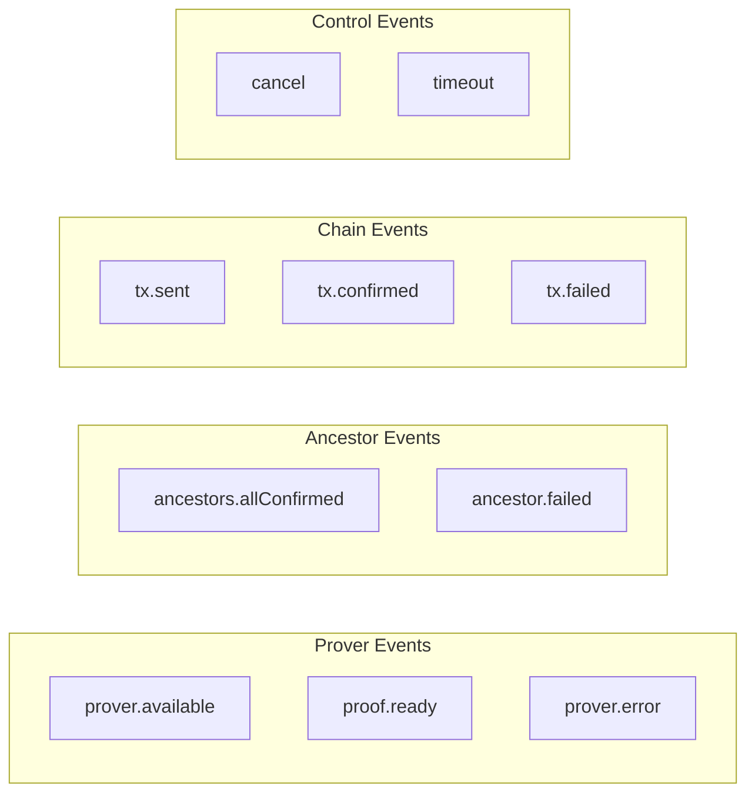
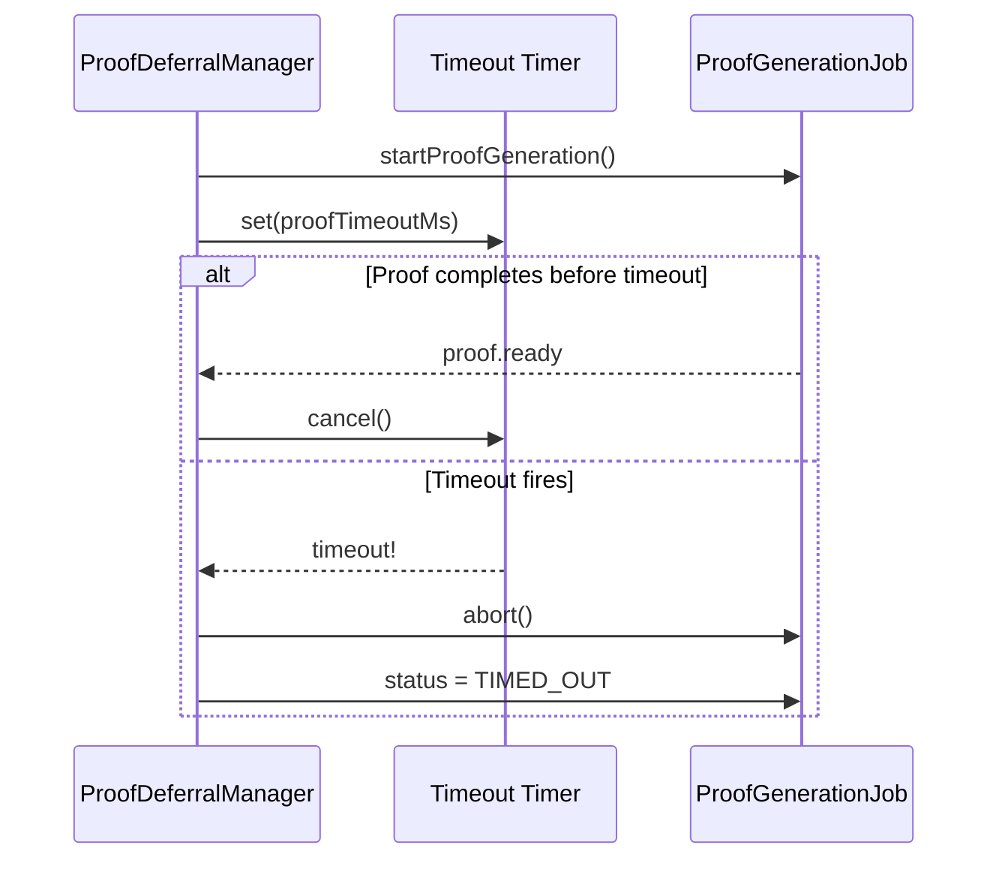
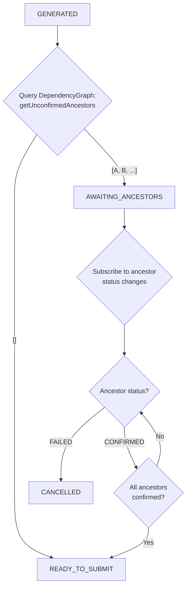
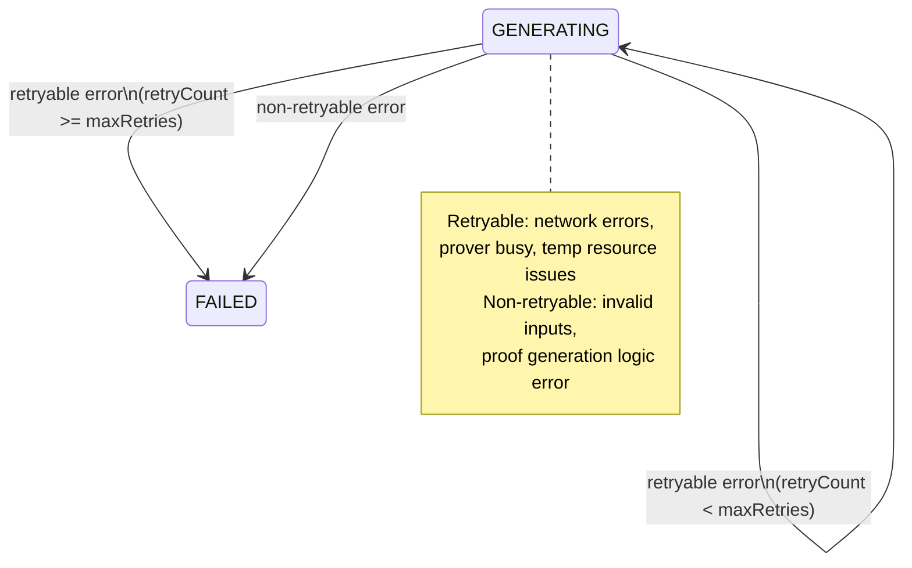

# State Machine: Proof Generation Lifecycle

> **Related Issues:** #264, #271  
> **Last Updated:** 2026-01-28

## Overview

This state machine defines the lifecycle of a proof generation job within the `ProofDeferralManager`, from queuing through on-chain confirmation.

## State Diagram

```mermaid
stateDiagram-v2
    direction TB
    
    [*] --> QUEUED: startProofGeneration()
    
    QUEUED --> GENERATING: prover available
    QUEUED --> CANCELLED: cancelProofGeneration()
    QUEUED --> CANCELLED: ancestor failed
    
    GENERATING --> GENERATED: proof complete
    GENERATING --> FAILED: proof error
    GENERATING --> TIMED_OUT: timeout exceeded
    GENERATING --> CANCELLED: cancelProofGeneration()
    GENERATING --> CANCELLED: ancestor failed
    
    GENERATED --> AWAITING_ANCESTORS: has unconfirmed ancestors
    GENERATED --> READY_TO_SUBMIT: all ancestors confirmed
    GENERATED --> CANCELLED: ancestor failed
    
    AWAITING_ANCESTORS --> READY_TO_SUBMIT: all ancestors confirmed
    AWAITING_ANCESTORS --> CANCELLED: ancestor failed
    
    READY_TO_SUBMIT --> SUBMITTING: submitProof()
    READY_TO_SUBMIT --> CANCELLED: ancestor failed
    
    SUBMITTING --> SUBMITTED: tx sent
    SUBMITTING --> FAILED: submission error
    
    SUBMITTED --> CONFIRMED: on-chain confirmation
    SUBMITTED --> FAILED: tx failed/dropped
    SUBMITTED --> FAILED: confirmation timeout
    
    CONFIRMED --> [*]: ✅ Success
    FAILED --> [*]: ❌ Failure
    TIMED_OUT --> [*]: ⏰ Timeout
    CANCELLED --> [*]: 🛑 Cancelled
    
    note right of QUEUED
        Proof job created,
        waiting for prover capacity
    end note
    
    note right of AWAITING_ANCESTORS
        ADR-002: Proof ready but
        cannot submit until ancestors
        are confirmed on-chain
    end note
    
    note left of TIMED_OUT
        Configurable timeout
        (default: proofTimeoutMs)
    end note
```



## Detailed State Diagram with Timeouts



## State Descriptions

| State | Description | Duration | Timeout |
|-------|-------------|----------|---------|
| `QUEUED` | Job created, waiting for prover capacity | Variable (queue depth dependent) | None (queued indefinitely) |
| `GENERATING` | ZK prover actively generating proof | Seconds to minutes | `proofTimeoutMs` (default: 5 min) |
| `GENERATED` | Proof ready, evaluating ancestor status | Instant transition | None |
| `AWAITING_ANCESTORS` | Proof ready, waiting for ancestor confirmations | Variable (depends on ancestors) | Implicit (claim expiry) |
| `READY_TO_SUBMIT` | All ancestors confirmed, ready to submit | Brief | None |
| `SUBMITTING` | Building and sending transaction | Seconds | `txTimeoutMs` (30s) |
| `SUBMITTED` | Transaction sent, awaiting confirmation | Seconds to minutes | `confirmationTimeoutMs` (2 min) |
| `CONFIRMED` | Proof verified on-chain ✅ | Terminal | - |
| `FAILED` | Unrecoverable error ❌ | Terminal | - |
| `TIMED_OUT` | Proof generation exceeded timeout ⏰ | Terminal | - |
| `CANCELLED` | Cancelled due to ancestor failure 🛑 | Terminal | - |

## Transition Events

### Normal Flow Events



### Event → Transition Mapping

| Event | From States | To State |
|-------|-------------|----------|
| `prover.available` | QUEUED | GENERATING |
| `proof.ready` | GENERATING | GENERATED |
| `prover.error` | GENERATING | FAILED |
| `timeout` | GENERATING | TIMED_OUT |
| `timeout` | SUBMITTED | FAILED |
| `ancestors.allConfirmed` | AWAITING_ANCESTORS | READY_TO_SUBMIT |
| `ancestor.failed` | QUEUED, GENERATING, GENERATED, AWAITING_ANCESTORS, READY_TO_SUBMIT | CANCELLED |
| `cancel` | QUEUED, GENERATING | CANCELLED |
| `tx.sent` | SUBMITTING | SUBMITTED |
| `tx.buildError` | SUBMITTING | FAILED |
| `tx.confirmed` | SUBMITTED | CONFIRMED |
| `tx.failed` | SUBMITTED | FAILED |

## Timeout Handling



### Configurable Timeouts

| Timeout | Config Key | Default | Description |
|---------|------------|---------|-------------|
| Proof generation | `proofTimeoutMs` | 300,000 (5 min) | Max time for ZK prover |
| Transaction send | `txTimeoutMs` | 30,000 (30s) | Max time to build and send |
| Confirmation | `confirmationTimeoutMs` | 120,000 (2 min) | Max time waiting for finality |

## Ancestor Waiting Logic

When a proof enters `GENERATED` state:



## Retry Behavior

The `ProofGenerationJob` tracks retry attempts for transient failures:



### Retry Configuration

```typescript
interface ProofRetryConfig {
  maxRetries: number;        // Default: 3
  baseDelayMs: number;       // Default: 1000
  maxDelayMs: number;        // Default: 30000
  backoffMultiplier: number; // Default: 2
}
```

## Metrics by State

| State Transition | Metric Emitted |
|-----------------|----------------|
| → QUEUED | `proof.queued` +1 |
| QUEUED → GENERATING | `proof.started` +1 |
| GENERATING → GENERATED | `proof.generation_time_ms` histogram |
| → AWAITING_ANCESTORS | `proof.deferred` +1 |
| AWAITING → READY | `proof.deferral_time_ms` histogram |
| → CONFIRMED | `proof.confirmed` +1, `proof.total_time_ms` histogram |
| → FAILED | `proof.failed` +1, `proof.failure_reason` label |
| → TIMED_OUT | `proof.timed_out` +1 |
| → CANCELLED | `proof.cancelled` +1 |

## Implementation Notes

```typescript
enum ProofJobStatus {
  QUEUED = 'QUEUED',
  GENERATING = 'GENERATING',
  GENERATED = 'GENERATED',
  AWAITING_ANCESTORS = 'AWAITING_ANCESTORS',
  READY_TO_SUBMIT = 'READY_TO_SUBMIT',
  SUBMITTING = 'SUBMITTING',
  SUBMITTED = 'SUBMITTED',
  CONFIRMED = 'CONFIRMED',
  FAILED = 'FAILED',
  TIMED_OUT = 'TIMED_OUT',
  CANCELLED = 'CANCELLED',
}

const TERMINAL_STATES = new Set([
  ProofJobStatus.CONFIRMED,
  ProofJobStatus.FAILED,
  ProofJobStatus.TIMED_OUT,
  ProofJobStatus.CANCELLED,
]);

class ProofGenerationJob {
  isTerminal(): boolean {
    return TERMINAL_STATES.has(this.status);
  }
  
  canCancel(): boolean {
    return [
      ProofJobStatus.QUEUED,
      ProofJobStatus.GENERATING,
      ProofJobStatus.GENERATED,
      ProofJobStatus.AWAITING_ANCESTORS,
      ProofJobStatus.READY_TO_SUBMIT,
    ].includes(this.status);
  }
}
```
