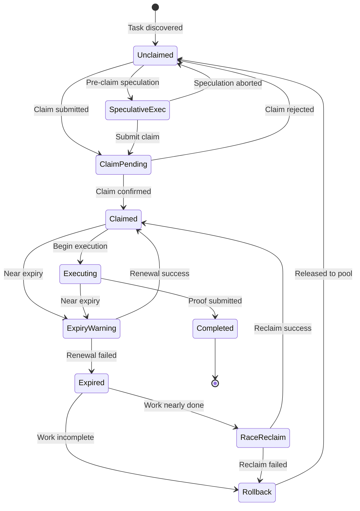
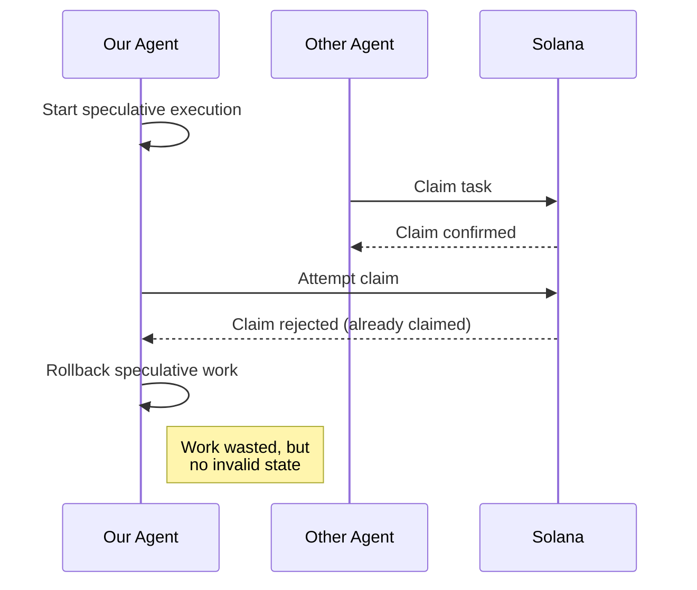
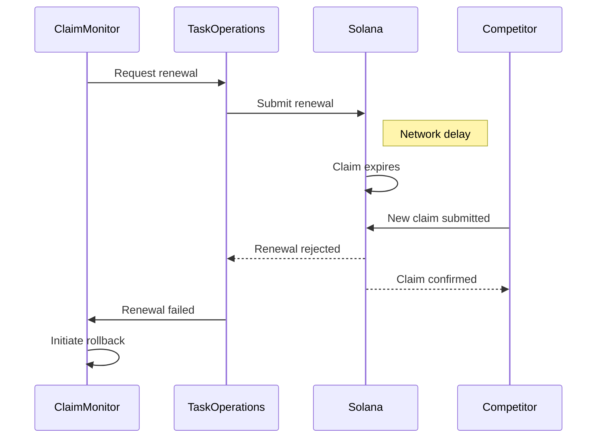

# Claim Lifecycle Swimlane Diagram

> Reference: GitHub Issues #260-#291

This diagram shows how task claims are managed during speculative execution, including claim acquisition, monitoring, and expiry handling.

## Actors

| Actor | Responsibility |
|-------|----------------|
| **TaskDiscovery** | Finds claimable tasks from on-chain state |
| **SpeculativeScheduler** | Evaluates claim windows and speculation viability |
| **TaskOperations** | Claims tasks on-chain, manages claim state |
| **ClaimMonitor** | Watches claim expiry, triggers renewals/releases |
| **RollbackController** | Handles claim expiry and abandonment scenarios |

## Swimlane Diagram

```mermaid
sequenceDiagram
    box Discovery Layer
        participant TD as TaskDiscovery
    end
    
    box Scheduling Layer
        participant SS as SpeculativeScheduler
        participant TO as TaskOperations
    end
    
    box Monitoring Layer
        participant CM as ClaimMonitor
        participant RC as RollbackController
    end

    %% Discovery Phase
    Note over TD,RC: Phase 1: Find Claimable Tasks
    TD->>TD: Scan for unclaimed tasks
    TD->>TD: Filter by agent capabilities
    TD->>SS: Report claimable task set
    
    %% Claim Window Evaluation Phase
    Note over TD,RC: Phase 2: Claim Window Analysis
    SS->>SS: Evaluate each candidate
    
    loop For each claimable task
        SS->>SS: Check claim window remaining
        
        alt Window > threshold (healthy)
            SS->>SS: Add to speculation candidates
            Note right of SS: Can speculatively execute<br/>before claiming
        else Window near expiry
            SS->>SS: Prioritize for immediate claim
            Note right of SS: Must claim first,<br/>then execute
        else Window too short
            SS->>SS: Skip this cycle
            Note right of SS: Wait for next<br/>claim opportunity
        end
    end
    
    SS->>SS: Rank candidates by value/risk

    %% Speculative Pre-Claim Phase
    Note over TD,RC: Phase 3: Speculative Pre-Claim Execution
    alt High-confidence speculation
        SS->>SS: Begin speculative execution
        Note right of SS: Execute before claiming<br/>to reduce latency
        SS->>TO: Queue claim submission
    else Standard flow
        SS->>TO: Claim task first
    end

    %% Claim Acquisition Phase
    Note over TD,RC: Phase 4: Claim Acquisition
    TO->>TO: Prepare claim transaction
    TO->>TO: Submit to Solana
    
    alt Claim successful
        TO-->>SS: Claim confirmed
        TO->>CM: Register claim for monitoring
        CM->>CM: Start expiry timer
        Note right of CM: claim_expiry = now + TTL
    else Claim failed (already claimed)
        TO-->>SS: Claim rejected
        SS->>RC: Abort speculative work (if any)
        RC->>RC: Rollback speculative state
    else Claim failed (other)
        TO-->>SS: Claim error
        SS->>SS: Retry or skip
    end

    %% Claim Monitoring Phase
    Note over TD,RC: Phase 5: Claim Monitoring
    loop Periodic check
        CM->>CM: Check time until expiry
        
        alt Expiry imminent (< renewal threshold)
            CM->>TO: Request claim renewal
            TO->>TO: Submit renewal transaction
            
            alt Renewal successful
                TO-->>CM: Expiry extended
                CM->>CM: Reset timer
            else Renewal failed
                TO-->>CM: Renewal rejected
                CM->>RC: Trigger expiry handling
            end
        else Task completed before expiry
            CM->>CM: Deregister claim monitor
            Note right of CM: Clean shutdown
        end
    end

    %% Expiry Handling Phase
    Note over TD,RC: Phase 6: Claim Expiry Handling
    alt Claim expired during execution
        CM->>RC: Claim expired notification
        RC->>RC: Evaluate work status
        
        alt Work nearly complete
            RC->>TO: Emergency claim attempt
            Note right of RC: Race to reclaim<br/>before competitor
        else Work incomplete
            RC->>RC: Initiate rollback
            RC->>SS: Release resources
            Note right of RC: Another agent may<br/>claim and complete
        end
    else Voluntary release
        SS->>TO: Release claim (task done)
        TO->>TO: Submit release transaction
        TO->>CM: Deregister monitoring
    end

    %% Completion Phase
    Note over TD,RC: Phase 7: Claim Resolution
    alt Task completed successfully
        TO->>TO: Claim auto-releases on proof
        CM->>CM: Remove from watch list
    else Task abandoned
        RC->>TO: Explicit claim release
        TO->>TD: Task returns to pool
    end
```



## Claim State Machine



## Claim Timing Configuration

| Parameter | Default | Description |
|-----------|---------|-------------|
| `claim_ttl` | 120 slots | On-chain claim duration |
| `renewal_threshold` | 30 slots | When to attempt renewal |
| `speculation_window_min` | 60 slots | Min window for pre-claim speculation |
| `expiry_grace_period` | 5 slots | Buffer before hard expiry |
| `race_reclaim_threshold` | 90% | Work progress to attempt emergency reclaim |

## Claim Monitoring Metrics

```
- claims_acquired: Total successful claims
- claims_renewed: Successful renewals
- claims_expired: Expirations during work
- claims_raced: Emergency reclaim attempts
- claim_utilization: % of claim window used
- speculation_preempt_rate: Pre-claim executions that won claim
```

## Edge Cases

### Pre-Claim Speculation Conflict
When we speculatively execute before claiming, another agent may claim first:



### Claim Renewal Race
When renewal and expiry happen simultaneously:



## Integration with Speculative Execution

The claim lifecycle interacts with speculation at key points:

1. **Pre-Claim Speculation**: High-confidence tasks can execute speculatively before claiming, reducing latency but risking wasted work

2. **Claim-Gated Submission**: Proof submission requires valid claim, so ProofDeferralManager coordinates with ClaimMonitor

3. **Expiry Rollback**: Claim expiry triggers the same rollback path as proof failure, maintaining consistency
