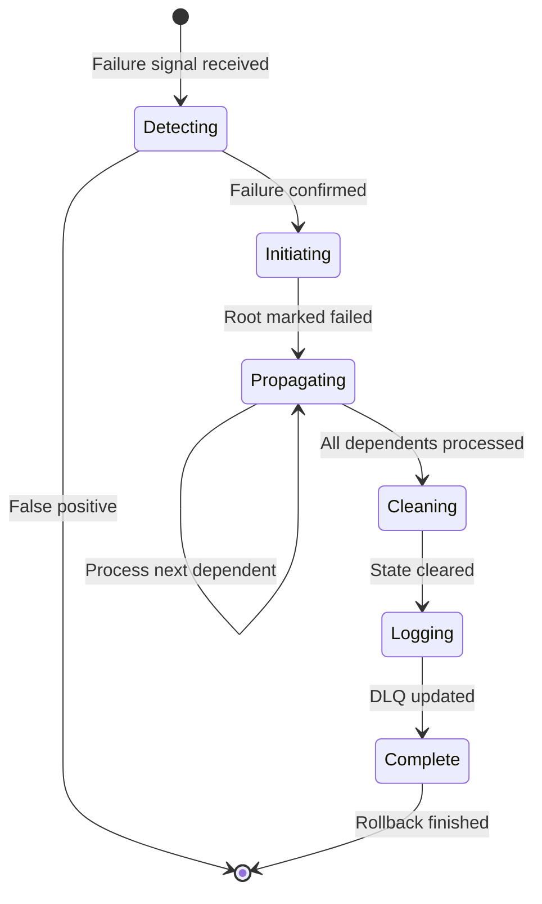

# Rollback Flow Swimlane Diagram

> Reference: GitHub Issues #260-#291

This diagram shows the rollback cascade when a speculative task fails, including how dependent tasks are aborted and state is cleaned up.

## Actors

| Actor | Responsibility |
|-------|----------------|
| **ProofDeferralManager** | Detects proof failures or ancestor failures |
| **RollbackController** | Initiates and coordinates rollback cascade |
| **CommitmentLedger** | Marks tasks as failed, tracks rollback state |
| **TaskExecutor** | Aborts actively executing speculative tasks |
| **DependencyGraph** | Traverses dependents for cascade propagation |
| **DeadLetterQueue** | Logs failed tasks for analysis/retry (optional) |

## Swimlane Diagram

```mermaid
sequenceDiagram
    box Detection Layer
        participant PDM as ProofDeferralManager
    end
    
    box Rollback Layer
        participant RC as RollbackController
        participant CL as CommitmentLedger
    end
    
    box Execution Layer
        participant TE as TaskExecutor
        participant DG as DependencyGraph
    end
    
    box Recovery Layer
        participant DLQ as DeadLetterQueue
    end

    %% Failure Detection Phase
    Note over PDM,DLQ: Phase 1: Failure Detection
    alt Proof verification failed
        PDM->>PDM: Detect proof rejection
        PDM->>RC: Report failure (task_id, reason)
    else Ancestor task failed
        CL->>PDM: Ancestor marked failed
        PDM->>RC: Report cascade trigger
    else Timeout expired
        PDM->>PDM: Proof submission timeout
        PDM->>RC: Report timeout failure
    end

    %% Rollback Initiation Phase
    Note over PDM,DLQ: Phase 2: Rollback Initiation
    RC->>RC: Create rollback context
    RC->>CL: Lock affected task tree
    CL->>CL: Acquire rollback lock
    CL-->>RC: Lock confirmed
    
    RC->>CL: Mark root task FAILED
    CL->>CL: Update state: speculative → failed
    CL-->>RC: Root task marked

    %% Cascade Propagation Phase
    Note over PDM,DLQ: Phase 3: Cascade Propagation
    RC->>DG: Get all dependents (recursive)
    DG->>DG: Traverse DAG depth-first
    DG-->>RC: Return dependent task set
    
    loop For each dependent task
        RC->>CL: Get task state
        CL-->>RC: Current state
        
        alt Task is EXECUTING
            RC->>TE: Abort task execution
            TE->>TE: Cancel computation
            TE->>TE: Release resources
            TE-->>RC: Abort confirmed
            RC->>CL: Mark task ABORTED
        else Task is PROOF_PENDING
            RC->>PDM: Cancel proof submission
            PDM->>PDM: Discard pending proof
            PDM-->>RC: Proof cancelled
            RC->>CL: Mark task ROLLED_BACK
        else Task is WAITING_ANCESTORS
            RC->>CL: Mark task ROLLED_BACK
        else Task is SCHEDULED (not started)
            RC->>CL: Mark task CANCELLED
        end
    end

    %% State Cleanup Phase
    Note over PDM,DLQ: Phase 4: State Cleanup
    RC->>CL: Release speculative commitments
    CL->>CL: Clear speculative state
    CL->>CL: Update commitment counters
    
    RC->>DG: Remove failed subtree
    DG->>DG: Prune invalid edges
    DG-->>RC: Graph updated

    %% Dead Letter Processing Phase
    Note over PDM,DLQ: Phase 5: Recovery Logging
    RC->>DLQ: Log failed task details
    DLQ->>DLQ: Record failure context
    Note right of DLQ: - Task ID<br/>- Failure reason<br/>- Dependent count<br/>- Timestamp
    
    opt Retry eligible
        DLQ->>DLQ: Queue for retry analysis
        DLQ-->>RC: Retry scheduled
    end

    %% Completion Phase
    Note over PDM,DLQ: Phase 6: Rollback Complete
    RC->>CL: Release rollback lock
    CL-->>RC: Lock released
    RC->>RC: Emit rollback complete event
    
    Note over PDM,DLQ: System ready for new speculative work
```



## Rollback State Machine



## Failure Types and Handling

| Failure Type | Source | Cascade Scope | Recovery Action |
|--------------|--------|---------------|-----------------|
| Proof Rejection | Solana verifier | Task + all dependents | Re-execute with new proof |
| Ancestor Failure | CommitmentLedger | All downstream tasks | Wait for ancestor retry |
| Timeout | ProofDeferralManager | Task + dependents | Retry with extended timeout |
| Resource Exhaustion | TaskExecutor | Affected task only | Queue for later execution |
| Invalid State | CommitmentLedger | Task subtree | Full re-discovery |

## Rollback Metrics

The RollbackController tracks:

```
- rollback_count: Total rollbacks initiated
- cascade_depth_max: Maximum dependent chain length
- cascade_size_avg: Average tasks affected per rollback
- abort_latency_p99: Time to abort executing tasks
- recovery_success_rate: Tasks successfully re-executed
```

## Critical Invariants

1. **Atomicity**: Either all dependents are rolled back, or none
2. **No orphans**: Every speculative task has tracked lineage
3. **Lock ordering**: Always acquire locks in task_id order to prevent deadlock
4. **Idempotency**: Rollback of already-rolled-back task is no-op
