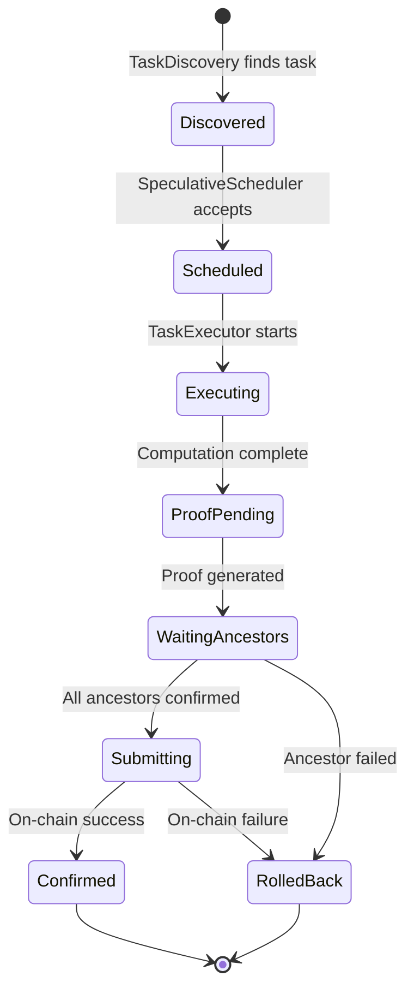

# Speculation Flow Swimlane Diagram

> Reference: GitHub Issues #260-#291

This diagram shows the main flow of speculative task execution, from discovery through on-chain confirmation.

## Actors

| Actor | Responsibility |
|-------|----------------|
| **TaskDiscovery** | Discovers tasks with dependencies from on-chain state |
| **DependencyGraph** | Builds and maintains the task DAG |
| **SpeculativeScheduler** | Makes speculation decisions based on confidence/risk |
| **TaskExecutor** | Executes tasks (speculatively or confirmed) |
| **ProofDeferralManager** | Generates proofs and manages submission timing |
| **CommitmentLedger** | Tracks speculative state and commitments |
| **Solana** | On-chain confirmation and finality |

## Swimlane Diagram

```mermaid
sequenceDiagram
    box Discovery Layer
        participant TD as TaskDiscovery
        participant DG as DependencyGraph
    end
    
    box Scheduling Layer
        participant SS as SpeculativeScheduler
        participant TE as TaskExecutor
    end
    
    box Commitment Layer
        participant PDM as ProofDeferralManager
        participant CL as CommitmentLedger
    end
    
    box Blockchain
        participant SOL as Solana
    end

    %% Discovery Phase
    Note over TD,SOL: Phase 1: Task Discovery
    TD->>TD: Poll for new tasks
    TD->>DG: Register task with dependencies
    DG->>DG: Update DAG structure
    DG->>SS: Notify: new task available

    %% Speculation Decision Phase
    Note over TD,SOL: Phase 2: Speculation Decision
    SS->>DG: Query ancestor status
    DG-->>SS: Return dependency chain
    SS->>CL: Check speculative commitments
    CL-->>SS: Return commitment status
    
    alt All ancestors confirmed
        SS->>TE: Execute normally (non-speculative)
    else Ancestors pending but high confidence
        SS->>SS: Calculate speculation score
        SS->>TE: Execute speculatively
        SS->>CL: Record speculative intent
    else Low confidence / too risky
        SS->>SS: Defer to later cycle
    end

    %% Parallel Execution Phase
    Note over TD,SOL: Phase 3: Parallel Execution
    TE->>TE: Execute task computation
    TE->>PDM: Submit result for proof generation
    PDM->>PDM: Generate ZK proof (background)
    PDM->>CL: Record pending proof
    CL->>CL: Track speculative state

    %% Ancestor Wait Phase
    Note over TD,SOL: Phase 4: Ancestor Coordination
    loop Until ancestors confirmed
        PDM->>CL: Check ancestor proof status
        CL-->>PDM: Ancestor status update
        alt Ancestor confirmed on-chain
            CL->>PDM: Release hold
        else Ancestor failed
            PDM->>PDM: Abort proof submission
            PDM->>CL: Mark as rolled back
        end
    end

    %% Submission Phase
    Note over TD,SOL: Phase 5: Proof Submission
    PDM->>PDM: Ancestors confirmed, proof ready
    PDM->>SOL: Submit proof transaction
    SOL->>SOL: Verify proof on-chain
    
    alt Proof valid
        SOL-->>PDM: Transaction confirmed
        PDM->>CL: Mark task confirmed
        CL->>DG: Update dependency status
        DG->>SS: Unblock dependent tasks
    else Proof invalid / rejected
        SOL-->>PDM: Transaction failed
        PDM->>CL: Initiate rollback cascade
    end

    %% Confirmation Phase
    Note over TD,SOL: Phase 6: Finality
    CL->>CL: Transition: speculative → confirmed
    CL->>TD: Notify: task complete
    TD->>TD: Remove from active set
```

## State Transitions

## Key Decision Points

1. **Speculation Score Calculation** (SpeculativeScheduler)
   - Ancestor confirmation probability
   - Historical success rate
   - Resource availability
   - Rollback cost estimation

2. **Proof Submission Timing** (ProofDeferralManager)
   - Wait for all ancestor proofs
   - Batch submission opportunities
   - Gas/fee optimization

3. **Commitment Tracking** (CommitmentLedger)
   - Speculative vs confirmed state
   - Dependency chain integrity
   - Rollback cascade scope
